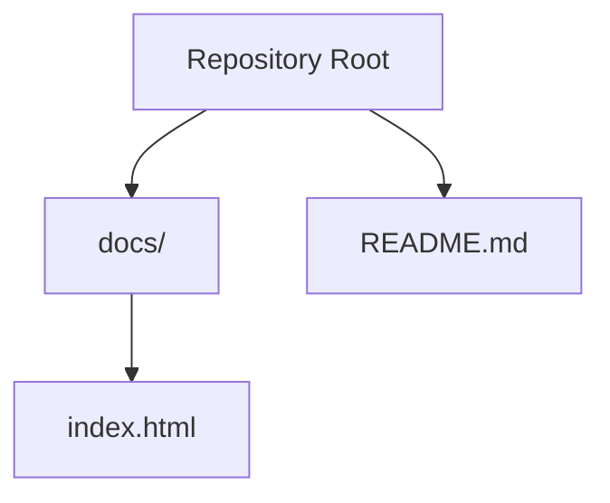
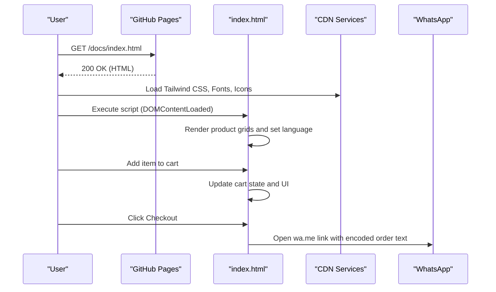
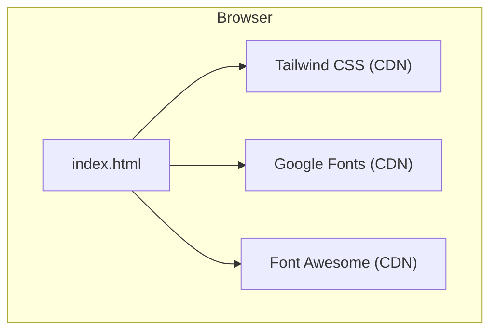

# Deployment and Maintenance

<cite>
**Referenced Files in This Document**
- [README.md](file://README.md)
- [index.html](file://docs/index.html)
</cite>

## Table of Contents
1. [Introduction](#introduction)
2. [Project Structure](#project-structure)
3. [Core Components](#core-components)
4. [Architecture Overview](#architecture-overview)
5. [Detailed Component Analysis](#detailed-component-analysis)
6. [Dependency Analysis](#dependency-analysis)
7. [Performance Considerations](#performance-considerations)
8. [Troubleshooting Guide](#troubleshooting-guide)
9. [Conclusion](#conclusion)
10. [Appendices](#appendices)

## Introduction
This document provides end-to-end deployment and maintenance guidance for a single-page, single-file website hosted on GitHub Pages. The site is implemented as one HTML file with embedded CSS and JavaScript, using Tailwind CSS via CDN and external fonts and icons. It includes product catalogs, a shopping cart UI, language switching (Traditional Chinese and English), and WhatsApp-based checkout.

The goal is to help maintainers:
- Deploy and update the site on GitHub Pages
- Update products and images safely
- Monitor and optimize performance
- Back up and version-control the monolithic HTML file
- Test across browsers and devices
- Troubleshoot common issues
- Plan for future evolution beyond a single-page architecture

[No sources needed since this section summarizes without analyzing specific files]

## Project Structure
The repository contains:
- docs/index.html: The entire site (HTML structure, styles, scripts, product data, translations, and client-side logic)
- README.md: Minimal project readme

**Diagram sources**
- [index.html:1-20](file://docs/index.html#L1-L20)
- [README.md:1-1](file://README.md#L1-L1)

**Section sources**
- [README.md:1-1](file://README.md#L1-L1)
- [index.html:1-20](file://docs/index.html#L1-L20)

## Core Components
- Single-file application: All content, styling, and behavior are contained within docs/index.html.
- External dependencies loaded at runtime:
  - Tailwind CSS via CDN
  - Google Fonts (Playfair Display, Inter, Noto Serif TC, Noto Sans TC)
  - Font Awesome 6.4.0 via CDN
- Client-side features:
  - Product catalog rendering by category
  - Shopping cart state management in memory
  - Language switching between Traditional Chinese and English
  - WhatsApp-based checkout link generation
  - Mobile menu toggle and sticky header shadow on scroll

Key implementation anchors:
- Head and CDN links: [index.html:1-20](file://docs/index.html#L1-L20)
- Tailwind configuration object: [index.html:13-38](file://docs/index.html#L13-L38)
- Translations dictionary and language switcher: [index.html:882-1075](file://docs/index.html#L882-L1075), [index.html:1353-1374](file://docs/index.html#L1353-L1374)
- Product arrays and render functions: [index.html:1079-1328](file://docs/index.html#L1079-L1328), [index.html:1406-1444](file://docs/index.html#L1406-L1444)
- Cart operations and WhatsApp checkout link: [index.html:1446-1553](file://docs/index.html#L1446-L1553)
- UI interactions (cart sidebar, mobile menu, toast): [index.html:1555-1585](file://docs/index.html#L1555-L1585)

**Section sources**
- [index.html:1-20](file://docs/index.html#L1-L20)
- [index.html:13-38](file://docs/index.html#L13-L38)
- [index.html:882-1075](file://docs/index.html#L882-L1075)
- [index.html:1353-1374](file://docs/index.html#L1353-L1374)
- [index.html:1079-1328](file://docs/index.html#L1079-L1328)
- [index.html:1406-1444](file://docs/index.html#L1406-L1444)
- [index.html:1446-1553](file://docs/index.html#L1446-L1553)
- [index.html:1555-1585](file://docs/index.html#L1555-L1585)

## Architecture Overview
High-level flow:
- Browser loads docs/index.html from GitHub Pages
- Tailwind CSS and fonts/icons are fetched from CDNs
- DOMContentLoaded triggers rendering of all product sections and initial language set to Traditional Chinese
- User interactions update the in-memory cart and generate a WhatsApp message link for checkout

**Diagram sources**
- [index.html:1332-1351](file://docs/index.html#L1332-L1351)
- [index.html:1446-1553](file://docs/index.html#L1446-L1553)
- [index.html:1478-1494](file://docs/index.html#L1478-L1494)

**Section sources**
- [index.html:1332-1351](file://docs/index.html#L1332-L1351)
- [index.html:1446-1553](file://docs/index.html#L1446-L1553)
- [index.html:1478-1494](file://docs/index.html#L1478-L1494)

## Detailed Component Analysis

### GitHub Pages Deployment Configuration
- Repository name pattern: queenflowerhk.github.io indicates user/organization pages; GitHub Pages serves the root of the default branch automatically.
- Content location: docs/index.html is served at https://queenflowerhk.github.io/docs/index.html or can be moved to the repository root if desired.
- No build step required; static HTML is deployed directly.

Operational notes:
- Ensure the default branch is main or master (as configured in your repo).
- If you move index.html to the repository root, adjust any relative references accordingly.
- There are no CI workflows or build artifacts in this repository.

**Section sources**
- [README.md:1-1](file://README.md#L1-L1)
- [index.html:1-20](file://docs/index.html#L1-L20)

### Content Update Workflows (Products and Images)
- Products are defined as JavaScript arrays near the top of the script block. Each product has id, names, price, category, image URL, and descriptions.
- Rendering functions map these arrays into grid containers by category.
- To add/update/remove products:
  - Edit the relevant array (ceremonial, funeral, wreath, opening, association, graduation, pets).
  - Ensure unique ids per category scope.
  - Update prices and descriptions in both languages where applicable.
  - Save and commit changes to trigger GitHub Pages rebuild.

Image handling:
- Images are referenced by absolute URLs (e.g., Unsplash). For production reliability:
  - Host images under a stable path in the repository (e.g., assets/images/) and reference them relatively.
  - Optimize images before committing (resize, compress, use modern formats like WebP when appropriate).

Language updates:
- The translations object holds keys used across the page. When adding new strings, add entries for both zh and en, then ensure elements have matching data-i18n attributes.

**Section sources**
- [index.html:1079-1328](file://docs/index.html#L1079-L1328)
- [index.html:1406-1444](file://docs/index.html#L1406-L1444)
- [index.html:882-1075](file://docs/index.html#L882-L1075)

### Performance Monitoring and Optimization Techniques
Observability:
- Use browser DevTools Network and Performance panels to measure load times, waterfall, and interactivity.
- Track Largest Contentful Paint (LCP), First Input Delay (FID)/Interaction to Next Paint (INP), and Cumulative Layout Shift (CLS) via Chrome UX Report or Lighthouse.

Optimization opportunities:
- Reduce payload size:
  - Replace large hero/background images with optimized versions or SVGs where possible.
  - Limit number of high-resolution images; consider lazy loading below-the-fold images.
- Improve font loading:
  - Preconnect to fonts.googleapis.com and cdnjs.cloudflare.com.
  - Subset fonts or limit weights to reduce download size.
- Minimize layout shifts:
  - Set explicit width/height on images to prevent reflow.
  - Reserve space for dynamic content such as product cards.
- Defer non-critical JS:
  - Move heavy initialization after first paint or defer execution until after critical resources load.
- Cache strategy:
  - Configure cache headers for static assets if migrating to a custom domain with server control.

[No sources needed since this section provides general guidance]

### Backup Strategies for the Single-File Architecture
- Local backups:
  - Keep a local copy of docs/index.html and any asset directories.
  - Export the current live page as a snapshot for audit purposes.
- Versioned backups:
  - Tag releases in Git (e.g., v1.0.0) to mark stable deployments.
  - Maintain a changelog describing content and feature changes.
- Offsite copies:
  - Mirror the repository to another Git provider or archive it periodically.
- Rollback plan:
  - Revert to the last known-good commit if an update breaks functionality.

[No sources needed since this section provides general guidance]

### Version Control Best Practices for the Monolithic HTML File
- Branching model:
  - Create feature branches for major updates (e.g., feature/new-products, fix/cart-ui).
  - Merge via pull requests with code review.
- Commit hygiene:
  - Atomic commits with descriptive messages (e.g., “Add graduation products and translations”).
  - Avoid mixing unrelated changes in a single commit.
- Code organization within the single file:
  - Group related logic (data, rendering, event handlers) with clear comments and consistent indentation.
  - Keep translation keys centralized and avoid duplication.
- Release tags:
  - Tag each production-ready state to simplify rollbacks and audits.

[No sources needed since this section provides general guidance]

### Testing Procedures Across Different Browsers and Devices
- Cross-browser testing:
  - Validate on latest Chrome, Safari, Firefox, Edge.
  - Check mobile Safari and Android Chrome for responsive behavior.
- Device matrix:
  - Test on phones (iOS and Android), tablets, and desktops.
- Feature checks:
  - Language switching toggles correctly and persists during session.
  - Cart adds/removes items, updates totals, and generates correct WhatsApp link.
  - Mobile menu opens/closes and overlays work.
- Accessibility:
  - Verify keyboard navigation and screen reader announcements for key actions.
- Visual regression:
  - Capture screenshots across breakpoints to detect unintended layout shifts.

[No sources needed since this section provides general guidance]

### Troubleshooting Common Deployment Issues
- Site not updating:
  - Confirm the change was pushed to the default branch and that GitHub Pages is enabled.
  - Clear browser cache or hard refresh.
- Missing styles or fonts:
  - Ensure CDN links are reachable and not blocked by corporate proxies.
  - Prefer preconnect hints for faster resource loading.
- Images not loading:
  - Verify image URLs are accessible and CORS-friendly if cross-origin.
  - Prefer hosting images within the repository for reliability.
- Cart or language not working:
  - Check console for JavaScript errors.
  - Ensure data-i18n attributes match keys in the translations object.
- WhatsApp link formatting:
  - Confirm phone number format and message encoding.

**Section sources**
- [index.html:1332-1351](file://docs/index.html#L1332-L1351)
- [index.html:1478-1494](file://docs/index.html#L1478-L1494)
- [index.html:882-1075](file://docs/index.html#L882-L1075)

## Dependency Analysis
External dependencies and their roles:
- Tailwind CSS (CDN): Utility-first styling framework applied via classes throughout the markup.
- Google Fonts: Typography assets for headings and body text.
- Font Awesome: Iconography used in navigation, buttons, and UI elements.

Runtime behavior:
- Tailwind config is injected inline to extend theme tokens (fonts and colors).
- Scripts run after DOMContentLoaded to render product grids and initialize language.

**Diagram sources**
- [index.html:1-20](file://docs/index.html#L1-L20)
- [index.html:13-38](file://docs/index.html#L13-L38)

**Section sources**
- [index.html:1-20](file://docs/index.html#L1-L20)
- [index.html:13-38](file://docs/index.html#L13-L38)

## Performance Considerations
- Bundle size:
  - The single HTML file includes substantial inline CSS and JS. Consider splitting concerns if the site grows significantly.
- Image optimization:
  - Compress and serve next-gen formats; implement responsive images with srcset where feasible.
- Critical rendering path:
  - Inline only critical CSS; defer non-critical styles and scripts.
- Caching:
  - Leverage browser caching for static assets; consider a CDN for global distribution.
- Metrics-driven iteration:
  - Regularly run Lighthouse audits and track improvements over time.

[No sources needed since this section provides general guidance]

## Troubleshooting Guide
Common symptoms and resolutions:
- Styles appear unstyled initially:
  - Tailwind CDN may take time to compile; ensure network connectivity and allow time for processing.
- Fonts not loading:
  - Check DNS and firewall rules; add preconnect hints to speed up font resolution.
- Cart total incorrect:
  - Verify arithmetic in cart update functions and ensure quantities are integers.
- Language not switching:
  - Confirm data-i18n attributes exist and keys are present in both language dictionaries.
- WhatsApp link malformed:
  - Ensure proper URL encoding and valid phone number format.

**Section sources**
- [index.html:1353-1374](file://docs/index.html#L1353-L1374)
- [index.html:1496-1553](file://docs/index.html#L1496-L1553)
- [index.html:1478-1494](file://docs/index.html#L1478-L1494)

## Conclusion
This single-file site is straightforward to deploy and maintain on GitHub Pages. By following disciplined version control, careful content updates, proactive performance tuning, and robust testing practices, you can keep the site reliable and fast. As business needs grow, consider evolving toward a modular architecture with separate assets, a build pipeline, and a CMS-backed content workflow while preserving the simplicity of the current deployment model.

[No sources needed since this section summarizes without analyzing specific files]

## Appendices

### Practical Examples for Routine Tasks
- Update a product price:
  - Locate the product entry in the relevant array and edit the price field.
  - Commit and push; verify the updated price renders correctly.
- Add a new product:
  - Insert a new object into the appropriate array with a unique id and bilingual descriptions.
  - Ensure the category matches the corresponding render function’s target grid.
- Change brand color:
  - Adjust the Tailwind theme extension colors object and update class usages consistently.
- Add a new language:
  - Extend the translations object with a new locale key and update the language switcher to include the new option.

**Section sources**
- [index.html:1079-1328](file://docs/index.html#L1079-L1328)
- [index.html:13-38](file://docs/index.html#L13-L38)
- [index.html:882-1075](file://docs/index.html#L882-L1075)

### Scalability Considerations and Migration Strategy
When the site outgrows a single-file approach:
- Modularization:
  - Split HTML into templates, extract CSS into a build pipeline, and isolate JS modules.
- Asset management:
  - Centralize images and fonts; use a CDN and cache-busting strategies.
- Content management:
  - Introduce a headless CMS or JSON data files to decouple content from code.
- Build and CI:
  - Adopt a static site generator or bundler with automated tests and previews.
- Analytics and monitoring:
  - Integrate privacy-compliant analytics and error tracking.
- SEO and accessibility:
  - Implement structured data, meta tags, and semantic markup improvements.

[No sources needed since this section provides general guidance]