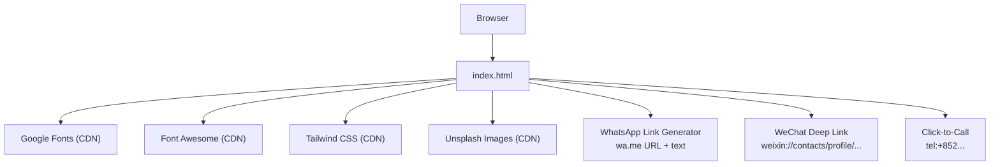
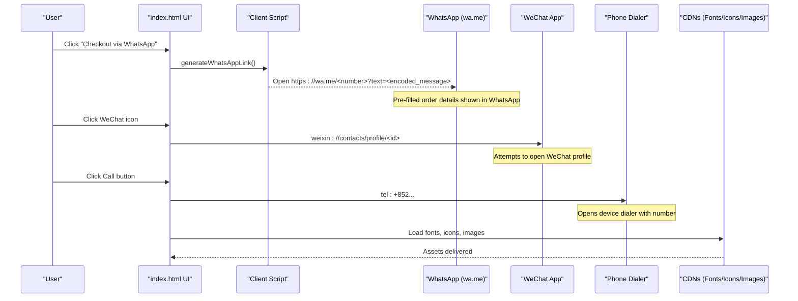
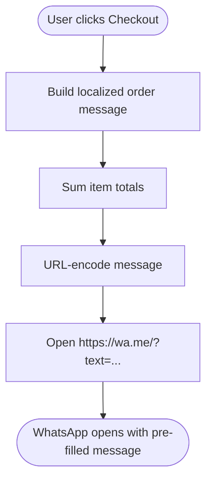
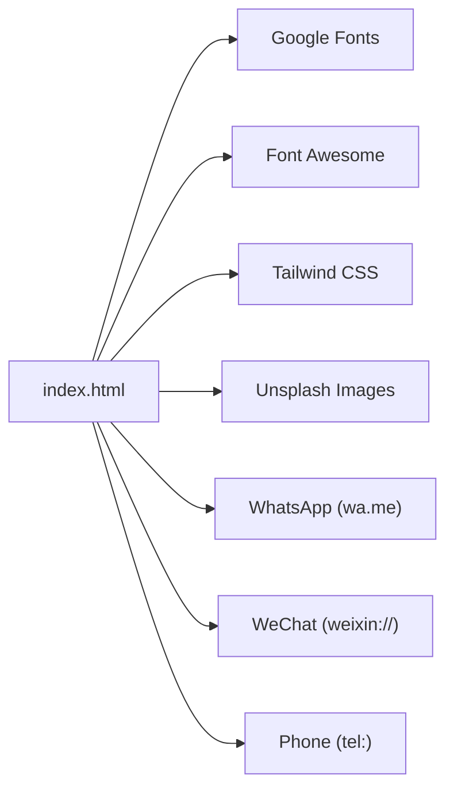

# External Integrations

<cite>
**Referenced Files in This Document**
- [index.html](file://docs/index.html)
- [main.js](file://docs/js/main.js)
- [cart.js](file://docs/js/cart.js)
- [components.js](file://docs/js/components.js)
</cite>

## Update Summary
**Changes Made**
- Updated social media integration section to reflect removal of Facebook integration
- Revised footer social media links to show only WhatsApp and WeChat
- Updated architecture diagrams to remove Facebook references
- Modified dependency analysis to exclude Facebook CDN and API calls
- Updated troubleshooting guide to remove Facebook-specific issues

## Table of Contents
1. [Introduction](#introduction)
2. [Project Structure](#project-structure)
3. [Core Components](#core-components)
4. [Architecture Overview](#architecture-overview)
5. [Detailed Component Analysis](#detailed-component-analysis)
6. [Dependency Analysis](#dependency-analysis)
7. [Performance Considerations](#performance-considerations)
8. [Troubleshooting Guide](#troubleshooting-guide)
9. [Conclusion](#conclusion)

## Introduction
This document explains the external integrations implemented in the site, focusing on:
- WhatsApp Business API integration for direct messaging and order processing (client-side link generation)
- WeChat social media connections via deep links
- Phone number click-to-call functionality
- External resource management through CDNs (Google Fonts, Font Awesome, Unsplash images)

The site currently supports two primary communication channels: WhatsApp for business communications and WeChat for social connectivity. All integrations are client-driven with no server-side API calls required.

It covers how these integrations are wired into the user interface, message formatting for WhatsApp orders, security considerations for external communications, and fallback strategies when external services fail. It also provides guidance for handling common issues such as connection troubleshooting.

## Project Structure
The project is a single-page website with all logic and assets referenced from one HTML file. External integrations are embedded directly in this file:
- CDN resources (fonts, icons, Tailwind CSS) are loaded in the head
- Product images are served from Unsplash URLs
- Social and communication links use protocol handlers (WhatsApp, WeChat, tel:)
- Client-side JavaScript builds WhatsApp messages and navigates to external apps

**Diagram sources**
- [index.html:9-12](file://docs/index.html#L9-L12)
- [index.html:549-556](file://docs/index.html#L549-L556)
- [index.html:677-686](file://docs/index.html#L677-L686)
- [index.html:307-311](file://docs/index.html#L307-L311)
- [index.html:466-469](file://docs/index.html#L466-L469)
- [main.js:26-45](file://docs/js/main.js#L26-L45)

**Section sources**
- [index.html:9-12](file://docs/index.html#L9-L12)

## Core Components
- **WhatsApp Order Messaging**: The page constructs a structured order summary and opens a WhatsApp chat with a pre-filled message using wa.me links.
- **WeChat Connection**: Footer includes a WeChat contact deep link that attempts to open the WeChat app.
- **Click-to-Call**: Buttons use tel: links to initiate phone calls.
- **External Resources**: Google Fonts, Font Awesome, and Unsplash images are loaded via CDNs.

Key implementation references:
- WhatsApp link generation and checkout flow: [main.js:26-45](file://docs/js/main.js#L26-L45), [index.html:663-667](file://docs/index.html#L663-L667)
- WeChat deep link in footer: [index.html:553-555](file://docs/index.html#L553-L555)
- Click-to-call buttons: [index.html:307-311](file://docs/index.html#L307-L311)
- External resources (fonts, icons, images): [index.html:9-12](file://docs/index.html#L9-L12), [index.html:466-469](file://docs/index.html#L466-L469)

**Section sources**
- [main.js:26-45](file://docs/js/main.js#L26-L45)
- [index.html:663-667](file://docs/index.html#L663-L667)
- [index.html:553-555](file://docs/index.html#L553-L555)
- [index.html:307-311](file://docs/index.html#L307-L311)
- [index.html:9-12](file://docs/index.html#L9-L12)
- [index.html:466-469](file://docs/index.html#L466-L469)

## Architecture Overview
The integrations are client-driven. There is no server-side API call; instead, the browser navigates to external services or opens native apps via protocol handlers.

**Diagram sources**
- [main.js:26-45](file://docs/js/main.js#L26-L45)
- [index.html:553-555](file://docs/index.html#L553-L555)
- [index.html:307-311](file://docs/index.html#L307-L311)
- [index.html:9-12](file://docs/index.html#L9-L12)
- [index.html:466-469](file://docs/index.html#L466-L469)

## Detailed Component Analysis

### WhatsApp Business Integration (Direct Messaging and Orders)
- **Pattern**: Client-side message composition and navigation to wa.me with an encoded text payload.
- **Message format**: Includes product ID, name, quantity, line total, and overall total. Language-aware greetings and closing lines based on current locale.
- **Entry points**:
  - Checkout action triggers link generation and redirects to WhatsApp.
  - Floating WhatsApp button opens general inquiry chat.
  - Hero section WhatsApp button for immediate inquiries.

Security and privacy notes:
- The message content is visible to the user before sending. Avoid including sensitive personal data beyond what is necessary for order confirmation.
- Use HTTPS (wa.me uses HTTPS by default). Ensure any future backend endpoints also enforce HTTPS.

Configuration options:
- Target phone number is embedded in the generated URL (+85291463455). Update it centrally if needed.
- Locale strings influence message wording.

Error handling and fallbacks:
- If WhatsApp is not installed, the browser may still open the web version of WhatsApp.
- If encoding fails, fall back to a minimal message without special characters.

Common issues:
- Rate limiting: Not applicable for client-side wa.me links. However, if you later implement a server-side WhatsApp Business API, adhere to platform limits and implement exponential backoff.

References:
- Message generation and checkout link: [main.js:26-45](file://docs/js/main.js#L26-L45)
- Cart UI updates and checkout wiring: [index.html:663-667](file://docs/index.html#L663-L667)
- General WhatsApp inquiry links: [index.html:200-204](file://docs/index.html#L200-204), [index.html:677-686](file://docs/index.html#L677-686)

**Section sources**
- [main.js:26-45](file://docs/js/main.js#L26-L45)
- [index.html:663-667](file://docs/index.html#L663-L667)
- [index.html:200-204](file://docs/index.html#L200-204)
- [index.html:677-686](file://docs/index.html#L677-686)

### WeChat Social Media Connections
- **Pattern**: Uses a WeChat deep link scheme to attempt opening the WeChat app and navigating to a specific contact profile.
- **Behavior**: On devices with WeChat installed, the app should open to the specified profile. On other devices, the link will likely fail to open.
- **Implementation**: Located in the footer social media section with both icon link and text display.

Implementation reference:
- WeChat deep link in footer: [index.html:553-555](file://docs/index.html#L553-L555)
- WeChat contact information display: [index.html:588-590](file://docs/index.html#L588-L590)

Fallback strategy:
- Provide a visible fallback option (e.g., show the WeChat ID textually) so users can manually add the contact if the deep link fails.

Security considerations:
- Deep links are handled by the OS/app. Validate the target ID and avoid exposing unnecessary personal information.

**Section sources**
- [index.html:553-555](file://docs/index.html#L553-L555)
- [index.html:588-590](file://docs/index.html#L588-L590)

### Phone Number Click-to-Call
- **Pattern**: Uses tel: URI scheme to trigger the device's dialer with a pre-filled number.
- **Implementation references**:
  - Funeral section call button: [index.html:307-311](file://docs/index.html#L307-L311)
  - Contact info listing: [index.html:580-582](file://docs/index.html#L580-L582)

Best practices:
- Always include country code (+852) for international compatibility.
- Ensure accessibility labels describe the action ("Call us").

**Section sources**
- [index.html:307-311](file://docs/index.html#L307-L311)
- [index.html:580-582](file://docs/index.html#L580-L582)

### External Resource Management (CDNs)
- **Google Fonts**: Loads multiple font families for typography.
- **Font Awesome**: Provides icons used across the UI.
- **Tailwind CSS**: Utility-first styling framework loaded via CDN.
- **Unsplash**: Product images are sourced from Unsplash URLs.

References:
- Fonts and icons: [index.html:9-12](file://docs/index.html#L9-L12)
- Unsplash image usage (examples): [index.html:466-469](file://docs/index.html#L466-L469)

Operational notes:
- All external assets are fetched at runtime. If a CDN is blocked or slow, assets may fail to load.
- Consider adding integrity checks and caching strategies for production.

**Section sources**
- [index.html:9-12](file://docs/index.html#L9-L12)
- [index.html:466-469](file://docs/index.html#L466-L469)

## Dependency Analysis
External dependencies are declared and consumed within the HTML:
- **Styles and fonts**: Google Fonts, Font Awesome, Tailwind CSS
- **Images**: Unsplash
- **Communication channels**: WhatsApp (wa.me), WeChat (deep link), Phone (tel:)

**Diagram sources**
- [index.html:9-12](file://docs/index.html#L9-L12)
- [index.html:466-469](file://docs/index.html#L466-L469)
- [index.html:553-555](file://docs/index.html#L553-L555)
- [index.html:307-311](file://docs/index.html#L307-L311)
- [main.js:26-45](file://docs/js/main.js#L26-L45)

**Section sources**
- [index.html:9-12](file://docs/index.html#L9-L12)
- [index.html:466-469](file://docs/index.html#L466-L469)
- [index.html:553-555](file://docs/index.html#L553-L555)
- [index.html:307-311](file://docs/index.html#L307-L311)
- [main.js:26-45](file://docs/js/main.js#L26-L45)

## Performance Considerations
- **Lazy loading**: Defer non-critical assets where possible. For example, defer Font Awesome or load it asynchronously.
- **Image optimization**: Use appropriate sizes and formats. Consider responsive images and lazy-loading attributes.
- **Caching**: Leverage browser caching for static assets. For CDNs, ensure cache headers are favorable.
- **Critical path**: Keep essential styles and fonts minimal to reduce initial render time.

[No sources needed since this section provides general guidance]

## Troubleshooting Guide
- **WhatsApp link does not open**:
  - Verify the target number is correct and reachable (+85291463455).
  - Ensure the message is properly URL-encoded.
  - On desktop, confirm the browser allows wa.me links.

- **WeChat deep link fails**:
  - Confirm WeChat is installed on the device.
  - Provide a fallback showing the WeChat ID for manual addition.

- **Click-to-call not working**:
  - Check the tel: URI format and country code.
  - Test on mobile devices; some desktop environments do not handle tel: links.

- **Fonts or icons not loading**:
  - Inspect network requests to Google Fonts and Font Awesome.
  - Check for ad blockers or corporate firewalls blocking CDNs.
  - Consider self-hosting critical assets as a fallback.

- **Unsplash images failing**:
  - Validate image URLs and permissions.
  - Provide placeholder images or local fallbacks.

- **Rate limiting (future server-side WhatsApp Business API)**:
  - Implement retry with exponential backoff.
  - Queue messages and process them in batches.
  - Monitor error responses and alert on repeated failures.

**Section sources**
- [main.js:26-45](file://docs/js/main.js#L26-L45)
- [index.html:553-555](file://docs/index.html#L553-L555)
- [index.html:307-311](file://docs/index.html#L307-L311)
- [index.html:9-12](file://docs/index.html#L9-L12)
- [index.html:466-469](file://docs/index.html#L466-L469)

## Conclusion
The site integrates external services primarily through client-side mechanisms:
- **WhatsApp** for order initiation via wa.me links with structured, localized messages
- **WeChat** deep links for social connectivity
- **Click-to-call** for immediate phone contact
- **CDNs** for fonts, icons, and images

These patterns are simple and effective for small-scale operations. The current implementation focuses on two primary communication channels (WhatsApp and WeChat) without Facebook integration, providing streamlined customer engagement through preferred Asian messaging platforms. For enterprise-grade reliability, consider introducing server-side orchestration, robust error handling, retries, and secure configuration management for external credentials and endpoints.