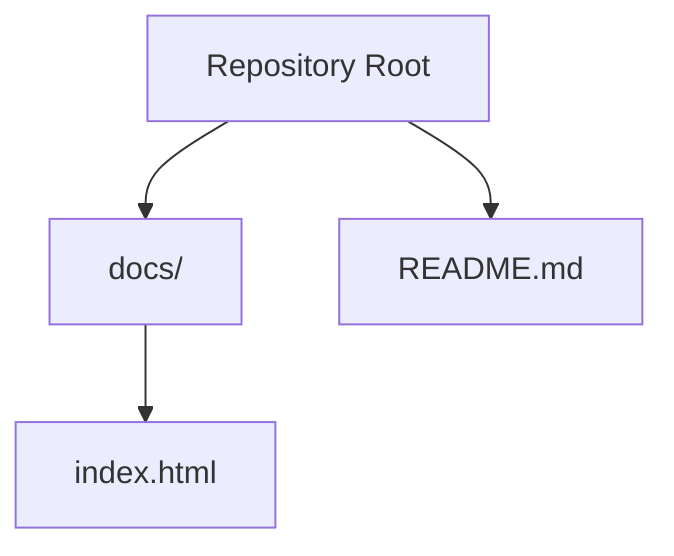
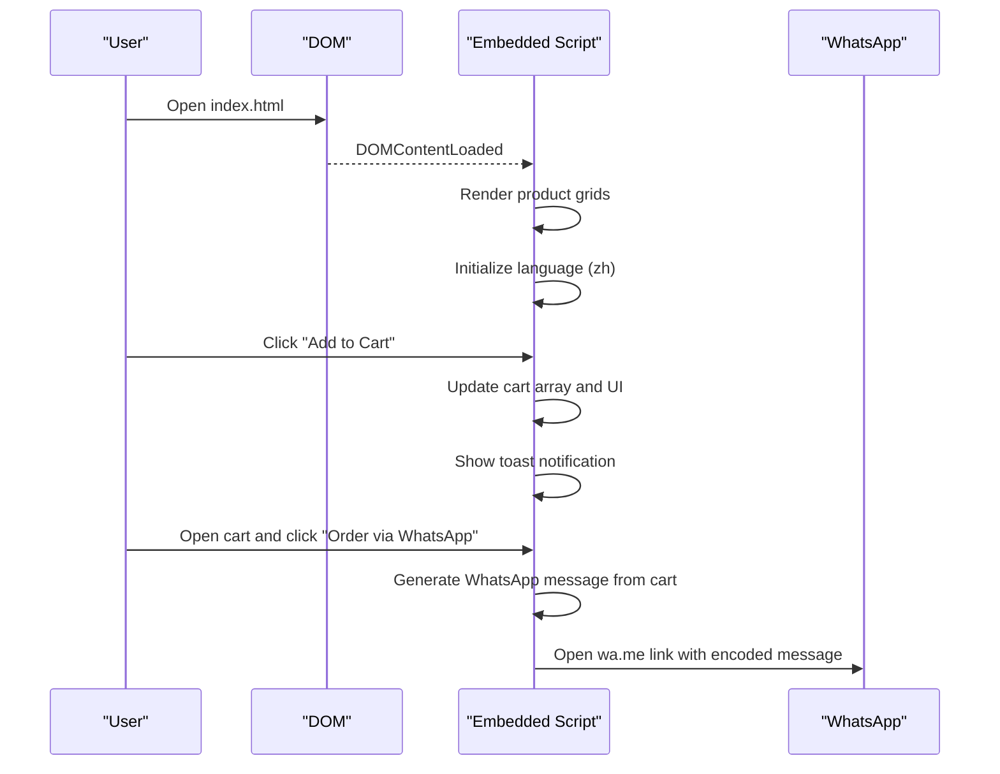
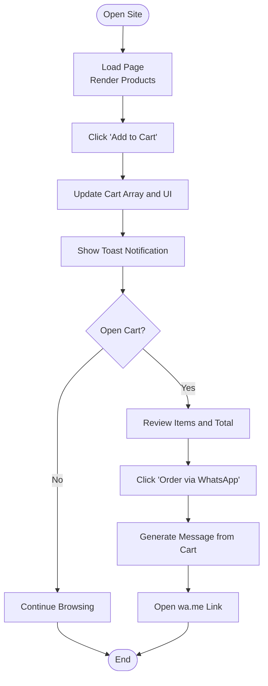
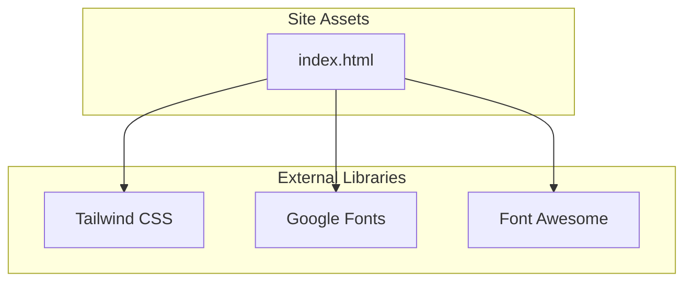

# Getting Started

<cite>
**Referenced Files in This Document**
- [README.md](file://README.md)
- [index.html](file://docs/index.html)
</cite>

## Table of Contents
1. [Introduction](#introduction)
2. [Project Structure](#project-structure)
3. [Core Components](#core-components)
4. [Architecture Overview](#architecture-overview)
5. [Detailed Component Analysis](#detailed-component-analysis)
6. [Dependency Analysis](#dependency-analysis)
7. [Performance Considerations](#performance-considerations)
8. [Troubleshooting Guide](#troubleshooting-guide)
9. [Conclusion](#conclusion)
10. [Appendices](#appendices)

## Introduction
This guide helps you set up, customize, and deploy the Fujian Florist website. The site is a single-page HTML application with embedded CSS and JavaScript, designed for easy editing and straightforward deployment to GitHub Pages. You will learn how to:
- Prepare your development environment
- Navigate the single-file structure
- Customize content such as products, images, and contact details
- Deploy to GitHub Pages

No build tools or server setup are required. All styling and interactivity are included within the HTML file.

## Project Structure
The repository contains a minimal structure optimized for static hosting:
- docs/index.html: The entire website (HTML, CSS, and JavaScript)
- README.md: Repository note

**Diagram sources**
- [index.html:1-20](file://docs/index.html#L1-L20)
- [README.md:1-1](file://README.md#L1-L1)

**Section sources**
- [README.md:1-1](file://README.md#L1-L1)
- [index.html:1-20](file://docs/index.html#L1-L20)

## Core Components
The website is organized into clear sections and features:
- Navigation bar with language toggle and cart icon
- Hero section with category links
- Product categories: Ceremonial, Funeral, Wreaths, Opening, Association, Graduation, Pets
- Delivery information and urgent order notice
- About section
- Footer with contact details and social links
- Shopping cart sidebar with WhatsApp checkout
- Floating WhatsApp button
- Toast notifications

Key implementation highlights:
- Tailwind CSS via CDN for styling
- Embedded custom CSS for animations and component styles
- Embedded JavaScript for product rendering, cart management, language switching, and UI interactions
- i18n dictionary for Traditional Chinese and English

**Section sources**
- [index.html:13-38](file://docs/index.html#L13-L38)
- [index.html:39-208](file://docs/index.html#L39-L208)
- [index.html:214-282](file://docs/index.html#L214-L282)
- [index.html:285-399](file://docs/index.html#L285-L399)
- [index.html:402-587](file://docs/index.html#L402-L587)
- [index.html:590-640](file://docs/index.html#L590-L640)
- [index.html:643-714](file://docs/index.html#L643-L714)
- [index.html:717-811](file://docs/index.html#L717-L811)
- [index.html:814-879](file://docs/index.html#L814-L879)
- [index.html:881-1586](file://docs/index.html#L881-L1586)

## Architecture Overview
High-level flow of the page:
- On load, the script renders product grids per category, initializes language, and sets up scroll effects.
- Users can switch languages; all text updates via data-i18n keys.
- Adding items to the cart updates counts, totals, and generates a WhatsApp message link.
- The floating WhatsApp button opens a chat with a default message.

**Diagram sources**
- [index.html:1332-1351](file://docs/index.html#L1332-L1351)
- [index.html:1353-1374](file://docs/index.html#L1353-L1374)
- [index.html:1446-1459](file://docs/index.html#L1446-L1459)
- [index.html:1478-1494](file://docs/index.html#L1478-L1494)
- [index.html:1496-1553](file://docs/index.html#L1496-L1553)
- [index.html:863-872](file://docs/index.html#L863-L872)

## Detailed Component Analysis

### Single File Organization
- Head includes:
  - Tailwind CSS CDN
  - Google Fonts
  - Font Awesome icons
  - Tailwind theme customization (fonts and colors)
  - Custom CSS block for animations, card hover effects, cart slide-in, overlays, and scrollbar styling
- Body includes:
  - Fixed navigation with language buttons and cart icon
  - Multiple product sections with grid containers
  - Delivery info and urgent order notice
  - About section
  - Footer with contact details and delivery summary
  - Cart sidebar overlay and controls
  - Floating WhatsApp button
  - Toast notification container
- Script block includes:
  - Translation dictionary (zh/en)
  - Product arrays by category
  - Rendering functions for each category
  - Cart logic (add/remove/update quantity)
  - Language switching function
  - UI helpers (toggle cart, mobile menu, toast)

Beginner tips:
- To change any visible text, search for the corresponding data-i18n key in the translation dictionary and update both zh and en entries.
- To add a new product, append an object to the relevant product array and ensure it has id, name, name_zh, price, category, image, description, and description_zh.

**Section sources**
- [index.html:1-20](file://docs/index.html#L1-L20)
- [index.html:13-38](file://docs/index.html#L13-L38)
- [index.html:39-208](file://docs/index.html#L39-L208)
- [index.html:881-1075](file://docs/index.html#L881-L1075)
- [index.html:1079-1328](file://docs/index.html#L1079-L1328)
- [index.html:1332-1351](file://docs/index.html#L1332-L1351)
- [index.html:1353-1374](file://docs/index.html#L1353-L1374)
- [index.html:1376-1444](file://docs/index.html#L1376-L1444)
- [index.html:1446-1586](file://docs/index.html#L1446-L1586)

### Products and Categories
Products are defined as arrays grouped by category. Each product object contains:
- id: unique numeric identifier
- name / name_zh: English and Traditional Chinese names
- price: number
- category: string matching the target section
- image: URL to product image
- description / description_zh: English and Traditional Chinese descriptions

Rendering functions map these arrays into grid cards and handle language-specific labels and badges.

To add a new product:
- Choose the correct category array
- Add a new object with all required fields
- Ensure the category value matches the render function’s expected category

To remove or reorder:
- Remove or move objects within the array accordingly

**Section sources**
- [index.html:1079-1120](file://docs/index.html#L1079-L1120)
- [index.html:1122-1163](file://docs/index.html#L1122-L1163)
- [index.html:1165-1196](file://docs/index.html#L1165-L1196)
- [index.html:1198-1229](file://docs/index.html#L1198-L1229)
- [index.html:1231-1262](file://docs/index.html#L1231-L1262)
- [index.html:1264-1295](file://docs/index.html#L1264-L1295)
- [index.html:1297-1328](file://docs/index.html#L1297-L1328)
- [index.html:1406-1444](file://docs/index.html#L1406-L1444)

### Images
Images are referenced by URLs in product objects and some static sections. To change images:
- Replace the image URL in the relevant product object
- For hero/about images, locate the img tags in the HTML body and replace src attributes

Best practices:
- Use high-resolution images optimized for web
- Keep consistent aspect ratios for uniform grid display
- Host images on a reliable CDN or include them in your repo under a dedicated folder and reference relative paths

**Section sources**
- [index.html:1086](file://docs/index.html#L1086)
- [index.html:1129](file://docs/index.html#L1129)
- [index.html:1172](file://docs/index.html#L1172)
- [index.html:1205](file://docs/index.html#L1205)
- [index.html:1238](file://docs/index.html#L1238)
- [index.html:1271](file://docs/index.html#L1271)
- [index.html:1304](file://docs/index.html#L1304)
- [index.html:648-651](file://docs/index.html#L648-L651)

### Contact Information
Contact details appear in the footer and various call-to-action links:
- Phone numbers
- WhatsApp links
- WeChat ID
- Store address
- Business hours

To update:
- Search for phone numbers and WhatsApp links in the HTML and replace with updated values
- Update WeChat ID and store address in the footer
- Adjust business hours text if needed

Note: WhatsApp links use a pre-filled message; ensure the phone number format matches the wa.me convention.

**Section sources**
- [index.html:760-781](file://docs/index.html#L760-L781)
- [index.html:738-741](file://docs/index.html#L738-L741)
- [index.html:863-872](file://docs/index.html#L863-L872)
- [index.html:1478-1494](file://docs/index.html#L1478-L1494)

### Language Switching
The site supports Traditional Chinese and English through a translations dictionary and data-i18n attributes. To add new text:
- Add the same key to both zh and en dictionaries
- Place the data-i18n attribute on the element containing the text

To change default language:
- Modify the initial language setting in the initialization code

**Section sources**
- [index.html:882-1075](file://docs/index.html#L882-L1075)
- [index.html:1353-1374](file://docs/index.html#L1353-L1374)

### Cart and Checkout Flow
Cart functionality:
- Add items to cart
- Increase/decrease quantities
- Remove items
- Calculate subtotal
- Generate WhatsApp message with itemized list and total
- Toggle cart sidebar and overlay

Checkout:
- Clicking “Order via WhatsApp” opens wa.me with a formatted message based on current language and cart contents

**Diagram sources**
- [index.html:1446-1459](file://docs/index.html#L1446-L1459)
- [index.html:1496-1553](file://docs/index.html#L1496-L1553)
- [index.html:1478-1494](file://docs/index.html#L1478-L1494)
- [index.html:863-872](file://docs/index.html#L863-L872)

**Section sources**
- [index.html:814-879](file://docs/index.html#L814-L879)
- [index.html:1446-1586](file://docs/index.html#L1446-L1586)

## Dependency Analysis
External dependencies loaded via CDN:
- Tailwind CSS (utility-first styling)
- Google Fonts (Playfair Display, Inter, Noto Serif TC, Noto Sans TC)
- Font Awesome 6 (icons)

Internal organization:
- Tailwind theme customization defines fonts and gold color palette
- Custom CSS adds animations, transitions, and component styles
- JavaScript manages state (cart), rendering, and user interactions

**Diagram sources**
- [index.html:8-12](file://docs/index.html#L8-L12)
- [index.html:13-38](file://docs/index.html#L13-L38)
- [index.html:39-208](file://docs/index.html#L39-L208)
- [index.html:881-1586](file://docs/index.html#L881-L1586)

**Section sources**
- [index.html:8-12](file://docs/index.html#L8-L12)
- [index.html:13-38](file://docs/index.html#L13-L38)
- [index.html:39-208](file://docs/index.html#L39-L208)
- [index.html:881-1586](file://docs/index.html#L881-L1586)

## Performance Considerations
- Single-file architecture simplifies deployment but increases initial payload size. Consider:
  - Optimizing images (compress, appropriate dimensions)
  - Using lazy loading for off-screen images if you expand the catalog
  - Deferring non-critical scripts if you later split the file
- CDN resources are cached by browsers; ensure version pinning for stability when scaling changes
- Minify CSS/JS if you decide to extract and optimize assets later

[No sources needed since this section provides general guidance]

## Troubleshooting Guide
Common issues and resolutions:
- Images not loading:
  - Verify image URLs are accessible and correctly typed
  - Check CORS restrictions if using third-party hosts
- Text not updating after language switch:
  - Ensure the element has the correct data-i18n attribute
  - Confirm the key exists in both zh and en dictionaries
- Cart not updating:
  - Check that product IDs are unique across categories
  - Validate that addToCart receives the correct productId
- WhatsApp link incorrect:
  - Confirm the phone number format matches wa.me conventions
  - Ensure the generated message is properly URL-encoded

**Section sources**
- [index.html:1353-1374](file://docs/index.html#L1353-L1374)
- [index.html:1446-1459](file://docs/index.html#L1446-L1459)
- [index.html:1478-1494](file://docs/index.html#L1478-L1494)

## Conclusion
You now have the essentials to develop, customize, and deploy the Fujian Florist website. The single-file design makes it beginner-friendly while offering enough depth for experienced developers to extend functionality. Focus on updating product catalogs, images, and contact details as needed, then deploy to GitHub Pages for instant public access.

[No sources needed since this section summarizes without analyzing specific files]

## Appendices

### Installation and Setup
- Prerequisites:
  - A modern web browser
  - A code editor (e.g., VS Code)
  - Git and GitHub account for deployment
- Local preview:
  - Open docs/index.html directly in your browser
  - Alternatively, serve locally with any static server (e.g., npx serve docs)

**Section sources**
- [index.html:1-20](file://docs/index.html#L1-L20)

### Basic Usage Examples
- Change brand name and tagline:
  - Update the corresponding data-i18n keys in the translation dictionary
- Add a new product:
  - Append a new object to the relevant category array with all required fields
- Change an image:
  - Replace the image URL in the product object or static img tag
- Update contact information:
  - Edit phone numbers, WhatsApp links, WeChat ID, address, and hours in the footer

**Section sources**
- [index.html:882-1075](file://docs/index.html#L882-L1075)
- [index.html:1079-1328](file://docs/index.html#L1079-L1328)
- [index.html:760-781](file://docs/index.html#L760-L781)

### Deployment to GitHub Pages
Steps:
- Create a new GitHub repository named <username>.github.io (replace <username> with your GitHub username)
- Push the repository contents to the main branch:
  - docs/index.html
  - README.md
- Enable GitHub Pages:
  - Go to Settings > Pages
  - Set Source to “Deploy from a branch”
  - Select main branch and /docs folder
  - Save and wait for deployment
- Access the site at https://<username>.github.io

Notes:
- Ensure the root path is configured to serve from /docs
- If you add more files, keep them under docs/ and reference them with relative paths

**Section sources**
- [README.md:1-1](file://README.md#L1-L1)
- [index.html:1-20](file://docs/index.html#L1-L20)