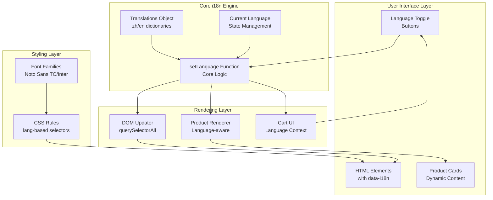
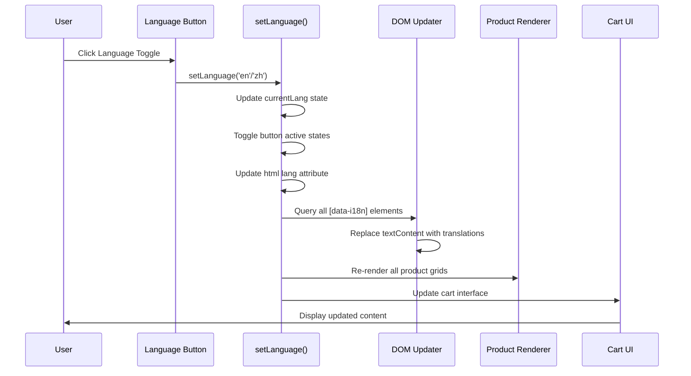

# Internationalization System

<cite>
**Referenced Files in This Document**
- [index.html](file://docs/index.html)
</cite>

## Table of Contents
1. [Introduction](#introduction)
2. [Architecture Overview](#architecture-overview)
3. [Translation Object Structure](#translation-object-structure)
4. [Dynamic Language Switching Mechanism](#dynamic-language-switching-mechanism)
5. [Font Family Adaptation](#font-family-adaptation)
6. [Contextual Content Replacement Patterns](#contextual-content-replacement-patterns)
7. [Language Toggle and UI Updates](#language-toggle-and-ui-updates)
8. [Adding New Languages](#adding-new-languages)
9. [Managing Translations](#managing-translations)
10. [Language-Specific Formatting](#language-specific-formatting)
11. [Common Issues and Solutions](#common-issues-and-solutions)
12. [Cultural Adaptations](#cultural-adaptations)
13. [Best Practices](#best-practices)

## Introduction

The internationalization (i18n) system in this project provides comprehensive bilingual support for Traditional Chinese (zh-Hant) and English (en). The implementation uses a client-side JavaScript approach with data attributes for dynamic content replacement, enabling seamless language switching without page reloads.

The system supports:
- Static text content through data-i18n attributes
- Dynamic product content with language-specific properties
- Font family adaptation for different languages
- Cultural formatting and messaging
- Real-time UI updates upon language switching

## Architecture Overview

The internationalization system follows a simple yet effective architecture:



**Diagram sources**
- [index.html:882-1075](file://docs/index.html#L882-L1075)
- [index.html:1353-1374](file://docs/index.html#L1353-L1374)
- [index.html:1376-1404](file://docs/index.html#L1376-L1404)

## Translation Object Structure

The translation system uses a hierarchical object structure with two primary language keys (`zh` and `en`) containing nested key-value pairs:

### Core Translation Keys

| Category | Key Pattern | Example Usage |
|----------|-------------|---------------|
| Brand & Navigation | `brand_*`, `nav_*` | Brand names, menu items |
| Hero Section | `hero_*` | Main headline and descriptions |
| Categories | `cat_*` | Product category labels |
| Sections | `section_*` | Section titles and descriptions |
| Services | `funeral_service_*` | Service feature descriptions |
| Delivery | `delivery_*` | Shipping information |
| About | `about_*` | Company information |
| Footer | `footer_*` | Contact and legal info |
| Cart | `cart_*` | Shopping cart interface |
| UI Feedback | `toast_*`, `whatsapp_*` | User interaction messages |

### Translation Data Structure

```javascript
const translations = {
    zh: {
        brand_name: "福建花店",
        nav_ceremonial: "喜慶花牌",
        hero_title_1: "喜事白事",
        // ... 90+ translation keys
    },
    en: {
        brand_name: "Fujian Florist",
        nav_ceremonial: "Ceremonial",
        hero_title_1: "Red & White",
        // ... 90+ translation keys
    }
};
```

**Section sources**
- [index.html:882-1075](file://docs/index.html#L882-L1075)

## Dynamic Language Switching Mechanism

The core language switching functionality is implemented through the `setLanguage()` function, which handles multiple aspects of the internationalization process:

### Language State Management



**Diagram sources**
- [index.html:1353-1374](file://docs/index.html#L1353-L1374)

### Implementation Details

The `setLanguage()` function performs these critical operations:

1. **State Update**: Sets the current language and updates button visual states
2. **Document Language**: Updates the `<html>` element's `lang` attribute for accessibility
3. **Static Content**: Uses `querySelectorAll('[data-i18n]')` to find and update all translatable elements
4. **Dynamic Content**: Re-renders product grids and cart interface with language context
5. **Persistence**: Maintains user preference throughout the session

**Section sources**
- [index.html:1353-1374](file://docs/index.html#L1353-L1374)

## Font Family Adaptation

The system implements sophisticated font family adaptation based on the current language context:

### Default Font Configuration

```css
body {
    font-family: 'Noto Sans TC', 'Inter', sans-serif;
}

h1, h2, h3, h4 {
    font-family: 'Noto Serif TC', 'Playfair Display', serif;
}
```

### Language-Specific Font Rules

```css
[lang="en"] h1,
[lang="en"] h2,
[lang="en"] h3,
[lang="en"] h4 {
    font-family: 'Playfair Display', serif;
}
```

### Font Loading Strategy

The system loads multiple font families to ensure optimal rendering across languages:

| Language | Primary Font | Fallback Font | Purpose |
|----------|--------------|---------------|---------|
| Traditional Chinese | Noto Sans TC / Noto Serif TC | Inter / Playfair Display | CJK character support |
| English | Inter / Playfair Display | - | Latin character optimization |

**Section sources**
- [index.html:17-20](file://docs/index.html#L17-L20)
- [index.html:40-56](file://docs/index.html#L40-L56)

## Contextual Content Replacement Patterns

The system employs multiple patterns for contextual content replacement:

### Static Content Pattern (data-i18n)

Elements with `data-i18n` attributes are automatically updated:

```html
<span data-i18n="brand_name">福建花店</span>
<button data-i18n="btn_shop">立即選購</button>
<h1 data-i18n="hero_title_1">喜事白事</h1>
```

### Dynamic Product Content Pattern

Products use language-specific properties within their data structures:

```javascript
const ceremonialProducts = [
    {
        id: 201,
        name: "Deluxe Double Happiness Wedding Plaque",
        name_zh: "豪華雙喜婚慶花牌",
        description: "Extra large red and gold floral plaque...",
        description_zh: "超大型紅金雙喜花牌..."
    }
];
```

### Conditional Rendering Pattern

JavaScript logic selects appropriate content based on current language:

```javascript
${currentLang === 'zh' ? product.name_zh : product.name}
${currentLang === 'zh' ? product.description_zh : product.description}
```

**Section sources**
- [index.html:221-224](file://docs/index.html#L221-L224)
- [index.html:1376-1404](file://docs/index.html#L1376-L1404)

## Language Toggle and UI Updates

The language toggle mechanism provides immediate feedback and maintains consistency across the entire interface:

### Toggle Button Implementation

```html
<div class="flex items-center bg-gray-100 rounded-full p-1 mr-2">
    <button onclick="setLanguage('zh')" id="lang-zh"
        class="lang-btn active px-3 py-1 rounded-full text-sm font-medium">繁</button>
    <button onclick="setLanguage('en')" id="lang-en"
        class="lang-btn px-3 py-1 rounded-full text-sm font-medium">EN</button>
</div>
```

### Visual State Management

The system manages active states through CSS classes:

```javascript
document.getElementById('lang-zh').classList.toggle('active', lang === 'zh');
document.getElementById('lang-en').classList.toggle('active', lang === 'en');
```

### Active State Styling

```css
.lang-btn.active {
    background-color: #b45309;
    color: white;
}
```

**Section sources**
- [index.html:248-253](file://docs/index.html#L248-L253)
- [index.html:1355-1356](file://docs/index.html#L1355-L1356)
- [index.html:150-153](file://docs/index.html#L150-L153)

## Adding New Languages

To add support for a new language (e.g., Simplified Chinese), follow these steps:

### Step 1: Extend Translation Object

Add a new language key to the translations object:

```javascript
const translations = {
    zh: { /* Traditional Chinese */ },
    en: { /* English */ },
    zh_cn: { /* Simplified Chinese - NEW */ }
};
```

### Step 2: Add Language Toggle Button

Include a new button in the language selector:

```html
<button onclick="setLanguage('zh_cn')" id="lang-zh_cn"
    class="lang-btn px-3 py-1 rounded-full text-sm font-medium">简</button>
```

### Step 3: Implement Font Support (Optional)

Add appropriate font families for the new language:

```css
[lang="zh-CN"] body {
    font-family: 'PingFang SC', 'Microsoft YaHei', sans-serif;
}
```

### Step 4: Update Language Detection

Modify the `setLanguage()` function if needed for special handling:

```javascript
function setLanguage(lang) {
    currentLang = lang;
    document.documentElement.lang = lang === 'zh' ? 'zh-Hant' : 
                                   lang === 'zh_cn' ? 'zh-Hans' : 'en';
    // ... rest of implementation
}
```

## Managing Translations

### Translation Key Organization

Maintain consistent key naming conventions:

| Pattern | Purpose | Example |
|---------|---------|---------|
| `component_action` | UI actions | `btn_shop`, `cart_checkout` |
| `section_description` | Section content | `hero_desc`, `about_desc_1` |
| `category_label` | Category names | `cat_ceremonial`, `nav_funeral` |
| `feature_title` | Feature highlights | `feature_1_title`, `delivery_kln_title` |

### Translation Validation

Ensure all keys exist in every language:

```javascript
function validateTranslations() {
    const zhKeys = Object.keys(translations.zh);
    const enKeys = Object.keys(translations.en);
    
    const missingInEn = zhKeys.filter(key => !translations.en[key]);
    const missingInZh = enKeys.filter(key => !translations.zh[key]);
    
    if (missingInEn.length > 0 || missingInZh.length > 0) {
        console.warn('Missing translations detected');
    }
}
```

### Translation File Structure

For larger projects, consider organizing translations into separate files:

```javascript
// translations/navigation.js
export const navigation = {
    zh: { nav_ceremonial: "喜慶花牌" },
    en: { nav_ceremonial: "Ceremonial" }
};

// translations/products.js
export const products = {
    zh: { cat_ceremonial: "喜慶花牌" },
    en: { cat_ceremonial: "Ceremonial" }
};
```

## Language-Specific Formatting

### Number and Currency Formatting

The system uses consistent currency formatting across languages:

```javascript
// Consistent currency display
$${product.price}
$${item.price * item.quantity}
```

### Date and Time Formatting

For future date/time features, implement locale-specific formatting:

```javascript
function formatDate(date, lang) {
    const options = lang === 'zh' ? {
        year: 'numeric',
        month: 'long',
        day: 'numeric'
    } : {
        year: 'numeric',
        month: 'short',
        day: 'numeric'
    };
    
    return date.toLocaleDateString(lang === 'zh' ? 'zh-TW' : 'en-US', options);
}
```

### Text Direction and Layout

Handle right-to-left languages if needed:

```css
[dir="rtl"] .container {
    direction: rtl;
    text-align: right;
}
```

## Common Issues and Solutions

### Text Overflow Problems

**Issue**: Long English text may overflow containers designed for shorter Chinese text.

**Solution**: Use responsive text sizing and flexible layouts:

```css
[data-i18n] {
    word-wrap: break-word;
    overflow-wrap: break-word;
}

@media (max-width: 768px) {
    [data-i18n] {
        font-size: 0.875rem;
    }
}
```

### Missing Translation Keys

**Issue**: Some elements may not update if translation keys are missing.

**Solution**: Implement fallback mechanisms:

```javascript
function safeTranslate(key, lang) {
    if (translations[lang][key]) {
        return translations[lang][key];
    }
    console.warn(`Missing translation key: ${key}`);
    return key; // Return key as fallback
}
```

### Performance Optimization

**Issue**: Large translation objects may impact initial load time.

**Solution**: Implement lazy loading or code splitting:

```javascript
// Lazy load translations
async function loadTranslations(lang) {
    if (!translations[lang]) {
        const response = await fetch(`/translations/${lang}.json`);
        translations[lang] = await response.json();
    }
    return translations[lang];
}
```

### Accessibility Concerns

**Issue**: Screen readers may not announce language changes properly.

**Solution**: Add ARIA attributes and live regions:

```html
<div aria-live="polite" aria-atomic="true" id="language-status">
    <!-- Language change announcements -->
</div>
```

## Cultural Adaptations

### Content Localization

Beyond direct translation, adapt content for cultural relevance:

| Aspect | Traditional Chinese | English |
|--------|-------------------|---------|
| Business Hours | 每日營業：上午9時至晚上7時 | Daily: 9AM - 7PM |
| Address Format | 九龍紅磡曲街2N號興利大廈地下西鋪 | West shop, Hing Lee Building, 2N Cooke Street, Hung Hom, Kowloon |
| Phone Format | +852 2334 9706 | +852 2334 9706 |
| Currency | $150 | $150 |

### Cultural Sensitivity

The system demonstrates cultural sensitivity in funeral-related content:

- Appropriate tone and terminology for memorial services
- Culturally relevant flower symbolism explanations
- Respectful language for sensitive topics

### Regional Variations

Consider implementing regional variants for broader coverage:

```javascript
const translations = {
    zh_hk: { /* Hong Kong Traditional Chinese */ },
    zh_tw: { /* Taiwan Traditional Chinese */ },
    zh_sg: { /* Singapore Traditional Chinese */ },
    en_us: { /* US English */ },
    en_gb: { /* UK English */ }
};
```

## Best Practices

### Translation Key Naming

Use descriptive, hierarchical key names:

```javascript
// Good examples
hero_section_title: "Main Headline"
product_card_add_to_cart: "Add to Cart"
footer_contact_phone: "Phone Number"

// Avoid vague names
text1: "Some text"
button1: "Click me"
```

### Code Organization

Separate concerns between structure, styling, and logic:

```javascript
// Keep translations centralized
const translations = { /* all translations */ };

// Separate rendering logic
function renderProductCard(product, index) {
    // Pure rendering logic
}

// Separate UI interactions
function setLanguage(lang) {
    // UI state management
}
```

### Testing Considerations

Implement testing strategies for internationalization:

```javascript
// Test language switching
function testLanguageSwitch() {
    setLanguage('en');
    assert(document.querySelector('[data-i18n="brand_name"]').textContent === 'Fujian Florist');
    
    setLanguage('zh');
    assert(document.querySelector('[data-i18n="brand_name"]').textContent === '福建花店');
}
```

### Documentation Maintenance

Keep translation documentation updated:

```markdown
# Translation Guide

## Adding New Keys
1. Add key to both zh and en objects
2. Use descriptive naming convention
3. Test in both languages
4. Verify no layout issues

## Key Categories
- UI Elements: btn_*, nav_*
- Content: section_*, about_*
- Products: cat_*, product_*
```

This internationalization system provides a robust foundation for multilingual support while maintaining clean code organization and excellent user experience across different languages and cultures.