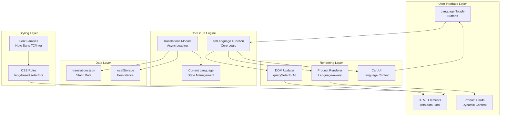
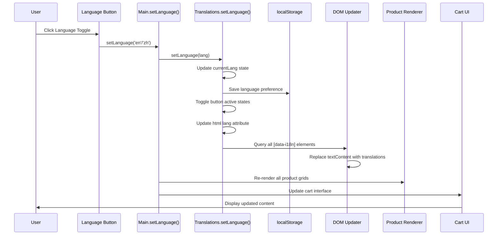

# Internationalization System

<cite>
**Referenced Files in This Document**
- [translations.js](file://docs/js/translations.js)
- [translations.json](file://docs/translations.json)
- [main.js](file://docs/js/main.js)
- [components.js](file://docs/js/components.js)
- [index.html](file://docs/index.html)
- [styles.css](file://docs/css/styles.css)
</cite>

## Update Summary
**Changes Made**
- Updated architecture overview to reflect new modular translation system
- Replaced inline translation objects with JSON-based structure
- Enhanced language switching mechanism with async loading and persistence
- Improved content organization with dedicated modules
- Added comprehensive examples for the new translation workflow

## Table of Contents
1. [Introduction](#introduction)
2. [Architecture Overview](#architecture-overview)
3. [Translation Module Structure](#translation-module-structure)
4. [JSON Translation File Organization](#json-translation-file-organization)
5. [Dynamic Language Switching Mechanism](#dynamic-language-switching-mechanism)
6. [Font Family Adaptation](#font-family-adaptation)
7. [Contextual Content Replacement Patterns](#contextual-content-replacement-patterns)
8. [Language Toggle and UI Updates](#language-toggle-and-ui-updates)
9. [Adding New Languages](#adding-new-languages)
10. [Managing Translations](#managing-translations)
11. [Language-Specific Formatting](#language-specific-formatting)
12. [Common Issues and Solutions](#common-issues-and-solutions)
13. [Cultural Adaptations](#cultural-adaptations)
14. [Best Practices](#best-practices)

## Introduction

The internationalization (i18n) system in this project provides comprehensive bilingual support for Traditional Chinese (zh-Hant) and English (en). The implementation has been overhauled to use a modular architecture with dedicated JavaScript modules and JSON-based translation files, enabling scalable and maintainable multilingual support without page reloads.

The system supports:
- Static text content through data-i18n attributes
- Dynamic product content with language-specific properties
- Font family adaptation for different languages
- Cultural formatting and messaging
- Real-time UI updates upon language switching
- Persistent language preferences across sessions

## Architecture Overview

The internationalization system follows a modular architecture with clear separation of concerns:



**Diagram sources**
- [translations.js:5-54](file://docs/js/translations.js#L5-L54)
- [main.js:110-127](file://docs/js/main.js#L110-L127)
- [index.html:72-77](file://docs/index.html#L72-L77)

## Translation Module Structure

The translation system is now implemented as a dedicated module with clear responsibilities:

### Core Module Functions

| Function | Purpose | Parameters | Returns |
|----------|---------|------------|---------|
| `load()` | Async load translations from JSON | None | Promise<void> |
| `getLang()` | Get current language | None | string |
| `t(key)` | Translate a key | string key | string |
| `apply()` | Apply translations to DOM | None | void |
| `setLanguage(lang)` | Set language and update UI | string lang | void |

### Module Implementation

```javascript
const Translations = (() => {
    let translations = {};
    let currentLang = 'zh';

    async function load() {
        const res = await fetch('translations.json');
        translations = await res.json();
        // Restore saved language preference
        const saved = localStorage.getItem('fujianFloristLang');
        if (saved && translations[saved]) {
            currentLang = saved;
        }
    }

    function t(key) {
        return (translations[currentLang] && translations[currentLang][key]) || key;
    }

    function apply() {
        document.querySelectorAll('[data-i18n]').forEach(el => {
            const key = el.getAttribute('data-i18n');
            const value = t(key);
            if (value !== key) {
                el.textContent = value;
            }
        });

        // Update lang buttons
        const zhBtn = document.getElementById('lang-zh');
        const enBtn = document.getElementById('lang-en');
        if (zhBtn) zhBtn.classList.toggle('active', currentLang === 'zh');
        if (enBtn) enBtn.classList.toggle('active', currentLang === 'en');

        // Update document lang attribute
        document.documentElement.lang = currentLang === 'zh' ? 'zh-Hant' : 'en';
    }

    function setLanguage(lang) {
        if (!translations[lang]) return;
        currentLang = lang;
        localStorage.setItem('fujianFloristLang', lang);
        apply();
    }

    return { load, getLang, t, apply, setLanguage };
})();
```

**Section sources**
- [translations.js:5-54](file://docs/js/translations.js#L5-L54)

## JSON Translation File Organization

The translation data is now stored in a structured JSON file with hierarchical organization:

### Translation Categories

| Category | Keys | Description |
|----------|------|-------------|
| Brand & Navigation | `brand_name`, `nav_*` | Brand names and menu items |
| Hero Section | `hero_*` | Main headline and descriptions |
| Categories | `cat_*` | Product category labels |
| Sections | `section_*` | Section titles and descriptions |
| Services | `funeral_service_*` | Service feature descriptions |
| Delivery | `delivery_*` | Shipping information |
| About | `about_*` | Company information |
| Footer | `footer_*` | Contact and legal info |
| Cart | `cart_*` | Shopping cart interface |
| UI Feedback | `toast_*`, `whatsapp_*` | User interaction messages |

### JSON Structure Example

```json
{
  "zh": {
    "brand_name": "福建花店",
    "nav_ceremonial": "喜慶花牌",
    "hero_title_1": "喜事白事",
    "hero_title_2": "一站俱全",
    "hero_desc": "福建花店專營各類喜慶花牌、帛事花牌、中西花圈、開張花牌、社團花牌、畢業花牌及寵物花牌。三十年經驗，信譽保證，需提前5天前預訂。",
    "btn_shop": "立即選購",
    "btn_whatsapp": "WhatsApp 查詢",
    "tag_1": "5天前預訂",
    "tag_2": "免費代寫輓聯",
    "tag_3": "三十年經驗",
    "cat_ceremonial": "喜慶花牌",
    "cat_ceremonial_desc": "祝壽賀喜",
    // ... additional keys
  },
  "en": {
    "brand_name": "Fujian Florist",
    "nav_ceremonial": "Ceremonial",
    "hero_title_1": "Red & White",
    "hero_title_2": "All in One Place",
    "hero_desc": "Fujian Florist specializes in ceremonial plaques, funeral plaques, Chinese/Western wreaths, grand opening plaques, association plaques, graduation plaques and pet memorial plaques. 30 years of experience. 5 days pre-order required.",
    "btn_shop": "Shop Now",
    "btn_whatsapp": "WhatsApp Inquiry",
    "tag_1": "5 days Pre-order",
    "tag_2": "Free Eulogy Writing",
    "tag_3": "30 Years Experience",
    "cat_ceremonial": "Ceremonial",
    "cat_ceremonial_desc": "Weddings",
    // ... additional keys
  }
}
```

**Section sources**
- [translations.json:1-199](file://docs/translations.json#L1-L199)

## Dynamic Language Switching Mechanism

The core language switching functionality is implemented through the enhanced `setLanguage()` function with improved state management and persistence:

### Language State Management Flow



**Diagram sources**
- [main.js:110-115](file://docs/js/main.js#L110-L115)
- [translations.js:46-51](file://docs/js/translations.js#L46-L51)

### Enhanced Implementation Details

The improved `setLanguage()` function performs these critical operations:

1. **Validation**: Checks if the target language exists in loaded translations
2. **State Update**: Sets the current language and persists it to localStorage
3. **Document Language**: Updates the `<html>` element's `lang` attribute for accessibility
4. **Static Content**: Uses `querySelectorAll('[data-i18n]')` to find and update all translatable elements
5. **Dynamic Content**: Triggers re-rendering of product grids and cart interface with language context
6. **Visual Feedback**: Updates language toggle button active states

**Section sources**
- [main.js:110-115](file://docs/js/main.js#L110-L115)
- [translations.js:46-51](file://docs/js/translations.js#L46-L51)

## Font Family Adaptation

The system implements sophisticated font family adaptation based on the current language context:

### Default Font Configuration

```css
body {
    font-family: 'Noto Sans TC', 'Inter', sans-serif;
}

h1, h2, h3, h4 {
    font-family: 'Noto Serif TC', 'Playfair Display', serif;
}
```

### Language-Specific Font Rules

```css
[lang="en"] h1,
[lang="en"] h2,
[lang="en"] h3,
[lang="en"] h4 {
    font-family: 'Playfair Display', serif;
}
```

### Font Loading Strategy

The system loads multiple font families to ensure optimal rendering across languages:

| Language | Primary Font | Fallback Font | Purpose |
|----------|--------------|---------------|---------|
| Traditional Chinese | Noto Sans TC / Noto Serif TC | Inter / Playfair Display | CJK character support |
| English | Inter / Playfair Display | - | Latin character optimization |

**Section sources**
- [index.html:18-21](file://docs/index.html#L18-L21)
- [styles.css:1-14](file://docs/css/styles.css#L1-L14)

## Contextual Content Replacement Patterns

The system employs multiple patterns for contextual content replacement:

### Static Content Pattern (data-i18n)

Elements with `data-i18n` attributes are automatically updated:

```html
<span data-i18n="brand_name">福建花店</span>
<button data-i18n="btn_shop">立即選購</button>
<h1 data-i18n="hero_title_1">喜事白事</h1>
```

### Dynamic Product Content Pattern

Products use language-specific properties within their data structures:

```javascript
const ceremonialProducts = [
    {
        id: 201,
        name: "Deluxe Double Happiness Wedding Plaque",
        name_zh: "豪華雙喜婚慶花牌",
        description: "Extra large red and gold floral plaque...",
        description_zh: "超大型紅金雙喜花牌..."
    }
];
```

### Conditional Rendering Pattern

JavaScript logic selects appropriate content based on current language:

```javascript
${currentLang === 'zh' ? product.name_zh : product.name}
${currentLang === 'zh' ? product.description_zh : product.description}
```

**Section sources**
- [index.html:45-48](file://docs/index.html#L45-L48)
- [main.js:34-36](file://docs/js/main.js#L34-L36)

## Language Toggle and UI Updates

The language toggle mechanism provides immediate feedback and maintains consistency across the entire interface:

### Toggle Button Implementation

```html
<div class="flex items-center bg-gray-100 rounded-full p-1 mr-2">
    <button onclick="setLanguage('zh')" id="lang-zh"
        class="lang-btn active px-3 py-1 rounded-full text-sm font-medium">繁</button>
    <button onclick="setLanguage('en')" id="lang-en"
        class="lang-btn px-3 py-1 rounded-full text-sm font-medium">EN</button>
</div>
```

### Visual State Management

The system manages active states through CSS classes:

```javascript
document.getElementById('lang-zh').classList.toggle('active', currentLang === 'zh');
document.getElementById('lang-en').classList.toggle('active', currentLang === 'en');
```

### Active State Styling

```css
.lang-btn.active {
    background-color: #b45309;
    color: white;
}
```

**Section sources**
- [index.html:72-77](file://docs/index.html#L72-L77)
- [translations.js:37-40](file://docs/js/translations.js#L37-L40)
- [styles.css:89-92](file://docs/css/styles.css#L89-L92)

## Adding New Languages

To add support for a new language (e.g., Simplified Chinese), follow these steps:

### Step 1: Extend JSON Translation File

Add a new language object to the translations.json file:

```json
{
  "zh": { /* Traditional Chinese */ },
  "en": { /* English */ },
  "zh_cn": { /* Simplified Chinese - NEW */ }
}
```

### Step 2: Add Language Toggle Button

Include a new button in the language selector:

```html
<button onclick="setLanguage('zh_cn')" id="lang-zh_cn"
    class="lang-btn px-3 py-1 rounded-full text-sm font-medium">简</button>
```

### Step 3: Implement Font Support (Optional)

Add appropriate font families for the new language:

```css
[lang="zh-CN"] body {
    font-family: 'PingFang SC', 'Microsoft YaHei', sans-serif;
}
```

### Step 4: Update Language Detection

Modify the `setLanguage()` function if needed for special handling:

```javascript
function setLanguage(lang) {
    if (!translations[lang]) return;
    currentLang = lang;
    localStorage.setItem('fujianFloristLang', lang);
    
    // Update document lang attribute for new language
    if (lang === 'zh_cn') {
        document.documentElement.lang = 'zh-Hans';
    } else if (lang === 'zh') {
        document.documentElement.lang = 'zh-Hant';
    } else {
        document.documentElement.lang = 'en';
    }
    
    apply();
}
```

## Managing Translations

### Translation Key Organization

Maintain consistent key naming conventions:

| Pattern | Purpose | Example |
|---------|---------|---------|
| `component_action` | UI actions | `btn_shop`, `cart_checkout` |
| `section_description` | Section content | `hero_desc`, `about_desc_1` |
| `category_label` | Category names | `cat_ceremonial`, `nav_funeral` |
| `feature_title` | Feature highlights | `feature_1_title`, `delivery_kln_title` |

### Translation Validation

Ensure all keys exist in every language:

```javascript
function validateTranslations() {
    const zhKeys = Object.keys(translations.zh);
    const enKeys = Object.keys(translations.en);
    
    const missingInEn = zhKeys.filter(key => !translations.en[key]);
    const missingInZh = enKeys.filter(key => !translations.zh[key]);
    
    if (missingInEn.length > 0 || missingInZh.length > 0) {
        console.warn('Missing translations detected');
    }
}
```

### Translation File Structure

For larger projects, consider organizing translations into separate files:

```javascript
// translations/navigation.js
export const navigation = {
    zh: { nav_ceremonial: "喜慶花牌" },
    en: { nav_ceremonial: "Ceremonial" }
};

// translations/products.js
export const products = {
    zh: { cat_ceremonial: "喜慶花牌" },
    en: { cat_ceremonial: "Ceremonial" }
};
```

## Language-Specific Formatting

### Number and Currency Formatting

The system uses consistent currency formatting across languages:

```javascript
// Consistent currency display
$${product.price}
$${item.price * item.quantity}
```

### Date and Time Formatting

For future date/time features, implement locale-specific formatting:

```javascript
function formatDate(date, lang) {
    const options = lang === 'zh' ? {
        year: 'numeric',
        month: 'long',
        day: 'numeric'
    } : {
        year: 'numeric',
        month: 'short',
        day: 'numeric'
    };
    
    return date.toLocaleDateString(lang === 'zh' ? 'zh-TW' : 'en-US', options);
}
```

### Text Direction and Layout

Handle right-to-left languages if needed:

```css
[dir="rtl"] .container {
    direction: rtl;
    text-align: right;
}
```

## Common Issues and Solutions

### Text Overflow Problems

**Issue**: Long English text may overflow containers designed for shorter Chinese text.

**Solution**: Use responsive text sizing and flexible layouts:

```css
[data-i18n] {
    word-wrap: break-word;
    overflow-wrap: break-word;
}

@media (max-width: 768px) {
    [data-i18n] {
        font-size: 0.875rem;
    }
}
```

### Missing Translation Keys

**Issue**: Some elements may not update if translation keys are missing.

**Solution**: Implement fallback mechanisms:

```javascript
function safeTranslate(key, lang) {
    if (translations[lang][key]) {
        return translations[lang][key];
    }
    console.warn(`Missing translation key: ${key}`);
    return key; // Return key as fallback
}
```

### Performance Optimization

**Issue**: Large translation objects may impact initial load time.

**Solution**: The current implementation already uses efficient JSON loading:

```javascript
async function load() {
    const res = await fetch('translations.json');
    translations = await res.json();
    // Restore saved language preference
    const saved = localStorage.getItem('fujianFloristLang');
    if (saved && translations[saved]) {
        currentLang = saved;
    }
}
```

### Accessibility Concerns

**Issue**: Screen readers may not announce language changes properly.

**Solution**: Add ARIA attributes and live regions:

```html
<div aria-live="polite" aria-atomic="true" id="language-status">
    <!-- Language change announcements -->
</div>
```

## Cultural Adaptations

### Content Localization

Beyond direct translation, adapt content for cultural relevance:

| Aspect | Traditional Chinese | English |
|--------|-------------------|---------|
| Business Hours | 每日營業：上午9時至晚上7時 | Daily: 9AM - 7PM |
| Address Format | 九龍紅磡曲街2N號興利大廈地下西鋪 | West shop, Hing Lee Building, 2N Cooke Street, Hung Hom, Kowloon |
| Phone Format | +852 2334 9706 | +852 2334 9706 |
| Currency | $150 | $150 |

### Cultural Sensitivity

The system demonstrates cultural sensitivity in funeral-related content:

- Appropriate tone and terminology for memorial services
- Culturally relevant flower symbolism explanations
- Respectful language for sensitive topics

### Regional Variations

Consider implementing regional variants for broader coverage:

```json
{
  "zh_hk": { /* Hong Kong Traditional Chinese */ },
  "zh_tw": { /* Taiwan Traditional Chinese */ },
  "zh_sg": { /* Singapore Traditional Chinese */ },
  "en_us": { /* US English */ },
  "en_gb": { /* UK English */ }
}
```

## Best Practices

### Translation Key Naming

Use descriptive, hierarchical key names:

```javascript
// Good examples
hero_section_title: "Main Headline"
product_card_add_to_cart: "Add to Cart"
footer_contact_phone: "Phone Number"

// Avoid vague names
text1: "Some text"
button1: "Click me"
```

### Code Organization

Separate concerns between structure, styling, and logic:

```javascript
// Keep translations centralized in JSON
// Separate rendering logic
function renderProductCard(product, index) {
    // Pure rendering logic
}

// Separate UI interactions
function setLanguage(lang) {
    // UI state management
}
```

### Testing Considerations

Implement testing strategies for internationalization:

```javascript
// Test language switching
function testLanguageSwitch() {
    Translations.setLanguage('en');
    assert(document.querySelector('[data-i18n="brand_name"]').textContent === 'Fujian Florist');
    
    Translations.setLanguage('zh');
    assert(document.querySelector('[data-i18n="brand_name"]').textContent === '福建花店');
}
```

### Documentation Maintenance

Keep translation documentation updated:

```markdown
# Translation Guide

## Adding New Keys
1. Add key to both zh and en objects in translations.json
2. Use descriptive naming convention
3. Test in both languages
4. Verify no layout issues

## Key Categories
- UI Elements: btn_*, nav_*
- Content: section_*, about_*
- Products: cat_*, product_*
```

This enhanced internationalization system provides a robust foundation for multilingual support while maintaining clean code organization, excellent performance, and superior user experience across different languages and cultures. The modular architecture ensures scalability and maintainability for future language additions and content updates.