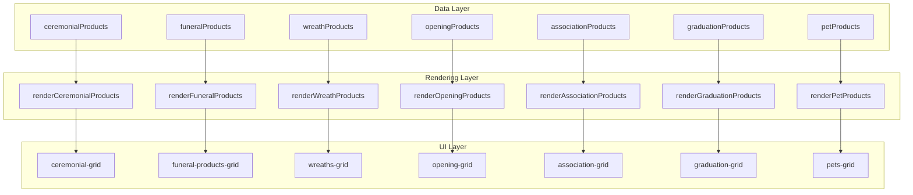
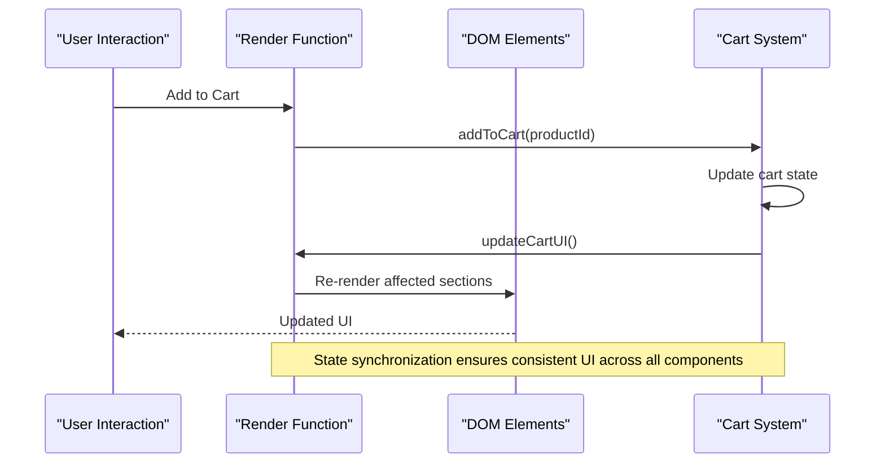
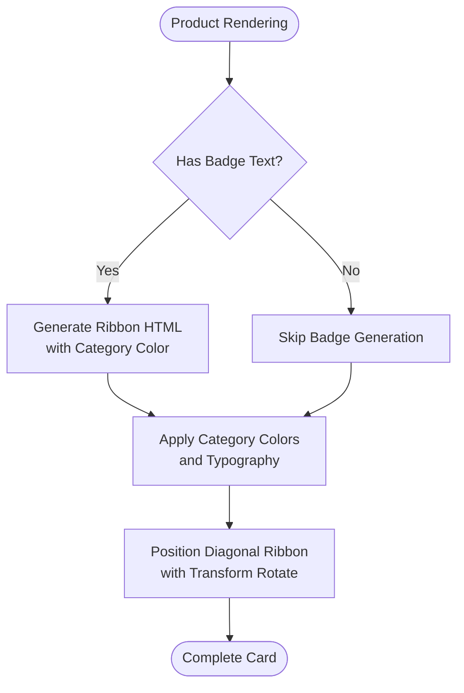

# Category Management System

<cite>
**Referenced Files in This Document**
- [index.html](file://docs/index.html)
</cite>

## Table of Contents
1. [Introduction](#introduction)
2. [Project Structure](#project-structure)
3. [Core Components](#core-components)
4. [Architecture Overview](#architecture-overview)
5. [Detailed Component Analysis](#detailed-component-analysis)
6. [Category Arrays and Data Structure](#category-arrays-and-data-structure)
7. [Badge System Implementation](#badge-system-implementation)
8. [Rendering Functions](#rendering-functions)
9. [Practical Examples](#practical-examples)
10. [Performance Considerations](#performance-considerations)
11. [Troubleshooting Guide](#troubleshooting-guide)
12. [Conclusion](#conclusion)

## Introduction

The Category Management System is a sophisticated product categorization and display mechanism implemented within a single-page florist website. This system manages seven distinct product categories, each with specialized rendering logic, visual styling, and interactive features. The implementation demonstrates a clean separation between data structures, rendering functions, and user interface components, providing an extensible foundation for managing diverse product types.

The system supports both ceremonial and funeral services, reflecting the cultural significance of red and white affairs in Chinese tradition. Each category maintains its own identity through color coding, badge systems, and specialized UI treatments while sharing common functionality for cart management and internationalization.

## Project Structure

The category management system is implemented as a self-contained JavaScript module within the main HTML file. The architecture follows a modular pattern where data arrays are separated from rendering logic, enabling maintainable code organization.



**Diagram sources**
- [index.html:1079-1328](file://docs/index.html#L1079-L1328)
- [index.html:1406-1444](file://docs/index.html#L1406-L1444)

**Section sources**
- [index.html:1079-1328](file://docs/index.html#L1079-L1328)
- [index.html:1406-1444](file://docs/index.html#L1406-L1444)

## Core Components

The category management system consists of several interconnected components that work together to provide a seamless user experience:

### Product Data Structure
Each product object contains standardized properties including unique identifiers, bilingual names, pricing information, category classification, image URLs, and descriptions in both Chinese and English.

### Rendering Engine
A centralized rendering function handles the creation of product cards with dynamic styling based on category attributes. This function manages badge generation, color schemes, and responsive layout adjustments.

### Category-Specific Renderers
Seven dedicated rendering functions handle the display of products within their respective sections, each mapping to specific DOM elements and applying category-specific visual treatments.

### Badge System
An intelligent badge system provides visual categorization through color-coded ribbons and text labels, enhancing product discoverability and brand consistency.

**Section sources**
- [index.html:1376-1404](file://docs/index.html#L1376-L1404)
- [index.html:1406-1444](file://docs/index.html#L1406-L1444)

## Architecture Overview

The system follows a unidirectional data flow pattern where data changes trigger re-rendering of affected components. The architecture emphasizes separation of concerns while maintaining efficient performance through targeted DOM updates.



**Diagram sources**
- [index.html:1446-1459](file://docs/index.html#L1446-L1459)
- [index.html:1496-1553](file://docs/index.html#L1496-L1553)

## Detailed Component Analysis

### Category Arrays and Data Structure

The system implements seven distinct product category arrays, each containing structured product data with consistent schema:

#### Data Schema Definition
Each product object follows this structure:
- `id`: Unique numeric identifier for cart operations
- `name`/`name_zh`: Bilingual product naming
- `price`: Numeric pricing in Hong Kong dollars
- `category`: String classification for filtering and styling
- `image`: URL path to product imagery
- `description`/`description_zh`: Bilingual product descriptions

#### Category Distribution
- **Ceremonial Products**: 4 items (IDs: 201-205) - Wedding and celebration arrangements
- **Funeral Products**: 4 items (IDs: 101-104) - Memorial and sympathy arrangements  
- **Wreath Products**: 3 items (IDs: 302-304) - Traditional and Western wreath styles
- **Opening Products**: 3 items (IDs: 402-404) - Business opening celebrations
- **Association Products**: 3 items (IDs: 501-503) - Community and organizational events
- **Graduation Products**: 3 items (IDs: 601-603) - Academic achievement celebrations
- **Pet Products**: 3 items (IDs: 701-703) - Pet memorial arrangements

**Section sources**
- [index.html:1079-1120](file://docs/index.html#L1079-L1120)
- [index.html:1122-1163](file://docs/index.html#L1122-L1163)
- [index.html:1165-1196](file://docs/index.html#L1165-L1196)
- [index.html:1198-1229](file://docs/index.html#L1198-L1229)
- [index.html:1231-1262](file://docs/index.html#L1231-L1262)
- [index.html:1264-1295](file://docs/index.html#L1264-L1295)
- [index.html:1297-1328](file://docs/index.html#L1297-L1328)

### Badge System Implementation

The badge system provides visual differentiation between product categories through color-coded ribbons and contextual styling:

#### Color Coding Strategy
- **Amber (#b45309)**: Ceremonial, Opening, Association products - representing prosperity and celebration
- **Blue (#2563eb)**: Graduation products - symbolizing academic achievement and trust
- **Purple (#7c3aed)**: Pet products - conveying warmth and compassion
- **Neutral**: Funeral products - maintaining respectful, subdued appearance

#### Badge Generation Logic
The system dynamically generates ribbon badges with category-specific colors and text labels. The badge positioning uses absolute CSS positioning with rotation transforms to create diagonal ribbon effects.



**Diagram sources**
- [index.html:1376-1404](file://docs/index.html#L1376-L1404)

**Section sources**
- [index.html:1376-1404](file://docs/index.html#L1376-L1404)

### Rendering Functions

Each category has a dedicated rendering function that maps product data to specific DOM elements:

#### DOM Element Mapping
- `ceremonial-grid`: Main ceremonial products container
- `funeral-products-grid`: Funeral products section
- `wreaths-grid`: Wreath products container
- `opening-grid`: Grand opening products section
- `association-grid`: Association products container
- `graduation-grid`: Graduation products section
- `pets-grid`: Pet memorial products container

#### Rendering Pipeline
The rendering process follows a consistent pattern:
1. Target specific DOM element by ID
2. Map product array to HTML string using template literals
3. Apply category-specific badge configuration
4. Inject generated HTML into target container

#### Language Support Integration
All rendering functions respect the current language setting, switching between Chinese and English content dynamically without requiring page reloads.

**Section sources**
- [index.html:1406-1444](file://docs/index.html#L1406-L1444)

## Practical Examples

### Adding New Products to Existing Categories

To add a new product to an existing category, follow these steps:

1. **Locate the target category array** in the appropriate section of the code
2. **Append a new product object** following the established schema
3. **Ensure unique ID assignment** to prevent conflicts with existing products
4. **Provide bilingual content** for both name and description fields
5. **Include valid image URL** pointing to appropriate product imagery

Example structure for adding to ceremonial products:
```javascript
{
    id: 206, // Next available ID
    name: "New Product Name",
    name_zh: "新產品名稱",
    price: 999,
    category: "ceremonial",
    image: "https://example.com/new-product.jpg",
    description: "English description here",
    description_zh: "中文描述內容"
}
```

### Creating Entirely New Category Systems

To implement a completely new category system:

1. **Define new category array** following existing patterns
2. **Create corresponding render function** with proper DOM targeting
3. **Add HTML container element** with unique grid ID
4. **Implement navigation links** for category access
5. **Configure badge system** with appropriate color scheme
6. **Update initialization sequence** to include new render function

#### Complete Implementation Checklist
- [ ] Create category data array with product objects
- [ ] Implement render function with DOM element targeting
- [ ] Add HTML section with grid container
- [ ] Configure navigation menu entries
- [ ] Set up badge system parameters
- [ ] Update initialization sequence
- [ ] Test language switching functionality
- [ ] Verify cart integration works correctly

**Section sources**
- [index.html:1079-1328](file://docs/index.html#L1079-L1328)
- [index.html:1406-1444](file://docs/index.html#L1406-L1444)

## Performance Considerations

The category management system implements several optimization strategies:

### Efficient DOM Manipulation
- Uses innerHTML replacement for batch updates rather than individual element manipulation
- Implements conditional rendering checks to prevent unnecessary DOM operations
- Leverages template literals for optimized string concatenation

### Memory Management
- Maintains single source of truth for product data
- Avoids duplicate event listeners through centralized handlers
- Implements cleanup mechanisms for dynamic content

### Rendering Optimization
- Staggered animation delays for progressive loading effect
- Conditional rendering based on DOM element existence
- Efficient cart state management with minimal re-renders

## Troubleshooting Guide

### Common Issues and Solutions

#### Products Not Displaying
- **Check DOM element IDs**: Ensure target grid containers exist with correct IDs
- **Verify array references**: Confirm category arrays are properly defined and accessible
- **Validate HTML injection**: Check browser console for DOM manipulation errors

#### Badge System Malfunctions
- **Review color codes**: Verify hex color values are properly formatted
- **Check CSS classes**: Ensure ribbon styling classes are present in stylesheet
- **Validate transform properties**: Confirm CSS transform syntax is correct

#### Cart Integration Problems
- **Verify product IDs**: Ensure unique IDs across all category arrays
- **Check event binding**: Confirm onclick handlers reference correct functions
- **Validate cart state**: Monitor cart array modifications during operations

#### Language Switching Issues
- **Confirm translation keys**: Verify all data-i18n attributes have matching translations
- **Check render function calls**: Ensure language change triggers re-rendering
- **Validate DOM updates**: Monitor dynamic content updates after language switch

**Section sources**
- [index.html:1332-1351](file://docs/index.html#L1332-L1351)
- [index.html:1353-1374](file://docs/index.html#L1353-L1374)

## Conclusion

The Category Management System represents a well-architected solution for organizing and displaying diverse product categories within a culturally sensitive florist website. The implementation demonstrates best practices in modular JavaScript development, including clear separation of concerns, efficient DOM manipulation, and comprehensive internationalization support.

The system's extensibility allows for easy addition of new categories while maintaining consistent user experience across all product types. The thoughtful design of the badge system and color coding enhances product discoverability while respecting cultural nuances in different service categories.

Future enhancements could include advanced filtering capabilities, search functionality, and integration with backend inventory systems. However, the current implementation provides a solid foundation that balances functionality, performance, and maintainability effectively.