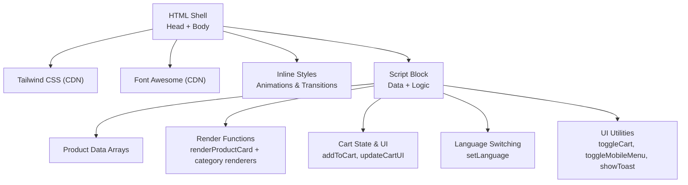
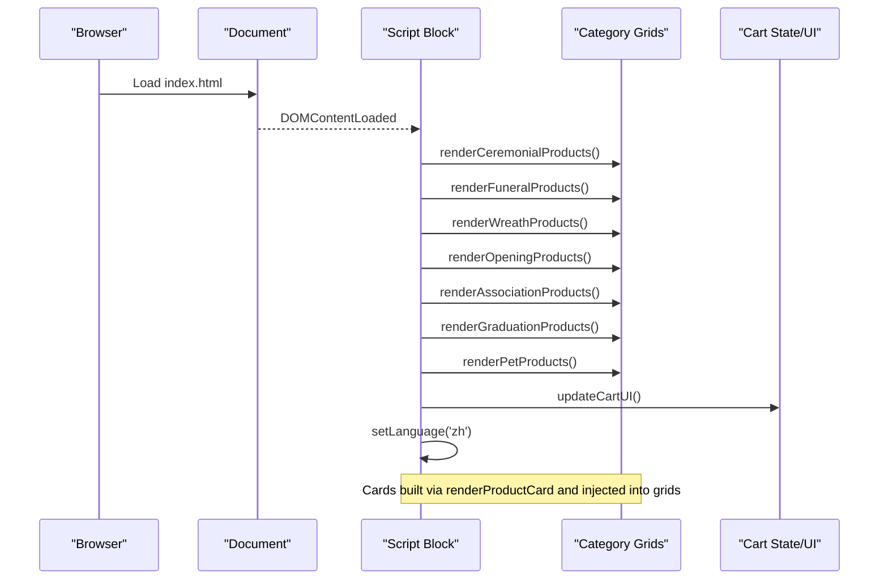
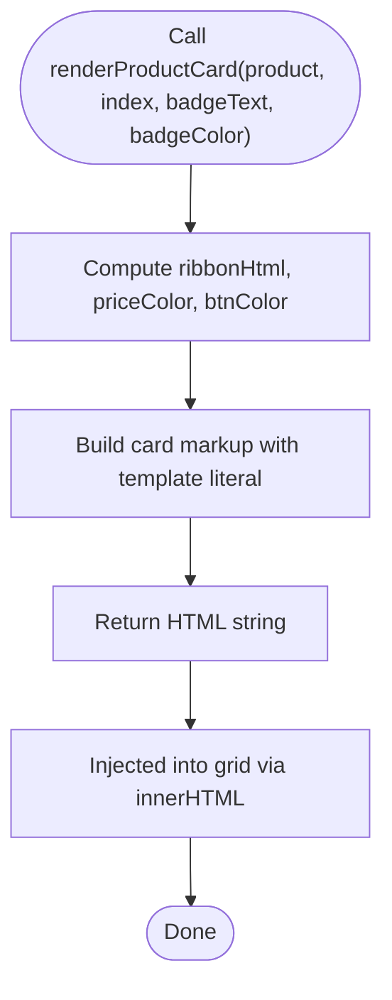
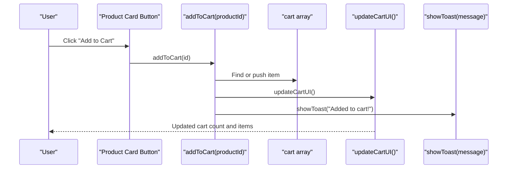
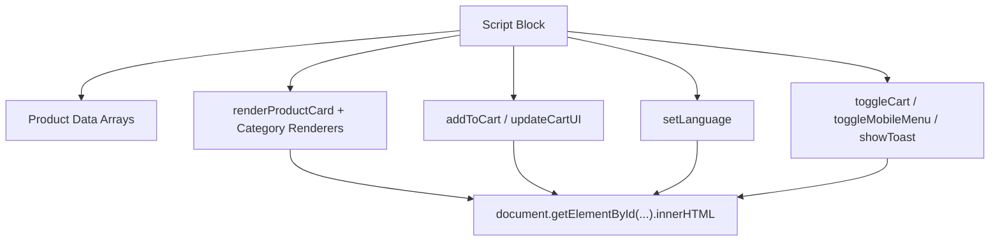

# Dynamic Product Rendering

<cite>
**Referenced Files in This Document**
- [index.html](file://docs/index.html)
</cite>

## Table of Contents
1. [Introduction](#introduction)
2. [Project Structure](#project-structure)
3. [Core Components](#core-components)
4. [Architecture Overview](#architecture-overview)
5. [Detailed Component Analysis](#detailed-component-analysis)
6. [Dependency Analysis](#dependency-analysis)
7. [Performance Considerations](#performance-considerations)
8. [Troubleshooting Guide](#troubleshooting-guide)
9. [Conclusion](#conclusion)
10. [Appendices](#appendices)

## Introduction
This document explains the dynamic product rendering system used to display and interact with product cards across multiple categories on a single-page site. It focuses on:
- The renderProductCard function implementation using template literals, DOM manipulation, and event binding patterns
- Responsive grid layout generation and hover effects
- Mobile-first design considerations
- Integration with the shopping cart via addToCart handlers
- Image loading optimization through Unsplash CDN parameters
- Accessibility features such as alt text handling
- Practical examples for customization, adding interactive elements, and optimizing performance for large catalogs

## Project Structure
The application is implemented as a single HTML file that includes:
- Tailwind CSS via CDN for responsive styling
- Font Awesome icons via CDN
- Inline styles for custom animations and transitions
- A script block containing all data, rendering logic, and UI interactions

**Diagram sources**
- [index.html:1-209](file://docs/index.html#L1-L209)
- [index.html:881-1589](file://docs/index.html#L881-L1589)

**Section sources**
- [index.html:1-209](file://docs/index.html#L1-L209)
- [index.html:881-1589](file://docs/index.html#L881-L1589)

## Core Components
- Product data arrays per category (ceremonial, funeral, wreath, opening, association, graduation, pets)
- Category-specific render functions that map products into card markup and inject into grid containers
- Central renderProductCard function that builds each card’s markup using template literals
- Cart state management and UI updates
- Language switching mechanism that re-renders content based on current language
- Toast notifications and slide-in/out cart sidebar

Key responsibilities:
- Render: Convert product data into DOM nodes
- Interact: Handle add-to-cart actions and quantity changes
- Update: Reflect cart state in the UI
- Localize: Re-render text and labels based on selected language

**Section sources**
- [index.html:1079-1328](file://docs/index.html#L1079-L1328)
- [index.html:1376-1444](file://docs/index.html#L1376-L1444)
- [index.html:1446-1553](file://docs/index.html#L1446-L1553)
- [index.html:1353-1374](file://docs/index.html#L1353-L1374)

## Architecture Overview
At runtime, the page initializes by rendering all product grids, setting the default language, and updating the cart UI. Each category has its own grid container element where rendered cards are injected.

**Diagram sources**
- [index.html:1332-1351](file://docs/index.html#L1332-L1351)
- [index.html:1353-1374](file://docs/index.html#L1353-L1374)
- [index.html:1406-1444](file://docs/index.html#L1406-L1444)

## Detailed Component Analysis

### renderProductCard Implementation
The renderProductCard function constructs a product card using template literals. It:
- Builds optional ribbon badge markup when provided
- Chooses price color and button hover style based on product category
- Returns a complete card string including image, title, description, price, and action buttons
- Uses inline onclick attributes to bind addToCart events directly in markup

**Diagram sources**
- [index.html:1376-1404](file://docs/index.html#L1376-L1404)

**Section sources**
- [index.html:1376-1404](file://docs/index.html#L1376-L1404)

### Responsive Grid Layout Generation
Each category section defines a responsive grid container using Tailwind classes:
- Single column on small screens
- Two columns on medium screens
- Three columns on large screens
- Consistent spacing and alignment

Examples of grid containers:
- Ceremonial: id="ceremonial-grid"
- Funeral: id="funeral-products-grid"
- Wreaths: id="wreaths-grid"
- Opening: id="opening-grid"
- Association: id="association-grid"
- Graduation: id="graduation-grid"
- Pets: id="pets-grid"

Category renderers map their respective product arrays into cards and assign them to the corresponding grid.

**Section sources**
- [index.html:417](file://docs/index.html#L417)
- [index.html:471](file://docs/index.html#L471)
- [index.html:509](file://docs/index.html#L509)
- [index.html:528](file://docs/index.html#L528)
- [index.html:547](file://docs/index.html#L547)
- [index.html:566](file://docs/index.html#L566)
- [index.html:585](file://docs/index.html#L585)
- [index.html:1406-1444](file://docs/index.html#L1406-L1444)

### Hover Effects Implementation
Hover behaviors are defined in inline styles:
- Card lift effect on hover
- Image zoom effect on hover
- Smooth transitions for transform and opacity
- Overlay darkening on hover for emphasis

These effects enhance interactivity without JavaScript overhead.

**Section sources**
- [index.html:74-88](file://docs/index.html#L74-L88)

### Mobile-First Design Considerations
- Navigation collapses into a mobile menu controlled by a toggle function
- Grid layouts adapt from one to three columns using Tailwind breakpoints
- Touch-friendly button sizes and spacing
- Cart sidebar slides in from the right on all devices

**Section sources**
- [index.html:260-281](file://docs/index.html#L260-L281)
- [index.html:1570-1573](file://docs/index.html#L1570-L1573)
- [index.html:1555-1568](file://docs/index.html#L1555-L1568)

### Shopping Cart Integration via addToCart Handlers
When a user clicks “Add to Cart” on a product card:
- The handler locates the product in the combined product list
- If already present, increments quantity; otherwise adds new item with quantity 1
- Updates the cart UI and shows a toast notification

**Diagram sources**
- [index.html:1446-1459](file://docs/index.html#L1446-L1459)
- [index.html:1496-1553](file://docs/index.html#L1496-L1553)
- [index.html:1575-1585](file://docs/index.html#L1575-L1585)

**Section sources**
- [index.html:1446-1459](file://docs/index.html#L1446-L1459)
- [index.html:1496-1553](file://docs/index.html#L1496-L1553)
- [index.html:1575-1585](file://docs/index.html#L1575-L1585)

### Image Loading Optimization with Unsplash CDN Parameters
All product images use Unsplash URLs with query parameters:
- w=600 sets width for optimized delivery
- auto=format&fit=crop ensures adaptive format and cropping
- q=80 balances quality and load time

This approach reduces bandwidth and improves perceived performance.

**Section sources**
- [index.html:1086](file://docs/index.html#L1086)
- [index.html:1096](file://docs/index.html#L1096)
- [index.html:1106](file://docs/index.html#L1106)
- [index.html:1116](file://docs/index.html#L1116)
- [index.html:1129](file://docs/index.html#L1129)
- [index.html:1139](file://docs/index.html#L1139)
- [index.html:1149](file://docs/index.html#L1149)
- [index.html:1159](file://docs/index.html#L1159)
- [index.html:1172](file://docs/index.html#L1172)
- [index.html:1182](file://docs/index.html#L1182)
- [index.html:1192](file://docs/index.html#L1192)
- [index.html:1205](file://docs/index.html#L1205)
- [index.html:1215](file://docs/index.html#L1215)
- [index.html:1225](file://docs/index.html#L1225)
- [index.html:1238](file://docs/index.html#L1238)
- [index.html:1248](file://docs/index.html#L1248)
- [index.html:1258](file://docs/index.html#L1258)
- [index.html:1271](file://docs/index.html#L1271)
- [index.html:1281](file://docs/index.html#L1281)
- [index.html:1291](file://docs/index.html#L1291)
- [index.html:1304](file://docs/index.html#L1304)
- [index.html:1314](file://docs/index.html#L1314)
- [index.html:1324](file://docs/index.html#L1324)

### Accessibility Features: Alt Text Handling
- Each product image includes an alt attribute dynamically set based on the current language
- Cart items also include alt text reflecting the selected language
- This ensures screen readers can describe images appropriately

**Section sources**
- [index.html:1385](file://docs/index.html#L1385)
- [index.html:1525](file://docs/index.html#L1525)

### Customization Examples

Customize product card appearance:
- Adjust hover effects by modifying transition timings and transforms in inline styles
- Change ribbon badge colors and text per category by passing different badgeColor and badgeText values in category renderers
- Modify price color and button hover styles within renderProductCard based on category logic

Adding new interactive elements:
- Extend renderProductCard to include additional buttons or badges
- Bind new actions by adding inline onclick handlers or refactoring to event delegation
- Update cart integration by extending addToCart behavior and updateCartUI rendering

Optimizing rendering performance for large catalogs:
- Use requestAnimationFrame batching for heavy DOM updates
- Implement virtual scrolling or pagination to limit visible nodes
- Debounce scroll-based UI changes (e.g., navbar shadow)
- Preload critical images and lazy-load others

[No sources needed since this section provides general guidance]

## Dependency Analysis
The script block depends on:
- Tailwind CSS utility classes for layout and styling
- Font Awesome icon classes for visual cues
- DOM APIs for querying elements and manipulating innerHTML
- Global variables for translations, product data, and cart state

**Diagram sources**
- [index.html:881-1589](file://docs/index.html#L881-L1589)

**Section sources**
- [index.html:881-1589](file://docs/index.html#L881-L1589)

## Performance Considerations
- Template literal rendering is efficient for moderate catalogs but may become costly at scale
- innerHTML replacement triggers full reflow; consider fragment-based insertion or virtualization for large lists
- Image parameters reduce payload size; consider further optimizations like srcset or lazy loading
- Avoid excessive inline event bindings; refactor to event delegation for better maintainability and performance
- Debounce scroll listeners to prevent layout thrashing

[No sources needed since this section provides general guidance]

## Troubleshooting Guide
Common issues and resolutions:
- Cart not updating after adding items: Ensure addToCart calls updateCartUI and that cart state is correctly mutated
- Missing product images: Verify Unsplash URLs and parameters; confirm network access and CORS settings
- Incorrect alt text: Confirm currentLang is updated before rendering and that alt attributes reflect the active language
- Cart sidebar not closing: Check toggleCart class toggling and overlay visibility states
- Mobile menu not toggling: Validate toggleMobileMenu and ensure the menu element exists

**Section sources**
- [index.html:1446-1459](file://docs/index.html#L1446-L1459)
- [index.html:1496-1553](file://docs/index.html#L1496-L1553)
- [index.html:1555-1568](file://docs/index.html#L1555-L1568)
- [index.html:1570-1573](file://docs/index.html#L1570-L1573)
- [index.html:1353-1374](file://docs/index.html#L1353-L1374)

## Conclusion
The dynamic product rendering system leverages template literals, responsive Tailwind grids, and straightforward DOM manipulation to deliver an interactive shopping experience. The addToCart integration, image optimization via Unsplash parameters, and accessibility-focused alt text contribute to a polished, performant interface. For larger catalogs, consider virtualization, event delegation, and lazy loading to maintain responsiveness.

[No sources needed since this section summarizes without analyzing specific files]

## Appendices

### API Definitions: Cart Operations
- addToCart(productId): Adds or increments a product in the cart and updates UI
- removeFromCart(productId): Removes an item from the cart
- updateQuantity(productId, change): Adjusts item quantity and removes if zero
- generateWhatsAppLink(): Produces a WhatsApp message link with cart details
- updateCartUI(): Refreshes cart count, items, totals, and checkout link

**Section sources**
- [index.html:1446-1494](file://docs/index.html#L1446-L1494)
- [index.html:1496-1553](file://docs/index.html#L1496-L1553)