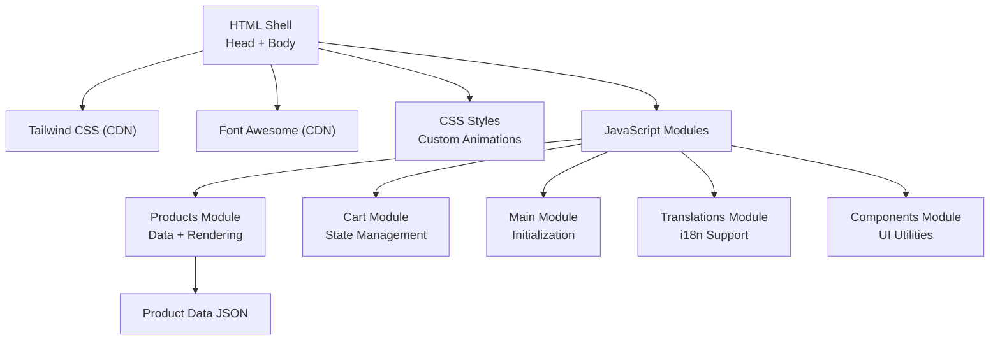
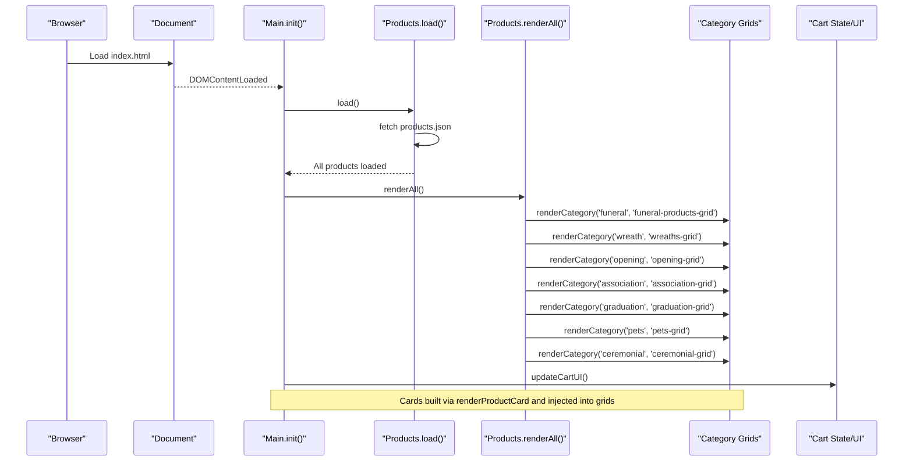
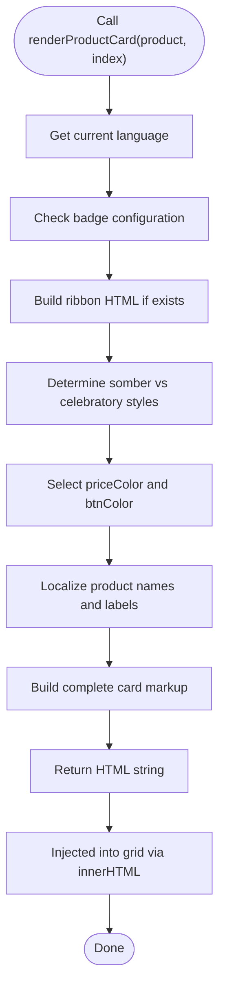
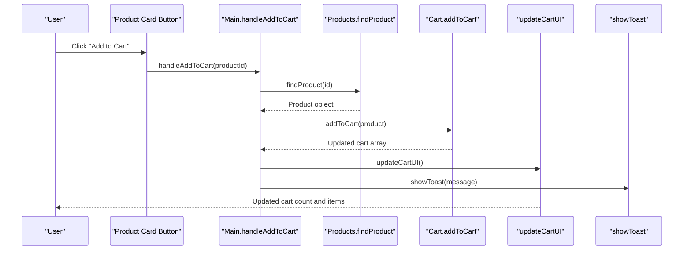
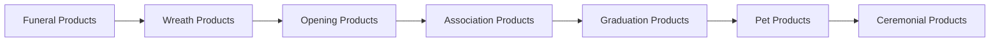
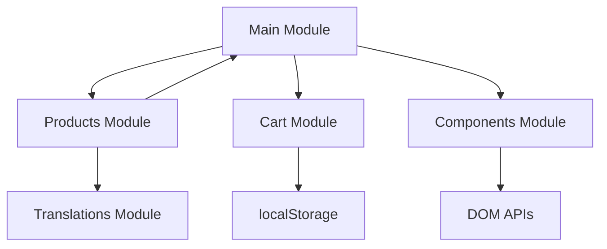

# Dynamic Product Rendering

<cite>
**Referenced Files in This Document**
- [index.html](file://docs/index.html)
- [products.js](file://docs/js/products.js)
- [main.js](file://docs/js/main.js)
- [cart.js](file://docs/js/cart.js)
- [products.json](file://docs/products.json)
</cite>

## Update Summary
**Changes Made**
- Updated renderAll() function documentation to reflect new rendering order with ceremonial category moved to last position
- Enhanced architecture overview diagram to show correct rendering sequence
- Updated detailed component analysis to document the refined rendering order
- Added specific examples of the new rendering sequence implementation

## Table of Contents
1. [Introduction](#introduction)
2. [Project Structure](#project-structure)
3. [Core Components](#core-components)
4. [Architecture Overview](#architecture-overview)
5. [Detailed Component Analysis](#detailed-component-analysis)
6. [Dependency Analysis](#dependency-analysis)
7. [Performance Considerations](#performance-considerations)
8. [Troubleshooting Guide](#troubleshooting-guide)
9. [Conclusion](#conclusion)
10. [Appendices](#appendices)

## Introduction
This document explains the dynamic product rendering system used to display and interact with product cards across multiple categories on a single-page site. It focuses on:
- The renderProductCard function implementation using template literals, DOM manipulation, and event binding patterns
- Responsive grid layout generation and hover effects
- Mobile-first design considerations
- Integration with the shopping cart via addToCart handlers
- Image loading optimization through Unsplash CDN parameters
- Accessibility features such as alt text handling
- Practical examples for customization, adding interactive elements, and optimizing performance for large catalogs

## Project Structure
The application is implemented as a modular JavaScript system with separate files for different concerns:
- HTML shell with Tailwind CSS and Font Awesome CDN integration
- Products module for data management and rendering logic
- Cart module for shopping cart state management
- Main module for initialization and UI coordination
- Translations module for internationalization support
- Components module for reusable UI utilities

**Diagram sources**
- [index.html:696-701](file://docs/index.html#L696-L701)
- [products.js:1-101](file://docs/js/products.js#L1-L101)
- [cart.js:1-69](file://docs/js/cart.js#L1-L69)
- [main.js:1-134](file://docs/js/main.js#L1-L134)

**Section sources**
- [index.html:696-701](file://docs/index.html#L696-L701)
- [products.js:1-101](file://docs/js/products.js#L1-L101)
- [cart.js:1-69](file://docs/js/cart.js#L1-L69)
- [main.js:1-134](file://docs/js/main.js#L1-L134)

## Core Components
- **Products Module**: Manages product data loading, categorization, and rendering logic
- **Cart Module**: Handles shopping cart state persistence and operations
- **Main Module**: Orchestrates initialization, language switching, and UI updates
- **Component System**: Provides reusable UI functions like toast notifications and cart toggles
- **Translation System**: Supports bilingual content (Chinese/English) with dynamic switching

Key responsibilities:
- **Render**: Convert product data into responsive DOM nodes with proper styling
- **Interact**: Handle add-to-cart actions and quantity modifications
- **Update**: Reflect cart state changes in real-time UI components
- **Localize**: Re-render all content based on selected language preference

**Section sources**
- [products.js:37-97](file://docs/js/products.js#L37-L97)
- [cart.js:24-67](file://docs/js/cart.js#L24-L67)
- [main.js:111-129](file://docs/js/main.js#L111-L129)

## Architecture Overview
At runtime, the page initializes by loading translations and product data, then renders all product grids in a specific order that aligns with the HTML structure. Each category has its own grid container element where rendered cards are injected.

**Updated** The rendering order has been refined to move the ceremonial category from first to last position, ensuring visual consistency with the HTML structure.

**Diagram sources**
- [main.js:119-127](file://docs/js/main.js#L119-L127)
- [products.js:89-97](file://docs/js/products.js#L89-L97)

## Detailed Component Analysis

### renderProductCard Implementation
The renderProductCard function constructs a product card using template literals with dynamic styling based on product category. It:
- Builds optional ribbon badge markup when provided through badge configuration
- Chooses price color and button hover style based on whether the product is somber (funeral/pets) or celebratory
- Returns a complete card string including image, title, description, price, and action buttons
- Uses inline onclick attributes to bind addToCart events directly in markup
- Implements staggered animation delays for smooth loading experience

**Diagram sources**
- [products.js:37-80](file://docs/js/products.js#L37-L80)

**Section sources**
- [products.js:37-80](file://docs/js/products.js#L37-L80)

### Responsive Grid Layout Generation
Each category section defines a responsive grid container using Tailwind classes:
- Single column on small screens (grid-cols-1)
- Two columns on medium screens (sm:grid-cols-2)
- Three columns on large screens (lg:grid-cols-3)
- Consistent spacing and alignment with gap-8

Examples of grid containers:
- Funeral: id="funeral-products-grid"
- Wreaths: id="wreaths-grid"
- Opening: id="opening-grid"
- Association: id="association-grid"
- Graduation: id="graduation-grid"
- Pets: id="pets-grid"
- Ceremonial: id="ceremonial-grid"

Category renderers map their respective product arrays into cards and assign them to the corresponding grid using the renderCategory function.

**Section sources**
- [index.html:276](file://docs/index.html#L276)
- [index.html:313](file://docs/index.html#L313)
- [index.html:331](file://docs/index.html#L331)
- [index.html:349](file://docs/index.html#L349)
- [index.html:367](file://docs/index.html#L367)
- [index.html:385](file://docs/index.html#L385)
- [index.html:404](file://docs/index.html#L404)
- [products.js:82-87](file://docs/js/products.js#L82-L87)

### Hover Effects Implementation
Hover behaviors are defined through CSS transitions and Tailwind classes:
- Card lift effect on hover with shadow enhancement
- Image overlay darkening on hover for emphasis
- Add-to-cart button slide-in animation from bottom-right
- Smooth transitions for transform and opacity changes
- Color transitions for text and decorative elements

These effects enhance interactivity without JavaScript overhead and provide visual feedback for user interactions.

**Section sources**
- [products.js:58-78](file://docs/js/products.js#L58-L78)

### Mobile-First Design Considerations
- Navigation collapses into a mobile menu controlled by toggle functions
- Grid layouts adapt from one to three columns using Tailwind breakpoints
- Touch-friendly button sizes and spacing throughout the interface
- Cart sidebar slides in from the right on all devices
- Responsive typography scales appropriately across screen sizes

**Section sources**
- [index.html:90-104](file://docs/index.html#L90-L104)
- [index.html:630-675](file://docs/index.html#L630-L675)

### Shopping Cart Integration via addToCart Handlers
When a user clicks "Add to Cart" on a product card:
- The handler locates the product in the combined product list using findProduct
- If already present, increments quantity; otherwise adds new item with quantity 1
- Updates the cart UI and shows a toast notification
- Persists cart state to localStorage for session continuity

**Diagram sources**
- [main.js:8-14](file://docs/js/main.js#L8-L14)
- [cart.js:24-34](file://docs/js/cart.js#L24-L34)

**Section sources**
- [main.js:8-14](file://docs/js/main.js#L8-L14)
- [cart.js:24-34](file://docs/js/cart.js#L24-L34)
- [main.js:47-107](file://docs/js/main.js#L47-L107)

### Image Loading Optimization with Unsplash CDN Parameters
All product images use optimized URLs with query parameters:
- w=600 sets width for optimized delivery
- auto=format&fit=crop ensures adaptive format and cropping
- q=80 balances quality and load time

This approach reduces bandwidth and improves perceived performance while maintaining visual quality across different devices and screen densities.

**Section sources**
- [products.json:8](file://docs/products.json#L8)
- [products.json:17](file://docs/products.json#L17)
- [products.json:26](file://docs/products.json#L26)
- [products.json:35](file://docs/products.json#L35)

### Accessibility Features: Alt Text Handling
- Each product image includes an alt attribute dynamically set based on the current language
- Cart items also include alt text reflecting the selected language
- This ensures screen readers can describe images appropriately
- Product IDs are displayed for reference and accessibility

**Section sources**
- [products.js:61](file://docs/js/products.js#L61)
- [main.js:76](file://docs/js/main.js#L76)

### Rendering Order Refinement
The renderAll() function has been updated to refine the rendering order, moving the ceremonial category from the first position to the last position. This change ensures visual consistency with the HTML structure and provides a more logical flow for users navigating through the product categories.

**Updated** The new rendering sequence follows this order: funeral → wreath → opening → association → graduation → pets → ceremonial

**Diagram sources**
- [products.js:89-97](file://docs/js/products.js#L89-L97)

**Section sources**
- [products.js:89-97](file://docs/js/products.js#L89-L97)

### Customization Examples

Customize product card appearance:
- Adjust hover effects by modifying transition timings and transforms in CSS
- Change ribbon badge colors and text per category by updating the badges configuration object
- Modify price color and button hover styles within renderProductCard based on category logic

Adding new interactive elements:
- Extend renderProductCard to include additional buttons or badges
- Bind new actions by adding inline onclick handlers or refactoring to event delegation
- Update cart integration by extending addToCart behavior and updateCartUI rendering

Optimizing rendering performance for large catalogs:
- Use requestAnimationFrame batching for heavy DOM updates
- Implement virtual scrolling or pagination to limit visible nodes
- Debounce scroll-based UI changes (e.g., navbar shadow)
- Preload critical images and lazy-load others

## Dependency Analysis
The system modules depend on each other in a clear hierarchy:
- Main module orchestrates initialization and coordinates between other modules
- Products module depends on translations for localization and main for cart integration
- Cart module operates independently with localStorage persistence
- Components module provides shared UI functionality

**Diagram sources**
- [main.js:1-134](file://docs/js/main.js#L1-134)
- [products.js:1-101](file://docs/js/products.js#L1-101)
- [cart.js:1-69](file://docs/js/cart.js#L1-L69)

**Section sources**
- [main.js:1-134](file://docs/js/main.js#L1-134)
- [products.js:1-101](file://docs/js/products.js#L1-L101)
- [cart.js:1-69](file://docs/js/cart.js#L1-L69)

## Performance Considerations
- Template literal rendering is efficient for moderate catalogs but may become costly at scale
- innerHTML replacement triggers full reflow; consider fragment-based insertion or virtualization for large lists
- Image parameters reduce payload size; consider further optimizations like srcset or lazy loading
- Avoid excessive inline event bindings; refactor to event delegation for better maintainability and performance
- Debounce scroll listeners to prevent layout thrashing
- The refined rendering order minimizes unnecessary DOM manipulations during initial load

## Troubleshooting Guide
Common issues and resolutions:
- Cart not updating after adding items: Ensure addToCart calls updateCartUI and that cart state is correctly mutated
- Missing product images: Verify Unsplash URLs and parameters; confirm network access and CORS settings
- Incorrect alt text: Confirm currentLang is updated before rendering and that alt attributes reflect the active language
- Cart sidebar not closing: Check toggleCart class toggling and overlay visibility states
- Mobile menu not toggling: Validate toggleMobileMenu and ensure the menu element exists
- Products not rendering in correct order: Verify renderAll() function maintains the updated sequence: funeral → wreath → opening → association → graduation → pets → ceremonial

**Section sources**
- [main.js:8-14](file://docs/js/main.js#L8-L14)
- [main.js:47-107](file://docs/js/main.js#L47-L107)
- [products.js:89-97](file://docs/js/products.js#L89-L97)

## Conclusion
The dynamic product rendering system leverages template literals, responsive Tailwind grids, and straightforward DOM manipulation to deliver an interactive shopping experience. The recent refinement of the rendering order in renderAll() ensures better visual consistency with the HTML structure. The addToCart integration, image optimization via Unsplash parameters, and accessibility-focused alt text contribute to a polished, performant interface. For larger catalogs, consider virtualization, event delegation, and lazy loading to maintain responsiveness.

## Appendices

### API Definitions: Cart Operations
- addToCart(product): Adds or increments a product in the cart and persists to localStorage
- removeFromCart(productId): Removes an item from the cart
- updateQuantity(productId, delta): Adjusts item quantity and removes if zero
- getCart(): Returns current cart state
- getCartCount(): Returns total number of items in cart
- getCartTotal(): Returns total monetary value of cart items
- clearCart(): Empties the cart and clears localStorage

### API Definitions: Products Operations
- load(): Fetches and loads product data from products.json
- getAllProductsFlat(): Returns flattened array of all products with category info
- getCategory(category): Returns products for specific category
- findProduct(productId): Finds product by ID across all categories
- renderAll(): Renders all product categories in refined order
- renderCategory(category, gridId): Renders specific category to designated grid

**Section sources**
- [cart.js:24-67](file://docs/js/cart.js#L24-L67)
- [products.js:17-97](file://docs/js/products.js#L17-L97)