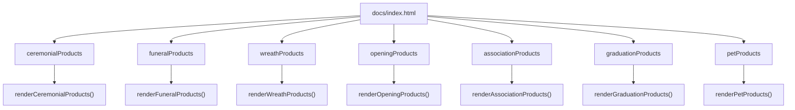
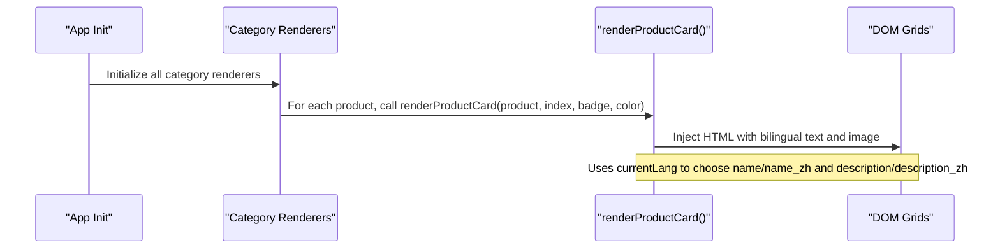
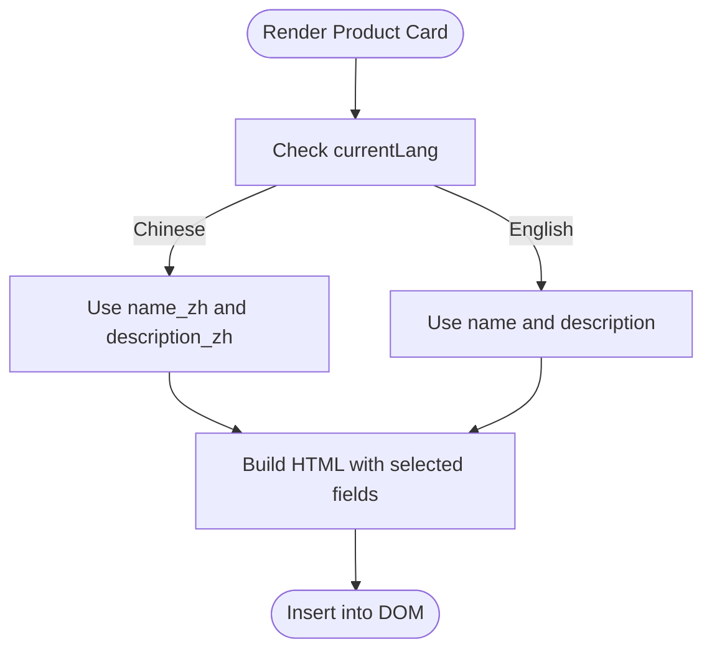
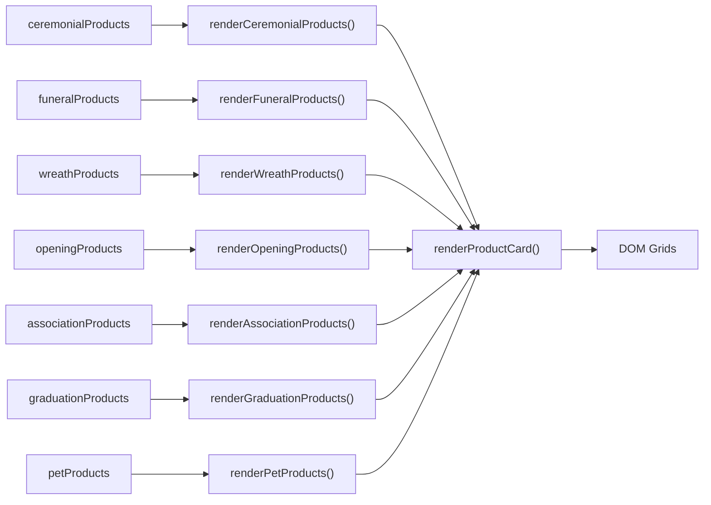

# Product Data Structure

<cite>
**Referenced Files in This Document**
- [index.html](file://docs/index.html)
</cite>

## Table of Contents
1. [Introduction](#introduction)
2. [Project Structure](#project-structure)
3. [Core Components](#core-components)
4. [Architecture Overview](#architecture-overview)
5. [Detailed Component Analysis](#detailed-component-analysis)
6. [Dependency Analysis](#dependency-analysis)
7. [Performance Considerations](#performance-considerations)
8. [Troubleshooting Guide](#troubleshooting-guide)
9. [Conclusion](#conclusion)

## Introduction
This document defines the standardized product data structure used across the site’s product catalog. It specifies the schema fields, naming conventions, validation rules, and internationalization patterns. It also documents the seven product categories and provides concrete examples from the codebase for proper formatting, including image URL optimization parameters and category-specific field usage.

## Project Structure
The product data is defined as JavaScript arrays within a single-page application file. Each category has its own array, and each product object follows a consistent schema. The rendering functions iterate over these arrays to build UI cards and support bilingual display.

**Diagram sources**
- [index.html:1078-1328](file://docs/index.html#L1078-L1328)
- [index.html:1406-1444](file://docs/index.html#L1406-L1444)

**Section sources**
- [index.html:1078-1328](file://docs/index.html#L1078-L1328)
- [index.html:1406-1444](file://docs/index.html#L1406-L1444)

## Core Components
- Standardized product object schema:
  - id: unique numeric identifier
  - name: English product name
  - name_zh: Traditional Chinese product name
  - price: numeric value (currency unit implied by UI)
  - category: one of seven allowed values
  - image: Unsplash CDN URL with optimization parameters
  - description: English product description
  - description_zh: Traditional Chinese product description
- Seven distinct categories:
  - ceremonial
  - funeral
  - wreath
  - opening
  - association
  - graduation
  - pets
- Internationalization:
  - Bilingual fields (name, name_zh; description, description_zh) are used to render content based on current language selection.
- Image optimization:
  - All images use Unsplash CDN URLs with query parameters for width, auto format, crop fit, and quality.

Examples of properly formatted products can be found in the following sections:
- Ceremonial: [index.html:1078-1120](file://docs/index.html#L1078-L1120)
- Funeral: [index.html:1122-1163](file://docs/index.html#L1122-L1163)
- Wreath: [index.html:1165-1196](file://docs/index.html#L1165-L1196)
- Opening: [index.html:1198-1229](file://docs/index.html#L1198-L1229)
- Association: [index.html:1231-1262](file://docs/index.html#L1231-L1262)
- Graduation: [index.html:1264-1295](file://docs/index.html#L1264-L1295)
- Pets: [index.html:1297-1328](file://docs/index.html#L1297-L1328)

Rendering logic that consumes these objects:
- Category renderers: [index.html:1406-1444](file://docs/index.html#L1406-L1444)
- Card renderer using bilingual fields and image: [index.html:1376-1404](file://docs/index.html#L1376-L1404)

**Section sources**
- [index.html:1078-1328](file://docs/index.html#L1078-L1328)
- [index.html:1376-1404](file://docs/index.html#L1376-L1404)
- [index.html:1406-1444](file://docs/index.html#L1406-L1444)

## Architecture Overview
The product system is a client-side data-driven UI. Arrays of product objects are rendered into DOM grids per category. The card renderer uses the current language to select between English and Chinese fields.

**Diagram sources**
- [index.html:1366-1374](file://docs/index.html#L1366-L1374)
- [index.html:1376-1404](file://docs/index.html#L1376-L1404)
- [index.html:1406-1444](file://docs/index.html#L1406-L1444)

## Detailed Component Analysis

### Schema Definition and Validation Rules
- Required fields:
  - id: number, must be unique across all categories
  - name: string
  - name_zh: string
  - price: number
  - category: enum ["ceremonial", "funeral", "wreath", "opening", "association", "graduation", "pets"]
  - image: string, must be an Unsplash CDN URL with optimization parameters
  - description: string
  - description_zh: string
- Naming conventions:
  - id: integer identifiers grouped by category ranges (e.g., 1xx for funeral, 2xx for ceremonial, etc.)
  - category: lowercase snake_case matching the category arrays
- Validation rules inferred from usage:
  - All fields are present in every product object
  - category matches the array it belongs to
  - image URLs include w=600&auto=format&fit=crop&q=80
  - price is a positive number
  - bilingual fields are provided for both languages

Concrete examples:
- Valid product object example (ceremonial): [index.html:1078-1120](file://docs/index.html#L1078-L1120)
- Valid product object example (funeral): [index.html:1122-1163](file://docs/index.html#L1122-L1163)
- Valid product object example (wreath): [index.html:1165-1196](file://docs/index.html#L1165-L1196)
- Valid product object example (opening): [index.html:1198-1229](file://docs/index.html#L1198-L1229)
- Valid product object example (association): [index.html:1231-1262](file://docs/index.html#L1231-L1262)
- Valid product object example (graduation): [index.html:1264-1295](file://docs/index.html#L1264-L1295)
- Valid product object example (pets): [index.html:1297-1328](file://docs/index.html#L1297-L1328)

**Section sources**
- [index.html:1078-1328](file://docs/index.html#L1078-L1328)

### Category Reference and Field Requirements
- ceremonial: celebratory events; typical badges and colors applied during rendering
  - Example: [index.html:1078-1120](file://docs/index.html#L1078-L1120)
- funeral: solemn arrangements; special styling for price and buttons
  - Example: [index.html:1122-1163](file://docs/index.html#L1122-L1163)
- wreath: traditional and Western circular wreaths
  - Example: [index.html:1165-1196](file://docs/index.html#L1165-L1196)
- opening: grand opening plaques and prosperity themes
  - Example: [index.html:1198-1229](file://docs/index.html#L1198-L1229)
- association: associations, chambers, clan gatherings
  - Example: [index.html:1231-1262](file://docs/index.html#L1231-L1262)
- graduation: academic achievements and school events
  - Example: [index.html:1264-1295](file://docs/index.html#L1264-L1295)
- pets: pet memorial plaques and wreaths
  - Example: [index.html:1297-1328](file://docs/index.html#L1297-L1328)

Category-specific rendering behavior:
- Badge text and color vary by category (e.g., “喜慶” for ceremonial, “開張” for opening, “社團” for association, “畢業” for graduation, “寵物” for pets).
- Funeral and pets use subdued color schemes for price and button hover states.

References:
- Rendering calls and badge/color mapping: [index.html:1406-1444](file://docs/index.html#L1406-L1444)
- Styling differences for funeral/pets: [index.html:1376-1404](file://docs/index.html#L1376-L1404)

**Section sources**
- [index.html:1078-1328](file://docs/index.html#L1078-L1328)
- [index.html:1376-1404](file://docs/index.html#L1376-L1404)
- [index.html:1406-1444](file://docs/index.html#L1406-L1444)

### Internationalization (i18n) Support
- Bilingual fields:
  - name vs name_zh
  - description vs description_zh
- Language selection drives which fields are displayed:
  - When current language is Chinese, name_zh and description_zh are used; otherwise, name and description are used.
- Implementation reference:
  - Bilingual selection in card template: [index.html:1376-1404](file://docs/index.html#L1376-L1404)

**Diagram sources**
- [index.html:1376-1404](file://docs/index.html#L1376-L1404)

**Section sources**
- [index.html:1376-1404](file://docs/index.html#L1376-L1404)

### Image URL Optimization Parameters
- All images use Unsplash CDN URLs with consistent optimization parameters:
  - w=600: target width
  - auto=format: automatic format selection
  - fit=crop: crop to fill container
  - q=80: quality setting
- Examples:
  - Ceremonial: [index.html:1078-1120](file://docs/index.html#L1078-L1120)
  - Funeral: [index.html:1122-1163](file://docs/index.html#L1122-L1163)
  - Wreath: [index.html:1165-1196](file://docs/index.html#L1165-L1196)
  - Opening: [index.html:1198-1229](file://docs/index.html#L1198-L1229)
  - Association: [index.html:1231-1262](file://docs/index.html#L1231-L1262)
  - Graduation: [index.html:1264-1295](file://docs/index.html#L1264-L1295)
  - Pets: [index.html:1297-1328](file://docs/index.html#L1297-L1328)

Best practice:
- Maintain consistent parameters across all product images to ensure uniform performance and visual quality.

**Section sources**
- [index.html:1078-1328](file://docs/index.html#L1078-L1328)

## Dependency Analysis
- Data-to-render dependency:
  - Each category array feeds its corresponding renderer function.
  - The card renderer depends on the presence of all required fields and correct category values.
- Cross-category aggregation:
  - The cart add-to-cart flow aggregates all category arrays to locate a product by id.

**Diagram sources**
- [index.html:1078-1328](file://docs/index.html#L1078-L1328)
- [index.html:1406-1444](file://docs/index.html#L1406-L1444)
- [index.html:1376-1404](file://docs/index.html#L1376-L1404)

**Section sources**
- [index.html:1078-1328](file://docs/index.html#L1078-L1328)
- [index.html:1406-1444](file://docs/index.html#L1406-L1444)
- [index.html:1376-1404](file://docs/index.html#L1376-L1404)

## Performance Considerations
- Image optimization:
  - Using Unsplash CDN with fixed width and quality reduces payload size and improves load times.
- Rendering efficiency:
  - Mapping arrays directly to innerHTML avoids repeated DOM queries and minimizes reflows.
- Consistency:
  - Keeping image parameters uniform ensures predictable caching behavior at the CDN level.

[No sources needed since this section provides general guidance]

## Troubleshooting Guide
Common issues and resolutions:
- Missing or mismatched category:
  - Ensure category matches one of the seven allowed values and aligns with the array it resides in.
  - References: [index.html:1078-1328](file://docs/index.html#L1078-L1328)
- Non-unique id:
  - Verify id uniqueness across all categories to prevent incorrect cart additions.
  - Aggregation lookup reference: [index.html:1446-1457](file://docs/index.html#L1446-L1457)
- Incorrect image URL format:
  - Confirm Unsplash CDN URL includes w=600&auto=format&fit=crop&q=80.
  - Examples: [index.html:1078-1328](file://docs/index.html#L1078-L1328)
- Bilingual fields missing:
  - Provide both name and name_zh, and both description and description_zh to avoid undefined content.
  - Usage reference: [index.html:1376-1404](file://docs/index.html#L1376-L1404)

**Section sources**
- [index.html:1078-1328](file://docs/index.html#L1078-L1328)
- [index.html:1376-1404](file://docs/index.html#L1376-L1404)
- [index.html:1446-1457](file://docs/index.html#L1446-L1457)

## Conclusion
The product data structure is a simple, consistent schema designed for clarity, maintainability, and internationalization. By adhering to the defined fields, naming conventions, and image optimization parameters, developers can reliably extend the catalog and ensure consistent user experiences across languages and categories.

[No sources needed since this section summarizes without analyzing specific files]