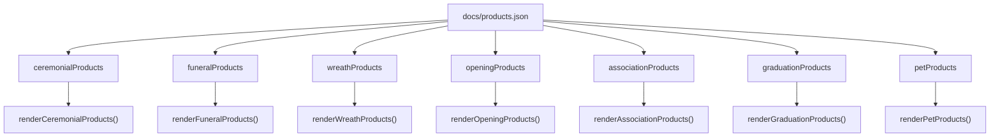
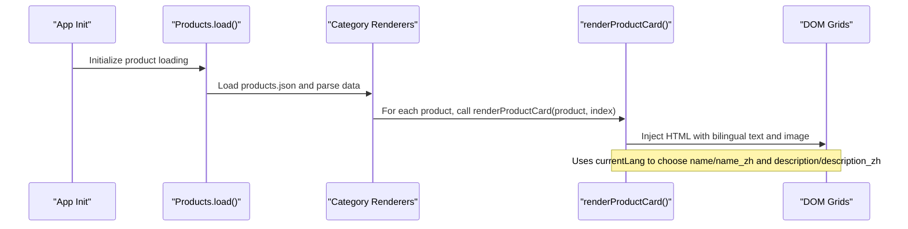
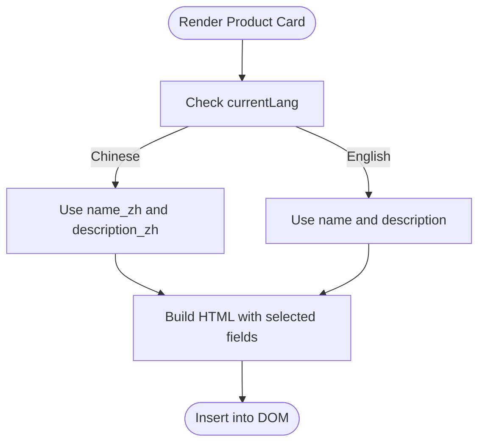
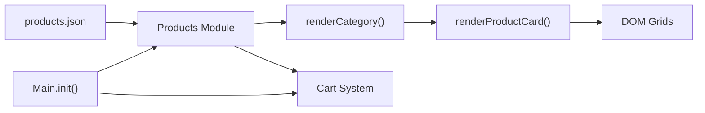

# Product Data Structure

<cite>
**Referenced Files in This Document**
- [products.json](file://docs/products.json)
- [products.js](file://docs/js/products.js)
- [main.js](file://docs/js/main.js)
- [index.html](file://docs/index.html)
</cite>

## Update Summary
**Changes Made**
- Updated price examples to reflect recent catalog modifications
- Added documentation for local image file support alongside Unsplash CDN URLs
- Updated product count references to account for removed items
- Enhanced image URL optimization section with mixed source support

## Table of Contents
1. [Introduction](#introduction)
2. [Project Structure](#project-structure)
3. [Core Components](#core-components)
4. [Architecture Overview](#architecture-overview)
5. [Detailed Component Analysis](#detailed-component-analysis)
6. [Dependency Analysis](#dependency-analysis)
7. [Performance Considerations](#performance-considerations)
8. [Troubleshooting Guide](#troubleshooting-guide)
9. [Conclusion](#conclusion)

## Introduction
This document defines the standardized product data structure used across the site's product catalog. It specifies the schema fields, naming conventions, validation rules, and internationalization patterns. It also documents the seven product categories and provides concrete examples from the codebase for proper formatting, including image URL optimization parameters and category-specific field usage.

## Project Structure
The product data is defined as a JSON file containing categorized product arrays. Each category has its own array, and each product object follows a consistent schema. The rendering functions iterate over these arrays to build UI cards and support bilingual display.

```mermaid
graph TB
A["docs/products.json"] --> B["ceremonialProducts"]
A --> C["funeralProducts"]
A --> D["wreathProducts"]
A --> E["openingProducts"]
A --> F["associationProducts"]
A --> G["graduationProducts"]
A --> H["petProducts"]
B --> I["renderCeremonialProducts()"]
C --> J["renderFuneralProducts()"]
D --> K["renderWreathProducts()"]
E --> L["renderOpeningProducts()"]
F --> M["renderAssociationProducts()"]
G --> N["renderGraduationProducts()"]
H --> O["renderPetProducts()"]
```

**Diagram sources**
- [products.json:1-215](file://docs/products.json#L1-L215)
- [products.js:82-97](file://docs/js/products.js#L82-L97)

**Section sources**
- [products.json:1-215](file://docs/products.json#L1-L215)
- [products.js:82-97](file://docs/js/products.js#L82-L97)

## Core Components
- Standardized product object schema:
  - id: unique numeric identifier
  - name: English product name
  - name_zh: Traditional Chinese product name
  - price: numeric value (currency unit implied by UI)
  - category: one of seven allowed values
  - image: Unsplash CDN URL or local file path with optimization parameters
  - description: English product description
  - description_zh: Traditional Chinese product description
- Seven distinct categories:
  - ceremonial
  - funeral
  - wreath
  - opening
  - association
  - graduation
  - pets
- Internationalization:
  - Bilingual fields (name, name_zh; description, description_zh) are used to render content based on current language selection.
- Image optimization:
  - All images use either Unsplash CDN URLs with query parameters for width, auto format, crop fit, and quality, OR local file paths for optimized assets.

Examples of properly formatted products can be found in the following sections:
- Ceremonial: [products.json:2-39](file://docs/products.json#L2-L39)
- Funeral: [products.json:40-68](file://docs/products.json#L40-L68)
- Wreath: [products.json:69-97](file://docs/products.json#L69-L97)
- Opening: [products.json:98-126](file://docs/products.json#L98-L126)
- Association: [products.json:127-155](file://docs/products.json#L127-L155)
- Graduation: [products.json:156-184](file://docs/products.json#L156-L184)
- Pets: [products.json:185-213](file://docs/products.json#L185-L213)

Rendering logic that consumes these objects:
- Category renderers: [products.js:82-97](file://docs/js/products.js#L82-L97)
- Card renderer using bilingual fields and image: [products.js:37-80](file://docs/js/products.js#L37-L80)

**Section sources**
- [products.json:1-215](file://docs/products.json#L1-L215)
- [products.js:37-80](file://docs/js/products.js#L37-L80)
- [products.js:82-97](file://docs/js/products.js#L82-L97)

## Architecture Overview
The product system is a client-side data-driven UI. Arrays of product objects are rendered into DOM grids per category. The card renderer uses the current language to select between English and Chinese fields.

```mermaid
sequenceDiagram
participant App as "App Init"
participant Products as "Products.load()"
participant Render as "Category Renderers"
participant Card as "renderProductCard()"
participant DOM as "DOM Grids"
App->>Products : Initialize product loading
Products->>Render : Load products.json and parse data
Render->>Card : For each product, call renderProductCard(product, index)
Card->>DOM : Inject HTML with bilingual text and image
Note over Card,DOM : Uses currentLang to choose name/name_zh and description/description_zh
```

**Diagram sources**
- [main.js:119-127](file://docs/js/main.js#L119-L127)
- [products.js:37-80](file://docs/js/products.js#L37-L80)
- [products.js:82-97](file://docs/js/products.js#L82-L97)

## Detailed Component Analysis

### Schema Definition and Validation Rules
- Required fields:
  - id: number, must be unique across all categories
  - name: string
  - name_zh: string
  - price: number
  - category: enum ["ceremonial", "funeral", "wreath", "opening", "association", "graduation", "pets"]
  - image: string, must be an Unsplash CDN URL with optimization parameters OR local file path
  - description: string
  - description_zh: string
- Naming conventions:
  - id: integer identifiers grouped by category ranges (e.g., 1xx for funeral, 2xx for ceremonial, etc.)
  - category: lowercase snake_case matching the category arrays
- Validation rules inferred from usage:
  - All fields are present in every product object
  - category matches the array it belongs to
  - image URLs include w=600&auto=format&fit=crop&q=80 for Unsplash CDN OR valid local file paths
  - price is a positive number
  - bilingual fields are provided for both languages

Concrete examples:
- Valid product object example (ceremonial): [products.json:2-39](file://docs/products.json#L2-L39)
- Valid product object example (funeral): [products.json:40-68](file://docs/products.json#L40-L68)
- Valid product object example (wreath): [products.json:69-97](file://docs/products.json#L69-L97)
- Valid product object example (opening): [products.json:98-126](file://docs/products.json#L98-L126)
- Valid product object example (association): [products.json:127-155](file://docs/products.json#L127-L155)
- Valid product object example (graduation): [products.json:156-184](file://docs/products.json#L156-L184)
- Valid product object example (pets): [products.json:185-213](file://docs/products.json#L185-L213)

**Updated** Recent catalog modifications include price adjustments for Deluxe Heart-Shaped Wreath ($880→$3000) and Grand Clan Association Plaque ($780→$1400), removal of product ID 104 from funeral category, and migration of some images to local file paths.

**Section sources**
- [products.json:1-215](file://docs/products.json#L1-L215)

### Category Reference and Field Requirements
- ceremonial: celebratory events; typical badges and colors applied during rendering
  - Example: [products.json:2-39](file://docs/products.json#L2-L39)
- funeral: solemn arrangements; special styling for price and buttons
  - Example: [products.json:40-68](file://docs/products.json#L40-L68)
- wreath: traditional and Western circular wreaths
  - Example: [products.json:69-97](file://docs/products.json#L69-L97)
- opening: grand opening plaques and prosperity themes
  - Example: [products.json:98-126](file://docs/products.json#L98-L126)
- association: associations, chambers, clan gatherings
  - Example: [products.json:127-155](file://docs/products.json#L127-L155)
- graduation: academic achievements and school events
  - Example: [products.json:156-184](file://docs/products.json#L156-L184)
- pets: pet memorial plaques and wreaths
  - Example: [products.json:185-213](file://docs/products.json#L185-L213)

Category-specific rendering behavior:
- Badge text and color vary by category (e.g., "喜慶" for ceremonial, "開張" for opening, "社團" for association, "畢業" for graduation, "寵物" for pets).
- Funeral and pets use subdued color schemes for price and button hover states.

References:
- Rendering calls and badge/color mapping: [products.js:82-97](file://docs/js/products.js#L82-L97)
- Styling differences for funeral/pets: [products.js:46-50](file://docs/js/products.js#L46-L50)

**Section sources**
- [products.json:1-215](file://docs/products.json#L1-L215)
- [products.js:46-50](file://docs/js/products.js#L46-L50)
- [products.js:82-97](file://docs/js/products.js#L82-L97)

### Internationalization (i18n) Support
- Bilingual fields:
  - name vs name_zh
  - description vs description_zh
- Language selection drives which fields are displayed:
  - When current language is Chinese, name_zh and description_zh are used; otherwise, name and description are used.
- Implementation reference:
  - Bilingual selection in card template: [products.js:52-53](file://docs/js/products.js#L52-L53)

```mermaid
flowchart TD
Start(["Render Product Card"]) --> CheckLang["Check currentLang"]
CheckLang --> |Chinese| UseZH["Use name_zh and description_zh"]
CheckLang --> |English| UseEN["Use name and description"]
UseZH --> BuildHTML["Build HTML with selected fields"]
UseEN --> BuildHTML
BuildHTML --> End(["Insert into DOM"])
```

**Diagram sources**
- [products.js:52-53](file://docs/js/products.js#L52-L53)

**Section sources**
- [products.js:52-53](file://docs/js/products.js#L52-L53)

### Image URL Optimization Parameters
- Images support two formats:
  - Unsplash CDN URLs with consistent optimization parameters:
    - w=600: target width
    - auto=format: automatic format selection
    - fit=crop: crop to fill container
    - q=80: quality setting
  - Local file paths for optimized assets:
    - Format: ./images/filename.ext
    - Examples: ./images/circle-101.jpg, ./images/heart-304.jpg, ./images/double-503.jpg
- Mixed implementation:
  - Some products continue using Unsplash CDN URLs
  - Others have been migrated to local files for better performance and control
- Examples:
  - Unsplash CDN: [products.json:4-10](file://docs/products.json#L4-L10)
  - Local files: [products.json:46](file://docs/products.json#L46), [products.json:93](file://docs/products.json#L93), [products.json:151](file://docs/products.json#L151)

Best practice:
- Maintain consistent image handling across all product images to ensure uniform performance and visual quality.
- Prefer local files for frequently used images to reduce external dependencies and improve load times.

**Updated** The system now supports both Unsplash CDN URLs and local file paths, providing flexibility for different image hosting strategies while maintaining consistent rendering behavior.

**Section sources**
- [products.json:1-215](file://docs/products.json#L1-L215)

## Dependency Analysis
- Data-to-render dependency:
  - The products.json file feeds the Products module which renders category-specific grids.
  - The card renderer depends on the presence of all required fields and correct category values.
- Cross-category aggregation:
  - The cart add-to-cart flow aggregates all category arrays to locate a product by id.

```mermaid
graph LR
JSON["products.json"] --> PM["Products Module"]
PM --> RC["renderCategory()"]
RC --> PC["renderProductCard()"]
PC --> DOM["DOM Grids"]
PM --> Cart["Cart System"]
Main["Main.init()"] --> PM
Main --> Cart
```

**Diagram sources**
- [products.js:17-20](file://docs/js/products.js#L17-L20)
- [products.js:82-97](file://docs/js/products.js#L82-L97)
- [main.js:119-127](file://docs/js/main.js#L119-L127)

**Section sources**
- [products.js:17-20](file://docs/js/products.js#L17-L20)
- [products.js:82-97](file://docs/js/products.js#L82-L97)
- [main.js:119-127](file://docs/js/main.js#L119-L127)

## Performance Considerations
- Image optimization:
  - Using Unsplash CDN with fixed width and quality reduces payload size and improves load times.
  - Local file paths provide faster loading and better control over image optimization.
- Rendering efficiency:
  - Mapping arrays directly to innerHTML avoids repeated DOM queries and minimizes reflows.
- Consistency:
  - Keeping image parameters uniform ensures predictable caching behavior at the CDN level.
- Data loading:
  - Single JSON file approach reduces HTTP requests and simplifies data management.

## Troubleshooting Guide
Common issues and resolutions:
- Missing or mismatched category:
  - Ensure category matches one of the seven allowed values and aligns with the array it resides in.
  - References: [products.json:1-215](file://docs/products.json#L1-L215)
- Non-unique id:
  - Verify id uniqueness across all categories to prevent incorrect cart additions.
  - Aggregation lookup reference: [products.js:32-34](file://docs/js/products.js#L32-L34)
- Incorrect image URL format:
  - Confirm Unsplash CDN URL includes w=600&auto=format&fit=crop&q=80 OR verify local file path exists.
  - Examples: [products.json:4-10](file://docs/products.json#L4-L10), [products.json:46](file://docs/products.json#L46)
- Bilingual fields missing:
  - Provide both name and name_zh, and both description and description_zh to avoid undefined content.
  - Usage reference: [products.js:52-53](file://docs/js/products.js#L52-L53)
- Price discrepancies:
  - Verify current pricing against latest catalog updates. Recent changes include Deluxe Heart-Shaped Wreath ($3000) and Grand Clan Association Plaque ($1400).
  - Current data reference: [products.json:92](file://docs/products.json#L92), [products.json:150](file://docs/products.json#L150)

**Updated** Added troubleshooting guidance for recent price changes and image path migrations.

**Section sources**
- [products.json:1-215](file://docs/products.json#L1-L215)
- [products.js:32-34](file://docs/js/products.js#L32-L34)
- [products.js:52-53](file://docs/js/products.js#L52-L53)

## Conclusion
The product data structure is a simple, consistent schema designed for clarity, maintainability, and internationalization. By adhering to the defined fields, naming conventions, and flexible image URL support (both Unsplash CDN and local files), developers can reliably extend the catalog and ensure consistent user experiences across languages and categories. The recent enhancements demonstrate the system's adaptability to changing business needs while maintaining backward compatibility.