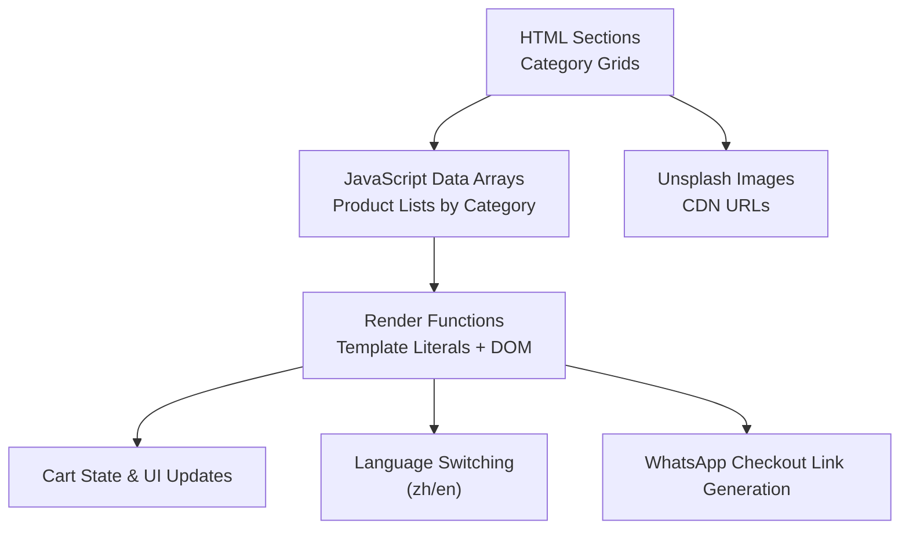
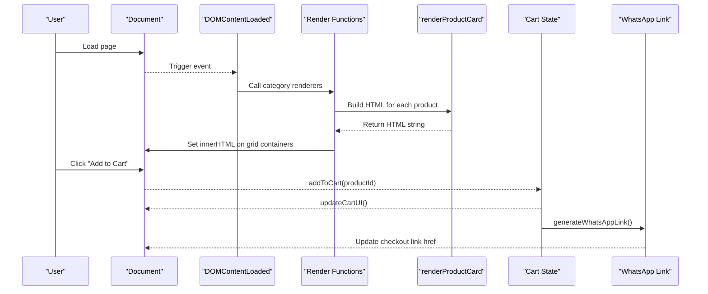
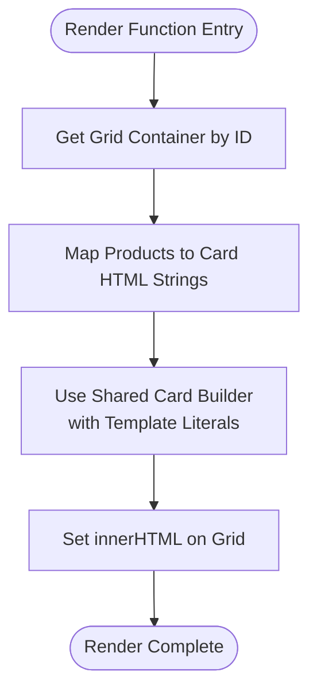
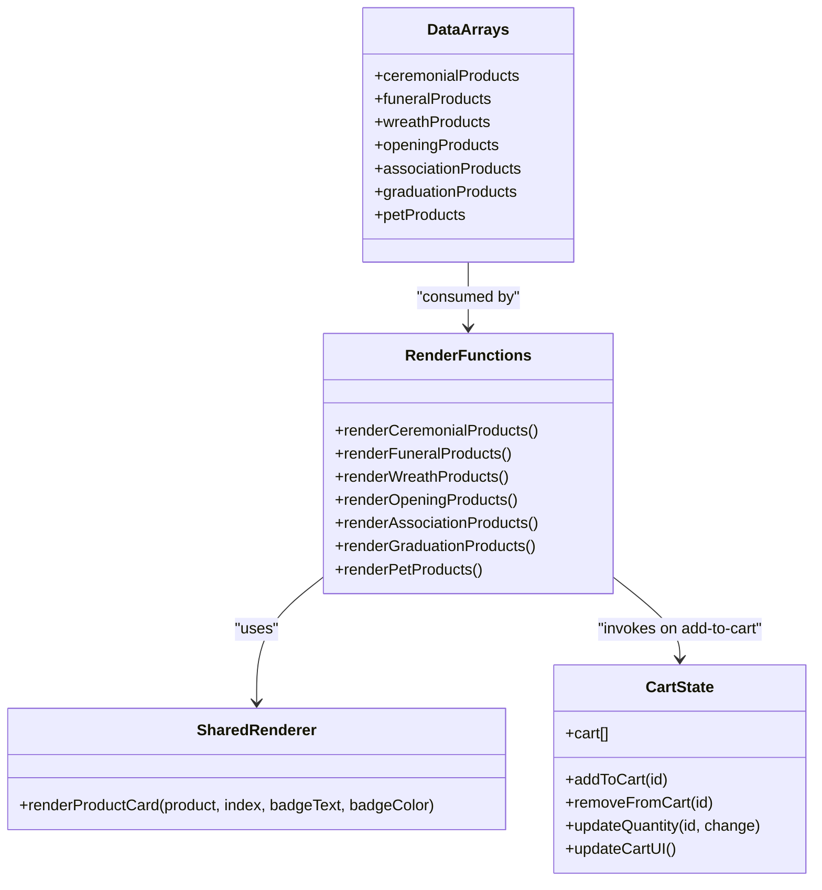
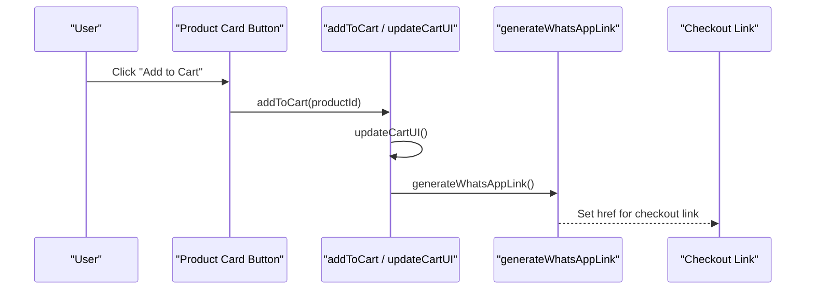
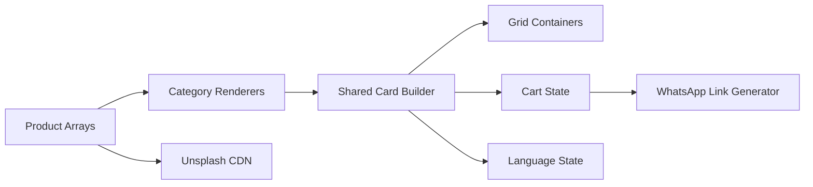

# Product Management System

<cite>
**Referenced Files in This Document**
- [index.html](file://docs/index.html)
</cite>

## Table of Contents
1. [Introduction](#introduction)
2. [Project Structure](#project-structure)
3. [Core Components](#core-components)
4. [Architecture Overview](#architecture-overview)
5. [Detailed Component Analysis](#detailed-component-analysis)
6. [Dependency Analysis](#dependency-analysis)
7. [Performance Considerations](#performance-considerations)
8. [Troubleshooting Guide](#troubleshooting-guide)
9. [Conclusion](#conclusion)

## Introduction
This document explains the product management system implemented for a florist website. It covers seven product categories (ceremonial, funeral, wreath, opening, association, graduation, pet memorial), the product data structure, dynamic rendering using template literals and DOM manipulation, image handling via Unsplash CDN, and the relationship between product arrays and render functions. It also provides practical guidance on adding new products, modifying existing ones, creating new categories, and addressing common issues such as image optimization and performance considerations.

## Project Structure
The entire implementation is contained within a single HTML file that includes:
- Static page sections for each category
- Inline CSS for styling and animations
- Inline JavaScript for internationalization, product data, rendering logic, cart operations, and UI interactions

**Diagram sources**
- [index.html:402-587](file://docs/index.html#L402-L587)
- [index.html:1079-1328](file://docs/index.html#L1079-L1328)
- [index.html:1332-1351](file://docs/index.html#L1332-L1351)
- [index.html:1376-1444](file://docs/index.html#L1376-L1444)
- [index.html:1446-1553](file://docs/index.html#L1446-L1553)
- [index.html:1478-1494](file://docs/index.html#L1478-L1494)

**Section sources**
- [index.html:402-587](file://docs/index.html#L402-L587)
- [index.html:1079-1328](file://docs/index.html#L1079-L1328)
- [index.html:1332-1351](file://docs/index.html#L1332-L1351)
- [index.html:1376-1444](file://docs/index.html#L1376-L1444)
- [index.html:1446-1553](file://docs/index.html#L1446-L1553)
- [index.html:1478-1494](file://docs/index.html#L1478-L1494)

## Core Components
- Product data arrays per category: Each category has its own array of product objects with consistent fields.
- Render functions: One function per category to map data into HTML cards and inject them into the corresponding grid container.
- Shared card renderer: A reusable function builds the product card markup using template literals and applies category-specific styles and badges.
- Cart state and UI: A simple in-memory cart array drives the sidebar UI, totals, and WhatsApp checkout link generation.
- Internationalization: A translations object supports zh/en toggling; language changes re-render all product grids.

Key responsibilities:
- Data: Define and maintain product records.
- Rendering: Convert data to DOM nodes efficiently.
- Interaction: Add/remove items from cart, update quantities, show feedback.
- Localization: Update text content and re-render product lists when language changes.

**Section sources**
- [index.html:1079-1328](file://docs/index.html#L1079-L1328)
- [index.html:1376-1444](file://docs/index.html#L1376-L1444)
- [index.html:1446-1553](file://docs/index.html#L1446-L1553)
- [index.html:1353-1374](file://docs/index.html#L1353-L1374)

## Architecture Overview
The system follows a straightforward client-side architecture:
- Data layer: Seven arrays hold product records.
- View layer: Each category section contains a grid container element.
- Controller layer: Render functions transform data into HTML strings and set innerHTML on containers.
- State layer: The cart array persists user selections during the session.
- Integration points: Unsplash CDN for images; WhatsApp API for checkout messaging.

**Diagram sources**
- [index.html:1332-1351](file://docs/index.html#L1332-L1351)
- [index.html:1376-1444](file://docs/index.html#L1376-L1444)
- [index.html:1446-1553](file://docs/index.html#L1446-L1553)
- [index.html:1478-1494](file://docs/index.html#L1478-L1494)

## Detailed Component Analysis

### Product Data Model
Each product object includes:
- id: Unique numeric identifier
- name: English name
- name_zh: Chinese name
- price: Numeric price
- category: String matching one of the seven categories
- image: Unsplash CDN URL with size/format parameters
- description: English description
- description_zh: Chinese description

Examples by category:
- Ceremonial: IDs 201, 202, 204, 205
- Funeral: IDs 101, 102, 103, 104
- Wreath: IDs 302, 303, 304
- Opening: IDs 402, 403, 404
- Association: IDs 501, 502, 503
- Graduation: IDs 601, 602, 603
- Pet Memorial: IDs 701, 702, 703

These arrays are defined at module scope and consumed by their respective render functions.

**Section sources**
- [index.html:1079-1120](file://docs/index.html#L1079-L1120)
- [index.html:1122-1163](file://docs/index.html#L1122-L1163)
- [index.html:1165-1196](file://docs/index.html#L1165-L1196)
- [index.html:1198-1229](file://docs/index.html#L1198-L1229)
- [index.html:1231-1262](file://docs/index.html#L1231-L1262)
- [index.html:1264-1295](file://docs/index.html#L1264-L1295)
- [index.html:1297-1328](file://docs/index.html#L1297-L1328)

### Dynamic Rendering Implementation
- Template literals: The shared card builder uses backtick strings to compose HTML with embedded expressions for names, descriptions, prices, and images.
- DOM injection: Each category’s render function sets innerHTML on its grid container after mapping the product array to card HTML strings.
- Conditional UI: Badges and color accents vary by category; funeral and pet categories use subdued colors, while others use accent colors.

**Diagram sources**
- [index.html:1376-1444](file://docs/index.html#L1376-L1444)

**Section sources**
- [index.html:1376-1444](file://docs/index.html#L1376-L1444)

### Image Handling via Unsplash CDN
- All product images reference Unsplash URLs with query parameters for width, auto-formatting, cropping, and quality.
- Benefits: Consistent sizing, optimized delivery, and reduced server load.
- Best practices: Keep width around 600px for grid thumbnails; adjust q parameter for balance between quality and bandwidth.

Common pitfalls:
- Using excessively large widths or high quality values can increase load time.
- Missing alt text increases accessibility issues; ensure alt reflects current language selection.

**Section sources**
- [index.html:1079-1328](file://docs/index.html#L1079-L1328)

### Relationship Between Product Arrays and Render Functions
- Each category has a dedicated array and a corresponding render function.
- On initial load and language switch, all render functions are invoked to populate grids.
- The shared card builder centralizes layout and behavior, minimizing duplication.

**Diagram sources**
- [index.html:1079-1328](file://docs/index.html#L1079-L1328)
- [index.html:1376-1444](file://docs/index.html#L1376-L1444)
- [index.html:1446-1553](file://docs/index.html#L1446-L1553)

**Section sources**
- [index.html:1332-1351](file://docs/index.html#L1332-L1351)
- [index.html:1376-1444](file://docs/index.html#L1376-L1444)
- [index.html:1446-1553](file://docs/index.html#L1446-L1553)

### Adding New Products
Steps:
1. Choose the appropriate category array.
2. Append a new product object with all required fields.
3. Ensure unique id and valid Unsplash image URL.
4. Save and reload; the product will appear automatically.

Where to edit:
- Ceremonial: [index.html:1079-1120](file://docs/index.html#L1079-L1120)
- Funeral: [index.html:1122-1163](file://docs/index.html#L1122-L1163)
- Wreath: [index.html:1165-1196](file://docs/index.html#L1165-L1196)
- Opening: [index.html:1198-1229](file://docs/index.html#L1198-L1229)
- Association: [index.html:1231-1262](file://docs/index.html#L1231-L1262)
- Graduation: [index.html:1264-1295](file://docs/index.html#L1264-L1295)
- Pet Memorial: [index.html:1297-1328](file://docs/index.html#L1297-L1328)

**Section sources**
- [index.html:1079-1328](file://docs/index.html#L1079-L1328)

### Modifying Existing Products
To update an existing product:
- Locate the product by id within the relevant category array.
- Edit fields such as name, price, image, or descriptions.
- Changes reflect immediately upon reload.

Example targets:
- Ceremonial entries: [index.html:1079-1120](file://docs/index.html#L1079-L1120)
- Funeral entries: [index.html:1122-1163](file://docs/index.html#L1122-L1163)
- Wreath entries: [index.html:1165-1196](file://docs/index.html#L1165-L1196)
- Opening entries: [index.html:1198-1229](file://docs/index.html#L1198-L1229)
- Association entries: [index.html:1231-1262](file://docs/index.html#L1231-L1262)
- Graduation entries: [index.html:1264-1295](file://docs/index.html#L1264-L1295)
- Pet entries: [index.html:1297-1328](file://docs/index.html#L1297-L1328)

**Section sources**
- [index.html:1079-1328](file://docs/index.html#L1079-L1328)

### Creating a New Category
To introduce a new category:
1. Add a new product array following the same schema.
2. Create a new render function similar to existing ones.
3. Add a new grid container element in the HTML with a unique id.
4. Invoke the new render function on initialization and language switch.
5. Optionally add navigation links and hero/category tiles if desired.

Implementation anchors:
- Initialization block where renderers are called: [index.html:1332-1351](file://docs/index.html#L1332-L1351)
- Language switcher re-render calls: [index.html:1353-1374](file://docs/index.html#L1353-L1374)
- Example render function pattern: [index.html:1406-1444](file://docs/index.html#L1406-L1444)
- Section grid containers: [index.html:402-587](file://docs/index.html#L402-L587)

**Section sources**
- [index.html:1332-1351](file://docs/index.html#L1332-L1351)
- [index.html:1353-1374](file://docs/index.html#L1353-L1374)
- [index.html:1406-1444](file://docs/index.html#L1406-L1444)
- [index.html:402-587](file://docs/index.html#L402-L587)

### Cart Integration and Checkout Flow
- Adding to cart: The shared card button triggers addToCart with the product id.
- Cart updates: updateCartUI recalculates totals and rebuilds the cart sidebar.
- WhatsApp checkout: generateWhatsAppLink composes a message including item details and total, then updates the checkout link.

**Diagram sources**
- [index.html:1376-1444](file://docs/index.html#L1376-L1444)
- [index.html:1446-1553](file://docs/index.html#L1446-L1553)
- [index.html:1478-1494](file://docs/index.html#L1478-L1494)

**Section sources**
- [index.html:1446-1553](file://docs/index.html#L1446-L1553)
- [index.html:1478-1494](file://docs/index.html#L1478-L1494)

## Dependency Analysis
- Data dependencies: Render functions depend on category arrays.
- UI dependencies: Cards depend on shared renderer and global language state.
- External dependencies: Unsplash CDN for images; WhatsApp API for checkout messages.
- No circular dependencies observed; clear separation between data, view, and interaction layers.

**Diagram sources**
- [index.html:1079-1328](file://docs/index.html#L1079-L1328)
- [index.html:1376-1444](file://docs/index.html#L1376-L1444)
- [index.html:1446-1553](file://docs/index.html#L1446-L1553)
- [index.html:1478-1494](file://docs/index.html#L1478-L1494)

**Section sources**
- [index.html:1079-1328](file://docs/index.html#L1079-L1328)
- [index.html:1376-1444](file://docs/index.html#L1376-L1444)
- [index.html:1446-1553](file://docs/index.html#L1446-L1553)
- [index.html:1478-1494](file://docs/index.html#L1478-L1494)

## Performance Considerations
- Image optimization: Use Unsplash parameters to limit width and quality; avoid oversized images for grid thumbnails.
- Rendering efficiency: innerHTML batch insertion is efficient for small catalogs; consider virtualization only if the catalog grows significantly.
- Re-renders on language switch: Current approach re-renders all grids; acceptable for small datasets but could be optimized by caching rendered HTML per language if needed.
- Event delegation: For very large catalogs, delegating click events to parent containers can reduce memory overhead.
- Avoid layout thrashing: Batch DOM writes and reads; current code primarily writes once per grid, which is efficient.

[No sources needed since this section provides general guidance]

## Troubleshooting Guide
Common issues and resolutions:
- Product not appearing: Verify the product exists in the correct category array and that the grid container id matches the render function target.
- Wrong image displayed: Check the Unsplash URL format and ensure it resolves; confirm alt text references the correct language field.
- Price formatting incorrect: Ensure price is a number and not a string; verify currency symbol usage in the card builder.
- Cart not updating: Confirm addToCart receives the correct id and that updateCartUI is called afterward.
- WhatsApp link missing details: Validate generateWhatsAppLink constructs the message correctly and that the checkout link href is updated.

Relevant implementation areas:
- Category arrays and product schemas: [index.html:1079-1328](file://docs/index.html#L1079-L1328)
- Render functions and grid ids: [index.html:1406-1444](file://docs/index.html#L1406-L1444)
- Cart operations and UI updates: [index.html:1446-1553](file://docs/index.html#L1446-L1553)
- WhatsApp link generation: [index.html:1478-1494](file://docs/index.html#L1478-L1494)

**Section sources**
- [index.html:1079-1328](file://docs/index.html#L1079-L1328)
- [index.html:1406-1444](file://docs/index.html#L1406-L1444)
- [index.html:1446-1553](file://docs/index.html#L1446-L1553)
- [index.html:1478-1494](file://docs/index.html#L1478-L1494)

## Conclusion
The product management system is a compact, client-side solution built around clear data arrays, reusable rendering logic, and straightforward DOM manipulation. It supports seven distinct categories, bilingual content, and seamless integration with Unsplash for images and WhatsApp for checkout. By adhering to the provided patterns, you can confidently add new products, modify existing ones, and extend the system with additional categories while maintaining performance and usability.