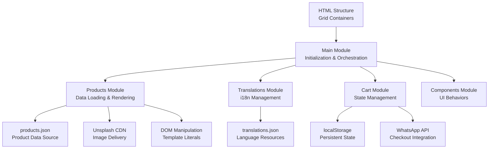
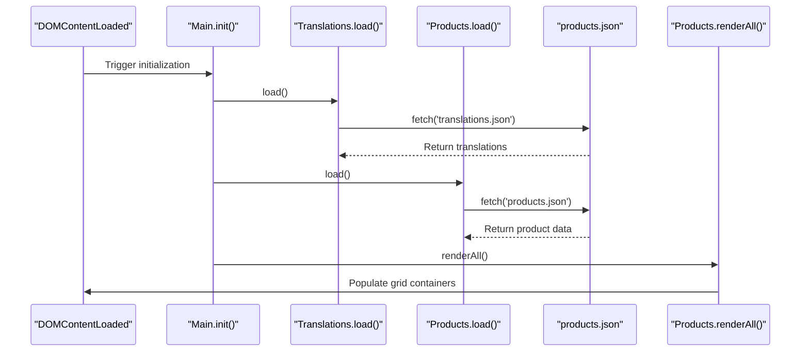
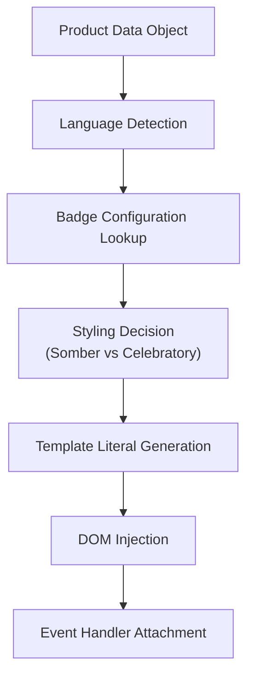
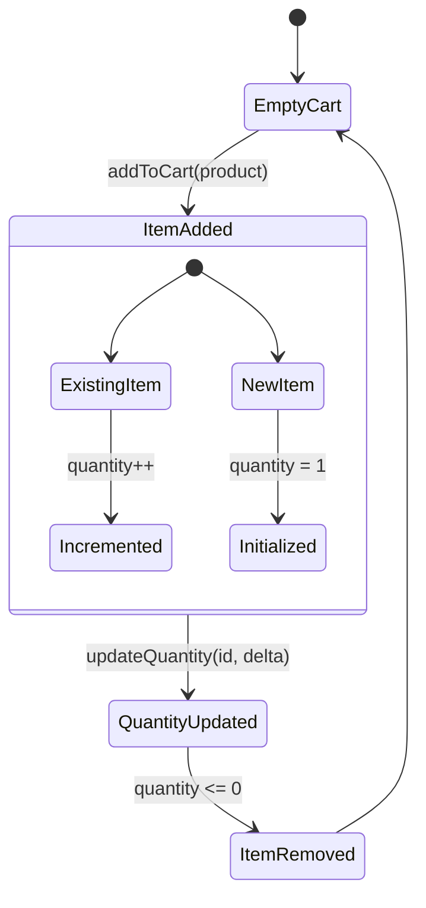
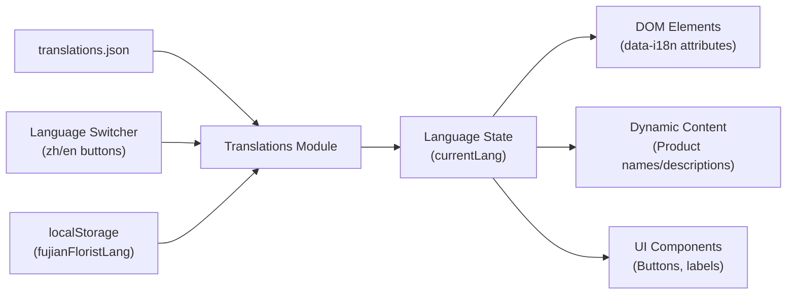
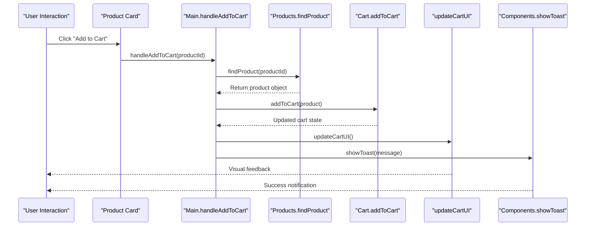

# Product Management System

<cite>
**Referenced Files in This Document**
- [products.json](file://docs/products.json)
- [main.js](file://docs/js/main.js)
- [products.js](file://docs/js/products.js)
- [cart.js](file://docs/js/cart.js)
- [translations.js](file://docs/js/translations.js)
- [components.js](file://docs/js/components.js)
- [index.html](file://docs/index.html)
- [translations.json](file://docs/translations.json)
</cite>

## Update Summary
**Changes Made**
- Completely restructured from hardcoded arrays in index.html to data-driven approach using products.json
- Implemented dynamic loading system with asynchronous data fetching
- Enhanced category management with centralized badge configuration
- Improved bilingual support with translation integration
- Modularized JavaScript architecture with separate modules for cart, translations, and components
- Added localStorage persistence for cart state and language preferences

## Table of Contents
1. [Introduction](#introduction)
2. [Architecture Overview](#architecture-overview)
3. [Data Layer](#data-layer)
4. [Dynamic Loading System](#dynamic-loading-system)
5. [Category Management](#category-management)
6. [Rendering Engine](#rendering-engine)
7. [Cart Integration](#cart-integration)
8. [Internationalization Support](#internationalization-support)
9. [Component Architecture](#component-architecture)
10. [Adding New Products](#adding-new-products)
11. [Creating New Categories](#creating-new-categories)
12. [Performance Considerations](#performance-considerations)
13. [Troubleshooting Guide](#troubleshooting-guide)
14. [Conclusion](#conclusion)

## Introduction
This document explains the modernized product management system implemented for the Fujian Florist website. The system has been completely restructured from a monolithic approach with hardcoded arrays to a modular, data-driven architecture that uses JSON files for product data and implements dynamic loading with improved category management and comprehensive bilingual support.

The system now supports seven distinct product categories (ceremonial, funeral, wreath, opening, association, graduation, pet memorial) through a sophisticated data layer, dynamic rendering engine, and component-based architecture. It features seamless integration with Unsplash CDN for images, WhatsApp checkout functionality, and persistent shopping cart state.

## Architecture Overview
The system follows a modular client-side architecture with clear separation of concerns:



**Diagram sources**
- [main.js:119-127](file://docs/js/main.js#L119-L127)
- [products.js:17-20](file://docs/js/products.js#L17-L20)
- [translations.js:9-17](file://docs/js/translations.js#L9-L17)
- [cart.js:5-18](file://docs/js/cart.js#L5-L18)

**Section sources**
- [main.js:119-127](file://docs/js/main.js#L119-L127)
- [products.js:17-20](file://docs/js/products.js#L17-L20)
- [translations.js:9-17](file://docs/js/translations.js#L9-L17)
- [cart.js:5-18](file://docs/js/cart.js#L5-L18)

## Data Layer
The data layer has been completely restructured to use a centralized JSON file for all product information, replacing the previous hardcoded arrays approach.

### Product Data Structure
Each product object maintains consistent fields across all categories:
- `id`: Unique numeric identifier for product lookup and cart operations
- `name`: English product name
- `name_zh`: Chinese product name  
- `price`: Numeric price value for calculations
- `image`: Unsplash CDN URL with optimization parameters
- `description`: English product description
- `description_zh`: Chinese product description

### Category Organization
Products are organized into seven categories within the JSON structure:
- **ceremonial**: Wedding plaques, longevity celebrations, engagement blessings
- **funeral**: Traditional white wreaths, standing sprays, casket arrangements
- **wreath**: Chinese round wreaths, Western circular wreaths, heart-shaped memorials
- **opening**: Grand opening plaques, prosperity stands, orchid arrangements
- **association**: Hometown association plaques, chamber of commerce stands, clan association displays
- **graduation**: Honor plaques, academic achievement stands, school ceremony displays
- **pets**: Pet memorial plaques, rainbow bridge wreaths, companion memorials

**Section sources**
- [products.json:1-224](file://docs/products.json#L1-L224)

## Dynamic Loading System
The system implements an asynchronous data loading mechanism that fetches product data from the JSON file at runtime.

### Asynchronous Data Fetching


**Diagram sources**
- [main.js:119-127](file://docs/js/main.js#L119-L127)
- [products.js:17-20](file://docs/js/products.js#L17-L20)
- [translations.js:9-17](file://docs/js/translations.js#L9-L17)

### Data Processing Pipeline
The system processes loaded data through several stages:
1. **Raw Data Fetch**: Async HTTP requests to JSON endpoints
2. **Data Transformation**: Convert flat arrays to structured objects with category metadata
3. **Caching**: Store processed data in module scope for efficient access
4. **Rendering**: Generate HTML markup and inject into DOM elements

**Section sources**
- [products.js:17-26](file://docs/js/products.js#L17-L26)
- [main.js:119-127](file://docs/js/main.js#L119-L127)

## Category Management
Category management has been significantly improved with centralized configuration and enhanced badge system.

### Badge Configuration System
Categories now have centralized badge configurations that control visual presentation:

| Category | Badge Text (EN) | Badge Text (ZH) | Color | Somber Mode |
|----------|----------------|-----------------|-------|-------------|
| ceremonial | Celebration | 喜慶 | #b45309 | No |
| funeral | - | - | - | Yes |
| wreath | - | - | - | No |
| opening | Opening | 開張 | #b45309 | No |
| association | Association | 社團 | #b45309 | No |
| graduation | Graduation | 畢業 | #2563eb | No |
| pets | Pet | 寵物 | #7c3aed | Yes |

### Dynamic Styling Logic
The system automatically applies appropriate styling based on category characteristics:
- **Somber categories** (funeral, pets): Gray color schemes, subdued button styles
- **Celebratory categories**: Amber/gold color schemes, vibrant button interactions
- **Badge display**: Conditional rendering based on category configuration

**Section sources**
- [products.js:8-15](file://docs/js/products.js#L8-L15)
- [products.js:46-50](file://docs/js/products.js#L46-L50)

## Rendering Engine
The rendering engine has been modularized with a shared card builder that handles template generation and DOM manipulation.

### Template Literal Architecture
The shared card renderer uses template literals to generate responsive product cards:



**Diagram sources**
- [products.js:37-80](file://docs/js/products.js#L37-L80)

### Grid Container Management
Each category targets specific grid containers by ID:
- `ceremonial-grid` → ceremonial products
- `funeral-products-grid` → funeral products  
- `wreaths-grid` → wreath products
- `opening-grid` → opening products
- `association-grid` → association products
- `graduation-grid` → graduation products
- `pets-grid` → pet memorial products

**Section sources**
- [products.js:82-97](file://docs/js/products.js#L82-L97)
- [index.html:239,293,330,348,366,384,402:239-402](file://docs/index.html#L239-L402)

## Cart Integration
The cart system provides persistent shopping functionality with localStorage storage and real-time UI updates.

### State Management Architecture


**Diagram sources**
- [cart.js:24-34](file://docs/js/cart.js#L24-L34)

### Persistent Storage
The cart system uses localStorage for data persistence:
- **Storage Key**: `fujianFloristCart`
- **Data Format**: JSON array of product objects with quantity metadata
- **Auto-sync**: All cart operations automatically save to storage
- **Error Handling**: Graceful fallback to empty cart on storage errors

**Section sources**
- [cart.js:5-18](file://docs/js/cart.js#L5-L18)
- [cart.js:24-34](file://docs/js/cart.js#L24-L34)

## Internationalization Support
The system provides comprehensive bilingual support with dynamic language switching and content localization.

### Translation Architecture


**Diagram sources**
- [translations.js:9-17](file://docs/js/translations.js#L9-L17)
- [translations.js:27-44](file://docs/js/translations.js#L27-L44)

### Language-Specific Features
- **Content Localization**: Product names, descriptions, and UI text switch dynamically
- **Visual Adaptation**: Document language attribute updates for proper font rendering
- **Preference Persistence**: User language choice saved to localStorage
- **Fallback Handling**: Graceful degradation when translations are missing

**Section sources**
- [translations.js:9-51](file://docs/js/translations.js#L9-L51)
- [translations.json:1-199](file://docs/translations.json#L1-L199)

## Component Architecture
The system follows a modular component pattern with clear separation of responsibilities.

### Module Responsibilities
- **Main Module**: Application orchestration, event handling, and cross-module communication
- **Products Module**: Data loading, processing, and rendering logic
- **Cart Module**: Shopping cart state management and persistence
- **Translations Module**: Internationalization and language switching
- **Components Module**: Reusable UI behaviors and shared functionality

### Event Flow Architecture


**Diagram sources**
- [main.js:8-14](file://docs/js/main.js#L8-L14)
- [products.js:32-34](file://docs/js/products.js#L32-34)
- [cart.js:24-34](file://docs/js/cart.js#L24-L34)

**Section sources**
- [main.js:1-134](file://docs/js/main.js#L1-134)
- [components.js:1-72](file://docs/js/components.js#L1-72)

## Adding New Products
Adding new products is now simplified through the centralized JSON data structure.

### Step-by-Step Process
1. **Open products.json**: Navigate to the appropriate category section
2. **Add Product Object**: Insert new product following the established schema
3. **Ensure Unique ID**: Use unique numeric identifier within category range
4. **Provide Bilingual Content**: Include both English and Chinese versions
5. **Optimize Image URL**: Use Unsplash CDN with appropriate parameters
6. **Save and Test**: Changes appear immediately after page reload

### Product Schema Requirements
```json
{
  "id": 801,
  "name": "New Product Name",
  "name_zh": "新產品名稱", 
  "price": 999,
  "image": "https://images.unsplash.com/photo-[ID]?w=600&auto=format&fit=crop&q=80",
  "description": "English product description",
  "description_zh": "中文產品描述"
}
```

### Best Practices
- **ID Sequencing**: Follow existing numbering patterns (e.g., 801+ for new categories)
- **Image Optimization**: Use w=600 parameter for optimal grid display
- **Price Formatting**: Use integer values without currency symbols
- **Description Length**: Keep descriptions concise but informative
- **Bilingual Consistency**: Ensure both language versions convey same meaning

**Section sources**
- [products.json:1-224](file://docs/products.json#L1-L224)

## Creating New Categories
Creating new categories requires updates across multiple files and architectural components.

### Implementation Steps
1. **Update products.json**: Add new category array with product objects
2. **Configure Badge Settings**: Add badge configuration in products.js
3. **Create Grid Container**: Add HTML grid element with unique ID
4. **Update Navigation**: Add navigation links and category tiles
5. **Modify Render Function**: Update renderAll() method
6. **Add Translations**: Include category-specific translations

### Required File Modifications

#### products.json Addition
```json
"new_category": [
  {
    "id": 901,
    "name": "New Category Product",
    "name_zh": "新類別產品",
    "price": 1000,
    "image": "https://images.unsplash.com/photo-[ID]?w=600&auto=format&fit=crop&q=80",
    "description": "English description",
    "description_zh": "中文描述"
  }
]
```

#### products.js Badge Configuration
```javascript
const badges = {
  // ... existing categories
  new_category: { 
    text_zh: '新類別', 
    text_en: 'New Category', 
    color: '#color-code' 
  }
};
```

#### HTML Grid Container
```html
<div class="grid grid-cols-1 sm:grid-cols-2 lg:grid-cols-3 gap-8" id="new-category-grid"></div>
```

#### Render Function Update
```javascript
function renderAll() {
  // ... existing renders
  renderCategory('new_category', 'new-category-grid');
}
```

**Section sources**
- [products.js:8-15](file://docs/js/products.js#L8-L15)
- [products.js:89-97](file://docs/js/products.js#L89-L97)
- [index.html:239-402](file://docs/index.html#L239-L402)

## Performance Considerations
The modernized architecture includes several performance optimizations and best practices.

### Data Loading Optimization
- **Asynchronous Loading**: Non-blocking data fetch prevents UI freezing
- **Single Request**: All product data loaded in one HTTP request
- **Memory Efficiency**: Data cached in module scope for reuse
- **Lazy Evaluation**: Only necessary data processed per category

### Rendering Performance
- **Batch DOM Updates**: innerHTML batch insertion reduces reflows
- **Efficient Templates**: Template literals minimize string concatenation overhead
- **Conditional Rendering**: Badge and styling logic optimized for performance
- **Event Delegation**: Single event handlers reduce memory footprint

### Image Optimization
- **CDN Delivery**: Unsplash CDN provides optimized image delivery
- **Responsive Sizing**: w=600 parameter balances quality and bandwidth
- **Format Optimization**: auto=format ensures optimal format selection
- **Quality Control**: q=80 parameter provides good quality-to-size ratio

### Memory Management
- **Module Pattern**: IIFE pattern prevents global namespace pollution
- **Event Cleanup**: Proper event handler management prevents memory leaks
- **LocalStorage Limits**: Cart data size managed to prevent storage quota issues

## Troubleshooting Guide
Common issues and their solutions in the modernized system.

### Data Loading Issues
**Problem**: Products not appearing on page load
- **Check Network Tab**: Verify products.json loads successfully
- **Validate JSON Syntax**: Ensure proper JSON formatting and syntax
- **Verify File Path**: Confirm correct relative path to products.json
- **Check Console Errors**: Look for CORS or parsing errors

**Problem**: Wrong language content displayed
- **Verify translations.json**: Check if required keys exist in selected language
- **Check Language State**: Confirm currentLang variable is set correctly
- **Inspect DOM Attributes**: Verify data-i18n attributes are properly applied

### Rendering Problems
**Problem**: Grid containers not found
- **Check Element IDs**: Verify grid container IDs match render function calls
- **Validate HTML Structure**: Ensure grid divs exist before script execution
- **Review Script Order**: Confirm scripts load in correct dependency order

**Problem**: Images not displaying
- **Validate Unsplash URLs**: Check image URLs are accessible and properly formatted
- **Verify Image Parameters**: Ensure w=600 and other parameters are correct
- **Check CORS Policy**: Confirm Unsplash allows cross-origin requests

### Cart Functionality Issues
**Problem**: Cart items not persisting
- **Check localStorage Access**: Verify browser allows localStorage
- **Validate Storage Key**: Ensure STORAGE_KEY constant matches usage
- **Inspect Error Handling**: Check try-catch blocks in _load() function

**Problem**: Cart total calculations incorrect
- **Verify Price Values**: Ensure prices are numbers, not strings
- **Check Quantity Updates**: Validate quantity increment/decrement logic
- **Review Calculation Methods**: Inspect getCartTotal() implementation

### Internationalization Problems
**Problem**: Language switching not working
- **Check Button Handlers**: Verify onclick handlers call setLanguage()
- **Validate Language Keys**: Ensure both 'zh' and 'en' keys exist in translations
- **Inspect DOM Updates**: Check if data-i18n elements are being updated

**Problem**: Missing translations
- **Verify Translation Keys**: Check if all required keys exist in translations.json
- **Check Fallback Logic**: Ensure default key returns when translation missing
- **Validate JSON Structure**: Confirm proper nesting and formatting

**Section sources**
- [products.js:17-20](file://docs/js/products.js#L17-L20)
- [translations.js:9-17](file://docs/js/translations.js#L9-L17)
- [cart.js:8-14](file://docs/js/cart.js#L8-L14)

## Conclusion
The modernized product management system represents a significant architectural improvement over the original hardcoded approach. The new data-driven architecture provides better maintainability, scalability, and user experience through:

- **Centralized Data Management**: All product information stored in structured JSON format
- **Modular Code Organization**: Clear separation of concerns with dedicated modules
- **Enhanced User Experience**: Real-time language switching and persistent shopping cart
- **Improved Performance**: Asynchronous loading and optimized rendering pipeline
- **Better Maintainability**: Easy addition of new products and categories through standardized schemas

The system successfully supports all seven product categories while providing a foundation for future enhancements such as search functionality, filtering capabilities, and expanded internationalization support. The modular architecture ensures that new features can be added without disrupting existing functionality, making it well-suited for continued development and scaling.