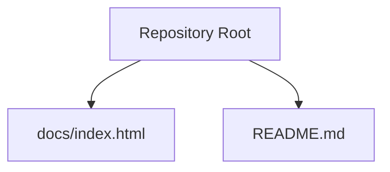
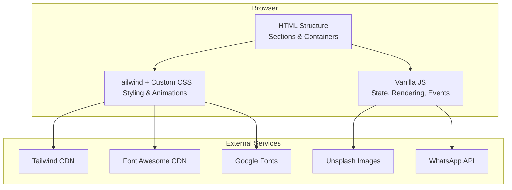
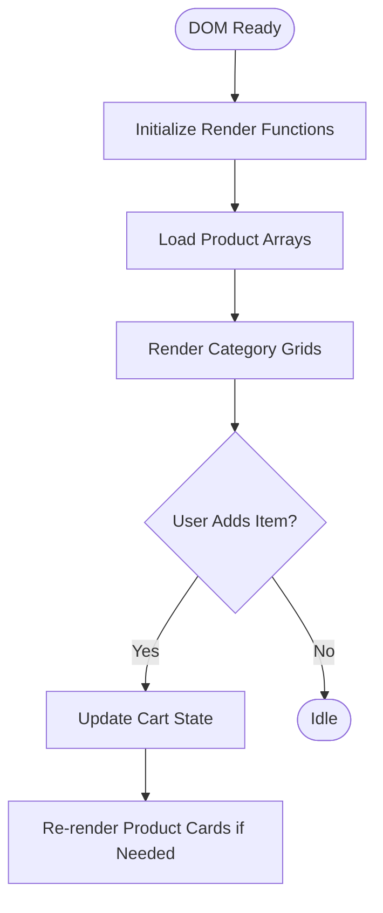
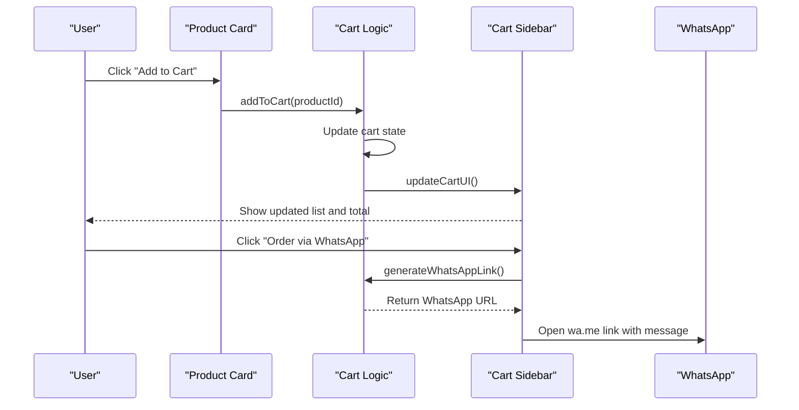
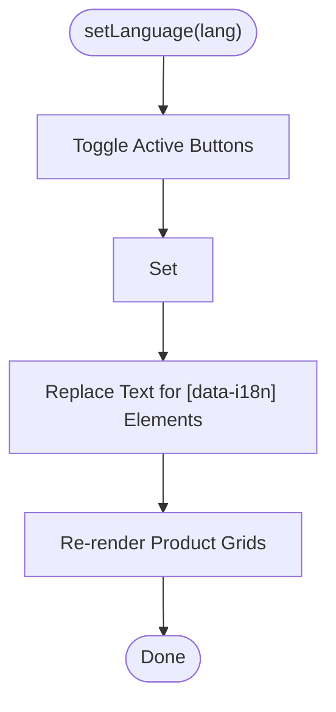
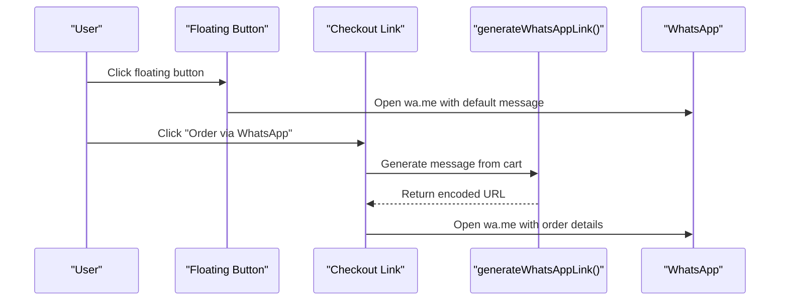
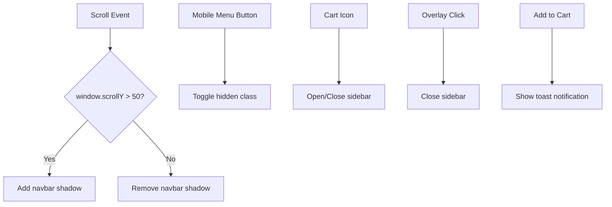
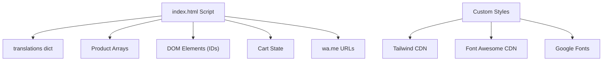

# Project Overview

<cite>
**Referenced Files in This Document**
- [README.md](file://README.md)
- [index.html](file://docs/index.html)
</cite>

## Table of Contents
1. [Introduction](#introduction)
2. [Project Structure](#project-structure)
3. [Core Components](#core-components)
4. [Architecture Overview](#architecture-overview)
5. [Detailed Component Analysis](#detailed-component-analysis)
6. [Dependency Analysis](#dependency-analysis)
7. [Performance Considerations](#performance-considerations)
8. [Troubleshooting Guide](#troubleshooting-guide)
9. [Conclusion](#conclusion)

## Introduction
This project is a single-page e-commerce showcase website for Fujian Florist, a traditional Chinese florist business specializing in ceremonial and memorial floral products. The site presents a curated product catalog across multiple categories (ceremonial plaques, funeral arrangements, wreaths, grand opening plaques, association plaques, graduation plaques, and pet memorials), supports bilingual content (Traditional Chinese and English), provides shopping cart functionality, and integrates WhatsApp for direct ordering and inquiries. It is designed as a monolithic single-page application built with HTML5, CSS3 using Tailwind CSS via CDN, and vanilla JavaScript.

Target audience:
- Customers seeking ceremonial and memorial floral services in Hong Kong
- Families and organizations planning events requiring pre-ordering
- International clients who prefer English content

Key capabilities:
- Product catalog management through client-side data arrays
- Shopping cart with add/remove/quantity controls and totals
- Multi-language support (zh-Hant and en)
- WhatsApp integration for checkout and general inquiries
- Responsive design and smooth user interactions

Technology stack:
- HTML5 semantic structure
- CSS3 with Tailwind CSS (CDN) and custom styles
- Vanilla JavaScript for interactivity and state management
- External assets: Google Fonts, Font Awesome icons, Unsplash images

Architectural approach:
- Monolithic SPA: all UI, logic, and data are contained within a single HTML file
- Client-side rendering: product grids are generated dynamically from JavaScript arrays
- State-driven UI: cart state drives the sidebar and totals
- Localization via data attributes and translation dictionary

Practical examples:
- Add a product to the cart by clicking “Add to Cart” on any product card
- Switch language between Traditional Chinese and English using the header toggles
- Open the cart sidebar, adjust quantities, and proceed to checkout via WhatsApp

**Section sources**
- [index.html:1-20](file://docs/index.html#L1-L20)
- [index.html:881-1075](file://docs/index.html#L881-L1075)
- [index.html:1332-1351](file://docs/index.html#L1332-L1351)

## Project Structure
The repository is minimal and focused on delivering a single-page site:
- docs/index.html: The complete SPA containing markup, styling, and scripts
- README.md: Repository root note

**Diagram sources**
- [index.html:1-20](file://docs/index.html#L1-L20)
- [README.md:1-1](file://README.md#L1-L1)

**Section sources**
- [README.md:1-1](file://README.md#L1-L1)
- [index.html:1-20](file://docs/index.html#L1-L20)

## Core Components
- Navigation and Hero: Fixed top navigation with category links, language toggle, and cart icon; hero section introduces brand and key service tags.
- Category Sections: Dedicated sections for each product category with dynamic grid rendering.
- Product Catalog: Client-side arrays define products per category; cards render names, descriptions, prices, and actions.
- Shopping Cart Sidebar: Slide-in panel showing items, quantity controls, subtotal, delivery notes, and WhatsApp checkout link.
- WhatsApp Integration: Floating button and checkout link generate localized messages and open WhatsApp chat.
- Multi-language Support: Translation dictionary keyed by data-i18n attributes; setLanguage updates DOM text and re-renders product grids.
- Toast Notifications: Non-blocking feedback when adding items to cart.
- Delivery and About Sections: Informational content about delivery options, urgent orders, and store background.

Implementation highlights:
- Data-driven rendering: render functions map product arrays into HTML strings and inject into grid containers
- Cart state: array of items with id, name, price, quantity; updateCartUI recalculates totals and renders list
- Localization: currentLang variable controls which translations and product labels are shown
- Interactions: event listeners for scroll effects, mobile menu toggle, cart open/close

**Section sources**
- [index.html:214-282](file://docs/index.html#L214-L282)
- [index.html:285-399](file://docs/index.html#L285-L399)
- [index.html:402-587](file://docs/index.html#L402-L587)
- [index.html:813-860](file://docs/index.html#L813-L860)
- [index.html:862-879](file://docs/index.html#L862-L879)
- [index.html:881-1075](file://docs/index.html#L881-L1075)
- [index.html:1332-1351](file://docs/index.html#L1332-L1351)
- [index.html:1376-1444](file://docs/index.html#L1376-L1444)
- [index.html:1446-1553](file://docs/index.html#L1446-L1553)

## Architecture Overview
Conceptual architecture of the SPA:
- Single HTML document hosts layout and content sections
- Tailwind CSS via CDN provides utility-first styling
- Custom CSS adds animations, transitions, and component-specific styles
- Vanilla JS manages state (cart, language), renders product grids, and handles user interactions
- External resources include fonts, icons, and placeholder images

[No sources needed since this diagram shows conceptual workflow, not actual code structure]

## Detailed Component Analysis

### Product Catalog Management
- Data model: Arrays of product objects per category, each with id, name (en/zh), price, category, image, description (en/zh)
- Rendering: Each category has a dedicated render function that maps its array into product cards and injects into the corresponding grid container
- Language-aware display: Product names and descriptions switch based on currentLang
- Badge ribbons: Optional category badges rendered conditionally

**Diagram sources**
- [index.html:1332-1351](file://docs/index.html#L1332-L1351)
- [index.html:1406-1444](file://docs/index.html#L1406-L1444)
- [index.html:1446-1459](file://docs/index.html#L1446-L1459)

**Section sources**
- [index.html:1079-1328](file://docs/index.html#L1079-L1328)
- [index.html:1406-1444](file://docs/index.html#L1406-L1444)

### Shopping Cart Functionality
- State: cart array holds selected items with quantity
- Actions: addToCart, removeFromCart, updateQuantity
- UI: Sidebar overlay with item list, quantity controls, subtotal, and WhatsApp checkout link
- Totals: Computed by summing price × quantity across items
- Checkout: Generates a localized message string and sets href to WhatsApp URL

**Diagram sources**
- [index.html:1446-1459](file://docs/index.html#L1446-L1459)
- [index.html:1496-1553](file://docs/index.html#L1496-L1553)
- [index.html:1478-1494](file://docs/index.html#L1478-L1494)
- [index.html:849-853](file://docs/index.html#L849-L853)

**Section sources**
- [index.html:813-860](file://docs/index.html#L813-L860)
- [index.html:1446-1553](file://docs/index.html#L1446-L1553)

### Multi-language Support
- Dictionary: translations object contains zh and en keys mapped to data-i18n attributes
- Language switching: setLanguage toggles active buttons, updates html lang attribute, replaces text content for elements with data-i18n, and re-renders product grids
- Initial language: Default set to zh on DOMContentLoaded

**Diagram sources**
- [index.html:1353-1374](file://docs/index.html#L1353-L1374)
- [index.html:881-1075](file://docs/index.html#L881-L1075)

**Section sources**
- [index.html:1353-1374](file://docs/index.html#L1353-L1374)
- [index.html:881-1075](file://docs/index.html#L881-L1075)

### WhatsApp Integration
- Floating button: Always visible, opens WhatsApp with a default inquiry message
- Checkout link: Dynamically generated from cart contents and current language
- Message format: Includes product IDs, names, quantities, and totals; encoded for URL safety

**Diagram sources**
- [index.html:862-872](file://docs/index.html#L862-L872)
- [index.html:1478-1494](file://docs/index.html#L1478-L1494)
- [index.html:849-853](file://docs/index.html#L849-L853)

**Section sources**
- [index.html:862-872](file://docs/index.html#L862-L872)
- [index.html:1478-1494](file://docs/index.html#L1478-L1494)
- [index.html:849-853](file://docs/index.html#L849-L853)

### UI Interactions and Animations
- Scroll effect: Navbar gains shadow on scroll
- Mobile menu: Toggle visibility for small screens
- Cart sidebar: Slide-in/out with overlay and body overflow control
- Toast notifications: Fade-in/out feedback after adding items
- Hover effects: Product cards lift and reveal add-to-cart button

**Diagram sources**
- [index.html:1343-1351](file://docs/index.html#L1343-L1351)
- [index.html:1555-1573](file://docs/index.html#L1555-L1573)
- [index.html:1575-1585](file://docs/index.html#L1575-L1585)

**Section sources**
- [index.html:1343-1351](file://docs/index.html#L1343-L1351)
- [index.html:1555-1573](file://docs/index.html#L1555-L1573)
- [index.html:1575-1585](file://docs/index.html#L1575-L1585)

## Dependency Analysis
External dependencies:
- Tailwind CSS via CDN for utility-first styling
- Font Awesome for icons
- Google Fonts for typography
- Unsplash images for product placeholders

Internal dependencies:
- DOM elements referenced by IDs (grids, cart sidebar, overlays)
- JavaScript functions depend on translation dictionary and product arrays
- Cart UI depends on cart state and computed totals

**Diagram sources**
- [index.html:881-1075](file://docs/index.html#L881-L1075)
- [index.html:1079-1328](file://docs/index.html#L1079-L1328)
- [index.html:1496-1553](file://docs/index.html#L1496-L1553)

**Section sources**
- [index.html:881-1075](file://docs/index.html#L881-L1075)
- [index.html:1079-1328](file://docs/index.html#L1079-L1328)
- [index.html:1496-1553](file://docs/index.html#L1496-L1553)

## Performance Considerations
- Single-file SPA reduces HTTP requests but increases initial payload size
- Using CDN for Tailwind and icons avoids local asset management
- Client-side rendering avoids server calls; ensure product arrays remain concise
- Image optimization: Use appropriately sized images and consider lazy loading for large galleries
- Avoid excessive DOM manipulation; batch updates where possible
- Keep translation dictionary compact and well-structured

[No sources needed since this section provides general guidance]

## Troubleshooting Guide
Common issues and resolutions:
- Language not updating: Ensure elements have correct data-i18n attributes and translations exist for the target language
- Cart not reflecting changes: Verify addToCart/updateQuantity/removeFromCart are called and updateCartUI runs afterward
- WhatsApp link incorrect: Confirm generateWhatsAppLink encodes message properly and uses the intended phone number
- Mobile menu not toggling: Check toggleMobileMenu and ensure the menu element ID matches
- Scroll shadow not applied: Validate scroll event listener and conditional class toggling

Operational checks:
- Confirm DOMContentLoaded initializes all render functions and sets default language
- Verify cart count badge visibility logic when totalItems is zero or greater than zero
- Test both zh and en flows for product names, descriptions, and checkout messages

**Section sources**
- [index.html:1332-1351](file://docs/index.html#L1332-L1351)
- [index.html:1446-1553](file://docs/index.html#L1446-L1553)
- [index.html:1353-1374](file://docs/index.html#L1353-L1374)
- [index.html:1570-1585](file://docs/index.html#L1570-L1585)

## Conclusion
Fujian Florist’s single-page website delivers a streamlined, bilingual e-commerce showcase tailored to traditional Chinese floral services. Its monolithic architecture simplifies deployment while providing essential features: a rich product catalog, interactive shopping cart, multi-language support, and WhatsApp-based ordering. Developers can extend functionality by expanding product arrays, refining localization, and enhancing performance through asset optimization. Users benefit from an intuitive interface that guides them from browsing to checkout with clear calls to action and culturally appropriate messaging.

[No sources needed since this section summarizes without analyzing specific files]