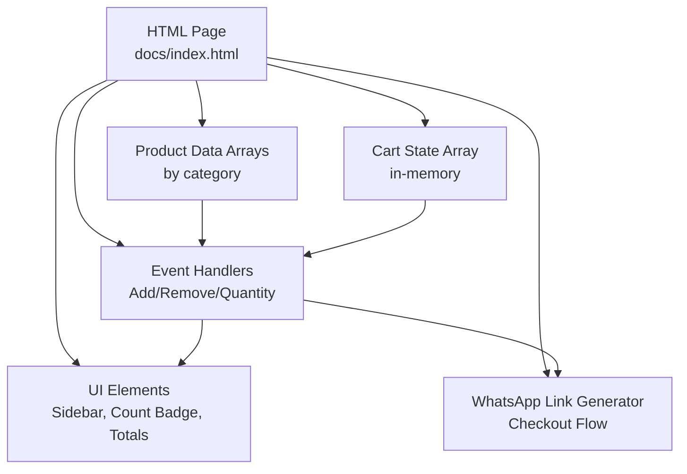
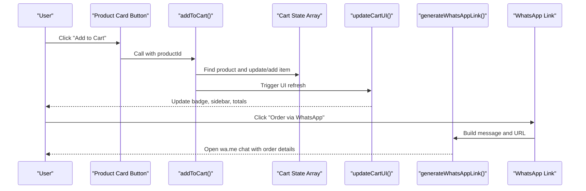
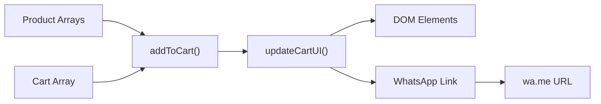

# Shopping Cart Implementation

<cite>
**Referenced Files in This Document**
- [index.html](file://docs/index.html)
</cite>

## Table of Contents
1. [Introduction](#introduction)
2. [Project Structure](#project-structure)
3. [Core Components](#core-components)
4. [Architecture Overview](#architecture-overview)
5. [Detailed Component Analysis](#detailed-component-analysis)
6. [Dependency Analysis](#dependency-analysis)
7. [Performance Considerations](#performance-considerations)
8. [Troubleshooting Guide](#troubleshooting-guide)
9. [Conclusion](#conclusion)

## Introduction
This document explains the shopping cart sub-feature implemented in a single-page site for Fujian Florist. It covers:
- In-memory cart state management using arrays
- Quantity tracking and real-time price calculations
- User interaction handlers for adding/removing items and adjusting quantities
- Checkout flow via WhatsApp Business API (wa.me link generation)
- UI persistence patterns within the page session
- Common issues such as state synchronization and performance considerations for larger catalogs

The implementation is contained entirely within one HTML file with embedded CSS and JavaScript, making it straightforward to understand and maintain.

## Project Structure
The shopping cart feature lives inside a single HTML file that includes:
- Product catalog data arrays by category
- A global in-memory cart array
- Functions to render product cards and update the cart UI
- Event-driven interactions for add/remove/quantity changes
- WhatsApp checkout link generation

**Diagram sources**
- [index.html:1079-1328](file://docs/index.html#L1079-L1328)
- [index.html:1330-1330](file://docs/index.html#L1330-L1330)
- [index.html:1446-1476](file://docs/index.html#L1446-L1476)
- [index.html:1478-1494](file://docs/index.html#L1478-L1494)
- [index.html:1496-1553](file://docs/index.html#L1496-L1553)

**Section sources**
- [index.html:1079-1328](file://docs/index.html#L1079-L1328)
- [index.html:1330-1330](file://docs/index.html#L1330-L1330)
- [index.html:1446-1476](file://docs/index.html#L1446-L1476)
- [index.html:1478-1494](file://docs/index.html#L1478-L1494)
- [index.html:1496-1553](file://docs/index.html#L1496-L1553)

## Core Components
- Product catalog arrays: Each category has an array of product objects containing id, name(s), price, category, image, and description(s).
- Cart state: A single in-memory array holds selected items with quantity.
- UI rendering: Functions render product cards into category grids and rebuild the cart sidebar on state changes.
- Interaction handlers: Add to cart, remove from cart, update quantity, toggle cart visibility, show toast notifications.
- Checkout integration: Generates a WhatsApp message URL with itemized order details and total.

Key responsibilities and relationships:
- addToCart locates a product across all categories and updates the cart array.
- removeFromCart filters out the item by id.
- updateQuantity increments/decrements quantity and removes the item if quantity drops to zero.
- generateWhatsAppLink builds a formatted message string and returns a wa.me URL.
- updateCartUI recalculates totals and re-renders the cart sidebar and header badge.

**Section sources**
- [index.html:1079-1328](file://docs/index.html#L1079-L1328)
- [index.html:1330-1330](file://docs/index.html#L1330-L1330)
- [index.html:1446-1476](file://docs/index.html#L1446-L1476)
- [index.html:1478-1494](file://docs/index.html#L1478-L1494)
- [index.html:1496-1553](file://docs/index.html#L1496-L1553)

## Architecture Overview
The cart follows a simple client-side MVC-like pattern:
- Model: Product arrays and cart array
- View: DOM elements for product grids, cart sidebar, header badge, and totals
- Controller: Event handlers and functions that mutate model and update view

**Diagram sources**
- [index.html:1446-1459](file://docs/index.html#L1446-L1459)
- [index.html:1496-1553](file://docs/index.html#L1496-L1553)
- [index.html:1478-1494](file://docs/index.html#L1478-L1494)

## Detailed Component Analysis

### Cart State Management (In-Memory Arrays)
- Global cart variable holds an array of items; each item mirrors product fields plus a quantity property.
- On load, the cart starts empty and is updated only through explicit user actions.
- No server or local storage persistence is used; cart resets on page reload.

Complexity:
- Adding an item: O(n) search over existing cart + O(1) push/update
- Removing an item: O(n) filter
- Updating quantity: O(n) find + O(1) mutation
- Calculating totals: O(n) reduce

Optimization opportunities:
- Maintain a Map keyed by product id for O(1) lookups when catalog grows large.
- Batch DOM updates to avoid repeated reflows.

**Section sources**
- [index.html:1330-1330](file://docs/index.html#L1330-L1330)
- [index.html:1446-1459](file://docs/index.html#L1446-L1459)
- [index.html:1461-1476](file://docs/index.html#L1461-L1476)
- [index.html:1496-1505](file://docs/index.html#L1496-L1505)

### Quantity Tracking Mechanisms
- When adding an item, if it already exists in the cart, its quantity increments; otherwise, a new entry is created with quantity 1.
- The minus button decreases quantity; if quantity reaches zero or below, the item is removed automatically.
- The UI reflects current quantity inline and recalculates per-item subtotal.

Edge cases handled:
- Prevents negative quantities by removing the item when quantity <= 0.
- Ensures the cart badge hides when no items are present.

**Section sources**
- [index.html:1446-1459](file://docs/index.html#L1446-L1459)
- [index.html:1466-1476](file://docs/index.html#L1466-L1476)
- [index.html:1506-1511](file://docs/index.html#L1506-L1511)

### Real-Time Price Calculations
- Subtotal per item equals unit price multiplied by quantity.
- Grand total is computed by summing per-item subtotals.
- Both values update instantly after any cart change.

Implementation notes:
- Uses array reduce to compute totals efficiently.
- Currency formatting is minimal; consider locale-aware formatting for production.

**Section sources**
- [index.html:1503-1505](file://docs/index.html#L1503-L1505)
- [index.html:1546-1546](file://docs/index.html#L1546-L1546)

### Integration with WhatsApp Business API (Checkout Flow)
- The checkout action generates a pre-filled WhatsApp message listing each cart item with product number, name, quantity, and line total.
- The final message includes a grand total and a polite closing.
- The generated URL opens a WhatsApp chat with the shop’s number using wa.me.

Flow:
- User clicks “Order via WhatsApp”
- System calls the link generator
- Browser navigates to the constructed wa.me URL

Notes:
- This uses the public wa.me web interface rather than the official WhatsApp Business Cloud API. For automated processing, backend integration would be required.

**Section sources**
- [index.html:1478-1494](file://docs/index.html#L1478-L1494)
- [index.html:1549-1551](file://docs/index.html#L1549-L1551)

### User Interaction Handlers
- Add to cart: Invoked from product card buttons; finds product across all categories and updates cart state.
- Remove from cart: Filters out the item by id and refreshes UI.
- Update quantity: Adjusts quantity and triggers removal if needed.
- Toggle cart: Shows/hides the slide-in sidebar and manages body scroll lock.
- Toast notification: Provides brief feedback when items are added.

Accessibility and UX:
- Clear visual feedback via badge count and toast messages.
- Smooth transitions for sidebar open/close.

**Section sources**
- [index.html:1446-1459](file://docs/index.html#L1446-L1459)
- [index.html:1461-1476](file://docs/index.html#L1461-L1476)
- [index.html:1555-1568](file://docs/index.html#L1555-L1568)
- [index.html:1575-1585](file://docs/index.html#L1575-L1585)

### Cart Persistence Patterns
- Current implementation does not persist cart across sessions.
- To persist, consider localStorage or sessionStorage:
  - Save cart on every mutation
  - Load cart on DOMContentLoaded
  - Handle serialization/deserialization safely

Trade-offs:
- localStorage persists across tabs and sessions but requires careful parsing and migration strategies.
- sessionStorage clears on tab close and may better reflect a single browsing session.

**Section sources**
- [index.html:1330-1330](file://docs/index.html#L1330-L1330)
- [index.html:1332-1341](file://docs/index.html#L1332-L1341)

### Concrete Examples from Codebase
- Adding an item: See the function that searches all products and updates the cart array, then refreshes UI and shows a toast.
- Removing an item: See the filter-based removal followed by UI refresh.
- Adjusting quantity: See the increment/decrement logic with automatic removal at zero.
- Generating checkout link: See the message builder and URL construction.
- Rendering cart UI: See the full sidebar rebuild including totals and WhatsApp link update.

**Section sources**
- [index.html:1446-1459](file://docs/index.html#L1446-L1459)
- [index.html:1461-1476](file://docs/index.html#L1461-L1476)
- [index.html:1478-1494](file://docs/index.html#L1478-L1494)
- [index.html:1496-1553](file://docs/index.html#L1496-L1553)

## Dependency Analysis
High-level dependencies among components:
- Product arrays feed both product rendering and cart operations.
- Cart state drives UI updates and checkout link generation.
- UI elements depend on IDs and classes defined in the HTML.

**Diagram sources**
- [index.html:1079-1328](file://docs/index.html#L1079-L1328)
- [index.html:1330-1330](file://docs/index.html#L1330-L1330)
- [index.html:1446-1459](file://docs/index.html#L1446-L1459)
- [index.html:1496-1553](file://docs/index.html#L1496-L1553)
- [index.html:1478-1494](file://docs/index.html#L1478-L1494)

**Section sources**
- [index.html:1079-1328](file://docs/index.html#L1079-L1328)
- [index.html:1330-1330](file://docs/index.html#L1330-L1330)
- [index.html:1446-1459](file://docs/index.html#L1446-L1459)
- [index.html:1478-1494](file://docs/index.html#L1478-L1494)
- [index.html:1496-1553](file://docs/index.html#L1496-L1553)

## Performance Considerations
Current approach is efficient for small catalogs:
- Search across concatenated arrays is O(n) per add operation.
- DOM rebuilds occur on each cart mutation.

Recommendations for larger catalogs:
- Index products by id in a Map for O(1) lookup.
- Use a virtualized list or pagination for product grids.
- Debounce rapid UI updates if multiple mutations happen quickly.
- Avoid unnecessary re-renders by diffing before updating innerHTML.
- Precompute derived data (e.g., totals) only when needed.

[No sources needed since this section provides general guidance]

## Troubleshooting Guide
Common issues and resolutions:
- Cart not updating: Ensure updateCartUI is called after any cart mutation. Verify element IDs exist in the DOM.
- Duplicate items: Confirm addToCart checks for existing id and increments quantity instead of pushing duplicates.
- Negative quantities: Validate updateQuantity removes items when quantity <= 0.
- Incorrect totals: Check reduce logic for summing quantities and prices.
- WhatsApp link not updating: Ensure generateWhatsAppLink is invoked and assigned to the checkout link element during updateCartUI.

Operational tips:
- Use browser DevTools to inspect the cart array and verify mutations.
- Temporarily log key variables (cart length, totals) to confirm calculations.

**Section sources**
- [index.html:1446-1459](file://docs/index.html#L1446-L1459)
- [index.html:1466-1476](file://docs/index.html#L1466-L1476)
- [index.html:1496-1553](file://docs/index.html#L1496-L1553)
- [index.html:1478-1494](file://docs/index.html#L1478-L1494)

## Conclusion
The shopping cart is a lightweight, client-side feature built around in-memory arrays and direct DOM manipulation. It supports core e-commerce interactions—adding/removing items, adjusting quantities, and calculating totals—and integrates with WhatsApp for order initiation via a pre-filled message. For production-scale catalogs and persistent carts, consider indexing strategies, virtualization, and storage mechanisms while preserving the simplicity and clarity of the current design.