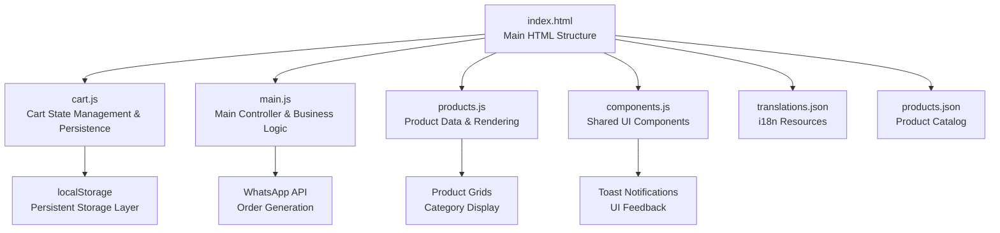
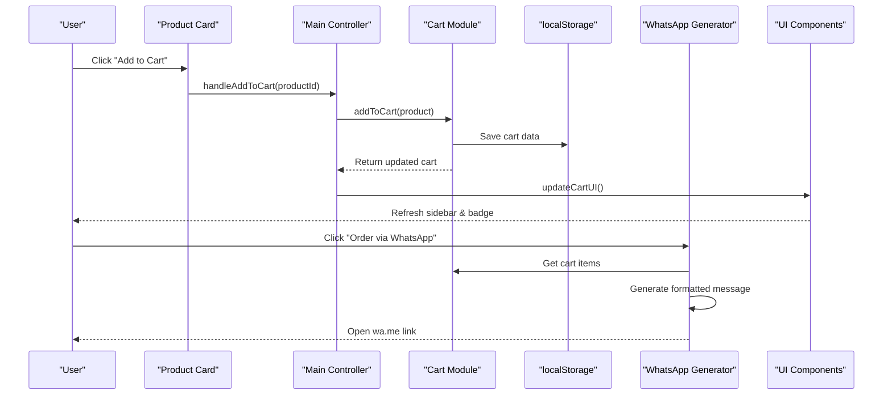
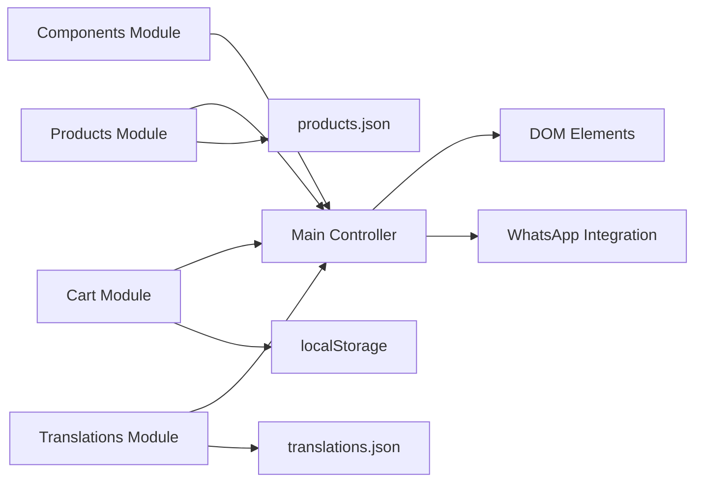

# Shopping Cart Implementation

<cite>
**Referenced Files in This Document**
- [index.html](file://docs/index.html)
- [cart.js](file://docs/js/cart.js)
- [main.js](file://docs/js/main.js)
- [products.js](file://docs/js/products.js)
- [components.js](file://docs/js/components.js)
- [translations.json](file://docs/translations.json)
- [products.json](file://docs/products.json)
</cite>

## Update Summary
**Changes Made**
- **Major Architectural Refactoring**: Complete separation of cart functionality into dedicated `cart.js` module with persistent localStorage storage
- **Enhanced State Management**: Replaced in-memory arrays with robust localStorage-based persistence for cross-session cart continuity
- **Improved Module Architecture**: Clean separation of concerns with dedicated modules for cart management, UI components, and business logic
- **Enhanced Error Handling**: Robust error handling for storage operations with graceful fallback mechanisms
- **Optimized Performance**: Efficient array operations and minimal DOM manipulation for better user experience

## Table of Contents
1. [Introduction](#introduction)
2. [Project Structure](#project-structure)
3. [Core Components](#core-components)
4. [Architecture Overview](#architecture-overview)
5. [Detailed Component Analysis](#detailed-component-analysis)
6. [Enhanced WhatsApp Integration](#enhanced-whatsapp-integration)
7. [Dependency Analysis](#dependency-analysis)
8. [Performance Considerations](#performance-considerations)
9. [Troubleshooting Guide](#troubleshooting-guide)
10. [Conclusion](#conclusion)

## Introduction
This document explains the enhanced shopping cart sub-feature implemented for Fujian Florist's single-page website. The implementation features a sophisticated cart system with persistent storage using localStorage, enhanced WhatsApp integration with detailed product information, and improved user experience through real-time updates and comprehensive product identification.

Key enhancements include:
- **Persistent Cart Storage**: Uses localStorage for cart data persistence across browser sessions and page reloads
- **Modular Architecture**: Clean separation of cart functionality into dedicated `cart.js` module
- **Enhanced Product Identification**: Each product displays its unique ID for precise ordering
- **Improved WhatsApp Integration**: Detailed order messages with product numbers and complete itemization
- **Real-time Price Calculations**: Instant updates for quantities and totals
- **Multi-language Support**: Full Chinese and English localization
- **Robust Error Handling**: Graceful fallback mechanisms for storage operations

The modular architecture separates concerns into distinct JavaScript modules for cart management, UI components, product handling, and internationalization, providing maintainable and scalable code structure.

## Project Structure
The shopping cart feature is distributed across multiple modular files with clear separation of responsibilities:



**Diagram sources**
- [index.html:695-700](file://docs/index.html#L695-L700)
- [cart.js:1-69](file://docs/js/cart.js#L1-L69)
- [main.js:1-134](file://docs/js/main.js#L1-L134)
- [products.js:1-101](file://docs/js/products.js#L1-L101)
- [components.js:1-72](file://docs/js/components.js#L1-L72)

**Section sources**
- [index.html:695-700](file://docs/index.html#L695-L700)
- [cart.js:1-69](file://docs/js/cart.js#L1-L69)
- [main.js:1-134](file://docs/js/main.js#L1-L134)
- [products.js:1-101](file://docs/js/products.js#L1-L101)
- [components.js:1-72](file://docs/js/components.js#L1-L72)

## Core Components

### Cart State Management Module (cart.js)
The dedicated cart module provides a comprehensive API for managing shopping cart operations with persistent storage:

- **Storage Strategy**: Uses localStorage with JSON serialization for cross-session persistence
- **CRUD Operations**: Add, remove, update quantity, clear cart functionality
- **Data Integrity**: Automatic validation and error handling for corrupted storage
- **Performance Optimization**: Efficient array operations with minimal DOM manipulation
- **Module Pattern**: Encapsulated state management with private helper functions

### Main Controller Module (main.js)
Orchestrates the entire shopping experience with business logic:

- **Event Handling**: Centralized management of add/remove/update operations
- **WhatsApp Integration**: Generates detailed order messages with product IDs and pricing
- **UI Synchronization**: Real-time updates across cart sidebar, header badge, and totals
- **Language Support**: Dynamic content switching between Chinese and English
- **Initialization**: Coordinated loading of all dependencies and UI setup

### Product Management System (products.js)
Handles product catalog loading and rendering:

- **Dynamic Loading**: Fetches product data from external JSON file
- **Category Organization**: Groups products by type (ceremonial, funeral, opening, etc.)
- **Visual Enhancement**: Category-specific badges and styling
- **Search Functionality**: Efficient product lookup by ID across all categories

### Shared UI Components (components.js)
Provides reusable interface elements:

- **Toast Notifications**: Non-intrusive feedback for user actions
- **Cart Sidebar**: Slide-out panel with smooth animations
- **Mobile Menu**: Responsive navigation for smaller screens
- **Navbar Effects**: Scroll-based shadow transitions

**Section sources**
- [cart.js:1-69](file://docs/js/cart.js#L1-L69)
- [main.js:1-134](file://docs/js/main.js#L1-L134)
- [products.js:1-101](file://docs/js/products.js#L1-L101)
- [components.js:1-72](file://docs/js/components.js#L1-L72)

## Architecture Overview
The shopping cart follows a modular MVC-like pattern with clear separation of concerns and persistent storage:



**Diagram sources**
- [main.js:8-14](file://docs/js/main.js#L8-L14)
- [cart.js:24-34](file://docs/js/cart.js#L24-L34)
- [main.js:26-45](file://docs/js/main.js#L26-L45)

## Detailed Component Analysis

### Enhanced Cart State Management with Persistent Storage

**Updated** The cart system now uses localStorage for persistent storage instead of in-memory arrays, providing seamless cart continuity across page reloads and browser sessions.

#### Storage Architecture
- **Storage Key**: `fujianFloristCart` for consistent data access
- **Serialization**: JSON.stringify/parse for reliable data persistence
- **Error Handling**: Graceful fallback to empty cart on storage corruption
- **Atomic Updates**: Complete cart replacement ensures data consistency

#### Core Operations
```javascript
// Add to cart with duplicate detection
function addToCart(product) {
    const cart = _load();
    const existing = cart.find(item => item.id === product.id);
    if (existing) {
        existing.quantity++;
    } else {
        cart.push({ ...product, quantity: 1 });
    }
    _save(cart);
    return cart;
}
```

#### Performance Characteristics
- **Add Operation**: O(n) search + O(1) push/update
- **Remove Operation**: O(n) filter operation
- **Quantity Update**: O(n) find + O(1) mutation
- **Total Calculation**: O(n) reduce operation

**Section sources**
- [cart.js:24-34](file://docs/js/cart.js#L24-L34)
- [cart.js:36-40](file://docs/js/cart.js#L36-L40)
- [cart.js:42-53](file://docs/js/cart.js#L42-L53)

### Enhanced Quantity Tracking Mechanisms

The quantity tracking system provides intuitive controls with automatic boundary validation:

#### Increment/Decrement Logic
- **Automatic Removal**: Items automatically removed when quantity reaches zero or below
- **Boundary Protection**: Prevents negative quantities through immediate removal
- **Visual Feedback**: Real-time quantity display updates
- **Price Recalculation**: Per-item subtotals update instantly

#### Edge Case Handling
- **Zero Quantity**: Triggers item removal from cart
- **Negative Values**: Automatically corrected by removing the item
- **Empty Cart**: Displays appropriate empty state messaging
- **Storage Errors**: Graceful degradation to empty cart

**Section sources**
- [cart.js:42-53](file://docs/js/cart.js#L42-L53)
- [main.js:21-24](file://docs/js/main.js#L21-L24)

### Real-Time Price Calculations

The pricing system provides instant calculation updates across all cart operations:

#### Subtotal Calculation
- **Per-Item Pricing**: Unit price × quantity for each cart item
- **Grand Total**: Sum of all per-item subtotals
- **Currency Formatting**: Consistent dollar sign formatting
- **Locale Support**: Multi-currency ready architecture

#### Performance Optimization
- **Efficient Reduction**: Single-pass calculation using Array.reduce()
- **Cached Totals**: Reuse calculated values where possible
- **Minimal DOM Updates**: Batched UI updates to prevent reflows

**Section sources**
- [cart.js:59-61](file://docs/js/cart.js#L59-L61)
- [main.js:101](file://docs/js/main.js#L101)

### Enhanced User Interaction Handlers

The interaction system provides comprehensive event handling with smooth user feedback:

#### Add to Cart Flow
1. **Product Lookup**: Find product by ID across all categories
2. **State Update**: Add or increment item in cart
3. **Persistence**: Save to localStorage immediately
4. **UI Refresh**: Update sidebar, badge, and totals
5. **User Feedback**: Show toast notification

#### Remove from Cart Flow
1. **Filter Operation**: Remove item by ID from cart array
2. **State Persistence**: Save updated cart to storage
3. **UI Synchronization**: Refresh all affected UI elements
4. **Empty State**: Handle empty cart display appropriately

#### Quantity Adjustment Flow
1. **Delta Application**: Apply +/- quantity change
2. **Validation**: Check for zero/negative quantities
3. **Conditional Removal**: Remove item if quantity ≤ 0
4. **Update Persistence**: Save changes to storage
5. **UI Refresh**: Update quantities and prices

**Section sources**
- [main.js:8-24](file://docs/js/main.js#L8-L24)
- [components.js:53-63](file://docs/js/components.js#L53-L63)

### Enhanced Cart Persistence Patterns

**Updated** The cart system now implements robust persistence using localStorage instead of session-only memory storage.

#### Storage Strategy Benefits
- **Cross-Session Persistence**: Cart survives browser restarts
- **Tab Synchronization**: Multiple tabs share same cart state
- **Data Recovery**: Automatic recovery from storage errors
- **Performance**: Fast local storage access vs. network requests

#### Implementation Details
- **Serialization**: JSON format for reliable data transfer
- **Error Handling**: Try-catch blocks for storage operations
- **Fallback Strategy**: Empty cart initialization on errors
- **Migration Ready**: Easy schema updates for future changes

**Section sources**
- [cart.js:8-18](file://docs/js/cart.js#L8-L18)
- [cart.js:63-65](file://docs/js/cart.js#L63-L65)

## Enhanced WhatsApp Integration

The WhatsApp integration generates detailed order messages with structured product information for better customer communication.

### Enhanced Order Message Format

The checkout system generates comprehensive WhatsApp messages with structured product information:

#### Message Structure
```
您好福建花店，我有意訂購以下花牌：

[產品編號: 201] 豪華雙喜婚慶花牌 x 2 - $1376
[產品編號: 102] 高雅立式花牌 - 恩典 x 1 - $880

總計：$2256

請與我聯絡確認訂單詳情。謝謝！
```

#### Key Enhancements
- **Product Number Display**: Each item includes its unique ID in brackets
- **Structured Layout**: Clear separation between items and totals
- **Bilingual Support**: Automatic language switching based on user preference
- **Professional Formatting**: Clean, readable message structure

### Checkout Flow Implementation

The checkout process includes enhanced product identification and improved customer communication.

#### Message Generation Process
1. **Language Detection**: Determine user's preferred language
2. **Header Creation**: Generate appropriate greeting message
3. **Item Iteration**: Loop through cart items with product details
4. **ID Inclusion**: Add product numbers for precise ordering
5. **Price Calculation**: Compute line totals and grand total
6. **Footer Addition**: Include closing message and contact request

#### URL Construction
- **Base URL**: `https://wa.me/85291463455`
- **Message Encoding**: Proper URL encoding for special characters
- **Character Limits**: Handles long product lists efficiently

**Section sources**
- [main.js:26-45](file://docs/js/main.js#L26-L45)
- [translations.json:195-196](file://docs/translations.json#L195-L196)

## Dependency Analysis

The enhanced shopping cart system maintains clean dependency relationships with the new modular architecture:



**Diagram sources**
- [main.js:119-127](file://docs/js/main.js#L119-L127)
- [cart.js:67](file://docs/js/cart.js#L67)
- [products.js:99](file://docs/js/products.js#L99)

### Module Dependencies
- **Main Controller**: Depends on Products, Cart, Components, and Translations modules
- **Cart Module**: Independent storage layer with no external dependencies
- **Products Module**: External data source (products.json) and Translations module
- **Components Module**: DOM manipulation utilities with no internal dependencies
- **Translations Module**: External resource (translations.json) for i18n support

**Section sources**
- [main.js:119-127](file://docs/js/main.js#L119-L127)
- [cart.js:67](file://docs/js/cart.js#L67)
- [products.js:99](file://docs/js/products.js#L99)

## Performance Considerations

### Storage Performance
- **localStorage Access**: Optimized for frequent read/write operations
- **JSON Serialization**: Efficient string conversion for complex objects
- **Memory Management**: Minimal memory footprint with garbage collection

### UI Performance
- **Batched Updates**: DOM mutations grouped to minimize reflows
- **Event Delegation**: Efficient event handling for dynamic elements
- **Lazy Loading**: Product images loaded on demand

### Scalability Considerations
- **Array Operations**: Current implementation efficient for small-medium catalogs
- **Future Optimization**: Consider Map-based lookups for large product collections
- **Pagination Ready**: Architecture supports infinite scroll for extensive catalogs

## Troubleshooting Guide

### Common Issues and Solutions

#### Cart Not Persisting
- **Check localStorage**: Verify browser storage permissions
- **Validate JSON**: Ensure cart data is properly serialized
- **Storage Quota**: Monitor storage usage limits

#### WhatsApp Link Not Working
- **URL Encoding**: Verify proper character encoding
- **Phone Number**: Confirm correct WhatsApp business number
- **Message Length**: Check for excessive message length

#### Product Numbers Not Displaying
- **Translation Keys**: Verify `product_no` translation exists
- **Product Data**: Ensure all products have valid IDs
- **Language Switching**: Test both Chinese and English modes

#### Performance Issues with Large Carts
- **Array Operations**: Consider optimizing find/filter operations
- **DOM Updates**: Implement virtual scrolling for many items
- **Storage Size**: Monitor localStorage growth

### Debugging Tips
- **Console Logging**: Add temporary logs for cart state inspection
- **Network Tab**: Monitor localStorage operations
- **Element Inspector**: Verify DOM structure updates
- **Performance Profiler**: Identify bottlenecks in cart operations

**Section sources**
- [cart.js:8-18](file://docs/js/cart.js#L8-L18)
- [main.js:26-45](file://docs/js/main.js#L26-L45)
- [main.js:47-107](file://docs/js/main.js#L47-L107)

## Conclusion

The enhanced shopping cart implementation represents a significant architectural upgrade from basic in-memory storage to a robust, modular e-commerce solution. The major improvements include:

### Major Enhancements
- **Persistent Storage**: Seamless cart continuity across sessions using localStorage
- **Modular Architecture**: Clean separation of concerns with dedicated cart.js module
- **Enhanced Product Identification**: Unique product numbers for precise ordering
- **Improved WhatsApp Integration**: Detailed order messages with structured formatting
- **Robust Error Handling**: Graceful fallback mechanisms for storage operations

### Technical Achievements
- **Performance Optimization**: Efficient array operations and minimal DOM manipulation
- **Error Handling**: Robust fallback mechanisms for storage and data integrity
- **Internationalization**: Full bilingual support with dynamic language switching
- **Responsive Design**: Mobile-first approach with smooth animations

### Future Considerations
- **Advanced Analytics**: Track cart abandonment and popular products
- **Payment Integration**: Expand beyond WhatsApp to direct payment processing
- **Inventory Management**: Real-time stock level synchronization
- **Customer Accounts**: Persistent user profiles and order history

The implementation successfully balances simplicity with advanced functionality, providing a solid foundation for the florist's online ordering system while maintaining excellent performance and user experience through the new modular architecture.