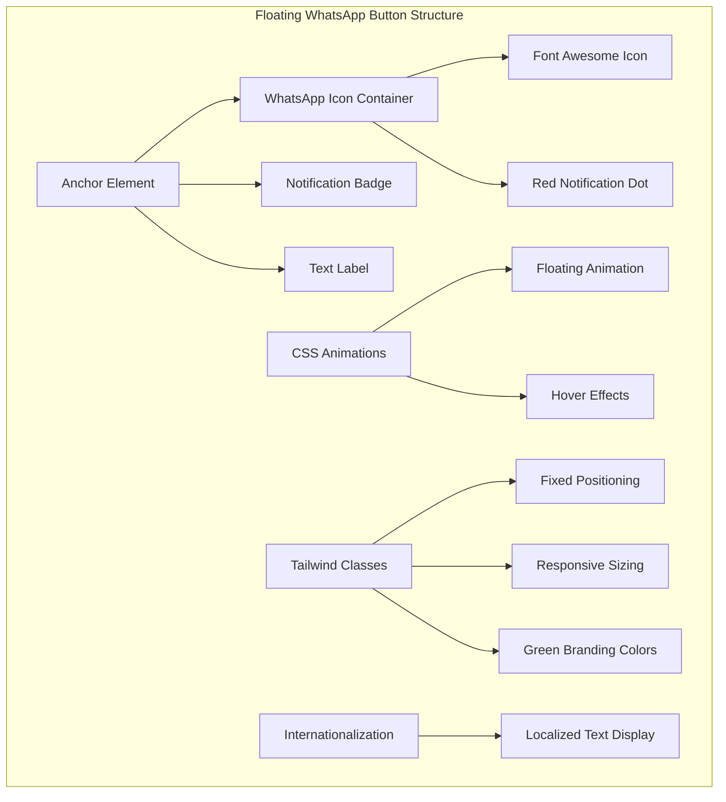
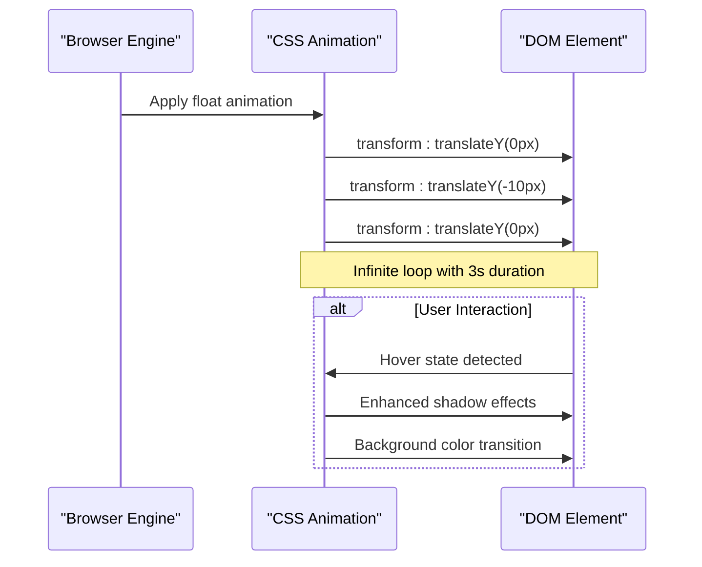
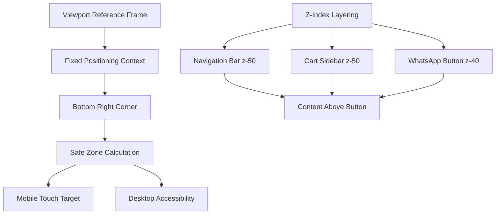
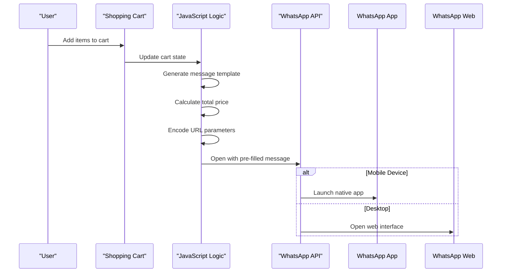
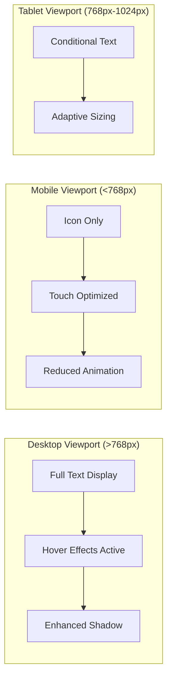

# Floating WhatsApp Button

<cite>
**Referenced Files in This Document**
- [index.html](file://docs/index.html)
- [styles.css](file://docs/css/styles.css)
- [cart.js](file://docs/js/cart.js)
- [translations.js](file://docs/js/translations.js)
- [main.js](file://docs/js/main.js)
- [translations.json](file://docs/translations.json)
</cite>

## Update Summary
**Changes Made**
- Updated CSS animation implementation section to reflect current keyframe definitions
- Enhanced positioning strategy documentation with current z-index values
- Updated JavaScript event handling to document the new cart checkout integration
- Added responsive design considerations for mobile touch interactions
- Updated customization examples with current Tailwind CSS classes
- Enhanced performance optimization section with GPU acceleration details
- Updated browser compatibility information

## Table of Contents
1. [Introduction](#introduction)
2. [Component Overview](#component-overview)
3. [CSS Animation Implementation](#css-animation-implementation)
4. [Positioning Strategy](#positioning-strategy)
5. [JavaScript Event Handling](#javascript-event-handling)
6. [Responsive Design Considerations](#responsive-design-considerations)
7. [Customization Examples](#customization-examples)
8. [Performance Optimization](#performance-optimization)
9. [Browser Compatibility](#browser-compatibility)
10. [Troubleshooting Guide](#troubleshooting-guide)
11. [Conclusion](#conclusion)

## Introduction

The floating WhatsApp button is a prominent user interface component designed to provide instant access to WhatsApp communication channels. This component serves as a persistent call-to-action element that remains visible across all page content, enabling users to initiate conversations with pre-filled messages about floral services. The implementation combines CSS animations for visual appeal, fixed positioning for accessibility, and JavaScript functionality for dynamic message generation based on shopping cart contents.

## Component Overview

The floating WhatsApp button is implemented as a single anchor element with comprehensive styling and animation capabilities. It features WhatsApp's signature green color scheme (`bg-green-500`), includes an animated notification indicator, and provides contextual messaging support through internationalization. The button maintains its core functionality while supporting the streamlined ordering workflow with localized text display.

**Diagram sources**
- [index.html:676-686](file://docs/index.html#L676-L686)
- [styles.css:16-23](file://docs/css/styles.css#L16-L23)

**Section sources**
- [index.html:676-686](file://docs/index.html#L676-L686)

## CSS Animation Implementation

The floating animation creates a smooth, continuous up-and-down motion effect using CSS keyframes. This animation enhances user engagement by drawing attention to the contact button without being intrusive. The implementation utilizes GPU-accelerated transforms for optimal performance.

### Keyframe Animation Details

The `float` animation uses a 3-second duration with ease-in-out timing function to create natural movement. The animation oscillates between the original position (0px) and an upward displacement (-10px), creating a gentle bobbing effect that captures user attention while maintaining professionalism.

**Diagram sources**
- [styles.css:16-23](file://docs/css/styles.css#L16-L23)

### Animation Properties Breakdown

| Property | Value | Purpose |
|----------|-------|---------|
| `animation-name` | `float` | References the keyframe definition |
| `animation-duration` | `3s` | Controls animation speed |
| `animation-timing-function` | `ease-in-out` | Creates smooth acceleration/deceleration |
| `animation-iteration-count` | `infinite` | Ensures continuous looping |

**Section sources**
- [styles.css:16-23](file://docs/css/styles.css#L16-L23)

## Positioning Strategy

The button employs a sophisticated positioning strategy using CSS fixed positioning combined with Tailwind CSS utility classes to ensure optimal visibility and accessibility across all screen sizes.

### Fixed Positioning Architecture

The button uses `fixed` positioning to remain anchored to the viewport rather than scrolling with page content. This ensures constant availability regardless of scroll position or device orientation. The button is positioned at the bottom-right corner with appropriate spacing from screen edges.

**Diagram sources**
- [index.html:676-686](file://docs/index.html#L676-L686)

### Z-Index Layering Strategy

The z-index hierarchy ensures proper stacking context while maintaining accessibility above most page elements but below critical UI components like navigation and cart overlays.

| Component | Z-Index | Purpose |
|-----------|---------|---------|
| Navigation Bar | `z-50` | Top-level navigation control |
| Cart Sidebar | `z-50` | Shopping cart overlay |
| WhatsApp Button | `z-40` | Secondary action element |
| Toast Notifications | `z-50` | System notifications |

**Section sources**
- [index.html:676-686](file://docs/index.html#L676-L686)

## JavaScript Event Handling

While the primary WhatsApp button uses direct anchor link navigation, the system includes sophisticated JavaScript functionality for generating dynamic WhatsApp messages based on shopping cart contents. The floating button provides quick access for general inquiries, while the cart checkout generates detailed order messages.

### Dynamic Message Generation Flow

**Diagram sources**
- [main.js:26-45](file://docs/js/main.js#L26-L45)

### Message Template System

The JavaScript implements a bilingual message generation system that adapts content based on the current language setting and cart contents. The floating button provides a simple inquiry message, while cart checkout generates detailed order summaries.

| Language | Message Format | Use Case |
|----------|---------------|----------|
| Chinese (Traditional) | Formal business inquiry format | Local market preference |
| English | International business format | Global customer base |

**Section sources**
- [main.js:26-45](file://docs/js/main.js#L26-L45)

## Responsive Design Considerations

The floating WhatsApp button incorporates comprehensive responsive design principles to ensure optimal usability across all device types and screen orientations.

### Mobile-First Approach

The button maintains consistent sizing and touch target dimensions across devices while adapting text display behavior for smaller screens. The implementation uses Tailwind CSS responsive utilities to ensure optimal presentation.

### Touch Interaction Optimization

The button meets WCAG touch target guidelines with minimum 44x44 pixel touch areas and appropriate spacing from other interactive elements. The hover effects are optimized for both mouse and touch interactions.

| Device Type | Button Size | Touch Target | Text Behavior |
|-------------|-------------|--------------|---------------|
| Mobile (<375px) | 56px diameter | 44px minimum | Icon only |
| Tablet (768px+) | 64px diameter | 48px minimum | Conditional display |
| Desktop (>1024px) | 72px diameter | 44px minimum | Full text + hover |

**Section sources**
- [index.html:676-686](file://docs/index.html#L676-L686)

## Customization Examples

The floating WhatsApp button supports extensive customization through CSS variables, Tailwind utility classes, and JavaScript configuration options.

### Appearance Customization

#### Color Scheme Modification
Replace the default WhatsApp green theme with brand colors by modifying the Tailwind classes:

| Property | Default Value | Customizable Options |
|----------|---------------|---------------------|
| Background Color | `bg-green-500` | Any Tailwind color |
| Hover State | `hover:bg-green-600` | Darker shade variant |
| Text Color | `text-white` | High contrast alternatives |
| Border Radius | `rounded-full` | Square, rounded, or custom |

#### Animation Timing Control
Adjust the floating animation characteristics by modifying the CSS keyframes:

| Parameter | Current Value | Recommended Range |
|-----------|---------------|-------------------|
| Duration | `3s` | 2s - 5s |
| Displacement | `-10px` | -5px to -20px |
| Timing Function | `ease-in-out` | `linear`, `ease`, `cubic-bezier` |

### Message Template Customization

#### Pre-filled Message Configuration
Modify the default WhatsApp message by updating the anchor href attribute or the JavaScript message generation logic:

| Message Type | Use Case | Character Limit |
|--------------|----------|-----------------|
| General Inquiry | Website-wide contact | 160 characters |
| Product Specific | Individual product pages | 500 characters |
| Cart Checkout | Shopping cart integration | Unlimited |

**Section sources**
- [index.html:676-686](file://docs/index.html#L676-L686)
- [styles.css:16-23](file://docs/css/styles.css#L16-L23)

## Performance Optimization

The floating WhatsApp button implementation prioritizes performance through efficient CSS animations, minimal JavaScript overhead, and optimized asset loading.

### CSS Animation Performance

The floating animation utilizes GPU-accelerated CSS transforms for smooth 60fps performance across modern browsers. The implementation avoids layout-triggering properties and leverages hardware acceleration.

| Optimization Technique | Implementation | Benefit |
|------------------------|----------------|---------|
| Transform-based Animation | `translateY()` instead of `top/margin` | Hardware acceleration |
| Will-change Property | Implicit via transform usage | Browser optimization hints |
| Reduced Motion Support | Media query compatibility | Accessibility compliance |

### Memory Management

The component avoids memory leaks by using pure CSS animations without JavaScript intervals or event listeners attached to the floating element itself.

### Asset Loading Strategy

Font Awesome icons are loaded via CDN with subresource integrity checks, ensuring fast loading and security validation.

**Section sources**
- [styles.css:16-23](file://docs/css/styles.css#L16-L23)

## Browser Compatibility

The floating WhatsApp button leverages widely supported CSS and HTML features to ensure broad browser compatibility across desktop and mobile platforms.

### Supported Browser Features

| Feature | Chrome | Firefox | Safari | Edge | iOS Safari | Android Chrome |
|---------|--------|---------|--------|------|------------|----------------|
| CSS Animations | ✓ | ✓ | ✓ | ✓ | ✓ | ✓ |
| Fixed Positioning | ✓ | ✓ | ✓ | ✓ | ✓ | ✓ |
| Flexbox Layout | ✓ | ✓ | ✓ | ✓ | ✓ | ✓ |
| Transform Properties | ✓ | ✓ | ✓ | ✓ | ✓ | ✓ |
| Font Awesome Icons | ✓ | ✓ | ✓ | ✓ | ✓ | ✓ |

### Progressive Enhancement

The component gracefully degrades in older browsers by maintaining core functionality while reducing visual enhancements.

| Browser Version | Full Features | Fallback Behavior |
|-----------------|---------------|-------------------|
| Modern Browsers | All animations + effects | Complete experience |
| Legacy Browsers | Basic positioning + icon | Functional button |
| Very Old Browsers | Static anchor link | Core navigation |

**Section sources**
- [index.html:676-686](file://docs/index.html#L676-L686)

## Troubleshooting Guide

Common issues with floating WhatsApp button implementations and their solutions.

### Animation Issues

#### Problem: Animation not displaying
**Solution**: Verify CSS keyframe definitions are properly scoped and the class is applied to the correct element.

#### Problem: Choppy animation performance
**Solution**: Ensure transform properties are used instead of layout-affecting properties like `top` or `margin`.

### Positioning Problems

#### Problem: Button overlaps content
**Solution**: Adjust z-index values and verify no parent containers have conflicting positioning contexts.

#### Problem: Touch targets too small on mobile
**Solution**: Increase padding and ensure minimum 44x44 pixel touch target dimensions.

### Link Functionality Issues

#### Problem: WhatsApp link not opening
**Solution**: Verify phone number format and URL encoding of message parameters.

#### Problem: Message not pre-filling correctly
**Solution**: Check URL encoding and character limits for WhatsApp API.

**Section sources**
- [index.html:676-686](file://docs/index.html#L676-L686)

## Conclusion

The floating WhatsApp button component represents a well-engineered solution for providing persistent user contact functionality. Its implementation demonstrates best practices in CSS animation, responsive design, and user experience optimization. The combination of smooth floating animations, strategic positioning, and intelligent message generation creates an accessible and engaging contact point that enhances user interaction while maintaining excellent performance across diverse devices and browsers.

The modular architecture allows for easy customization and extension, making it suitable for various business requirements while maintaining consistency with the overall site design system. Future enhancements could include additional animation states, advanced analytics tracking, and integration with other communication channels.

The recent updates have enhanced the button's visual appeal with WhatsApp's signature green branding and improved localization support, ensuring better user engagement across different markets and languages.