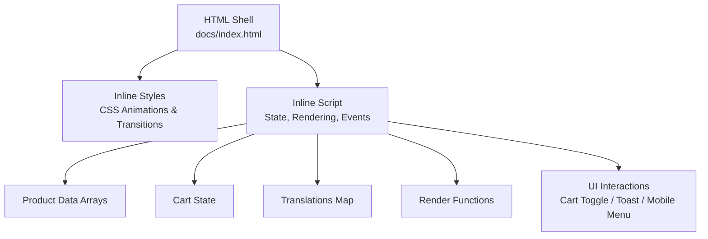
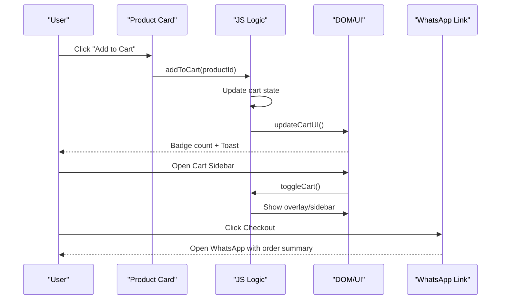
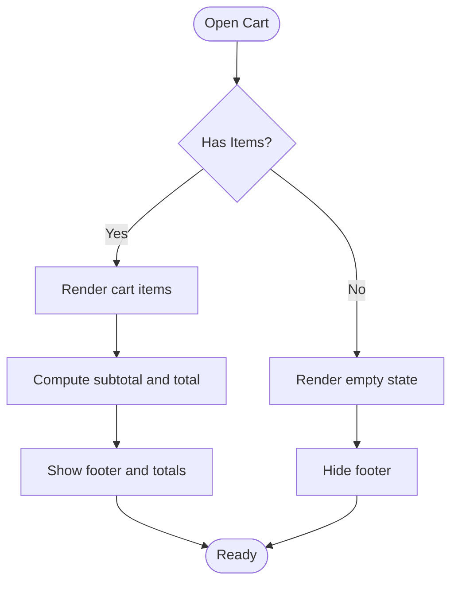
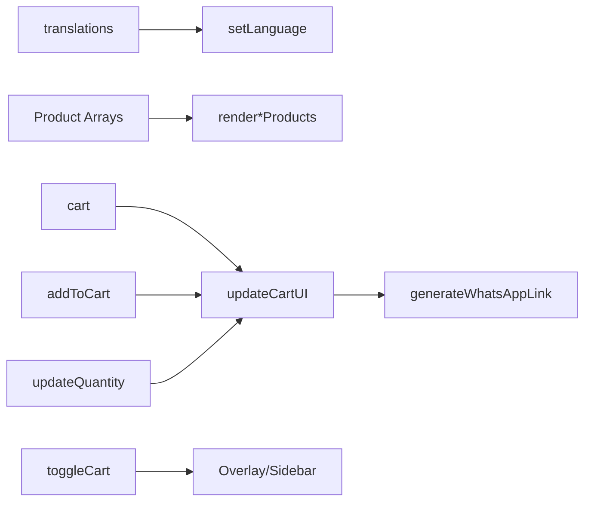

# Interactive Elements

<cite>
**Referenced Files in This Document**
- [index.html](file://docs/index.html)
</cite>

## Table of Contents
1. [Introduction](#introduction)
2. [Project Structure](#project-structure)
3. [Core Components](#core-components)
4. [Architecture Overview](#architecture-overview)
5. [Detailed Component Analysis](#detailed-component-analysis)
6. [Dependency Analysis](#dependency-analysis)
7. [Performance Considerations](#performance-considerations)
8. [Troubleshooting Guide](#troubleshooting-guide)
9. [Conclusion](#conclusion)

## Introduction
This document explains the interactive UI elements and animations implemented in the site, focusing on:
- Floating WhatsApp button with animation
- Shopping cart sidebar with slide-in effects
- Language switching buttons
- Quantity controls
It also documents CSS animations (float keyframes, slide-in transitions, fade-in), JavaScript event handling, state management for cart operations, dynamic content updates, touch device compatibility, and performance considerations.

## Project Structure
The project is a single-page site with all HTML, CSS, and JavaScript contained in one file. The structure includes:
- Inline Tailwind configuration and custom styles
- Product sections rendered dynamically
- A floating WhatsApp CTA
- A slide-in shopping cart sidebar
- Language switcher and toast notifications

**Diagram sources**
- [index.html:1-209](file://docs/index.html#L1-L209)
- [index.html:881-1589](file://docs/index.html#L881-L1589)

**Section sources**
- [index.html:1-209](file://docs/index.html#L1-L209)
- [index.html:881-1589](file://docs/index.html#L881-L1589)

## Core Components
- Floating WhatsApp Button: Fixed-position CTA with hover expansion and float animation.
- Shopping Cart Sidebar: Slide-in panel with overlay, item list, quantity controls, totals, and checkout via WhatsApp.
- Language Switching Buttons: Toggles between Traditional Chinese and English, updating text and product labels.
- Quantity Controls: Increment/decrement buttons within cart items that update state and totals.

Key responsibilities:
- CSS defines animations and transitions for smooth UX.
- JavaScript manages state (cart, language), renders DOM, and wires up events.

**Section sources**
- [index.html:58-153](file://docs/index.html#L58-L153)
- [index.html:813-879](file://docs/index.html#L813-L879)
- [index.html:881-1589](file://docs/index.html#L881-L1589)

## Architecture Overview
High-level flow of interactions:
- User clicks “Add to Cart” on a product card → addToCart updates state → updateCartUI re-renders cart and badge → showToast confirms action.
- User opens cart → toggleCart shows sidebar and overlay; body scroll locked.
- User changes language → setLanguage updates i18n text and re-renders products and cart.
- User adjusts quantity → updateQuantity modifies state and refreshes UI.

**Diagram sources**
- [index.html:1446-1459](file://docs/index.html#L1446-L1459)
- [index.html:1496-1553](file://docs/index.html#L1496-L1553)
- [index.html:1555-1568](file://docs/index.html#L1555-L1568)
- [index.html:1478-1494](file://docs/index.html#L1478-L1494)

## Detailed Component Analysis

### Floating WhatsApp Button
Behavior:
- Fixed bottom-right position with z-index above most content.
- Hover expands label text from hidden to visible.
- Continuous vertical float animation draws attention.

Animation details:
- Float keyframes animate translateY over 3s infinite ease-in-out.
- Group hover transition animates max-width and opacity for the label.

Accessibility and UX:
- Uses external link with rel="noopener noreferrer".
- Provides clear call-to-action with icon and label.

Implementation references:
- CSS class and keyframes for float animation.
- Anchor element with group hover behavior.

**Section sources**
- [index.html:58-72](file://docs/index.html#L58-L72)
- [index.html:862-872](file://docs/index.html#L862-L872)

### Shopping Cart Sidebar
Behavior:
- Overlay covers viewport when open; clicking overlay closes it.
- Sidebar slides in from right using transform translateX and transition.
- Body scroll is disabled while sidebar is open.

State and rendering:
- Cart array holds items with id, name, price, description, image, quantity.
- updateCartUI computes totals, toggles visibility of footer, and builds item rows.
- Empty state shows placeholder and “Start Shopping” action.

Checkout:
- Generates a WhatsApp message including product names, quantities, and total.
- Updates href of checkout link dynamically.

Interaction flow:
- Toggle cart open/close via toggleCart.
- Add/remove items and adjust quantities via dedicated functions.

**Diagram sources**
- [index.html:1496-1553](file://docs/index.html#L1496-L1553)

**Section sources**
- [index.html:813-860](file://docs/index.html#L813-L860)
- [index.html:1446-1476](file://docs/index.html#L1446-L1476)
- [index.html:1478-1494](file://docs/index.html#L1478-L1494)
- [index.html:1496-1568](file://docs/index.html#L1496-L1568)

### Language Switching Buttons
Behavior:
- Two buttons (繁/EN) toggle active state based on current language.
- setLanguage updates document lang attribute and replaces all localized text.
- Re-renders product grids and cart UI after language change.

Data model:
- translations object contains zh and en keys for each i18n string.
- Elements use data-i18n attributes to bind text.

Implementation references:
- Button click handlers inline in markup.
- setLanguage function updates DOM and re-renders.

**Section sources**
- [index.html:248-253](file://docs/index.html#L248-L253)
- [index.html:882-1075](file://docs/index.html#L882-L1075)
- [index.html:1353-1374](file://docs/index.html#L1353-L1374)

### Quantity Controls
Behavior:
- Each cart item has increment (+) and decrement (-) buttons.
- updateQuantity increases or decreases item quantity.
- If quantity drops to zero or below, item is removed from cart.

State updates:
- updateQuantity calls removeFromCart if needed.
- updateCartUI recalculates totals and re-renders item row.

Implementation references:
- Quantity buttons are injected into cart item template.
- Event handlers call updateQuantity with productId and delta.

**Section sources**
- [index.html:1466-1476](file://docs/index.html#L1466-L1476)
- [index.html:1523-1544](file://docs/index.html#L1523-L1544)

### CSS Animations and Transitions
Animations:
- Float: continuous vertical movement for the WhatsApp button.
- Fade-in: entrance effect for product cards with staggered delays.
- Slide-in right: entrance effect for new cart items.

Transitions:
- Product card hover: lift and image scale.
- Category pills and language buttons: background and color transitions.
- Quantity buttons: hover color transitions.

Implementation references:
- Keyframes and classes defined in inline style block.
- Utility classes from Tailwind used alongside custom styles.

**Section sources**
- [index.html:58-153](file://docs/index.html#L58-L153)
- [index.html:1376-1404](file://docs/index.html#L1376-L1404)

### Toast Notification
Behavior:
- Shows a brief confirmation message at the bottom center.
- Animated entry and exit using opacity and transform.
- Auto-dismisses after a timeout.

Implementation references:
- Toast container and message element IDs.
- showToast toggles classes and sets timeout.

**Section sources**
- [index.html:874-879](file://docs/index.html#L874-L879)
- [index.html:1575-1585](file://docs/index.html#L1575-L1585)

## Dependency Analysis
- DOM dependencies:
  - Navbar, cart overlay/sidebar, cart items container, cart footer, cart count badge, mobile menu, toast container.
- Data dependencies:
  - Product arrays drive render functions.
  - translations map drives i18n updates.
  - cart array drives cart UI and totals.
- Function dependencies:
  - setLanguage depends on translations and render functions.
  - addToCart depends on product arrays and updateCartUI.
  - updateCartUI depends on cart state and generates WhatsApp link.

**Diagram sources**
- [index.html:882-1075](file://docs/index.html#L882-L1075)
- [index.html:1332-1351](file://docs/index.html#L1332-L1351)
- [index.html:1446-1476](file://docs/index.html#L1446-L1476)
- [index.html:1478-1494](file://docs/index.html#L1478-L1494)
- [index.html:1496-1568](file://docs/index.html#L1496-L1568)

**Section sources**
- [index.html:882-1075](file://docs/index.html#L882-L1075)
- [index.html:1332-1351](file://docs/index.html#L1332-L1351)
- [index.html:1446-1476](file://docs/index.html#L1446-L1476)
- [index.html:1478-1494](file://docs/index.html#L1478-L1494)
- [index.html:1496-1568](file://docs/index.html#L1496-L1568)

## Performance Considerations
- Use transform and opacity for animations to leverage GPU acceleration and avoid layout thrashing.
- Keep animation durations moderate (e.g., 0.3–0.6s) and easing curves smooth for perceived responsiveness.
- Avoid heavy DOM mutations inside frequent events; batch updates where possible.
- For large lists, consider virtualization or pagination; currently, product counts are small enough for direct rendering.
- Debounce scroll listeners if adding more complex logic; current navbar shadow toggle is lightweight.
- Prefer requestAnimationFrame for custom animations if extending beyond CSS.
- Ensure images are optimized and use appropriate sizes to prevent jank during initial load.

[No sources needed since this section provides general guidance]

## Troubleshooting Guide
Common issues and resolutions:
- Cart not opening/closing:
  - Verify overlay and sidebar IDs exist and classes are toggled correctly.
  - Ensure body overflow is managed when toggling.
- Cart count badge not updating:
  - Confirm updateCartUI runs after cart state changes.
  - Check that totalItems calculation includes quantities.
- Language not changing:
  - Ensure data-i18n attributes match keys in translations.
  - Confirm setLanguage is called and re-renders product grids.
- Quantity buttons not working:
  - Validate that onclick handlers pass correct productId and delta.
  - Ensure updateQuantity handles edge cases (quantity <= 0).
- WhatsApp link incorrect:
  - Check generateWhatsAppLink encodes message properly and uses correct phone number.
- Toast not appearing:
  - Verify toast container exists and classes are toggled correctly.
  - Ensure setTimeout clears previous timers if rapid actions occur.

**Section sources**
- [index.html:1496-1568](file://docs/index.html#L1496-L1568)
- [index.html:1575-1585](file://docs/index.html#L1575-L1585)
- [index.html:1353-1374](file://docs/index.html#L1353-L1374)
- [index.html:1478-1494](file://docs/index.html#L1478-L1494)

## Conclusion
The site implements a cohesive set of interactive features with smooth animations and responsive design. The floating WhatsApp button, slide-in cart, language switcher, and quantity controls provide an intuitive user experience. The implementation leverages CSS animations and transitions for performance and clarity, while JavaScript manages state and DOM updates efficiently. Following the recommendations here will help maintain accessibility, responsiveness, and performance across devices.

[No sources needed since this section summarizes without analyzing specific files]