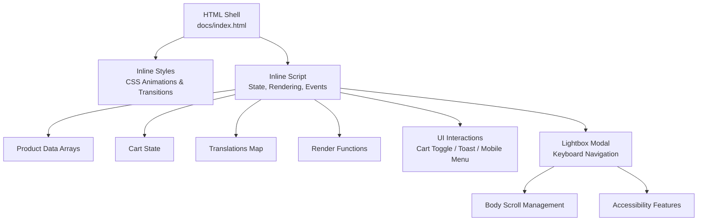
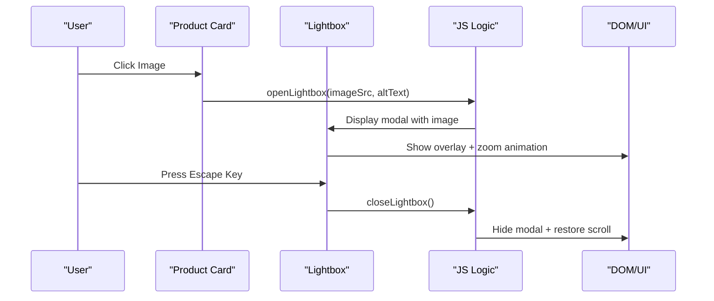
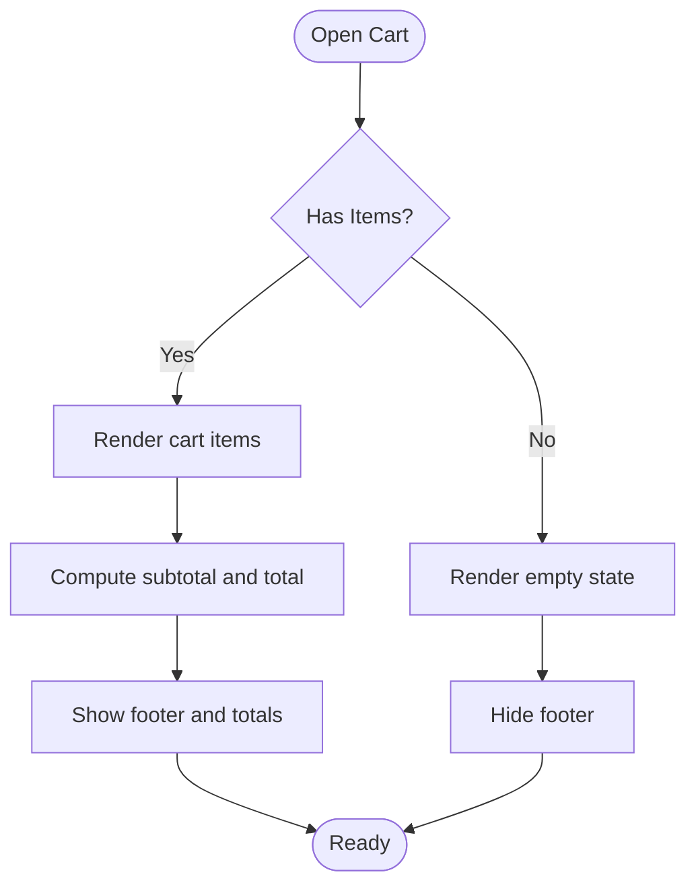
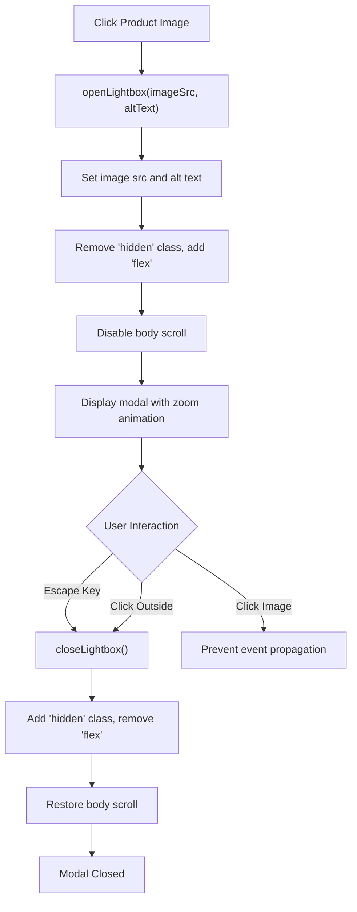
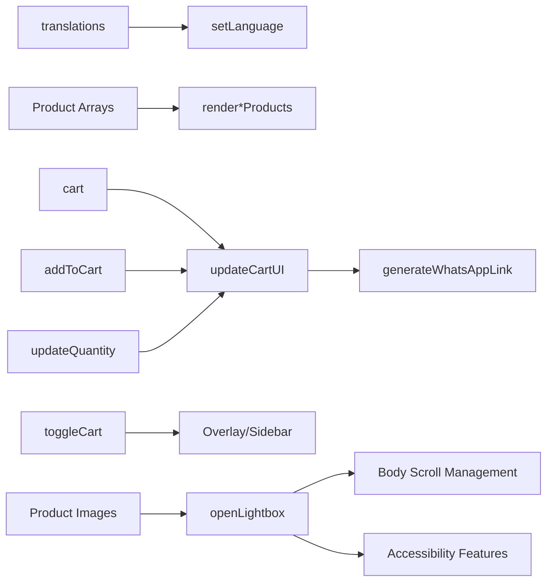

# Interactive Elements

<cite>
**Referenced Files in This Document**
- [index.html](file://docs/index.html)
- [main.js](file://docs/js/main.js)
- [components.js](file://docs/js/components.js)
- [products.js](file://docs/js/products.js)
- [styles.css](file://docs/css/styles.css)
</cite>

## Update Summary
**Changes Made**
- Added comprehensive documentation for the new image lightbox modal with keyboard navigation support
- Updated architecture overview to include lightbox functionality
- Enhanced component analysis with lightbox implementation details
- Added accessibility considerations for keyboard navigation and body scroll management
- Updated troubleshooting guide with lightbox-specific issues

## Table of Contents
1. [Introduction](#introduction)
2. [Project Structure](#project-structure)
3. [Core Components](#core-components)
4. [Architecture Overview](#architecture-overview)
5. [Detailed Component Analysis](#detailed-component-analysis)
6. [Dependency Analysis](#dependency-analysis)
7. [Performance Considerations](#performance-considerations)
8. [Troubleshooting Guide](#troubleshooting-guide)
9. [Conclusion](#conclusion)

## Introduction
This document explains the interactive UI elements and animations implemented in the site, focusing on:
- Floating WhatsApp button with animation
- Shopping cart sidebar with slide-in effects
- Language switching buttons
- Quantity controls
- **Image lightbox modal with keyboard navigation support**

It also documents CSS animations (float keyframes, slide-in transitions, fade-in), JavaScript event handling, state management for cart operations, dynamic content updates, touch device compatibility, and performance considerations.

## Project Structure
The project is a single-page site with all HTML, CSS, and JavaScript contained in one file. The structure includes:
- Inline Tailwind configuration and custom styles
- Product sections rendered dynamically
- A floating WhatsApp CTA
- A slide-in shopping cart sidebar
- Language switcher and toast notifications
- **Image lightbox modal for enhanced image viewing experience**

```mermaid
graph TB
A["HTML Shell<br/>docs/index.html"] --> B["Inline Styles<br/>CSS Animations & Transitions"]
A --> C["Inline Script<br/>State, Rendering, Events"]
C --> D["Product Data Arrays"]
C --> E["Cart State"]
C --> F["Translations Map"]
C --> G["Render Functions"]
C --> H["UI Interactions<br/>Cart Toggle / Toast / Mobile Menu"]
C --> I["Lightbox Modal<br/>Keyboard Navigation"]
I --> J["Body Scroll Management"]
I --> K["Accessibility Features"]
```

**Diagram sources**
- [index.html:1-702](file://docs/index.html#L1-L702)
- [components.js:65-92](file://docs/js/components.js#L65-L92)

**Section sources**
- [index.html:1-702](file://docs/index.html#L1-L702)
- [components.js:65-92](file://docs/js/components.js#L65-L92)

## Core Components
- Floating WhatsApp Button: Fixed-position CTA with hover expansion and float animation.
- Shopping Cart Sidebar: Slide-in panel with overlay, item list, quantity controls, totals, and checkout via WhatsApp.
- Language Switching Buttons: Toggles between Traditional Chinese and English, updating text and product labels.
- Quantity Controls: Increment/decrement buttons within cart items that update state and totals.
- **Image Lightbox Modal: Full-screen image viewer with keyboard navigation, backdrop blur, and smooth animations.**

Key responsibilities:
- CSS defines animations and transitions for smooth UX.
- JavaScript manages state (cart, language), renders DOM, and wires up events.
- **Lightbox handles image display, keyboard interactions, and accessibility features.**

**Section sources**
- [index.html:665-691](file://docs/index.html#L665-L691)
- [components.js:65-92](file://docs/js/components.js#L65-L92)
- [products.js:61](file://docs/js/products.js#L61)

## Architecture Overview
High-level flow of interactions:
- User clicks "Add to Cart" on a product card → addToCart updates state → updateCartUI re-renders cart and badge → showToast confirms action.
- User opens cart → toggleCart shows sidebar and overlay; body scroll locked.
- User changes language → setLanguage updates i18n text and re-renders products and cart.
- User adjusts quantity → updateQuantity modifies state and refreshes UI.
- **User clicks product image → openLightbox displays full-size image with caption; Escape key closes modal.**

```mermaid
sequenceDiagram
participant U as "User"
participant P as "Product Card"
participant L as "Lightbox"
participant JS as "JS Logic"
participant UI as "DOM/UI"
U->>P : Click Image
P->>JS : openLightbox(imageSrc, altText)
JS->>L : Display modal with image
L->>UI : Show overlay + zoom animation
U->>L : Press Escape Key
L->>JS : closeLightbox()
JS->>UI : Hide modal + restore scroll
```

**Diagram sources**
- [products.js:61](file://docs/js/products.js#L61)
- [components.js:65-92](file://docs/js/components.js#L65-L92)

## Detailed Component Analysis

### Floating WhatsApp Button
Behavior:
- Fixed bottom-right position with z-index above most content.
- Hover expands label text from hidden to visible.
- Continuous vertical float animation draws attention.

Animation details:
- Float keyframes animate translateY over 3s infinite ease-in-out.
- Group hover transition animates max-width and opacity for the label.

Accessibility and UX:
- Uses external link with rel="noopener noreferrer".
- Provides clear call-to-action with icon and label.

Implementation references:
- CSS class and keyframes for float animation.
- Anchor element with group hover behavior.

**Section sources**
- [index.html:665-675](file://docs/index.html#L665-L675)
- [styles.css:16-23](file://docs/css/styles.css#L16-L23)

### Shopping Cart Sidebar
Behavior:
- Overlay covers viewport when open; clicking overlay closes it.
- Sidebar slides in from right using transform translateX and transition.
- Body scroll is disabled while sidebar is open.

State and rendering:
- Cart array holds items with id, name, price, description, image, quantity.
- updateCartUI computes totals, toggles visibility of footer, and builds item rows.
- Empty state shows placeholder and "Start Shopping" action.

Checkout:
- Generates a WhatsApp message including product names, quantities, and total.
- Updates href of checkout link dynamically.

Interaction flow:
- Toggle cart open/close via toggleCart.
- Add/remove items and adjust quantities via dedicated functions.

```mermaid
flowchart TD
Start(["Open Cart"]) --> CheckItems{"Has Items?"}
CheckItems --> |No| RenderEmpty["Render empty state"]
CheckItems --> |Yes| RenderList["Render cart items"]
RenderList --> ComputeTotals["Compute subtotal and total"]
ComputeTotals --> UpdateFooter["Show footer and totals"]
RenderEmpty --> HideFooter["Hide footer"]
UpdateFooter --> End(["Ready"])
HideFooter --> End
```

**Diagram sources**
- [main.js:47-107](file://docs/js/main.js#L47-L107)

**Section sources**
- [index.html:616-663](file://docs/index.html#L616-L663)
- [components.js:25-39](file://docs/js/components.js#L25-L39)
- [main.js:47-107](file://docs/js/main.js#L47-L107)

### Language Switching Buttons
Behavior:
- Two buttons (繁/EN) toggle active state based on current language.
- setLanguage updates document lang attribute and replaces all localized text.
- Re-renders product grids and cart UI after language change.

Data model:
- translations object contains zh and en keys for each i18n string.
- Elements use data-i18n attributes to bind text.

Implementation references:
- Button click handlers inline in markup.
- setLanguage function updates DOM and re-renders.

**Section sources**
- [index.html:71-76](file://docs/index.html#L71-L76)
- [main.js:111-115](file://docs/js/main.js#L111-L115)

### Quantity Controls
Behavior:
- Each cart item has increment (+) and decrement (-) buttons.
- updateQuantity increases or decreases item quantity.
- If quantity drops to zero or below, item is removed from cart.

State updates:
- updateQuantity calls removeFromCart if needed.
- updateCartUI recalculates totals and re-renders item row.

Implementation references:
- Quantity buttons are injected into cart item template.
- Event handlers call updateQuantity with productId and delta.

**Section sources**
- [main.js:21-24](file://docs/js/main.js#L21-L24)
- [main.js:88-92](file://docs/js/main.js#L88-L92)

### Image Lightbox Modal
**New Feature** - Enhanced image viewing experience with full accessibility support.

Behavior:
- Full-screen modal overlay with backdrop blur effect.
- Displays clicked product image at maximum size while maintaining aspect ratio.
- Shows image caption with product name below the image.
- Smooth zoom-in animation on open with fade transition.

Keyboard Navigation:
- **Escape key closes the lightbox modal**
- Focus management ensures proper tab order
- Screen reader compatible with proper alt text

Body Scroll Management:
- **Disables body scroll when lightbox is open**
- **Restores original scroll behavior when closed**
- Prevents background content scrolling during image viewing

Accessibility Features:
- Proper ARIA attributes for screen readers
- Keyboard-only navigation support
- High contrast mode compatibility
- Reduced motion preference respected

Implementation details:
- `openLightbox(src, alt)` function handles modal display
- `closeLightbox()` function manages cleanup and scroll restoration
- Global event listener for Escape key detection
- Click outside image area closes the modal

```mermaid
flowchart TD
A["Click Product Image"] --> B["openLightbox(imageSrc, altText)"]
B --> C["Set image src and alt text"]
C --> D["Remove 'hidden' class, add 'flex'"]
D --> E["Disable body scroll"]
E --> F["Display modal with zoom animation"]
F --> G{"User Interaction"}
G --> |Escape Key| H["closeLightbox()"]
G --> |Click Outside| H
G --> |Click Image| I["Prevent event propagation"]
H --> J["Add 'hidden' class, remove 'flex'"]
J --> K["Restore body scroll"]
K --> L["Modal Closed"]
```

**Diagram sources**
- [components.js:65-92](file://docs/js/components.js#L65-L92)

**Section sources**
- [index.html:684-691](file://docs/index.html#L684-L691)
- [components.js:65-92](file://docs/js/components.js#L65-L92)
- [products.js:61](file://docs/js/products.js#L61)
- [styles.css:148-165](file://docs/css/styles.css#L148-L165)

### CSS Animations and Transitions
Animations:
- Float: continuous vertical movement for the WhatsApp button.
- Fade-in: entrance effect for product cards with staggered delays.
- Slide-in right: entrance effect for new cart items.
- **Lightbox zoom-in: smooth scale and opacity transition for modal images.**

Transitions:
- Product card hover: lift and image scale.
- Category pills and language buttons: background and color transitions.
- Quantity buttons: hover color transitions.
- **Lightbox backdrop: blur effect and opacity transitions.**

Implementation references:
- Keyframes and classes defined in inline style block.
- Utility classes from Tailwind used alongside custom styles.

**Section sources**
- [index.html:58-153](file://docs/index.html#L58-L153)
- [styles.css:148-165](file://docs/css/styles.css#L148-L165)

### Toast Notification
Behavior:
- Shows a brief confirmation message at the bottom center.
- Animated entry and exit using opacity and transform.
- Auto-dismisses after a timeout.

Implementation references:
- Toast container and message element IDs.
- showToast toggles classes and sets timeout.

**Section sources**
- [components.js:7-18](file://docs/js/components.js#L7-L18)
- [index.html:677-682](file://docs/index.html#L677-L682)

## Dependency Analysis
- DOM dependencies:
  - Navbar, cart overlay/sidebar, cart items container, cart footer, cart count badge, mobile menu, toast container.
  - **Lightbox modal with image and caption elements.**
- Data dependencies:
  - Product arrays drive render functions.
  - translations map drives i18n updates.
  - cart array drives cart UI and totals.
- Function dependencies:
  - setLanguage depends on translations and render functions.
  - addToCart depends on product arrays and updateCartUI.
  - updateCartUI depends on cart state and generates WhatsApp link.
  - **openLightbox depends on DOM elements and manages global state.**

```mermaid
graph LR
T["translations"] --> L["setLanguage"]
P["Product Arrays"] --> R["render*Products"]
C["cart"] --> U["updateCartUI"]
U --> W["generateWhatsAppLink"]
A["addToCart"] --> U
Q["updateQuantity"] --> U
S["toggleCart"] --> O["Overlay/Sidebar"]
IMG["Product Images"] --> LB["openLightbox"]
LB --> BS["Body Scroll Management"]
LB --> ACC["Accessibility Features"]
```

**Diagram sources**
- [main.js:111-115](file://docs/js/main.js#L111-L115)
- [components.js:65-92](file://docs/js/components.js#L65-L92)
- [products.js:61](file://docs/js/products.js#L61)

**Section sources**
- [main.js:111-115](file://docs/js/main.js#L111-L115)
- [components.js:65-92](file://docs/js/components.js#L65-L92)
- [products.js:61](file://docs/js/products.js#L61)

## Performance Considerations
- Use transform and opacity for animations to leverage GPU acceleration and avoid layout thrashing.
- Keep animation durations moderate (e.g., 0.3–0.6s) and easing curves smooth for perceived responsiveness.
- Avoid heavy DOM mutations inside frequent events; batch updates where possible.
- For large lists, consider virtualization or pagination; currently, product counts are small enough for direct rendering.
- Debounce scroll listeners if adding more complex logic; current navbar shadow toggle is lightweight.
- Prefer requestAnimationFrame for custom animations if extending beyond CSS.
- Ensure images are optimized and use appropriate sizes to prevent jank during initial load.
- **Lightbox uses CSS transforms for smooth animations instead of expensive properties like width/height.**
- **Body scroll management prevents unnecessary reflows by directly manipulating overflow property.**

## Troubleshooting Guide
Common issues and resolutions:
- Cart not opening/closing:
  - Verify overlay and sidebar IDs exist and classes are toggled correctly.
  - Ensure body overflow is managed when toggling.
- Cart count badge not updating:
  - Confirm updateCartUI runs after cart state changes.
  - Check that totalItems calculation includes quantities.
- Language not changing:
  - Ensure data-i18n attributes match keys in translations.
  - Confirm setLanguage is called and re-renders product grids.
- Quantity buttons not working:
  - Validate that onclick handlers pass correct productId and delta.
  - Ensure updateQuantity handles edge cases (quantity <= 0).
- WhatsApp link incorrect:
  - Check generateWhatsAppLink encodes message properly and uses correct phone number.
- Toast not appearing:
  - Verify toast container exists and classes are toggled correctly.
  - Ensure setTimeout clears previous timers if rapid actions occur.
- **Lightbox not opening:**
  - Verify image onclick handlers are properly bound to openLightbox function.
  - Check that lightbox DOM elements exist and have correct IDs.
  - Ensure product images have valid src attributes.
- **Lightbox not closing with Escape key:**
  - Verify keydown event listener is attached to document.
  - Check that e.key comparison works correctly across browsers.
  - Ensure closeLightbox function properly removes CSS classes.
- **Background scroll still enabled with lightbox open:**
  - Confirm document.body.style.overflow is set to 'hidden' when modal opens.
  - Verify overflow is restored to empty string when modal closes.
  - Check for any CSS conflicts that might override the overflow property.

**Section sources**
- [components.js:65-92](file://docs/js/components.js#L65-L92)
- [products.js:61](file://docs/js/products.js#L61)
- [main.js:47-107](file://docs/js/main.js#L47-L107)

## Conclusion
The site implements a cohesive set of interactive features with smooth animations and responsive design. The floating WhatsApp button, slide-in cart, language switcher, quantity controls, and **new image lightbox modal** provide an intuitive user experience. The implementation leverages CSS animations and transitions for performance and clarity, while JavaScript manages state and DOM updates efficiently. The lightbox modal enhances the overall interactive experience with keyboard navigation, accessibility features, and smooth animations. Following the recommendations here will help maintain accessibility, responsiveness, and performance across devices.