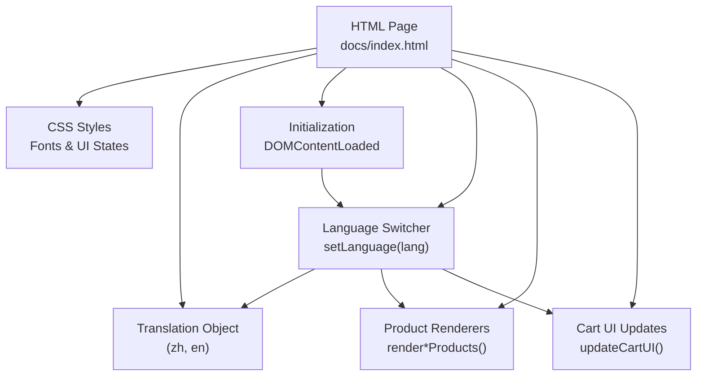
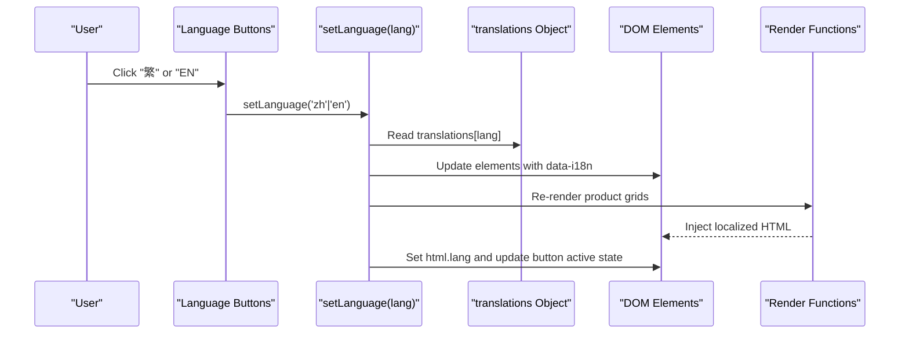
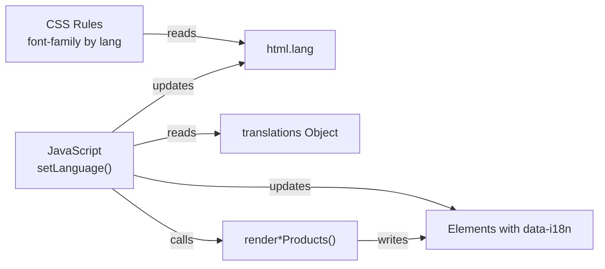

# Language Switcher

<cite>
**Referenced Files in This Document**
- [index.html](file://docs/index.html)
</cite>

## Table of Contents
1. [Introduction](#introduction)
2. [Project Structure](#project-structure)
3. [Core Components](#core-components)
4. [Architecture Overview](#architecture-overview)
5. [Detailed Component Analysis](#detailed-component-analysis)
6. [Dependency Analysis](#dependency-analysis)
7. [Performance Considerations](#performance-considerations)
8. [Troubleshooting Guide](#troubleshooting-guide)
9. [Conclusion](#conclusion)
10. [Appendices](#appendices)

## Introduction
This document explains the language switching component implemented in a single-page site. It covers:
- Bilingual content management using data attributes and translation objects
- Dynamic text replacement without page reloads
- Font family switching for Chinese vs English typography
- Active state management for visual feedback on selected language
- Initialization process that sets default language
- Guidance for adding new languages, managing keys, and context-specific translations
- Accessibility considerations for screen readers and keyboard navigation

## Project Structure
The language system is implemented within a single HTML file containing:
- CSS styles for fonts and UI states
- A translation object with two locales (Chinese Traditional and English)
- DOM-based rendering functions that use current language to render product cards and UI strings
- Event-driven initialization and language switching logic

**Diagram sources**
- [index.html:881-1075](file://docs/index.html#L881-L1075)
- [index.html:1332-1374](file://docs/index.html#L1332-L1374)
- [index.html:1406-1444](file://docs/index.html#L1406-L1444)
- [index.html:1496-1553](file://docs/index.html#L1496-L1553)

**Section sources**
- [index.html:881-1075](file://docs/index.html#L881-L1075)
- [index.html:1332-1374](file://docs/index.html#L1332-L1374)

## Core Components
- Translation dictionary: A nested object keyed by locale identifiers (e.g., zh, en), each containing string values mapped to stable keys used across the page.
- Data attribute binding: Elements marked with a specific attribute are updated at runtime based on the active locale.
- Language switch buttons: Two buttons trigger the language change function and visually indicate the active language via an active class.
- Font switching: The root element’s lang attribute changes, and CSS rules apply different font families for headings and body depending on the language.
- Rendering pipeline: Product grids and cart UI are re-rendered after language changes to reflect localized names and descriptions.

Key responsibilities:
- Maintain current language state
- Update static UI text via data attributes
- Re-render dynamic content (product cards, cart)
- Apply appropriate typography per language
- Provide accessible labels and focus behavior

**Section sources**
- [index.html:881-1075](file://docs/index.html#L881-L1075)
- [index.html:1353-1374](file://docs/index.html#L1353-L1374)
- [index.html:1406-1444](file://docs/index.html#L1406-L1444)
- [index.html:1496-1553](file://docs/index.html#L1496-L1553)

## Architecture Overview
The language system follows a simple client-side i18n pattern:
- Static markup uses data attributes as placeholders for localized strings
- JavaScript holds all translations in memory
- On language change, the script updates the DOM and re-renders dynamic sections
- CSS adapts typography based on the html lang attribute

**Diagram sources**
- [index.html:1353-1374](file://docs/index.html#L1353-L1374)
- [index.html:1406-1444](file://docs/index.html#L1406-L1444)

## Detailed Component Analysis

### Bilingual Content Management System
- Translation storage: A global object contains two locales, each mapping stable keys to localized strings. Keys cover navigation, hero, categories, sections, footer, cart, and toast messages.
- Data attribute binding: Elements carry a key reference; during language change, the script selects matching elements and replaces their text content with the corresponding value from the active locale.
- Scope of updates: All elements with the attribute are updated in one pass, ensuring consistent localization across the page.

Implementation highlights:
- Centralized translation object with keys for brand, navigation, hero, categories, sections, delivery, about, features, footer, cart, and toast
- Single-pass selection and replacement of localized text
- No server calls; entirely client-side

**Section sources**
- [index.html:881-1075](file://docs/index.html#L881-L1075)
- [index.html:1359-1364](file://docs/index.html#L1359-L1364)

### Dynamic Content Replacement Mechanism
- Trigger: User clicks a language button
- State update: Current language variable is set
- UI sync: Button active classes are toggled to reflect selection
- Text update: All elements with the data attribute are refreshed
- Dynamic sections: Product grids and cart UI are re-rendered to reflect localized names, descriptions, and labels

Behavioral notes:
- No page reload occurs; updates are immediate
- Product card rendering chooses between Chinese and English fields based on current language
- Cart UI strings and generated WhatsApp message adapt to the active language

**Section sources**
- [index.html:1353-1374](file://docs/index.html#L1353-L1374)
- [index.html:1376-1404](file://docs/index.html#L1376-L1404)
- [index.html:1496-1553](file://docs/index.html#L1496-L1553)

### Font Family Switching Logic
- Fonts loaded: Both Chinese-focused and Western-focused typefaces are included
- Tailwind config defines font stacks prioritizing Chinese fonts for serif and sans when available
- Default CSS applies Chinese fonts to body and headings
- When the html lang attribute is set to English, heading selectors override to use Western serif fonts
- Result: Headings switch to a Western serif font in English mode while body remains readable with the configured stack

Operational flow:
- Language change sets html.lang accordingly
- CSS selectors match the lang attribute and adjust font-family for headings
- Body font remains consistent but benefits from fallbacks defined in Tailwind config

**Section sources**
- [index.html:9-11](file://docs/index.html#L9-L11)
- [index.html:14-20](file://docs/index.html#L14-L20)
- [index.html:40-56](file://docs/index.html#L40-L56)
- [index.html:1357](file://docs/index.html#L1357)

### Active State Management for Visual Feedback
- Buttons have an active class applied when they represent the current language
- Toggling removes the active class from the other button and adds it to the selected one
- Styling ensures clear visual distinction between active and inactive states

Accessibility note:
- Buttons are interactive and can be focused via keyboard
- Adding aria-pressed would further improve accessibility for screen readers

**Section sources**
- [index.html:1355-1356](file://docs/index.html#L1355-L1356)
- [index.html:146-153](file://docs/index.html#L146-L153)

### Initialization Process
- On DOM ready, the app renders all product grids and initializes the language to Chinese
- Scroll listener enhances navbar appearance on scroll
- Initial language setting ensures consistent first paint and correct defaults

Considerations:
- If URL parameters were intended to control initial language, additional logic would be needed to parse query strings and call the language setter before rendering
- Currently, the default is hardcoded to Chinese

**Section sources**
- [index.html:1332-1351](file://docs/index.html#L1332-L1351)
- [index.html:1341](file://docs/index.html#L1341)

### Examples and How-To Guides

#### Adding a New Language
Steps:
1. Add a new top-level key in the translation object for the new locale
2. Provide complete mappings for all keys used across the page
3. Add a new language button in the header and wire its click handler to call the language setter with the new locale code
4. Ensure any dynamic content references support the new locale (e.g., product name fields)

References:
- Translation object structure and existing locales
- Language button markup and click handlers
- Language setter function

**Section sources**
- [index.html:881-1075](file://docs/index.html#L881-L1075)
- [index.html:248-253](file://docs/index.html#L248-L253)
- [index.html:1353-1374](file://docs/index.html#L1353-L1374)

#### Managing Translation Keys
Guidelines:
- Use descriptive, hierarchical keys (e.g., nav_ceremonial, section_wreaths_title)
- Keep keys consistent across locales
- Avoid embedding formatting or HTML inside keys; prefer plain text and compose in templates if needed

References:
- Existing key naming patterns throughout the translation object

**Section sources**
- [index.html:881-1075](file://docs/index.html#L881-L1075)

#### Implementing Context-Specific Translations
Approach:
- For product listings, store both language variants in the data model and select the appropriate field based on current language during rendering
- For UI strings, add dedicated keys scoped to the feature area (e.g., cart_* or toast_*)

References:
- Product data model with bilingual fields
- Rendering functions choosing fields based on current language
- Cart UI updates using localized strings

**Section sources**
- [index.html:1079-1328](file://docs/index.html#L1079-L1328)
- [index.html:1376-1404](file://docs/index.html#L1376-L1404)
- [index.html:1496-1553](file://docs/index.html#L1496-L1553)

### Accessibility Considerations
- Screen reader announcements:
  - Consider adding aria-live regions around dynamic content so screen readers announce updates when language changes
  - Announce the new language explicitly (e.g., “Language changed to English”)
- Keyboard navigation:
  - Ensure language buttons are focusable and operable via Enter/Space
  - Provide visible focus indicators
- Semantic language declaration:
  - The html lang attribute is updated to reflect the current language, aiding assistive technologies
- Alternative text:
  - Product images should include alt text reflecting the current language where applicable

Recommendations:
- Add aria-pressed to language buttons to convey toggle state
- Wrap dynamic content updates in a live region for better accessibility

**Section sources**
- [index.html:1357](file://docs/index.html#L1357)
- [index.html:1359-1364](file://docs/index.html#L1359-L1364)

## Dependency Analysis
The language system has minimal dependencies and clear boundaries:
- CSS depends on the html lang attribute to switch fonts
- JavaScript depends on:
  - The translation object for text values
  - DOM queries for elements with data attributes
  - Rendering functions for dynamic content
  - Button click handlers to trigger updates

**Diagram sources**
- [index.html:40-56](file://docs/index.html#L40-L56)
- [index.html:1353-1374](file://docs/index.html#L1353-L1374)
- [index.html:1406-1444](file://docs/index.html#L1406-L1444)

**Section sources**
- [index.html:1353-1374](file://docs/index.html#L1353-L1374)
- [index.html:1406-1444](file://docs/index.html#L1406-L1444)

## Performance Considerations
- Client-side i18n avoids network requests for translations once the page loads
- Re-rendering product grids on every language change is acceptable for small catalogs; consider caching rendered HTML per locale if the catalog grows
- Avoid excessive DOM queries by batching updates or using efficient selectors
- Prefer textContent over innerHTML for static text updates to reduce overhead and XSS risk

## Troubleshooting Guide
Common issues and resolutions:
- Missing translation key:
  - Symptom: Element does not update
  - Resolution: Ensure the key exists in all locales and matches exactly
- Dynamic content not localized:
  - Symptom: Product names/descriptions remain in one language
  - Resolution: Confirm rendering functions select fields based on current language
- Font not switching:
  - Symptom: Headings do not change fonts in English mode
  - Resolution: Verify html.lang is set correctly and CSS selectors target the lang attribute
- Button state incorrect:
  - Symptom: Active class not applied
  - Resolution: Check active class toggling logic and ensure IDs match button elements

**Section sources**
- [index.html:1353-1374](file://docs/index.html#L1353-L1374)
- [index.html:1376-1404](file://docs/index.html#L1376-L1404)
- [index.html:40-56](file://docs/index.html#L40-L56)

## Conclusion
The language switching component provides a straightforward, client-side solution for bilingual content management. It leverages data attributes for static text, a centralized translation object for maintainability, and targeted CSS for typography adaptation. With minor enhancements—such as aria-live regions and optional URL parameter handling—the system can achieve robust accessibility and deeper integration with routing expectations.

## Appendices

### Key Implementation References
- Translation object definition and keys
- Language setter function and button interactions
- Product rendering functions and cart UI updates
- Font loading and CSS overrides based on language

**Section sources**
- [index.html:881-1075](file://docs/index.html#L881-L1075)
- [index.html:1353-1374](file://docs/index.html#L1353-L1374)
- [index.html:1406-1444](file://docs/index.html#L1406-L1444)
- [index.html:1496-1553](file://docs/index.html#L1496-L1553)
- [index.html:9-11](file://docs/index.html#L9-L11)
- [index.html:14-20](file://docs/index.html#L14-L20)
- [index.html:40-56](file://docs/index.html#L40-L56)