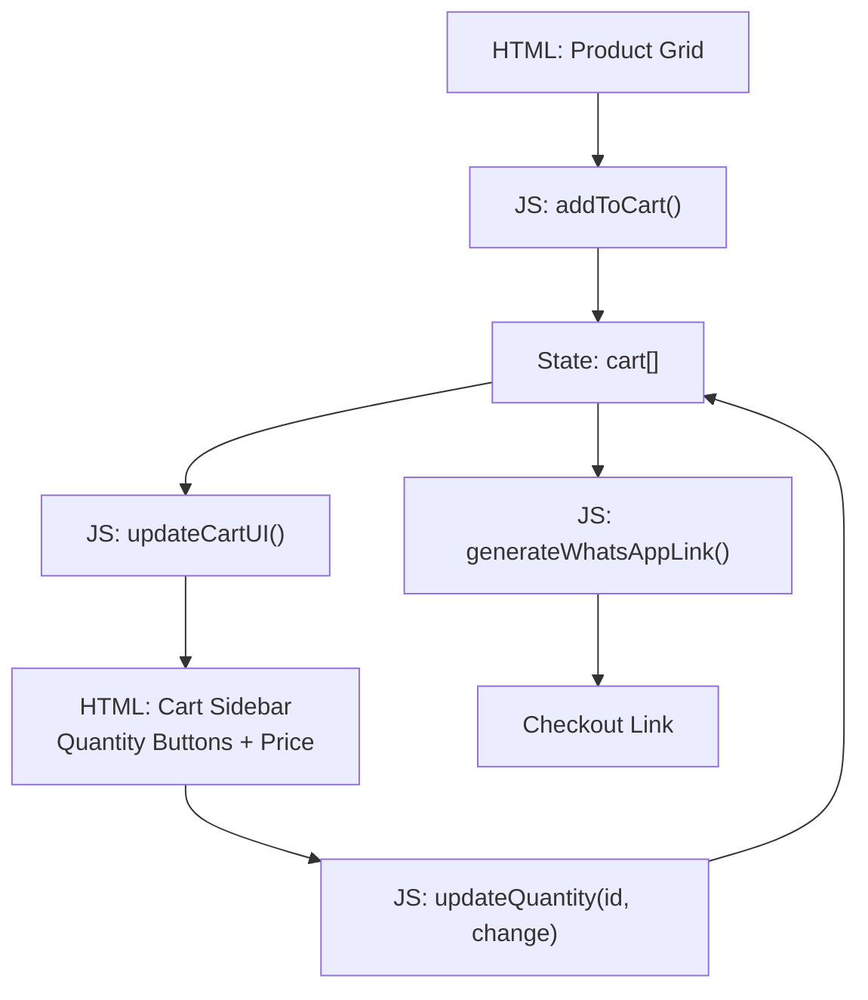
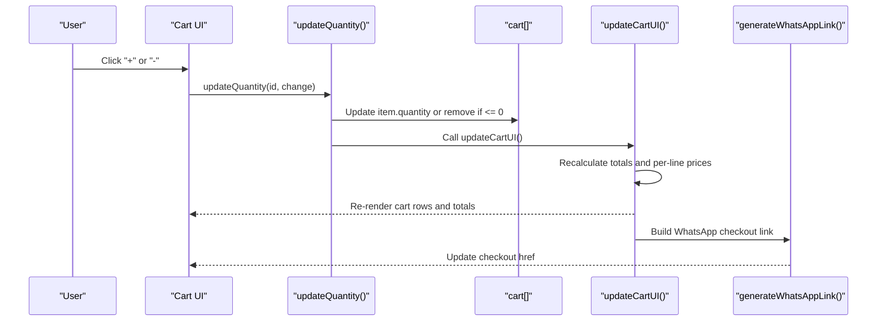
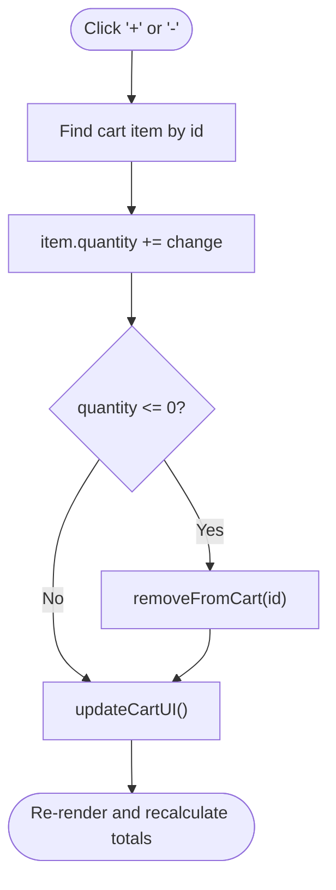
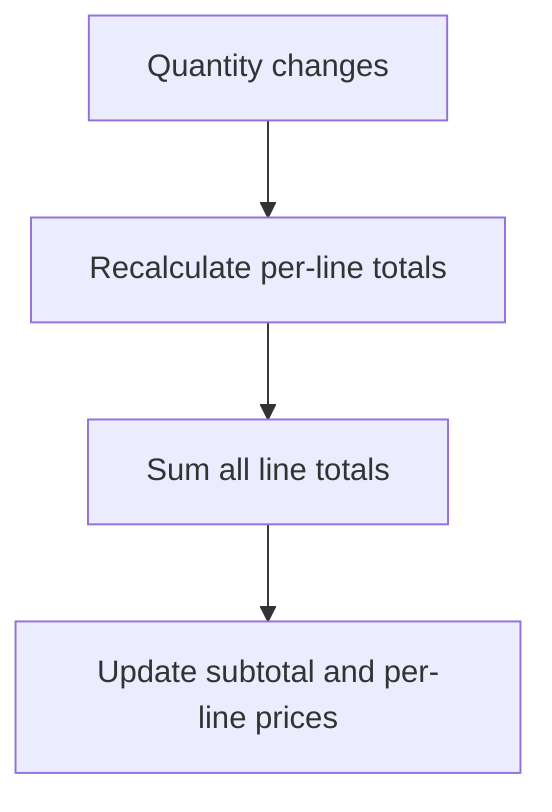
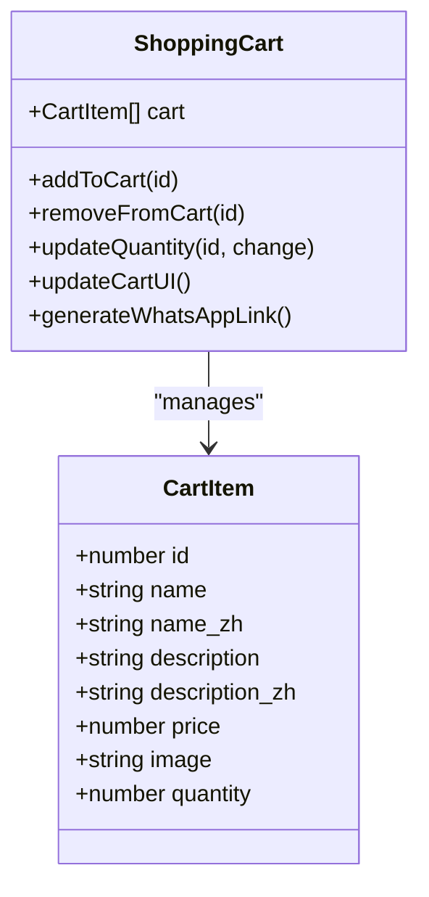
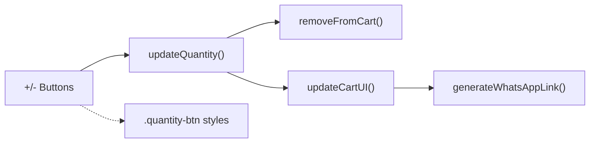

# Quantity Controls

<cite>
**Referenced Files in This Document**
- [index.html](file://docs/index.html)
</cite>

## Table of Contents
1. [Introduction](#introduction)
2. [Project Structure](#project-structure)
3. [Core Components](#core-components)
4. [Architecture Overview](#architecture-overview)
5. [Detailed Component Analysis](#detailed-component-analysis)
6. [Dependency Analysis](#dependency-analysis)
7. [Performance Considerations](#performance-considerations)
8. [Troubleshooting Guide](#troubleshooting-guide)
9. [Conclusion](#conclusion)

## Introduction
This document explains the quantity control components used across the product interface, focusing on increment/decrement buttons, hover effects, click handlers, input validation, real-time price updates, visual feedback, and integration with the shopping cart state management. It also provides guidance for customization, keyboard shortcuts, bulk operations, mobile touch interactions, and accessibility considerations.

## Project Structure
The application is implemented as a single-page site with HTML, CSS, and JavaScript co-located in one file. The quantity controls are rendered inside the shopping cart sidebar and updated via inline event handlers that call shared functions.

**Diagram sources**
- [index.html:1446-1459](file://docs/index.html#L1446-L1459)
- [index.html:1466-1476](file://docs/index.html#L1466-L1476)
- [index.html:1496-1553](file://docs/index.html#L1496-L1553)
- [index.html:1478-1494](file://docs/index.html#L1478-L1494)

**Section sources**
- [index.html:1330-1341](file://docs/index.html#L1330-L1341)
- [index.html:1496-1553](file://docs/index.html#L1496-L1553)

## Core Components
- Increment/Decrement Buttons
  - Rendered within each cart item row using small circular buttons labeled “+” and “–”.
  - Each button calls updateQuantity(productId, change) with change = ±1.
  - Hover effect transitions background to an accent color and text to white.
- Quantity Display
  - Centered numeric span reflects current item quantity.
  - When quantity reaches zero or below, the item is removed from the cart.
- Real-Time Price Calculation
  - Per-line total equals unit price × quantity.
  - Cart subtotal recalculated on every update.
- Visual Feedback
  - Button hover transitions (color and text).
  - Slide-in animation for new cart items.
  - Toast notification when adding items to cart.
- Cart Integration
  - State stored in a simple array cart[].
  - updateCartUI() re-renders the cart UI and recalculates totals.
  - Checkout link dynamically generated from cart contents.

**Section sources**
- [index.html:133-140](file://docs/index.html#L133-L140)
- [index.html:1535-1541](file://docs/index.html#L1535-L1541)
- [index.html:1466-1476](file://docs/index.html#L1466-L1476)
- [index.html:1496-1553](file://docs/index.html#L1496-L1553)
- [index.html:1575-1585](file://docs/index.html#L1575-L1585)

## Architecture Overview
The quantity controls follow a unidirectional data flow: user actions update the cart state, which triggers UI re-rendering and price recalculation.

**Diagram sources**
- [index.html:1466-1476](file://docs/index.html#L1466-L1476)
- [index.html:1496-1553](file://docs/index.html#L1496-L1553)
- [index.html:1478-1494](file://docs/index.html#L1478-L1494)

## Detailed Component Analysis

### Increment/Decrement Button Implementation
- Rendering
  - Buttons are created during cart rendering and wired to updateQuantity with explicit change values (+1 or -1).
- Click Handlers
  - updateQuantity finds the matching cart item by id, applies the change, and enforces a minimum threshold.
- Validation Logic
  - If the resulting quantity is less than or equal to zero, the item is removed from the cart rather than showing negative quantities.
- Hover Effects
  - CSS class .quantity-btn defines a smooth transition; :hover switches background to an accent color and text to white.

**Diagram sources**
- [index.html:1466-1476](file://docs/index.html#L1466-L1476)
- [index.html:1461-1464](file://docs/index.html#L1461-L1464)
- [index.html:1496-1553](file://docs/index.html#L1496-L1553)

**Section sources**
- [index.html:133-140](file://docs/index.html#L133-L140)
- [index.html:1535-1541](file://docs/index.html#L1535-L1541)
- [index.html:1466-1476](file://docs/index.html#L1466-L1476)

### Input Validation and Minimum Order Requirements
- Negative Quantities
  - Prevented by removing the item when quantity drops to zero or below.
- Minimum Order Requirements
  - No global minimum order enforcement is present in the code. Business rules such as urgent order minimums are communicated via static copy but not enforced programmatically.

**Section sources**
- [index.html:1466-1476](file://docs/index.html#L1466-L1476)
- [index.html:1478-1494](file://docs/index.html#L1478-L1494)

### Real-Time Price Calculation Updates
- Per-Line Total
  - Calculated as item.price × item.quantity and displayed next to the quantity controls.
- Cart Subtotal
  - Computed by summing all line totals and shown in the cart footer.
- Trigger Points
  - Every time updateQuantity runs, updateCartUI recalculates totals and refreshes the DOM.

**Diagram sources**
- [index.html:1496-1553](file://docs/index.html#L1496-L1553)

**Section sources**
- [index.html:1496-1553](file://docs/index.html#L1496-L1553)

### Visual Feedback System
- Color Changes and Transitions
  - .quantity-btn uses a transition for smooth hover effects; hover state sets background to an accent color and text to white.
- Animations
  - Cart items slide in with a slide-in-right animation.
  - Toast notifications fade in/out to confirm actions like adding to cart.
- Overlay and Sidebar
  - Cart overlay blurs the background; sidebar slides in/out with transform transitions.

**Section sources**
- [index.html:133-140](file://docs/index.html#L133-L140)
- [index.html:110-122](file://docs/index.html#L110-L122)
- [index.html:142-144](file://docs/index.html#L142-L144)
- [index.html:1575-1585](file://docs/index.html#L1575-L1585)

### Shopping Cart State Management Integration
- State Model
  - cart[] holds objects with at least id, name(s), description(s), price, image, and quantity.
- Add to Cart
  - addToCart increments quantity if the item exists or pushes a new entry with quantity 1.
- Remove and Update
  - removeFromCart filters out the item by id.
  - updateQuantity adjusts quantity and removes the item if it becomes non-positive.
- UI Sync
  - updateCartUI recomputes counts and totals, renders cart rows, and updates the checkout link.

**Diagram sources**
- [index.html:1330-1341](file://docs/index.html#L1330-L1341)
- [index.html:1446-1459](file://docs/index.html#L1446-L1459)
- [index.html:1461-1476](file://docs/index.html#L1461-L1476)
- [index.html:1496-1553](file://docs/index.html#L1496-L1553)

**Section sources**
- [index.html:1446-1459](file://docs/index.html#L1446-L1459)
- [index.html:1461-1476](file://docs/index.html#L1461-L1476)
- [index.html:1496-1553](file://docs/index.html#L1496-L1553)

## Dependency Analysis
- Inline Event Wiring
  - Buttons use onclick attributes to call updateQuantity directly.
- Shared Functions
  - updateQuantity depends on removeFromCart and updateCartUI.
  - updateCartUI depends on generateWhatsAppLink for checkout link generation.
- Styling Dependencies
  - .quantity-btn styles define transitions and hover states applied to both increment and decrement buttons.

**Diagram sources**
- [index.html:1466-1476](file://docs/index.html#L1466-L1476)
- [index.html:1461-1464](file://docs/index.html#L1461-L1464)
- [index.html:1496-1553](file://docs/index.html#L1496-L1553)
- [index.html:133-140](file://docs/index.html#L133-L140)

**Section sources**
- [index.html:1466-1476](file://docs/index.html#L1466-L1476)
- [index.html:1496-1553](file://docs/index.html#L1496-L1553)
- [index.html:133-140](file://docs/index.html#L133-L140)

## Performance Considerations
- Minimal DOM Updates
  - updateCartUI rebuilds only the cart content area and updates totals, avoiding full page reloads.
- Efficient State Operations
  - Array-based cart with find/filter operations is suitable for the current dataset size.
- Animation Costs
  - Use lightweight CSS transitions and animations already defined; avoid heavy JS-driven animations for better performance.

[No sources needed since this section provides general guidance]

## Troubleshooting Guide
- Buttons Not Updating Quantity
  - Ensure the element IDs exist and updateQuantity is called with valid productId and change values.
- Negative Quantities Appearing
  - Verify the guard condition in updateQuantity prevents non-positive quantities and removes the item instead.
- Totals Not Refreshing
  - Confirm updateCartUI is invoked after any state change and that DOM elements for totals exist.
- Hover Styles Not Applying
  - Check that .quantity-btn class is present and no overriding styles interfere.

**Section sources**
- [index.html:1466-1476](file://docs/index.html#L1466-L1476)
- [index.html:1496-1553](file://docs/index.html#L1496-L1553)
- [index.html:133-140](file://docs/index.html#L133-L140)

## Conclusion
The quantity controls provide a straightforward, responsive mechanism to adjust item quantities, enforce non-negative constraints, and reflect real-time pricing. They integrate tightly with a simple in-memory cart state and produce clear visual feedback through transitions and animations. For further enhancements, consider adding keyboard support, bulk operations, and robust accessibility attributes to improve usability across devices and assistive technologies.

[No sources needed since this section summarizes without analyzing specific files]

## Appendices

### Customization Examples

- Customize Button Styles
  - Modify the .quantity-btn CSS to change colors, sizes, border radius, and transitions.
  - Reference: [index.html:133-140](file://docs/index.html#L133-L140)

- Add Keyboard Shortcuts
  - Attach keydown listeners to the cart container to handle ArrowUp/ArrowDown or +/- keys for focused items.
  - Dispatch updateQuantity(id, change) accordingly.

- Implement Bulk Quantity Operations
  - Add “Set All to X” or “Increase All by N” buttons that iterate over cart and apply updateQuantity-like logic in batch.
  - After bulk changes, call updateCartUI once to minimize reflows.

- Mobile Touch Interactions
  - Ensure buttons have adequate tap targets and spacing.
  - Consider adding touchstart/touchend handlers for immediate feedback on mobile.

- Accessibility Features for Screen Readers
  - Add aria-label to increment/decrement buttons describing the action and current quantity.
  - Provide role="button" and tabindex="0" where necessary.
  - Announce changes to screen readers by updating aria-live regions or using subtle focus management.

[No sources needed since this section provides general guidance]