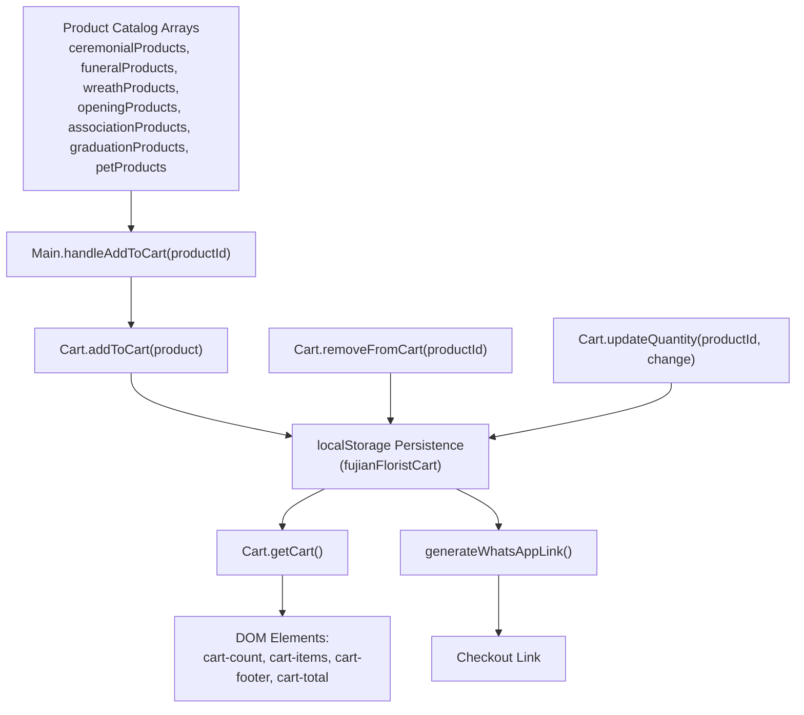
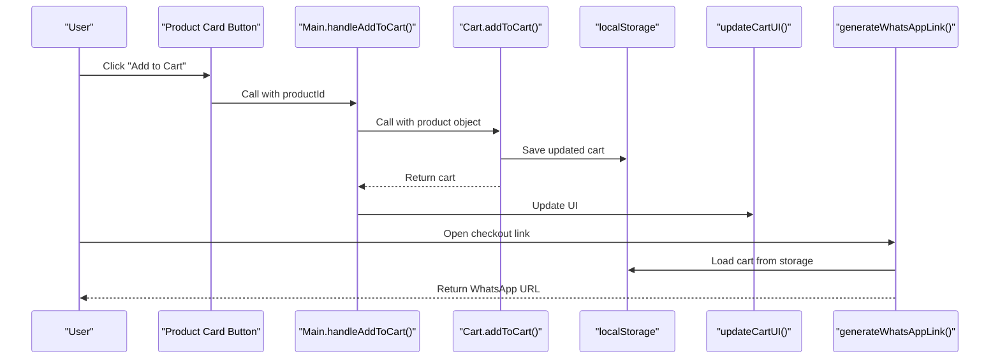
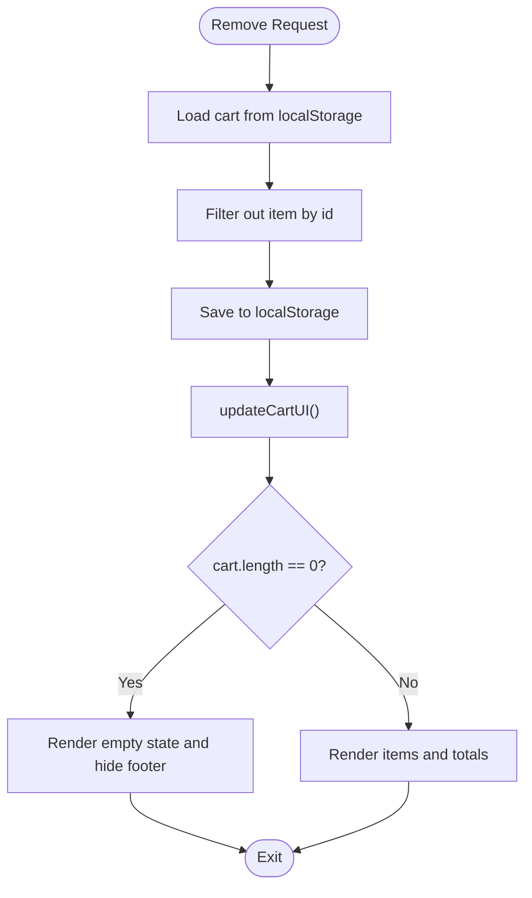
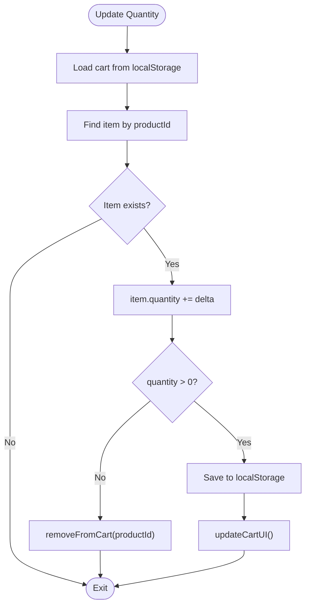
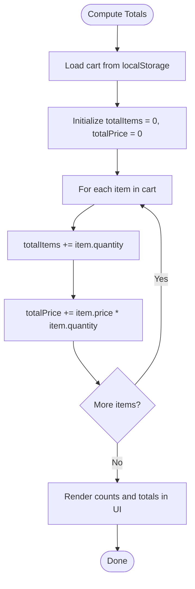
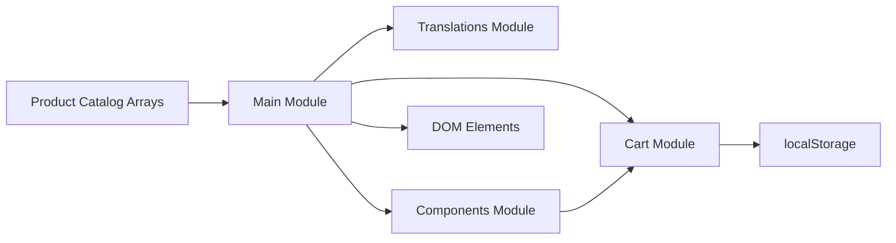

# Cart State Management

<cite>
**Referenced Files in This Document**
- [cart.js](file://docs/js/cart.js)
- [main.js](file://docs/js/main.js)
- [components.js](file://docs/js/components.js)
- [index.html](file://docs/index.html)
</cite>

## Update Summary
**Changes Made**
- Updated persistence strategy section to reflect localStorage implementation
- Added new Cart module architecture overview
- Updated all sections to reference the new modular cart system
- Revised performance considerations for persistent storage
- Enhanced troubleshooting guide for localStorage-specific issues

## Table of Contents
1. [Introduction](#introduction)
2. [Project Structure](#project-structure)
3. [Core Components](#core-components)
4. [Architecture Overview](#architecture-overview)
5. [Detailed Component Analysis](#detailed-component-analysis)
6. [Dependency Analysis](#dependency-analysis)
7. [Performance Considerations](#performance-considerations)
8. [Troubleshooting Guide](#troubleshooting-guide)
9. [Conclusion](#conclusion)
10. [Appendices](#appendices)

## Introduction
This document explains the shopping cart state management system implemented in a single-page HTML application. The system has been redesigned with a modular architecture featuring persistent storage using localStorage. It covers:
- The cart array structure and item schema
- Add-to-cart behavior, including duplicate handling and quantity updates
- Remove-from-cart logic and empty cart state
- Price calculation algorithms for subtotal computation and currency formatting
- **Updated**: Persistent storage strategy using localStorage for cross-session data retention
- Examples for extending functionality, customizing item properties, and implementing validation rules
- Performance considerations for large datasets and memory optimization techniques

## Project Structure
The cart system is now implemented as a modular architecture with separate JavaScript modules:
- **cart.js**: Core cart state management with localStorage persistence
- **main.js**: Application orchestration and UI rendering logic
- **components.js**: Shared UI components and behaviors
- **index.html**: Main HTML structure with cart sidebar and product catalog



**Diagram sources**
- [cart.js:24-34](file://docs/js/cart.js#L24-L34)
- [cart.js:36-40](file://docs/js/cart.js#L36-L40)
- [cart.js:42-53](file://docs/js/cart.js#L42-L53)
- [cart.js:20-22](file://docs/js/cart.js#L20-L22)
- [main.js:26-45](file://docs/js/main.js#L26-L45)
- [main.js:47-107](file://docs/js/main.js#L47-L107)

**Section sources**
- [cart.js:1-69](file://docs/js/cart.js#L1-L69)
- [main.js:1-134](file://docs/js/main.js#L1-L134)
- [components.js:1-72](file://docs/js/components.js#L1-L72)
- [index.html:627-674](file://docs/index.html#L627-L674)

## Core Components
- **Cart Module**: A self-contained module providing CRUD operations for cart items with automatic localStorage persistence
- **Main Module**: Orchestrates cart operations, UI rendering, and WhatsApp checkout generation
- **Components Module**: Handles shared UI behaviors like toast notifications and cart sidebar toggling
- **Storage Layer**: localStorage-based persistence with JSON serialization/deserialization
- **UI Rendering**: Dynamic DOM manipulation for cart display and totals calculation

Key responsibilities:
- **Data Integrity**: Ensure unique ids per line item and non-negative quantities with automatic persistence
- **UI Consistency**: Keep DOM state synchronized with the persisted cart data after every mutation
- **Pricing Accuracy**: Compute subtotals and totals using item.price * item.quantity
- **Cross-Session Persistence**: Maintain cart state across browser sessions and page reloads

**Section sources**
- [cart.js:5-68](file://docs/js/cart.js#L5-L68)
- [main.js:8-24](file://docs/js/main.js#L8-L24)
- [components.js:53-63](file://docs/js/components.js#L53-L63)

## Architecture Overview
The cart system follows a modular, unidirectional flow with persistent storage:
- User actions trigger handlers in the Main module that call Cart module methods
- Cart operations automatically persist data to localStorage
- After mutations, updateCartUI() recalculates totals and refreshes the DOM
- Checkout uses generateWhatsAppLink() to produce a pre-filled message based on the current cart



**Diagram sources**
- [main.js:8-14](file://docs/js/main.js#L8-L14)
- [cart.js:24-34](file://docs/js/cart.js#L24-L34)
- [cart.js:8-18](file://docs/js/cart.js#L8-L18)
- [main.js:26-45](file://docs/js/main.js#L26-L45)

## Detailed Component Analysis

### Cart Data Model
- **Storage**: localStorage with key 'fujianFloristCart'
- **Item shape**: Each item is a copy of a product object plus a quantity field
- **Product fields used by cart**:
  - id: unique identifier for matching duplicates
  - name / name_zh: display names in English/Chinese
  - price: numeric value used for calculations
  - image: displayed in cart list
  - description / description_zh: shown in cart list
  - category: not directly used by cart logic but available from product source

Complexity:
- Lookup by id is O(n) where n is number of cart items
- Insertion and removal are O(n) due to find/filter operations
- Storage operations add overhead for JSON serialization/deserialization

Optimization opportunities:
- Maintain a Map keyed by id for O(1) lookups and updates
- Keep a separate lightweight line-item model with only required fields to reduce memory footprint
- Implement batch operations to minimize localStorage writes

**Section sources**
- [cart.js:5-68](file://docs/js/cart.js#L5-L68)
- [cart.js:24-34](file://docs/js/cart.js#L24-L34)

### Add to Cart Functionality
Behavior:
- Receives a complete product object from the Main module
- Loads current cart from localStorage
- If an item with the same id already exists in cart, increment its quantity
- Otherwise, push a new item created by spreading the product object and setting quantity to 1
- Persists the updated cart to localStorage
- Returns the updated cart for UI updates

Duplicate handling:
- Duplicate detection is performed via cart.find(item => item.id === product.id)
- Quantity is incremented rather than creating a new entry

Edge cases:
- Graceful error handling if localStorage is unavailable or corrupted
- No explicit validation for negative or zero quantities during addition

**Section sources**
- [cart.js:24-34](file://docs/js/cart.js#L24-L34)

#### Sequence Diagram: Add to Cart
```mermaid
sequenceDiagram
participant U as "User"
participant BTN as "Add to Cart Button"
participant M as "Main.handleAddToCart()"
participant C as "Cart.addToCart()"
local as "localStorage"
U->>BTN : Click
BTN->>M : productId
M->>C : product object
C->>local : Load cart
C->>C : Find existing item by id
alt Found
C->>C : item.quantity++
else Not found
C->>C : push({ ...product, quantity : 1 })
end
C->>local : Save updated cart
C-->>M : Return cart
M->>M : updateCartUI()
```

**Diagram sources**
- [main.js:8-14](file://docs/js/main.js#L8-L14)
- [cart.js:24-34](file://docs/js/cart.js#L24-L34)
- [cart.js:8-18](file://docs/js/cart.js#L8-L18)

### Remove from Cart Logic
Behavior:
- Loads current cart from localStorage
- Filters the cart array to exclude the item whose id matches the provided productId
- Persists the filtered cart back to localStorage
- Returns the updated cart for UI updates

Empty cart state:
- When cart.length equals 0, updateCartUI renders an empty-state placeholder and hides the footer section

**Section sources**
- [cart.js:36-40](file://docs/js/cart.js#L36-L40)
- [main.js:47-107](file://docs/js/main.js#L47-L107)

#### Flowchart: Remove from Cart


**Diagram sources**
- [cart.js:36-40](file://docs/js/cart.js#L36-L40)
- [main.js:47-107](file://docs/js/main.js#L47-L107)

### Update Quantity Logic
Behavior:
- Loads current cart from localStorage
- Finds the item by productId and adds the delta (+1 or -1)
- If the resulting quantity is less than or equal to zero, it removes the item via removeFromCart
- Otherwise, persists the updated cart to localStorage
- Returns the updated cart for UI updates

Validation:
- Prevents negative quantities by removing the item when quantity reaches zero or below

**Section sources**
- [cart.js:42-53](file://docs/js/cart.js#L42-L53)

#### Flowchart: Update Quantity


**Diagram sources**
- [cart.js:42-53](file://docs/js/cart.js#L42-L53)

### Price Calculation Algorithms
Subtotal computation:
- Total items count: sum of item.quantity across all items (via getCartCount())
- Subtotal total: sum of item.price * item.quantity across all items (via getCartTotal())

Currency formatting:
- Prices are rendered as plain numbers prefixed with a dollar sign without decimal formatting
- Line item totals and cart total use the same pattern

Checkout message:
- Generates a text message listing each item with id, localized name, quantity, and line total
- Appends a final total line and a call-to-action message in the selected language

**Section sources**
- [cart.js:55-61](file://docs/js/cart.js#L55-L61)
- [main.js:26-45](file://docs/js/main.js#L26-L45)

#### Flowchart: Subtotal Computation


**Diagram sources**
- [cart.js:55-61](file://docs/js/cart.js#L55-L61)

### Cart Persistence Strategy
**Updated** The cart system now uses localStorage for persistent storage:

Current implementation:
- Uses localStorage with key 'fujianFloristCart' for cart data persistence
- Automatic JSON serialization/deserialization for cart objects
- Cart persists across browser sessions and page reloads
- Error handling for localStorage corruption or unavailability
- All cart operations (add, remove, update) automatically persist changes

Storage lifecycle:
- **Initialization**: Cart loads from localStorage on page load
- **Mutations**: Every cart operation saves changes immediately to localStorage
- **Retrieval**: Cart data is loaded fresh from storage for each operation
- **Cleanup**: ClearCart function resets localStorage to empty array

Benefits:
- Cross-session persistence maintains user selections
- Improved reliability with automatic error recovery
- Simplified architecture with centralized storage logic

**Section sources**
- [cart.js:1-18](file://docs/js/cart.js#L1-L18)
- [cart.js:24-34](file://docs/js/cart.js#L24-L34)
- [cart.js:36-40](file://docs/js/cart.js#L36-L40)
- [cart.js:42-53](file://docs/js/cart.js#L42-L53)
- [cart.js:63-65](file://docs/js/cart.js#L63-L65)

### Extending Cart Functionality
Examples you can implement:
- Custom item properties:
  - Add optional fields like color, size, or gift message to product objects and propagate them into cart items when added
- Validation rules:
  - Enforce minimum order amounts before enabling checkout
  - Limit maximum quantity per item
  - Validate stock availability against a backend inventory endpoint
- Additional features:
  - Apply discount codes or promotions
  - Group items by category for shipping estimates
  - Export cart to JSON for analytics or backup
  - Implement cart sharing between tabs using storage events

Implementation guidance:
- Extend the item creation in addToCart to include new fields
- Update updateCartUI to render additional fields
- Modify generateWhatsAppLink to include extra details in the checkout message
- Add new methods to the Cart module for advanced operations

## Dependency Analysis
The cart system has a clean modular dependency structure:
- **Cart Module**: Self-contained with localStorage dependency
- **Main Module**: Depends on Cart, Translations, Products, and Components
- **Components Module**: Depends on Cart for cart count updates
- **HTML**: References all modules in proper dependency order



**Diagram sources**
- [cart.js:1-69](file://docs/js/cart.js#L1-L69)
- [main.js:1-134](file://docs/js/main.js#L1-L134)
- [components.js:1-72](file://docs/js/components.js#L1-L72)
- [index.html:695-700](file://docs/index.html#L695-L700)

**Section sources**
- [cart.js:1-69](file://docs/js/cart.js#L1-L69)
- [main.js:1-134](file://docs/js/main.js#L1-L134)
- [components.js:1-72](file://docs/js/components.js#L1-L72)
- [index.html:695-700](file://docs/index.html#L695-L700)

## Performance Considerations
**Updated** Performance considerations for localStorage-based cart system:

- **Time complexity**:
  - addToCart: O(n) to find existing item + O(1) localStorage write
  - removeFromCart: O(n) to filter + O(1) localStorage write
  - updateQuantity: O(n) to find item + O(1) localStorage write
  - updateCartUI: O(n) to compute totals and O(n) to render items
  - Storage operations: JSON serialization/deserialization overhead

- **Memory usage**:
  - Each cart item holds a full product object copy
  - localStorage has ~5-10MB storage limit depending on browser
  - Consider storing only essential fields in cart entries for large catalogs

- **Optimization techniques**:
  - Use a Map keyed by id for O(1) lookups and updates
  - Debounce rapid UI updates if batch operations occur
  - Virtualize or paginate cart rendering if displaying very large lists
  - Cache frequently accessed data to reduce localStorage reads
  - Implement lazy loading for product images in cart display
  - Consider IndexedDB for larger datasets exceeding localStorage limits

- **Storage considerations**:
  - Monitor localStorage quota usage
  - Implement graceful degradation if storage is unavailable
  - Consider data migration strategies for storage format changes

## Troubleshooting Guide
**Updated** Common issues and resolutions for localStorage-based cart system:

- **Adding an unknown productId**:
  - Symptom: Nothing appears in cart
  - Cause: Product lookup fails; addToCart does not add anything
  - Resolution: Ensure productId corresponds to an existing product in one of the catalog arrays

- **Negative or zero quantity**:
  - Behavior: Decreasing quantity to zero or below removes the item automatically
  - Resolution: This is expected; validate user interactions to prevent accidental decrements

- **Totals not updating**:
  - Symptom: Cart totals remain unchanged after modifications
  - Cause: Missing call to updateCartUI after mutation
  - Resolution: Ensure updateCartUI is invoked after any cart change

- **Empty cart UI not showing**:
  - Symptom: Footer remains visible even when cart is empty
  - Cause: DOM class toggling may be incorrect
  - Resolution: Verify cartFooter visibility is controlled by cart.length check in updateCartUI

- **localStorage errors**:
  - Symptom: Cart operations fail silently or throw errors
  - Cause: localStorage quota exceeded, privacy mode, or corrupted data
  - Resolution: Check for storage availability, handle JSON parsing errors, implement fallback mechanisms

- **Cart data not persisting**:
  - Symptom: Cart resets on page reload
  - Cause: localStorage disabled or storage key mismatch
  - Resolution: Verify localStorage is enabled, check storage key consistency, inspect browser developer tools

- **Cross-tab synchronization issues**:
  - Symptom: Cart changes in one tab don't reflect in other tabs
  - Cause: No event listeners for storage changes
  - Resolution: Implement storage event listeners for real-time sync between tabs

**Section sources**
- [cart.js:8-18](file://docs/js/cart.js#L8-L18)
- [cart.js:24-34](file://docs/js/cart.js#L24-L34)
- [main.js:47-107](file://docs/js/main.js#L47-L107)

## Conclusion
The cart system has been successfully redesigned with a modular architecture featuring persistent storage using localStorage. The new implementation provides essential operations for adding, removing, and updating items, along with basic price computation and a WhatsApp-based checkout flow. The localStorage-based persistence ensures cart data survives across browser sessions and page reloads, significantly improving user experience. For further scaling, consider introducing optimized data structures, robust validation rules, and advanced storage solutions like IndexedDB for larger datasets.

## Appendices

### Appendix A: Cart Item Schema
- Fields:
  - id: number/string unique identifier
  - name: string
  - name_zh: string
  - price: number
  - image: string URL
  - description: string
  - description_zh: string
  - quantity: number (added at runtime)

**Section sources**
- [cart.js:24-34](file://docs/js/cart.js#L24-L34)

### Appendix B: Example Extensions
- Add a "gift wrap" option:
  - Include a boolean field in product objects and propagate it into cart items
  - Update updateCartUI to show the option and adjust totals accordingly
- Implement stock limits:
  - Add a maxStock field to product objects
  - In addToCart and updateQuantity, enforce item.quantity <= maxStock
- Persist cart across sessions:
  - Already implemented via localStorage
  - Consider adding export/import functionality for backup purposes
- Add storage event listeners:
  - Listen for storage events to sync cart across browser tabs
  - Implement real-time collaboration features

### Appendix C: Storage API Reference
- **Storage Key**: 'fujianFloristCart'
- **Data Format**: JSON array of cart items
- **Error Handling**: Graceful fallback to empty cart on storage errors
- **Quota Management**: Automatic handling of storage limits
- **Serialization**: JSON.stringify/JSON.parse for data persistence

**Section sources**
- [cart.js:6](file://docs/js/cart.js#L6)
- [cart.js:8-18](file://docs/js/cart.js#L8-L18)