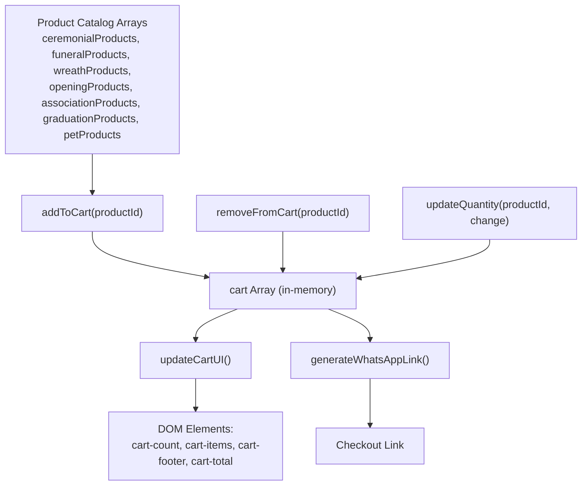
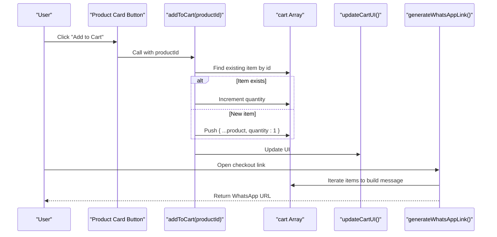
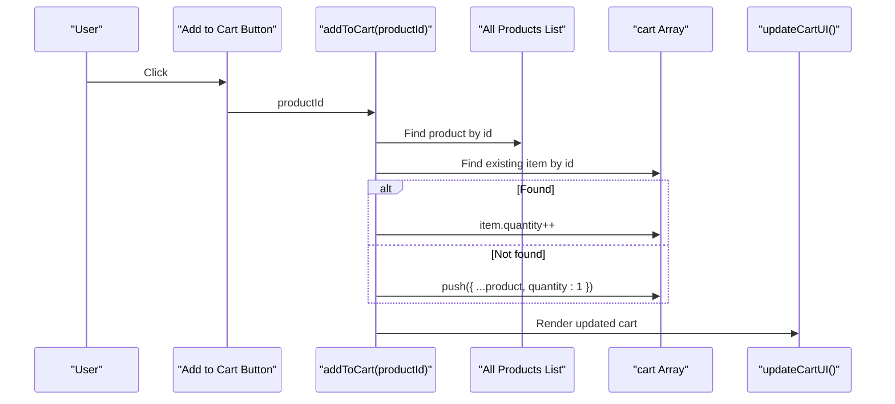
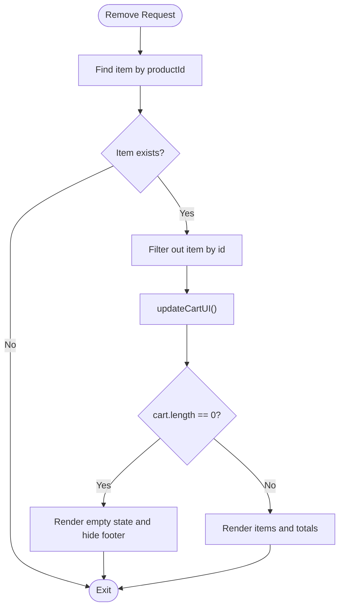
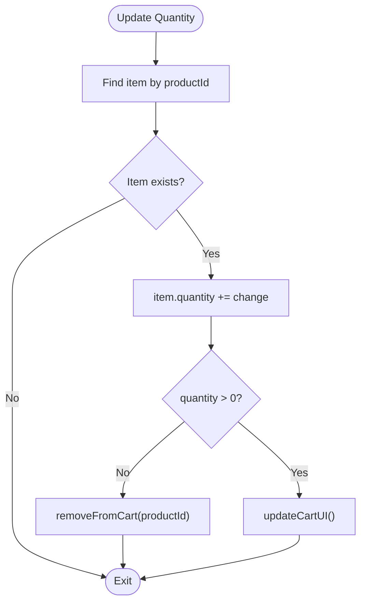
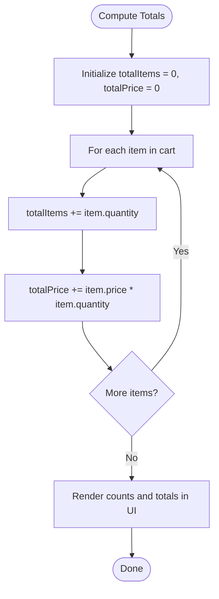
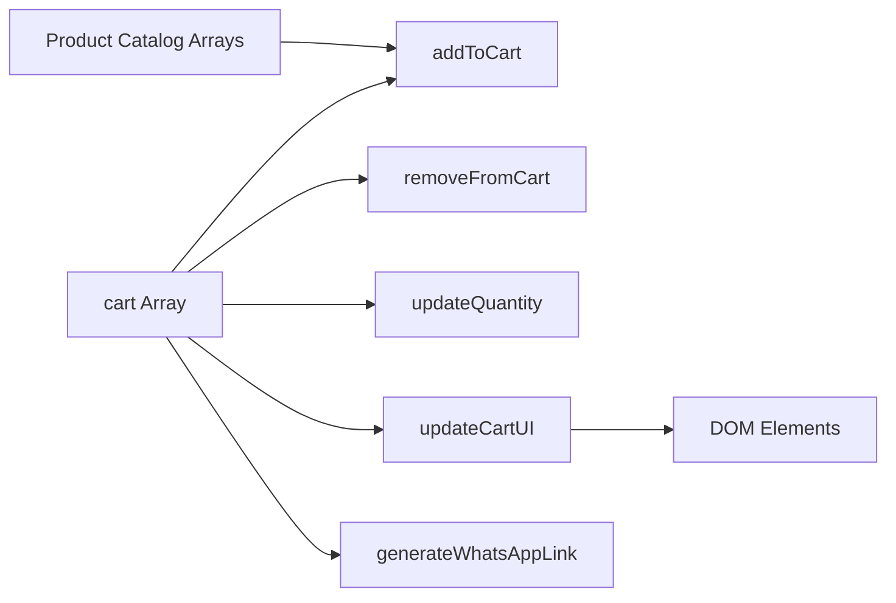

# Cart State Management

<cite>
**Referenced Files in This Document**
- [index.html](file://docs/index.html)
</cite>

## Table of Contents
1. [Introduction](#introduction)
2. [Project Structure](#project-structure)
3. [Core Components](#core-components)
4. [Architecture Overview](#architecture-overview)
5. [Detailed Component Analysis](#detailed-component-analysis)
6. [Dependency Analysis](#dependency-analysis)
7. [Performance Considerations](#performance-considerations)
8. [Troubleshooting Guide](#troubleshooting-guide)
9. [Conclusion](#conclusion)
10. [Appendices](#appendices)

## Introduction
This document explains the shopping cart state management system implemented in a single-page HTML application. It covers:
- The cart array structure and item schema
- Add-to-cart behavior, including duplicate handling and quantity updates
- Remove-from-cart logic and empty cart state
- Price calculation algorithms for subtotal computation and currency formatting
- Persistence strategy (in-memory only; no session or local storage)
- Examples for extending functionality, customizing item properties, and implementing validation rules
- Performance considerations for large datasets and memory optimization techniques

## Project Structure
The cart system is implemented within a single HTML file that contains:
- Product catalog arrays organized by category
- A global cart array representing the current user’s selections
- UI rendering functions to display products and cart contents
- Event-driven handlers for adding, removing, and updating items
- Price computation and checkout link generation

**Diagram sources**
- [index.html:1079-1328](file://docs/index.html#L1079-L1328)
- [index.html:1330](file://docs/index.html#L1330)
- [index.html:1446-1476](file://docs/index.html#L1446-L1476)
- [index.html:1478-1494](file://docs/index.html#L1478-L1494)
- [index.html:1496-1553](file://docs/index.html#L1496-L1553)

**Section sources**
- [index.html:1079-1328](file://docs/index.html#L1079-L1328)
- [index.html:1330](file://docs/index.html#L1330)
- [index.html:1446-1476](file://docs/index.html#L1446-L1476)
- [index.html:1478-1494](file://docs/index.html#L1478-L1494)
- [index.html:1496-1553](file://docs/index.html#L1496-L1553)

## Core Components
- Cart data store: an in-memory array initialized at page load. Each element represents a line item with product details and a quantity field.
- Product catalogs: multiple arrays grouped by category, each containing objects with fields such as id, name, name_zh, price, category, image, description, and description_zh.
- Handlers:
  - addToCart(productId): finds the product, checks for duplicates, increments quantity if present, otherwise pushes a new item with quantity 1.
  - removeFromCart(productId): filters out the item by id.
  - updateQuantity(productId, change): adjusts quantity and removes the item when quantity drops to zero or below.
- UI updater: updateCartUI() computes totals and re-renders the cart sidebar and footer.
- Checkout generator: generateWhatsAppLink() builds a message string from cart items and returns a WhatsApp URL.

Key responsibilities:
- Data integrity: ensure unique ids per line item and non-negative quantities.
- UI consistency: keep DOM state synchronized with the cart array after every mutation.
- Pricing accuracy: compute subtotals and totals using item.price * item.quantity.

**Section sources**
- [index.html:1330](file://docs/index.html#L1330)
- [index.html:1446-1476](file://docs/index.html#L1446-L1476)
- [index.html:1496-1553](file://docs/index.html#L1496-L1553)
- [index.html:1478-1494](file://docs/index.html#L1478-L1494)

## Architecture Overview
The cart system follows a simple unidirectional flow:
- User actions trigger handlers that mutate the in-memory cart array.
- After mutations, updateCartUI() recalculates totals and refreshes the DOM.
- Checkout uses generateWhatsAppLink() to produce a pre-filled message based on the current cart.

**Diagram sources**
- [index.html:1446-1476](file://docs/index.html#L1446-L1476)
- [index.html:1496-1553](file://docs/index.html#L1496-L1553)
- [index.html:1478-1494](file://docs/index.html#L1478-L1494)

## Detailed Component Analysis

### Cart Data Model
- Storage: In-memory array named cart.
- Item shape: Each item is a copy of a product object plus a quantity field.
- Product fields used by cart:
  - id: unique identifier for matching duplicates
  - name / name_zh: display names in English/Chinese
  - price: numeric value used for calculations
  - image: displayed in cart list
  - description / description_zh: shown in cart list
  - category: not directly used by cart logic but available from product source

Complexity:
- Lookup by id is O(n) where n is number of cart items.
- Insertion and removal are O(n) due to find/filter operations.

Optimization opportunities:
- Maintain a Map keyed by id for O(1) lookups and updates.
- Keep a separate lightweight line-item model with only required fields to reduce memory footprint.

**Section sources**
- [index.html:1330](file://docs/index.html#L1330)
- [index.html:1446-1455](file://docs/index.html#L1446-L1455)
- [index.html:1079-1328](file://docs/index.html#L1079-L1328)

### Add to Cart Functionality
Behavior:
- Concatenates all product arrays to locate the target product by id.
- If an item with the same id already exists in cart, increment its quantity.
- Otherwise, push a new item created by spreading the product object and setting quantity to 1.
- Calls updateCartUI() to reflect changes and shows a toast notification.

Duplicate handling:
- Duplicate detection is performed via cart.find(item => item.id === productId).
- Quantity is incremented rather than creating a new entry.

Edge cases:
- If productId does not match any product, addToCart will not add anything because product lookup fails.
- No explicit validation for negative or zero quantities during addition.

**Section sources**
- [index.html:1446-1459](file://docs/index.html#L1446-L1459)

#### Sequence Diagram: Add to Cart

**Diagram sources**
- [index.html:1446-1459](file://docs/index.html#L1446-L1459)
- [index.html:1496-1553](file://docs/index.html#L1496-L1553)

### Remove from Cart Logic
Behavior:
- Filters the cart array to exclude the item whose id matches the provided productId.
- Re-renders the cart UI immediately after removal.

Empty cart state:
- When cart.length equals 0, updateCartUI renders an empty-state placeholder and hides the footer section.

**Section sources**
- [index.html:1461-1464](file://docs/index.html#L1461-L1464)
- [index.html:1496-1553](file://docs/index.html#L1496-L1553)

#### Flowchart: Remove from Cart

**Diagram sources**
- [index.html:1461-1464](file://docs/index.html#L1461-L1464)
- [index.html:1496-1553](file://docs/index.html#L1496-L1553)

### Update Quantity Logic
Behavior:
- Finds the item by productId and adds the change (+1 or -1).
- If the resulting quantity is less than or equal to zero, it removes the item via removeFromCart.
- Otherwise, it updates the UI.

Validation:
- Prevents negative quantities by removing the item when quantity reaches zero or below.

**Section sources**
- [index.html:1466-1476](file://docs/index.html#L1466-L1476)

#### Flowchart: Update Quantity

**Diagram sources**
- [index.html:1466-1476](file://docs/index.html#L1466-L1476)

### Price Calculation Algorithms
Subtotal computation:
- Total items count: sum of item.quantity across all items.
- Subtotal total: sum of item.price * item.quantity across all items.

Currency formatting:
- Prices are rendered as plain numbers prefixed with a dollar sign without decimal formatting.
- Line item totals and cart total use the same pattern.

Checkout message:
- Generates a text message listing each item with id, localized name, quantity, and line total.
- Appends a final total line and a call-to-action message in the selected language.

**Section sources**
- [index.html:1496-1553](file://docs/index.html#L1496-L1553)
- [index.html:1478-1494](file://docs/index.html#L1478-L1494)

#### Flowchart: Subtotal Computation

**Diagram sources**
- [index.html:1496-1553](file://docs/index.html#L1496-L1553)

### Cart Persistence Strategy
Current implementation:
- Uses an in-memory array for cart state.
- No usage of localStorage, sessionStorage, cookies, or server-side persistence.
- Cart resets on page reload.

Recommendations for session-based persistence:
- Persist cart to sessionStorage to survive tab refreshes while clearing on close.
- Optionally persist to localStorage for cross-session retention.
- Integrate persistence hooks into addToCart, removeFromCart, and updateQuantity to save after each mutation.

**Section sources**
- [index.html:1330](file://docs/index.html#L1330)
- [index.html:1446-1476](file://docs/index.html#L1446-L1476)

### Extending Cart Functionality
Examples you can implement:
- Custom item properties:
  - Add optional fields like color, size, or gift message to product objects and propagate them into cart items when added.
- Validation rules:
  - Enforce minimum order amounts before enabling checkout.
  - Limit maximum quantity per item.
  - Validate stock availability against a backend inventory endpoint.
- Additional features:
  - Apply discount codes or promotions.
  - Group items by category for shipping estimates.
  - Export cart to JSON for analytics or backup.

Implementation guidance:
- Extend the item creation in addToCart to include new fields.
- Update updateCartUI to render additional fields.
- Modify generateWhatsAppLink to include extra details in the checkout message.

[No sources needed since this section provides general guidance]

## Dependency Analysis
The cart system has minimal dependencies:
- DOM APIs for reading/writing elements.
- Global variables for product arrays and cart state.
- Language toggle affects which localized strings are used in UI and checkout messages.

**Diagram sources**
- [index.html:1079-1328](file://docs/index.html#L1079-L1328)
- [index.html:1330](file://docs/index.html#L1330)
- [index.html:1446-1476](file://docs/index.html#L1446-L1476)
- [index.html:1478-1494](file://docs/index.html#L1478-L1494)
- [index.html:1496-1553](file://docs/index.html#L1496-L1553)

**Section sources**
- [index.html:1079-1328](file://docs/index.html#L1079-L1328)
- [index.html:1330](file://docs/index.html#L1330)
- [index.html:1446-1476](file://docs/index.html#L1446-L1476)
- [index.html:1478-1494](file://docs/index.html#L1478-L1494)
- [index.html:1496-1553](file://docs/index.html#L1496-L1553)

## Performance Considerations
- Time complexity:
  - addToCart: O(n) to find existing item; O(1) to push new item.
  - removeFromCart: O(n) to filter.
  - updateQuantity: O(n) to find item.
  - updateCartUI: O(n) to compute totals and O(n) to render items.
- Memory usage:
  - Each cart item holds a full product object copy. For large catalogs or many items, consider storing only necessary fields in cart entries.
- Optimization techniques:
  - Use a Map keyed by id for O(1) lookups and updates.
  - Debounce rapid UI updates if batch operations occur.
  - Virtualize or paginate cart rendering if displaying very large lists.
  - Avoid repeated concatenation of product arrays; cache a flattened index once.

[No sources needed since this section provides general guidance]

## Troubleshooting Guide
Common issues and resolutions:
- Adding an unknown productId:
  - Symptom: Nothing appears in cart.
  - Cause: Product lookup fails; addToCart does not add anything.
  - Resolution: Ensure productId corresponds to an existing product in one of the catalog arrays.
- Negative or zero quantity:
  - Behavior: Decreasing quantity to zero or below removes the item automatically.
  - Resolution: This is expected; validate user interactions to prevent accidental decrements.
- Totals not updating:
  - Symptom: Cart totals remain unchanged after modifications.
  - Cause: Missing call to updateCartUI after mutation.
  - Resolution: Ensure updateCartUI is invoked after any cart change.
- Empty cart UI not showing:
  - Symptom: Footer remains visible even when cart is empty.
  - Cause: DOM class toggling may be incorrect.
  - Resolution: Verify cartFooter visibility is controlled by cart.length check in updateCartUI.

**Section sources**
- [index.html:1446-1476](file://docs/index.html#L1446-L1476)
- [index.html:1496-1553](file://docs/index.html#L1496-L1553)

## Conclusion
The cart system is a straightforward, in-memory implementation suitable for small-scale use cases. It provides essential operations for adding, removing, and updating items, along with basic price computation and a WhatsApp-based checkout flow. To scale up, consider introducing persistent storage, optimized data structures, and robust validation rules.

[No sources needed since this section summarizes without analyzing specific files]

## Appendices

### Appendix A: Cart Item Schema
- Fields:
  - id: number/string unique identifier
  - name: string
  - name_zh: string
  - price: number
  - image: string URL
  - description: string
  - description_zh: string
  - quantity: number (added at runtime)

**Section sources**
- [index.html:1079-1328](file://docs/index.html#L1079-L1328)
- [index.html:1446-1455](file://docs/index.html#L1446-L1455)

### Appendix B: Example Extensions
- Add a “gift wrap” option:
  - Include a boolean field in product objects and propagate it into cart items.
  - Update updateCartUI to show the option and adjust totals accordingly.
- Implement stock limits:
  - Add a maxStock field to product objects.
  - In addToCart and updateQuantity, enforce item.quantity <= maxStock.
- Persist cart across sessions:
  - Save cart to localStorage on each mutation.
  - Load cart from localStorage on page initialization.

[No sources needed since this section provides general guidance]