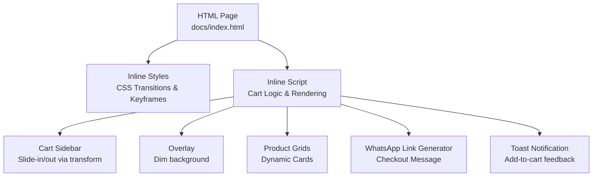
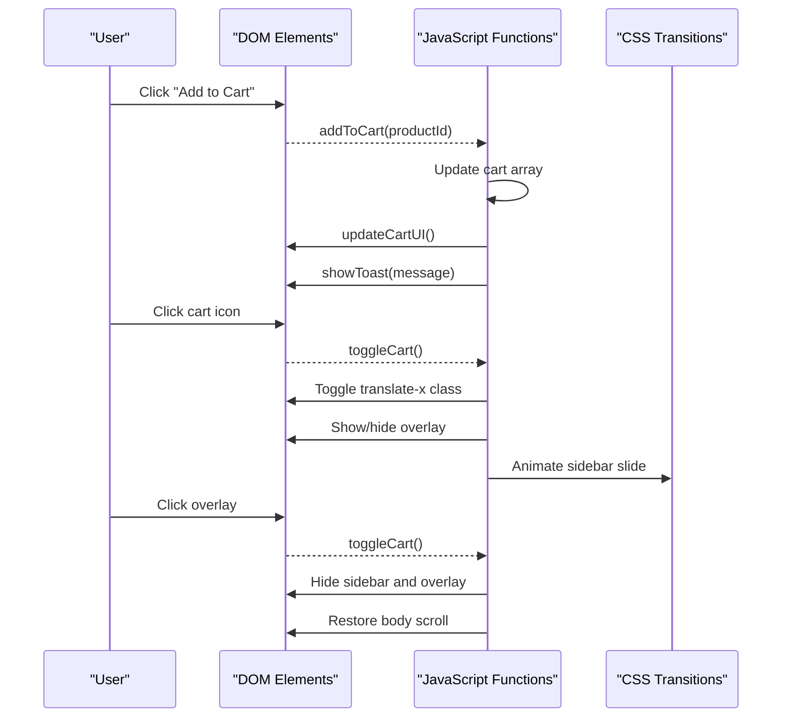
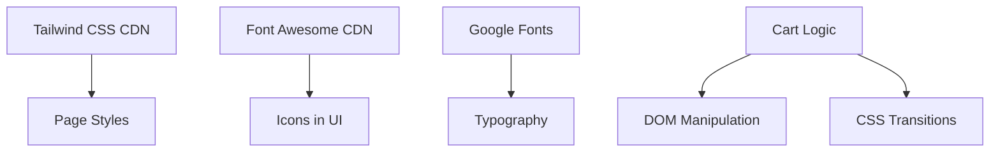

# Cart UI & Animations

<cite>
**Referenced Files in This Document**
- [index.html](file://docs/index.html)
</cite>

## Table of Contents
1. [Introduction](#introduction)
2. [Project Structure](#project-structure)
3. [Core Components](#core-components)
4. [Architecture Overview](#architecture-overview)
5. [Detailed Component Analysis](#detailed-component-analysis)
6. [Dependency Analysis](#dependency-analysis)
7. [Performance Considerations](#performance-considerations)
8. [Troubleshooting Guide](#troubleshooting-guide)
9. [Conclusion](#conclusion)
10. [Appendices](#appendices)

## Introduction
This document explains the shopping cart user interface and animation system implemented in a single-page site for a florist shop. It focuses on:
- Slide-in/out sidebar animations using CSS transform and transitions
- Overlay dimming when the cart is open
- Responsive behavior across mobile and desktop
- Dynamic cart item rendering with template literals
- Empty cart state display
- Footer section with delivery information
- Customization examples, touch gesture support, cross-browser compatibility, and performance optimization tips

The implementation is contained within one HTML file that includes inline styles and JavaScript.

## Project Structure
The project consists of a single page with embedded CSS and JavaScript. The cart UI is composed of:
- A fixed overlay that dims the background
- A right-side slide-in sidebar containing cart items and footer actions
- A floating WhatsApp button and toast notifications
- Product grids that add items to the cart

**Diagram sources**
- [index.html:39-208](file://docs/index.html#L39-L208)
- [index.html:813-860](file://docs/index.html#L813-L860)
- [index.html:874-879](file://docs/index.html#L874-L879)
- [index.html:1376-1444](file://docs/index.html#L1376-L1444)
- [index.html:1446-1553](file://docs/index.html#L1446-L1553)
- [index.html:1555-1568](file://docs/index.html#L1555-L1568)
- [index.html:1575-1585](file://docs/index.html#L1575-L1585)

**Section sources**
- [index.html:39-208](file://docs/index.html#L39-L208)
- [index.html:813-860](file://docs/index.html#L813-L860)
- [index.html:874-879](file://docs/index.html#L874-L879)
- [index.html:1376-1444](file://docs/index.html#L1376-L1444)
- [index.html:1446-1553](file://docs/index.html#L1446-L1553)
- [index.html:1555-1568](file://docs/index.html#L1555-L1568)
- [index.html:1575-1585](file://docs/index.html#L1575-L1585)

## Core Components
- Cart Sidebar: Fixed panel on the right edge; slides in/out by toggling translate-x classes.
- Overlay: Full-screen backdrop with blur effect; closes the cart when clicked.
- Cart Items Renderer: Builds list items dynamically from an in-memory cart array.
- Empty State: Shows placeholder content when the cart is empty.
- Cart Footer: Displays subtotal, delivery options, pre-order notice, and checkout link.
- Toast: Temporary notification after adding items.
- Language Switcher: Updates text and re-renders product cards and cart content.

Key responsibilities:
- Toggle visibility and body scroll lock
- Maintain cart state (add/remove/update quantity)
- Generate localized WhatsApp checkout message
- Render dynamic content with template literals

**Section sources**
- [index.html:813-860](file://docs/index.html#L813-L860)
- [index.html:1446-1553](file://docs/index.html#L1446-L1553)
- [index.html:1555-1568](file://docs/index.html#L1555-L1568)
- [index.html:1575-1585](file://docs/index.html#L1575-L1585)
- [index.html:1376-1444](file://docs/index.html#L1376-L1444)

## Architecture Overview
The cart system follows a simple event-driven architecture:
- User interactions trigger functions that update the cart array and UI
- CSS transforms drive smooth animations without layout thrashing
- Overlay manages focus and prevents background scrolling
- Localization updates both static text and dynamic content

**Diagram sources**
- [index.html:1446-1459](file://docs/index.html#L1446-L1459)
- [index.html:1496-1553](file://docs/index.html#L1496-L1553)
- [index.html:1555-1568](file://docs/index.html#L1555-L1568)
- [index.html:1575-1585](file://docs/index.html#L1575-L1585)
- [index.html:90-92](file://docs/index.html#L90-L92)
- [index.html:142-144](file://docs/index.html#L142-L144)

## Detailed Component Analysis

### Slide-in/out Animation System
- Implementation uses CSS transform translateX and transition timing functions for smooth sliding.
- The sidebar starts off-screen with translate-x-full and slides into view by removing that class.
- Transition duration and easing are defined in a dedicated class for reuse.

Customization tips:
- Adjust transition duration and easing curve to change speed and feel
- Use different transform values for left/right or top/bottom variants
- Add keyframe-based entrance/exit effects if needed

Cross-browser notes:
- Modern browsers fully support transform and transition
- For older environments, consider fallbacks or polyfills if necessary

**Section sources**
- [index.html:90-92](file://docs/index.html#L90-L92)
- [index.html:110-122](file://docs/index.html#L110-L122)
- [index.html:1555-1568](file://docs/index.html#L1555-L1568)

### Overlay System
- A full-screen overlay with backdrop blur dims the background when the cart is open.
- Clicking the overlay closes the cart and restores body scroll.
- Z-index ensures overlay sits above page content but below the sidebar.

Accessibility considerations:
- Prevent background scrolling while the cart is open
- Ensure keyboard users can close the cart via Escape (optional enhancement)

**Section sources**
- [index.html:142-144](file://docs/index.html#L142-L144)
- [index.html:814-816](file://docs/index.html#L814-L816)
- [index.html:1555-1568](file://docs/index.html#L1555-L1568)

### Responsive Design Patterns
- The sidebar uses max-width and full height to adapt to various screen sizes.
- Product grids switch columns based on breakpoints for mobile, tablet, and desktop.
- Mobile navigation menu toggles visibility for smaller screens.

Best practices:
- Keep interactive targets large enough for touch
- Avoid horizontal overflow inside the sidebar
- Test font sizes and spacing at small widths

**Section sources**
- [index.html:815-816](file://docs/index.html#L815-L816)
- [index.html:417](file://docs/index.html#L417)
- [index.html:471](file://docs/index.html#L471)
- [index.html:509](file://docs/index.html#L509)
- [index.html:528](file://docs/index.html#L528)
- [index.html:547](file://docs/index.html#L547)
- [index.html:566](file://docs/index.html#L566)
- [index.html:585](file://docs/index.html#L585)
- [index.html:267-281](file://docs/index.html#L267-L281)

### Cart Item Rendering Logic
- Products are stored in arrays per category and rendered into grid containers.
- Each product card is generated via a function that returns a template literal string.
- The cart renders items by mapping over the cart array and building HTML fragments.

Template literals usage:
- Interpolate product fields such as name, description, price, image URL, and ID
- Conditionally render badges and colors based on category
- Localize labels and descriptions based on current language

Empty cart state:
- When the cart is empty, a friendly message and call-to-action are shown
- The footer section remains hidden until there are items

**Section sources**
- [index.html:1376-1404](file://docs/index.html#L1376-L1404)
- [index.html:1406-1444](file://docs/index.html#L1406-L1444)
- [index.html:1496-1553](file://docs/index.html#L1496-L1553)

### Cart Footer and Delivery Information
- The footer shows subtotal, delivery options, and a pre-order notice
- Checkout link generates a WhatsApp message including all items and totals
- Delivery pricing and pickup details are displayed consistently

Localization:
- All labels and messages update when switching languages
- The WhatsApp message is built dynamically based on selected language

**Section sources**
- [index.html:835-859](file://docs/index.html#L835-L859)
- [index.html:1478-1494](file://docs/index.html#L1478-L1494)
- [index.html:1496-1553](file://docs/index.html#L1496-L1553)

### Touch Gestures for Mobile Devices
- The current implementation does not include swipe gestures
- To add swipe-to-close:
  - Track touchstart and touchmove to calculate delta X
  - If delta exceeds a threshold, trigger the close action
  - Provide visual feedback during drag (e.g., partial slide-out)
- Ensure gestures do not conflict with scrolling

Implementation guidance:
- Use passive listeners for better scroll performance
- Debounce or throttle movement calculations if needed
- Reset transform on release if gesture is canceled

[No sources needed since this section provides general guidance]

### Cross-Browser Compatibility
- Transform and transition are widely supported in modern browsers
- Backdrop-filter may have limited support in some environments; consider a semi-transparent background fallback
- Smooth scrolling is enabled globally; ensure it does not interfere with other behaviors

Recommendations:
- Test on iOS Safari, Android Chrome, and desktop browsers
- Provide graceful degradation where features like backdrop-filter are unsupported

**Section sources**
- [index.html:142-144](file://docs/index.html#L142-L144)
- [index.html:155-157](file://docs/index.html#L155-L157)

### Performance Optimization for Smooth Animations
- Prefer transform and opacity for animations to leverage GPU acceleration
- Avoid triggering layout recalculations during animations
- Minimize heavy operations in event handlers; keep logic lightweight
- Use requestAnimationFrame only if you need frame-by-frame control

Practical tips:
- Keep transition durations short (around 0.3–0.5s) for snappy UX
- Reduce number of animated elements simultaneously
- Preload critical images and use responsive image attributes

[No sources needed since this section provides general guidance]

## Dependency Analysis
The cart system has minimal dependencies:
- Tailwind CSS via CDN for utility classes
- Font Awesome icons via CDN
- Google Fonts for typography
- No external JavaScript libraries; all logic is vanilla JS

**Diagram sources**
- [index.html:8-12](file://docs/index.html#L8-L12)
- [index.html:13-38](file://docs/index.html#L13-L38)
- [index.html:1332-1351](file://docs/index.html#L1332-L1351)
- [index.html:1555-1568](file://docs/index.html#L1555-L1568)

**Section sources**
- [index.html:8-12](file://docs/index.html#L8-L12)
- [index.html:13-38](file://docs/index.html#L13-L38)
- [index.html:1332-1351](file://docs/index.html#L1332-L1351)
- [index.html:1555-1568](file://docs/index.html#L1555-L1568)

## Performance Considerations
- Use transform-based animations to avoid layout thrash
- Keep cart data in memory and batch DOM updates
- Avoid excessive reflows by updating innerHTML once per render cycle
- Optimize images with appropriate sizing and compression
- Limit concurrent animations to maintain 60fps on mobile devices

[No sources needed since this section provides general guidance]

## Troubleshooting Guide
Common issues and resolutions:
- Cart does not close when clicking overlay:
  - Verify overlay click handler calls the toggle function
  - Ensure z-index values place overlay above content but below sidebar
- Body scroll remains locked after closing:
  - Confirm the toggle function resets body overflow style
- Cart count badge not updating:
  - Check that totalItems calculation and class toggling occur in updateCartUI
- WhatsApp link not generating correctly:
  - Validate message construction and URL encoding
- Animations feel sluggish:
  - Reduce transition duration and easing complexity
  - Remove unnecessary transforms or filters during animation

**Section sources**
- [index.html:814-816](file://docs/index.html#L814-L816)
- [index.html:1555-1568](file://docs/index.html#L1555-L1568)
- [index.html:1496-1553](file://docs/index.html#L1496-L1553)
- [index.html:1478-1494](file://docs/index.html#L1478-L1494)
- [index.html:90-92](file://docs/index.html#L90-L92)

## Conclusion
The cart UI combines a clean design with efficient animations and straightforward logic. By leveraging CSS transforms and transitions, the sidebar offers smooth slide-in/out behavior, while the overlay enhances focus and usability. Dynamic rendering with template literals supports localization and flexible content generation. With minor enhancements—such as touch gestures and robust fallbacks—the system can deliver a polished experience across devices and browsers.

[No sources needed since this section summarizes without analyzing specific files]

## Appendices

### Customization Examples
- Change animation speed:
  - Adjust transition duration in the slide class
- Add new UI element:
  - Insert markup in the sidebar and wire up events in the script
- Implement swipe-to-close:
  - Add touch event listeners to track horizontal movement and trigger close on threshold

[No sources needed since this section provides general guidance]