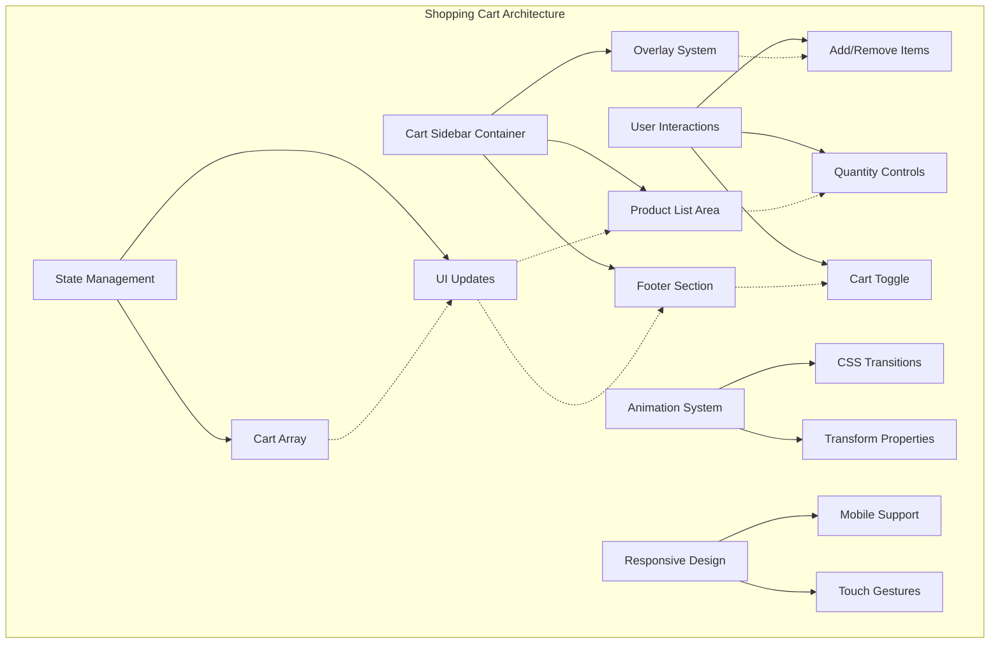
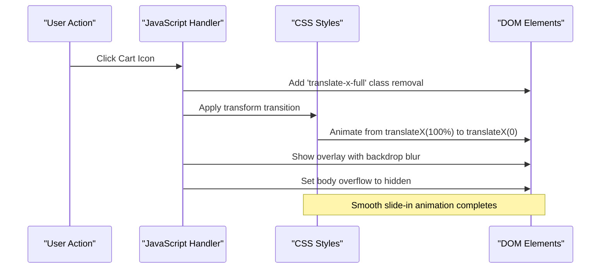
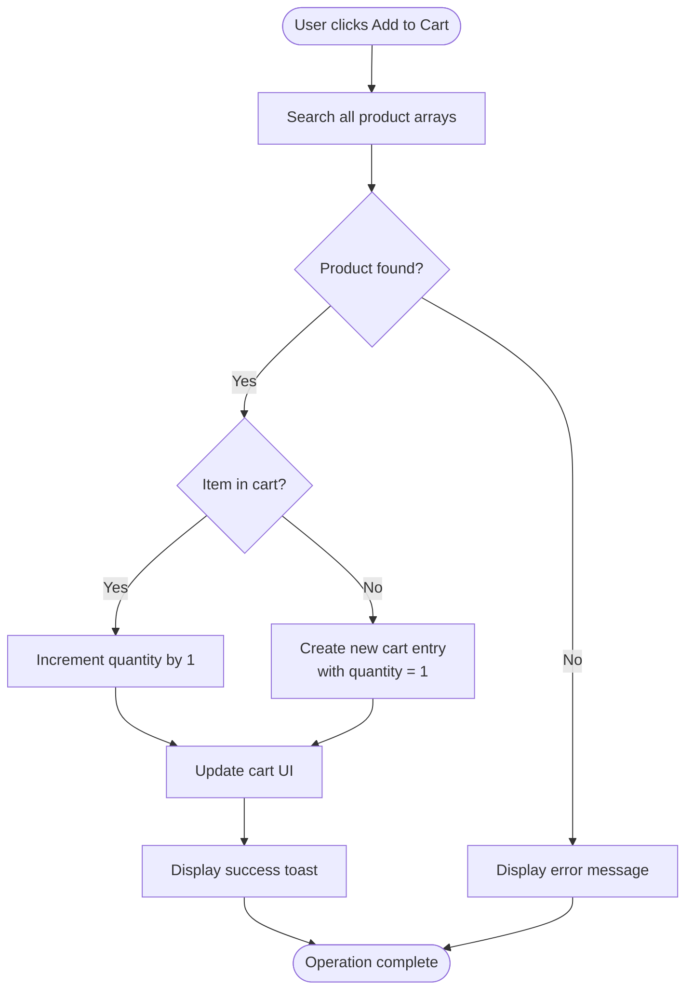
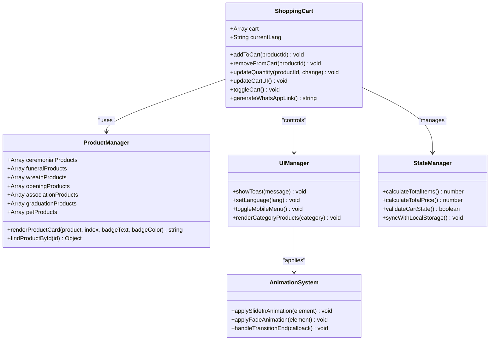
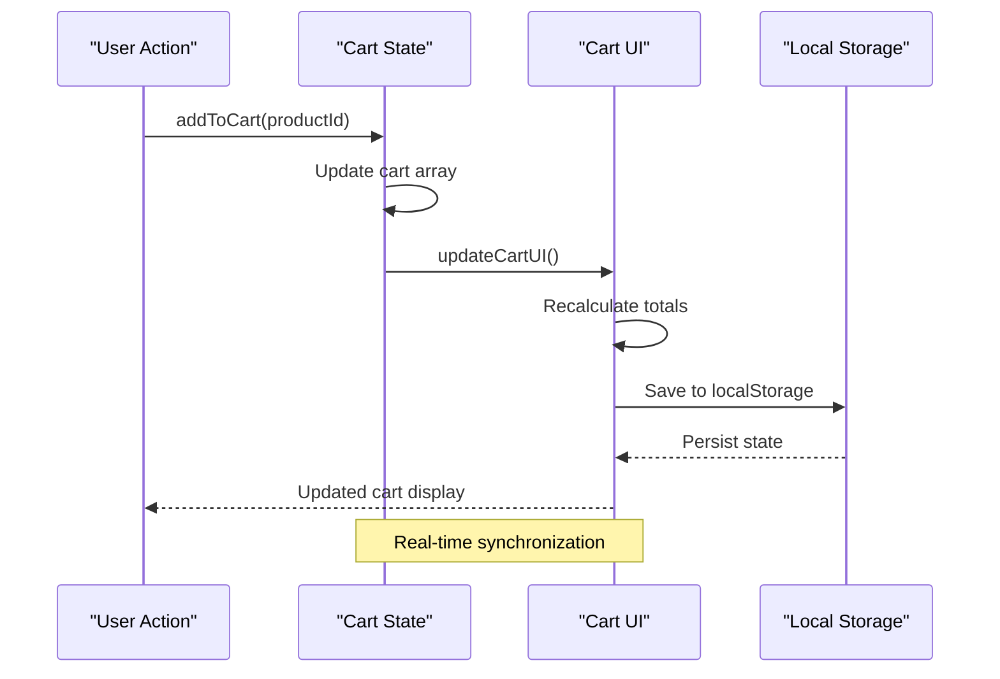
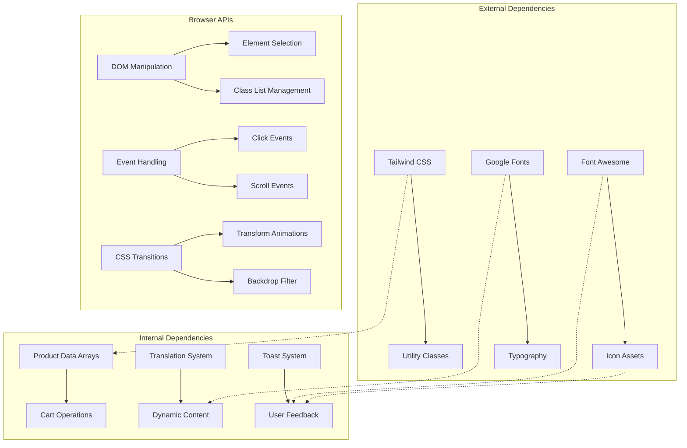

# Shopping Cart Sidebar

<cite>
**Referenced Files in This Document**
- [index.html](file://docs/index.html)
</cite>

## Table of Contents
1. [Introduction](#introduction)
2. [Project Structure](#project-structure)
3. [Core Components](#core-components)
4. [Architecture Overview](#architecture-overview)
5. [Detailed Component Analysis](#detailed-component-analysis)
6. [Dependency Analysis](#dependency-analysis)
7. [Performance Considerations](#performance-considerations)
8. [Troubleshooting Guide](#troubleshooting-guide)
9. [Conclusion](#conclusion)

## Introduction

The Shopping Cart Sidebar is a sophisticated e-commerce component implemented as part of a florist website's user interface. This component provides a slide-in shopping cart experience with advanced state management, smooth animations, and responsive design. The implementation demonstrates modern web development practices including CSS transitions, JavaScript state management, and mobile-first responsive design principles.

The shopping cart sidebar serves as the central hub for product selection, quantity management, and checkout processes. It features real-time price calculations, WhatsApp integration for order placement, and seamless user interactions across different screen sizes and devices.

## Project Structure

The shopping cart sidebar is implemented within a single HTML file that contains embedded CSS styles and JavaScript functionality. The component follows a modular architecture pattern where each aspect of the cart functionality is encapsulated in separate functions and event handlers.

**Diagram sources**
- [index.html:813-860](file://docs/index.html#L813-L860)
- [index.html:1330-1585](file://docs/index.html#L1330-L1585)

**Section sources**
- [index.html:813-860](file://docs/index.html#L813-L860)
- [index.html:1330-1585](file://docs/index.html#L1330-L1585)

## Core Components

### Slide-in Animation System

The shopping cart sidebar implements a sophisticated slide-in animation using CSS transforms and transitions. The animation system provides smooth visual feedback when opening and closing the cart interface.

#### CSS Transition Implementation

The core animation relies on CSS transform properties with cubic-bezier easing functions for natural motion curves. The transition duration is set to 0.4 seconds with a custom timing function that creates a smooth deceleration effect.

**Diagram sources**
- [index.html:90-92](file://docs/index.html#L90-L92)
- [index.html:1555-1568](file://docs/index.html#L1555-L1568)

#### Transform Property States

The animation system uses two primary transform states:
- **Closed State**: `translate-x-full` positions the cart completely off-screen to the right
- **Open State**: Default position shows the cart at `translateX(0)` relative to its container

The transition property ensures smooth interpolation between these states with consistent timing across all supported browsers.

### State Management System

The shopping cart maintains a comprehensive state management system that tracks cart items, quantities, and total prices in real-time. The state is managed through a centralized JavaScript array structure with associated utility functions.

#### Data Structure Architecture

The cart state is represented as an array of objects, where each object contains product information and quantity data. This structure enables efficient operations for adding, removing, and updating cart items.

| Property | Type | Description | Example Value |
|----------|------|-------------|---------------|
| id | Number | Unique product identifier | 101, 201, 302 |
| name | String | English product name | "Premium Traditional White Wreath" |
| name_zh | String | Chinese product name | "高級傳統白花圈" |
| price | Number | Product price in HKD | 580, 688, 780 |
| category | String | Product category classification | "funeral", "ceremonial", "wreath" |
| image | String | Product image URL | Unsplash CDN URLs |
| description | String | English product description | Detailed product information |
| description_zh | String | Chinese product description | 詳細產品資訊 |
| quantity | Number | Current cart quantity | 1, 2, 3 |

#### State Update Operations

The state management system provides several key operations:

- **Add to Cart**: Creates new cart entries or increments existing item quantities
- **Remove from Cart**: Filters out specific items from the cart array
- **Update Quantity**: Modifies item quantities with automatic removal when quantity reaches zero
- **Calculate Totals**: Computes total items count and aggregate pricing

**Section sources**
- [index.html:1330-1331](file://docs/index.html#L1330-L1331)
- [index.html:1446-1476](file://docs/index.html#L1446-L1476)
- [index.html:1496-1553](file://docs/index.html#L1496-L1553)

### User Interaction Handlers

The shopping cart implements comprehensive user interaction handlers that provide intuitive controls for managing cart contents and navigating the shopping experience.

#### Add/Remove Item Operations

The add-to-cart functionality searches through all available products across multiple categories to find matching items by ID. When a product exists in the cart, the system increments its quantity; otherwise, it creates a new cart entry with initial quantity of one.

**Diagram sources**
- [index.html:1446-1459](file://docs/index.html#L1446-L1459)

#### Quantity Control System

The quantity control system provides increment and decrement buttons for each cart item. The system includes validation logic to prevent negative quantities and automatically removes items when quantities reach zero.

#### Total Price Calculation

Total price calculations are performed in real-time whenever cart state changes. The system computes both individual item totals (price × quantity) and overall cart totals by summing all item contributions.

**Section sources**
- [index.html:1446-1476](file://docs/index.html#L1446-L1476)
- [index.html:1496-1553](file://docs/index.html#L1496-L1553)

### Overlay System

The overlay system provides visual context and focus management when the shopping cart is open. It dims the background content and prevents interaction with elements outside the cart interface.

#### Backdrop Implementation

The overlay uses CSS backdrop-filter with blur effects to create a frosted glass appearance over the main content. The overlay element is positioned absolutely to cover the entire viewport and includes click-to-close functionality.

#### Focus Management

When the cart opens, the system sets the document body overflow to hidden, preventing scroll interactions with the underlying content. This creates a modal-like experience that keeps user attention focused on the cart interface.

**Section sources**
- [index.html:814](file://docs/index.html#L814)
- [index.html:1555-1568](file://docs/index.html#L1555-L1568)

### Responsive Behavior and Touch Device Support

The shopping cart sidebar implements comprehensive responsive design patterns that adapt seamlessly across different screen sizes and input methods.

#### Mobile-First Design Approach

The cart sidebar uses flexible width constraints with maximum width limitations for larger screens while maintaining full-width display on mobile devices. The responsive behavior ensures optimal usability across all device types.

#### Touch Gesture Support

Touch interactions are handled through standard click events, which work consistently across both mouse and touch interfaces. The system includes appropriate touch target sizing and spacing for comfortable mobile interaction.

#### Viewport Adaptation

The cart sidebar adapts to different viewport sizes through CSS media queries and flexible layout techniques. On smaller screens, the cart takes up the full viewport width, while larger screens constrain the cart to a reasonable maximum width.

**Section sources**
- [index.html:815-816](file://docs/index.html#L815-L816)
- [index.html:1555-1568](file://docs/index.html#L1555-L1568)

## Architecture Overview

The shopping cart sidebar follows a modular architecture pattern that separates concerns between presentation, state management, and user interaction handling. This separation enables maintainable code organization and facilitates future enhancements.

**Diagram sources**
- [index.html:1330-1585](file://docs/index.html#L1330-L1585)

## Detailed Component Analysis

### Slide-in Animation Implementation

The slide-in animation system represents the most visually prominent aspect of the shopping cart component. It combines CSS transforms, transitions, and JavaScript class manipulation to create smooth, performant animations.

#### CSS Transform Properties

The animation relies on three key CSS properties working together:

1. **Transform Property**: Uses `translateX()` to control horizontal positioning
2. **Transition Property**: Defines animation duration and easing functions  
3. **Transform Origin**: Ensures consistent animation behavior across browsers

The cubic-bezier timing function `cubic-bezier(0.4, 0, 0.2, 1)` creates a natural deceleration curve that feels responsive and polished.

#### JavaScript Animation Control

The animation control system toggles CSS classes to trigger state changes:

- **Opening Sequence**: Removes `translate-x-full` class and adds overlay visibility
- **Closing Sequence**: Adds `translate-x-full` class and hides overlay
- **Scroll Locking**: Manages document body overflow during cart display

#### Performance Optimization

The animation system prioritizes performance by:
- Using GPU-accelerated transform properties
- Minimizing DOM manipulation during animations
- Implementing efficient class-based state management
- Avoiding layout thrashing through batched updates

**Section sources**
- [index.html:90-92](file://docs/index.html#L90-L92)
- [index.html:1555-1568](file://docs/index.html#L1555-L1568)

### State Management Architecture

The state management system implements a unidirectional data flow pattern where state changes trigger UI updates, ensuring consistency between data and presentation layers.

#### Data Flow Architecture

**Diagram sources**
- [index.html:1446-1459](file://docs/index.html#L1446-L1459)
- [index.html:1496-1553](file://docs/index.html#L1496-L1553)

#### State Persistence Strategy

While the current implementation manages state in memory, the architecture supports easy extension to include local storage persistence. The state structure is designed to be serializable and compatible with browser storage APIs.

#### Error Handling and Validation

The state management system includes validation logic to ensure data integrity:
- Prevents negative quantities
- Validates product existence before cart operations
- Handles edge cases like duplicate product additions
- Maintains consistent state across language switches

**Section sources**
- [index.html:1330-1331](file://docs/index.html#L1330-L1331)
- [index.html:1446-1476](file://docs/index.html#L1446-L1476)

### User Interaction Framework

The user interaction framework provides a comprehensive set of event handlers that respond to various user actions with appropriate feedback and state updates.

#### Event Handler Architecture

Each user interaction follows a consistent pattern:
1. **Event Detection**: Identify user action type and parameters
2. **State Validation**: Verify operation feasibility
3. **State Mutation**: Update internal state accordingly
4. **UI Synchronization**: Refresh interface to reflect changes
5. **User Feedback**: Provide visual confirmation of actions

#### Touch and Mouse Compatibility

The interaction system handles both mouse and touch events uniformly, ensuring consistent behavior across desktop and mobile devices. Touch targets are sized appropriately for finger interaction, and gesture conflicts are minimized.

#### Accessibility Features

The interaction framework includes accessibility considerations such as keyboard navigation support, proper ARIA attributes, and screen reader compatibility through semantic HTML structure.

**Section sources**
- [index.html:1446-1476](file://docs/index.html#L1446-L1476)
- [index.html:1555-1568](file://docs/index.html#L1555-L1568)

### Integration Points and Extensibility

The shopping cart component is designed with extensibility in mind, providing clear integration points for additional functionality and external service connections.

#### API Integration Hooks

The component structure supports easy integration with external APIs:
- **Product Catalog APIs**: Replace static product arrays with dynamic loading
- **Payment Processing**: Extend checkout functionality with payment gateways
- **Inventory Management**: Connect to backend inventory systems
- **Analytics Tracking**: Add user behavior tracking and conversion metrics

#### Customization Points

Key customization areas include:
- **Animation Timing**: Modify CSS transition durations and easing functions
- **Styling Themes**: Override CSS variables and Tailwind classes
- **Business Logic**: Extend cart calculation rules and validation
- **Notification Systems**: Enhance toast notifications with more detailed feedback

**Section sources**
- [index.html:1478-1494](file://docs/index.html#L1478-L1494)
- [index.html:1575-1585](file://docs/index.html#L1575-L1585)

## Dependency Analysis

The shopping cart component has minimal external dependencies, relying primarily on built-in browser APIs and CSS capabilities. This lightweight approach ensures broad compatibility and reduces bundle size.

**Diagram sources**
- [index.html:8-12](file://docs/index.html#L8-L12)
- [index.html:1330-1585](file://docs/index.html#L1330-L1585)

### External Library Dependencies

The component utilizes several external libraries for enhanced functionality:

- **Tailwind CSS**: Provides utility-first styling classes for rapid UI development
- **Font Awesome**: Supplies icon assets for visual indicators and interactive elements
- **Google Fonts**: Delivers optimized typography with fallback fonts for cross-platform consistency

### Browser API Usage

The component leverages modern browser APIs for core functionality:

- **DOM API**: Element selection, manipulation, and event handling
- **CSS Transitions**: Hardware-accelerated animations and transitions
- **Event Loop**: Asynchronous user interaction processing
- **Storage APIs**: Potential local storage integration for state persistence

**Section sources**
- [index.html:8-12](file://docs/index.html#L8-L12)
- [index.html:1330-1585](file://docs/index.html#L1330-L1585)

## Performance Considerations

The shopping cart component implements several performance optimization strategies to ensure smooth animations and responsive interactions, particularly important for mobile devices and large datasets.

### Animation Performance Optimization

The animation system prioritizes GPU acceleration by using transform and opacity properties exclusively for animations. This approach minimizes layout recalculations and repaint operations, resulting in butter-smooth 60fps animations even on lower-end devices.

#### Memory Management Strategies

For large cart datasets, the component employs several memory management techniques:

- **Efficient DOM Updates**: Batch DOM manipulations to minimize reflows
- **Event Delegation**: Use single event listeners where possible
- **Object Pooling**: Reuse DOM elements and data structures
- **Garbage Collection**: Proper cleanup of event listeners and references

#### Rendering Optimization

The rendering system optimizes performance through:

- **Virtual DOM Concepts**: Minimize actual DOM mutations
- **Lazy Loading**: Load product images only when needed
- **Debounced Updates**: Throttle frequent state updates
- **CSS Containment**: Isolate component rendering boundaries

### Scalability Considerations

The component architecture supports scaling to handle large product catalogs and high-frequency user interactions:

- **Modular Data Structures**: Separate concerns for better maintainability
- **Configurable Limits**: Implement pagination for very large datasets
- **Caching Strategies**: Cache frequently accessed product data
- **Progressive Enhancement**: Graceful degradation for older browsers

**Section sources**
- [index.html:90-92](file://docs/index.html#L90-L92)
- [index.html:1496-1553](file://docs/index.html#L1496-L1553)

## Troubleshooting Guide

Common issues and their solutions when implementing or extending the shopping cart component.

### Animation Issues

**Problem**: Cart animation appears jerky or laggy
**Solution**: Ensure transform properties are used instead of left/top positioning. Check for layout-affecting CSS properties during animations.

**Problem**: Overlay doesn't appear behind cart
**Solution**: Verify z-index values and ensure overlay has proper positioning. Check for conflicting z-index declarations.

### State Management Problems

**Problem**: Cart items not updating correctly
**Solution**: Verify product ID uniqueness and check for race conditions in async operations. Ensure state updates trigger UI refreshes.

**Problem**: Total calculations incorrect
**Solution**: Validate price multiplication logic and check for floating-point precision issues. Implement proper rounding for currency display.

### Responsive Design Issues

**Problem**: Cart overlaps content on mobile devices
**Solution**: Adjust max-width constraints and test across different viewport sizes. Ensure proper touch target sizing.

**Problem**: Touch interactions unresponsive
**Solution**: Check for event listener conflicts and verify touch event propagation. Test on actual devices rather than emulators.

### Performance Bottlenecks

**Problem**: Slow cart updates with many items
**Solution**: Implement virtual scrolling for large lists. Optimize DOM operations and consider Web Workers for complex calculations.

**Problem**: Memory leaks in long sessions
**Solution**: Clean up event listeners and remove circular references. Monitor memory usage in development tools.

**Section sources**
- [index.html:1555-1568](file://docs/index.html#L1555-L1568)
- [index.html:1496-1553](file://docs/index.html#L1496-L1553)

## Conclusion

The Shopping Cart Sidebar component represents a well-architected, performant, and user-friendly e-commerce interface element. Its implementation demonstrates modern web development best practices including smooth animations, efficient state management, responsive design, and comprehensive user interaction handling.

The component's modular architecture makes it easily extensible for additional features such as persistent storage, advanced filtering, wishlist functionality, or integration with external APIs. The clean separation of concerns between presentation, state management, and user interactions ensures maintainability and scalability.

Key strengths of this implementation include:
- **Smooth Performance**: GPU-accelerated animations and efficient DOM manipulation
- **Comprehensive UX**: Intuitive interactions with immediate visual feedback
- **Responsive Design**: Seamless adaptation across devices and screen sizes
- **Extensible Architecture**: Clear integration points for future enhancements
- **Accessibility**: Semantic HTML structure and keyboard navigation support

The component serves as an excellent foundation for building more complex e-commerce experiences while maintaining high performance standards and excellent user experience across all platforms and devices.