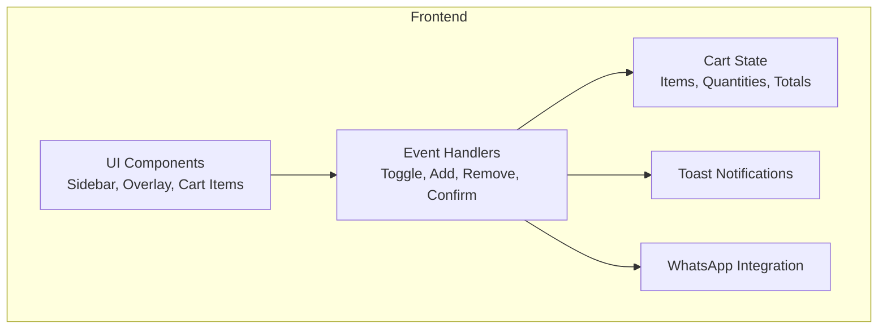
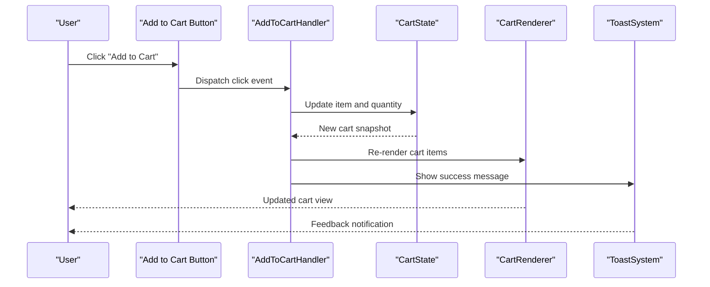
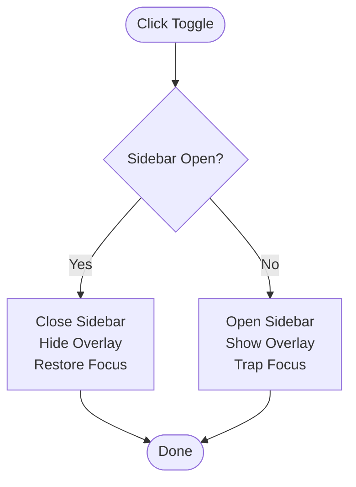
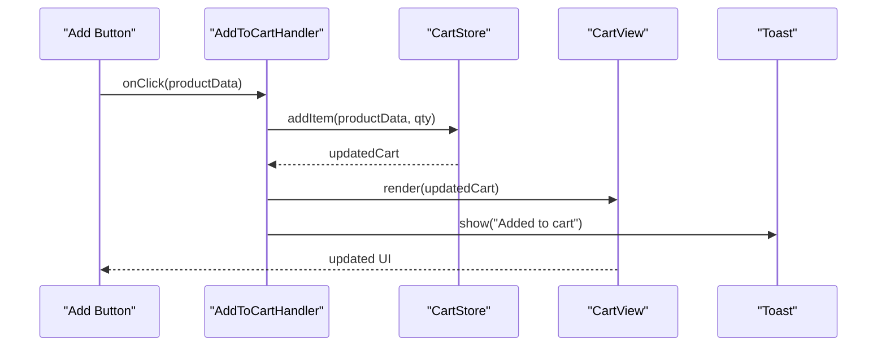
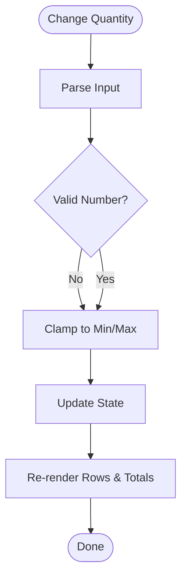
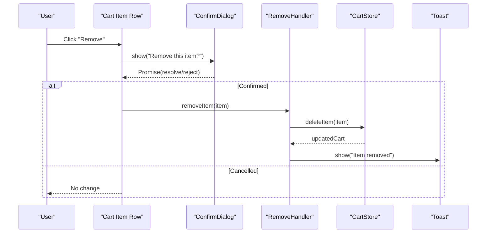
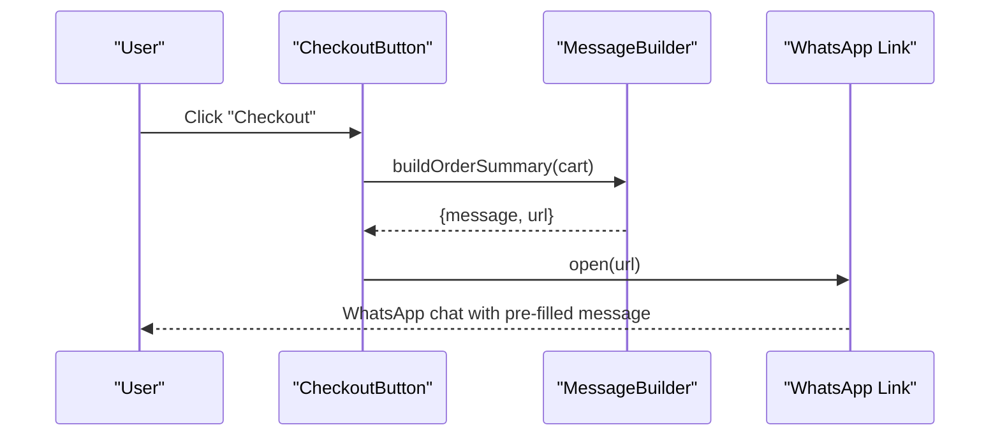
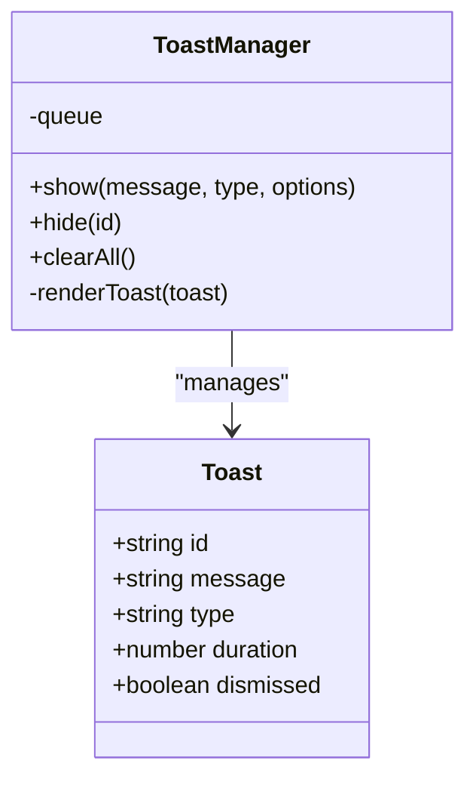
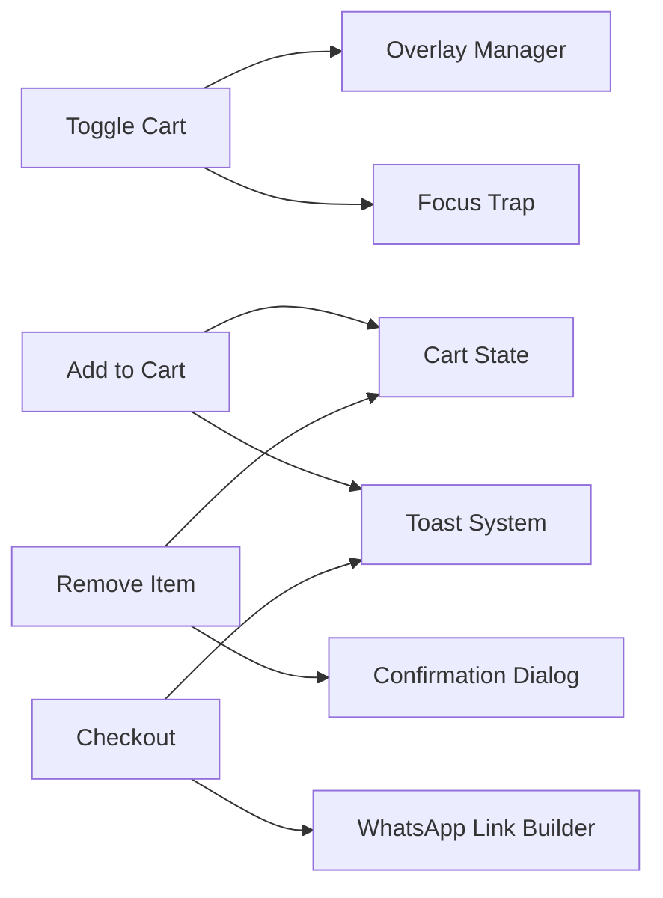

# User Interaction Handlers

<cite>
**Referenced Files in This Document**
- [README.md](file://README.md)
</cite>

## Table of Contents
1. [Introduction](#introduction)
2. [Project Structure](#project-structure)
3. [Core Components](#core-components)
4. [Architecture Overview](#architecture-overview)
5. [Detailed Component Analysis](#detailed-component-analysis)
6. [Dependency Analysis](#dependency-analysis)
7. [Performance Considerations](#performance-considerations)
8. [Troubleshooting Guide](#troubleshooting-guide)
9. [Conclusion](#conclusion)
10. [Appendices](#appendices)

## Introduction
This document provides comprehensive guidance for implementing and maintaining shopping cart user interaction handlers and event management. It focuses on:
- Toggle cart behavior (sidebar open/close and overlay visibility)
- Add to cart button handlers with product data binding and quantity controls
- Remove item functionality with confirmation dialogs
- Checkout integration via WhatsApp API and message generation
- Toast notification system for feedback
- Extensibility patterns, keyboard navigation, accessibility, and error handling strategies

The goal is to help developers implement robust, accessible, and maintainable interactions that improve the shopping experience.

## Project Structure
At a high level, this repository contains documentation and minimal site assets. The shopping cart interaction logic described here should be implemented within the web application’s frontend layer (HTML/JS/CSS). Organize code by feature or responsibility to keep interactions cohesive and testable.

[No sources needed since this diagram shows conceptual workflow, not actual code structure]

## Core Components
- Toggle Cart Handler
  - Responsibilities: Open/close sidebar, manage overlay visibility, trap focus when open, restore focus on close.
  - Inputs: Trigger element (e.g., cart icon), target elements (sidebar, overlay).
  - Outputs: Updated DOM state, focus management, optional analytics events.

- Add to Cart Button Handler
  - Responsibilities: Read product data from DOM attributes or data store, update cart state, render updated items, show toast success.
  - Inputs: Product identifier, name, price, image URL, initial quantity.
  - Outputs: Updated cart list, total calculations, notifications.

- Quantity Controls
  - Responsibilities: Increment/decrement quantity, enforce min/max bounds, update totals, persist changes.
  - Inputs: Item reference, delta (+/-), validation rules.
  - Outputs: Updated item quantity, recalculated totals, re-rendered rows.

- Remove Item Handler
  - Responsibilities: Show confirmation dialog, remove item upon confirmation, update totals, notify user.
  - Inputs: Item reference, confirmation callback.
  - Outputs: Updated cart list, toast messages.

- Confirmation Dialog
  - Responsibilities: Present confirm/cancel actions, handle keyboard and screen reader interactions, return promise-like result.
  - Inputs: Message text, action labels.
  - Outputs: Boolean decision, side effects based on choice.

- Checkout via WhatsApp
  - Responsibilities: Build order summary, encode into WhatsApp message, open chat link.
  - Inputs: Cart items, quantities, totals, optional customer info.
  - Outputs: Redirect to WhatsApp with pre-filled message.

- Toast Notification System
  - Responsibilities: Display transient messages (success, error, info), queue multiple toasts, auto-dismiss, allow manual dismiss.
  - Inputs: Message text, type, duration, optional actions.
  - Outputs: Rendered toast elements, lifecycle control.

**Section sources**
- [README.md](file://README.md)

## Architecture Overview
The following sequence illustrates the add-to-cart flow, including state updates, rendering, and notifications.

**Diagram sources**
- [README.md](file://README.md)

## Detailed Component Analysis

### Toggle Cart Handler
- Behavior
  - Opens the cart sidebar and displays an overlay backdrop.
  - Closes the sidebar and hides the overlay.
  - Manages focus: moves focus to the first interactive element when opened; restores previous focus when closed.
  - Prevents background scrolling while the sidebar is open.
- Event Bindings
  - Attach listeners to trigger elements (e.g., cart icon).
  - Handle overlay clicks to close the sidebar.
  - Listen for Escape key to close.
- Accessibility
  - Use aria-expanded on the trigger.
  - Set aria-hidden on the overlay/sidebar when hidden.
  - Ensure tab trapping inside the sidebar when visible.
- Error Handling
  - Guard against missing DOM nodes before toggling classes.
  - Log errors if focus restoration fails.

**Section sources**
- [README.md](file://README.md)

### Add to Cart Button Handler
- Data Binding
  - Read product metadata from data attributes or a centralized product registry.
  - Validate required fields (id, name, price).
- State Updates
  - If item exists, increment quantity; otherwise, add new entry.
  - Recalculate totals and tax/shipping if applicable.
- Rendering
  - Update cart item list and totals.
  - Persist state to storage (e.g., localStorage) if needed.
- Feedback
  - Show a success toast after adding.
  - Provide immediate visual feedback (e.g., button disabled briefly).

**Section sources**
- [README.md](file://README.md)

### Quantity Controls
- Operations
  - Increment/decrement with minimum and maximum constraints.
  - Debounce rapid clicks to avoid excessive re-renders.
- Validation
  - Reject invalid inputs (non-numbers, negative values).
  - Clamp values to allowed range.
- Side Effects
  - Update totals and badges.
  - Persist changes.

**Section sources**
- [README.md](file://README.md)

### Remove Item and Confirmation Dialog
- Flow
  - On remove request, present a confirmation dialog.
  - On confirm, remove item, update totals, and show a toast.
  - On cancel, do nothing.
- Accessibility
  - Ensure dialog is focusable and has role="dialog".
  - Manage focus within dialog and restore focus on close.
  - Provide clear labels and descriptions.

**Section sources**
- [README.md](file://README.md)

### Checkout via WhatsApp API
- Message Generation
  - Build a concise order summary including item names, quantities, prices, and total.
  - Encode special characters and line breaks appropriately for the URL.
- Integration
  - Construct the WhatsApp URL with the encoded message.
  - Open the link in a new tab or app context.
- Error Handling
  - Validate phone number format if provided.
  - Fallback to copy-to-clipboard if opening fails.

**Section sources**
- [README.md](file://README.md)

### Toast Notification System
- Features
  - Types: success, error, info, warning.
  - Auto-dismiss after configurable duration.
  - Manual dismiss option.
  - Queueing to prevent overlapping.
- Implementation Tips
  - Use ARIA live regions for announcements.
  - Ensure keyboard dismissal and focus management.
  - Avoid blocking user interactions.

**Section sources**
- [README.md](file://README.md)

### Adding New Interaction Patterns
- Steps
  - Define a handler module for the new feature.
  - Bind events to relevant DOM nodes safely.
  - Update shared state and re-render affected components.
  - Integrate with the toast system for feedback.
  - Add unit tests and accessibility checks.
- Example Pattern
  - Create a reusable function that accepts configuration (selectors, callbacks).
  - Emit custom events for decoupled communication between modules.

**Section sources**
- [README.md](file://README.md)

### Customizing Notification Styles
- Approach
  - Centralize CSS variables for colors, spacing, and durations.
  - Provide theme variants (light/dark) and type-specific styles.
  - Allow runtime overrides via configuration object.
- Best Practices
  - Keep animations subtle and short.
  - Ensure contrast meets accessibility standards.
  - Test across devices and browsers.

**Section sources**
- [README.md](file://README.md)

### Implementing Keyboard Navigation Support
- Guidelines
  - Tab through all interactive elements in predictable order.
  - Trap focus within modals and overlays.
  - Support Escape to close overlays and dialogs.
  - Provide visible focus indicators.
- Implementation Checklist
  - Add tabindex where necessary.
  - Implement keydown listeners for Escape and Enter/Space.
  - Restore focus to the triggering element on close.

**Section sources**
- [README.md](file://README.md)

### Accessibility Considerations
- Semantic Markup
  - Use buttons for actions, links for navigation.
  - Associate labels and descriptions with inputs.
- ARIA Attributes
  - aria-expanded for toggles.
  - aria-live for dynamic content like toasts.
  - aria-modal for dialogs.
- Screen Readers
  - Announce state changes and outcomes.
  - Avoid relying solely on color to convey meaning.

**Section sources**
- [README.md](file://README.md)

### Error Handling Strategies
- Client-Side Validation
  - Validate inputs before state updates.
  - Provide inline error messages near inputs.
- Network Failures
  - Retry with backoff for critical operations.
  - Show actionable error toasts with retry options.
- Graceful Degradation
  - Fallback to clipboard copy if WhatsApp link fails.
  - Persist partial progress locally.

**Section sources**
- [README.md](file://README.md)

## Dependency Analysis
Conceptual dependency relationships among interaction modules:

[No sources needed since this diagram shows conceptual workflow, not actual code structure]

## Performance Considerations
- Batch DOM updates to minimize reflows.
- Debounce frequent events (e.g., input changes).
- Use efficient selectors and cache references to frequently accessed nodes.
- Avoid heavy computations during render; defer to Web Workers if necessary.

[No sources needed since this section provides general guidance]

## Troubleshooting Guide
- Sidebar does not open
  - Verify event bindings are attached after DOM ready.
  - Check for missing IDs/classes used by selectors.
- Overlay remains visible
  - Ensure close handlers run on overlay click and Escape key.
  - Confirm overlay z-index and pointer-events are correct.
- Toast messages not shown
  - Confirm toast container exists and ARIA live region is configured.
  - Inspect console for errors in toast manager.
- WhatsApp link fails to open
  - Validate phone number format and message encoding.
  - Provide fallback to copy-to-clipboard.

**Section sources**
- [README.md](file://README.md)

## Conclusion
By structuring interactions around clear handlers, centralized state, and robust feedback mechanisms, you can deliver a smooth and accessible shopping cart experience. Follow the patterns outlined above to extend functionality, customize notifications, support keyboard navigation, and handle errors gracefully.

[No sources needed since this section summarizes without analyzing specific files]

## Appendices
- Quick Reference
  - Toggle: open/close, overlay, focus trap
  - Add: bind product data, update state, render, toast
  - Quantity: validate, clamp, debounce
  - Remove: confirm dialog, update state, toast
  - Checkout: build message, open WhatsApp link
  - Toast: types, queue, auto-dismiss, ARIA live

[No sources needed since this section provides general guidance]