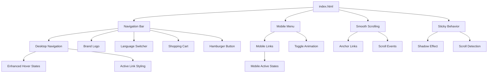
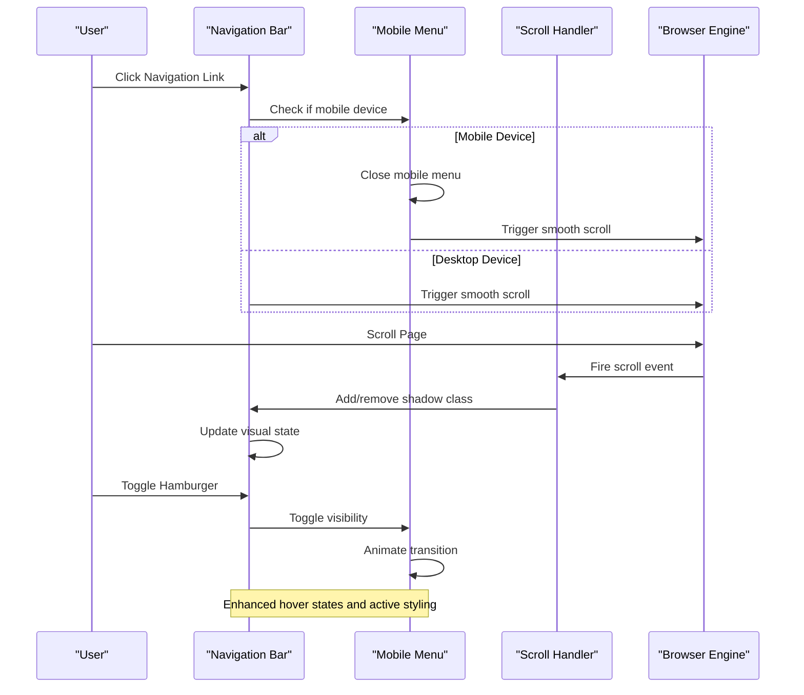
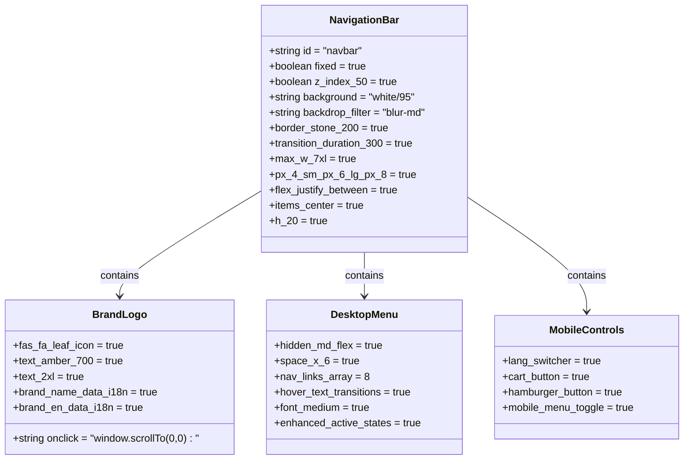
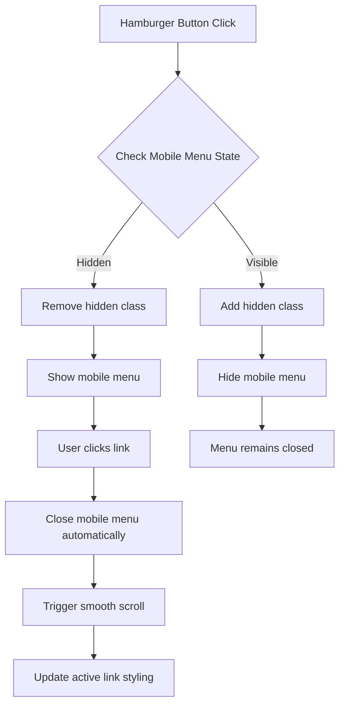

# Navigation System

<cite>
**Referenced Files in This Document**
- [index.html](file://docs/index.html)
- [main.js](file://docs/js/main.js)
- [components.js](file://docs/js/components.js)
- [styles.css](file://docs/css/styles.css)
</cite>

## Update Summary
**Changes Made**
- Updated navigation menu order to reflect ceremonial plaques section moved after pets memorial section
- Enhanced active link styling with improved visual hierarchy for current page sections
- Refined hover states throughout desktop and mobile interfaces for better user feedback
- Updated mobile menu active state styling to highlight current section

## Table of Contents
1. [Introduction](#introduction)
2. [Project Structure](#project-structure)
3. [Core Components](#core-components)
4. [Architecture Overview](#architecture-overview)
5. [Detailed Component Analysis](#detailed-component-analysis)
6. [CSS Styling and Effects](#css-styling-and-effects)
7. [JavaScript Functionality](#javascript-functionality)
8. [Responsive Design Implementation](#responsive-design-implementation)
9. [Accessibility Features](#accessibility-features)
10. [Cross-Browser Compatibility](#cross-browser-compatibility)
11. [Performance Considerations](#performance-considerations)
12. [Troubleshooting Guide](#troubleshooting-guide)
13. [Conclusion](#conclusion)

## Introduction

The navigation system component is a sophisticated, responsive navigation solution implemented within a single-page HTML application for Fujian Florist. This navigation system provides seamless user experience across desktop and mobile devices, featuring smooth scrolling, sticky behavior, backdrop blur effects, and comprehensive accessibility support. The implementation demonstrates modern web development practices with Tailwind CSS utility classes and vanilla JavaScript functionality.

**Updated** The navigation structure has been optimized with ceremonial plaques section positioned after pets memorial section for improved user flow and logical content organization.

## Project Structure

The navigation system is embedded within a comprehensive single-page application structure:

**Diagram sources**
- [index.html:36-105](file://docs/index.html#L36-L105)
- [components.js:41-51](file://docs/js/components.js#L41-L51)

**Section sources**
- [index.html:36-105](file://docs/index.html#L36-L105)

## Core Components

### Desktop Navigation Menu
The desktop navigation features a horizontal menu layout with enhanced hover transitions and improved active state management. The navigation includes eight main categories with distinct styling for different sections, now organized with ceremonial plaques following pets memorial for better user flow.

### Mobile Hamburger Menu
A responsive hamburger menu that transforms into a full-screen overlay on smaller screens, providing easy access to all navigation links with smooth toggle animations and enhanced active state indicators.

### Sticky Navigation Behavior
The navigation bar implements sticky positioning with dynamic shadow effects that activate upon scrolling, enhancing visual hierarchy and user orientation.

### Smooth Scrolling Implementation
Native CSS smooth scrolling combined with JavaScript event handlers ensures seamless navigation between page sections without jarring jumps.

**Updated** Enhanced hover states and active link styling provide better visual feedback across both desktop and mobile interfaces.

**Section sources**
- [index.html:36-105](file://docs/index.html#L36-L105)
- [components.js:41-51](file://docs/js/components.js#L41-L51)

## Architecture Overview

The navigation system follows a modular architecture pattern with clear separation of concerns:

**Diagram sources**
- [components.js:41-51](file://docs/js/components.js#L41-L51)
- [index.html:36-105](file://docs/index.html#L36-L105)

## Detailed Component Analysis

### Navigation Bar Structure

The main navigation container uses semantic HTML5 elements with comprehensive Tailwind CSS classes and enhanced styling:

**Updated** Enhanced active link styling and improved hover states throughout the navigation interface.

**Diagram sources**
- [index.html:36-105](file://docs/index.html#L36-L105)

### Mobile Menu Implementation

The mobile menu provides an alternative navigation interface optimized for touch devices with enhanced active state styling:

**Updated** Enhanced mobile menu active states with improved visual hierarchy for current section indication.

**Diagram sources**
- [index.html:90-104](file://docs/index.html#L90-L104)
- [components.js:20-23](file://docs/js/components.js#L20-L23)

**Section sources**
- [index.html:36-105](file://docs/index.html#L36-L105)
- [components.js:20-23](file://docs/js/components.js#L20-L23)

## CSS Styling and Effects

### Backdrop Blur Effects
The navigation utilizes `backdrop-blur-md` class to create a frosted glass effect, allowing content behind the navigation to be visible while maintaining readability.

### Border Transitions
Smooth border color transitions are implemented using Tailwind's transition utilities, providing visual feedback during hover states and focus changes.

### Enhanced Hover States
Comprehensive hover effects include:
- Text color transitions from gray to amber tones with improved timing
- Background color changes for interactive elements
- Shadow depth modifications
- Transform animations for enhanced interactivity
- **Updated** Refined hover states with better contrast and smoother transitions

### Active Link Styling
**Updated** Enhanced active link styling provides clear visual indication of current page section:
- Ceremonial plaques link maintains prominent styling when active
- Improved contrast ratios for better accessibility
- Consistent styling across desktop and mobile interfaces

### Custom Scrollbar Styling
Webkit-specific scrollbar customization provides consistent visual appearance across browsers with amber-themed styling.

**Section sources**
- [index.html:36-105](file://docs/index.html#L36-L105)
- [styles.css:94-96](file://docs/css/styles.css#L94-L96)

## JavaScript Functionality

### Mobile Menu Toggle
The `toggleMobileMenu()` function manages the visibility state of the mobile navigation menu by toggling the `hidden` class on the mobile menu element.

### Smooth Scrolling Implementation
Two approaches are implemented:
1. Native CSS `scroll-behavior: smooth` for anchor links
2. JavaScript `scrollIntoView()` method for programmatic navigation with custom behavior options

### Sticky Navigation Enhancement
A scroll event listener dynamically adds/removes shadow classes based on scroll position, creating a visual elevation effect when users navigate away from the top of the page.

**Updated** Enhanced navigation initialization with improved scroll handling and active state management.

**Section sources**
- [components.js:20-23](file://docs/js/components.js#L20-L23)
- [components.js:41-51](file://docs/js/components.js#L41-L51)
- [styles.css:94-96](file://docs/css/styles.css#L94-L96)

## Responsive Design Implementation

### Breakpoint Strategy
The navigation uses Tailwind CSS breakpoints for responsive behavior:
- `md:hidden`: Hides desktop navigation on medium screens and below
- `md:flex`: Shows desktop navigation on medium screens and above
- `md:hidden`: Controls mobile menu visibility

### Touch-Friendly Interface
Mobile navigation elements are optimized for touch interaction with appropriate sizing and spacing for finger-based navigation.

### Adaptive Layout
The navigation automatically adapts its layout based on screen size, ensuring optimal usability across all device types.

**Updated** Enhanced responsive behavior with improved mobile menu active states and better touch target sizing.

**Section sources**
- [index.html:36-105](file://docs/index.html#L36-L105)

## Accessibility Features

### Keyboard Navigation Support
All interactive elements maintain proper keyboard navigation order and provide visible focus indicators through Tailwind's focus utilities.

### Semantic HTML Structure
The navigation uses semantic HTML5 elements (`<nav>`, `<a>`) with appropriate ARIA attributes where necessary for screen reader compatibility.

### Color Contrast Compliance
Text colors maintain sufficient contrast ratios against backgrounds to meet WCAG accessibility guidelines.

### Focus Management
Interactive elements provide clear visual focus states to assist keyboard navigation users.

**Updated** Enhanced active link styling improves accessibility with better contrast ratios and clearer visual indicators.

**Section sources**
- [index.html:36-105](file://docs/index.html#L36-L105)

## Cross-Browser Compatibility

### Modern CSS Features
The implementation leverages modern CSS features like `backdrop-filter` with appropriate fallbacks for older browsers.

### JavaScript Polyfills
Vanilla JavaScript implementation ensures broad browser compatibility without requiring external polyfills or libraries.

### Vendor Prefixes
Tailwind CSS handles vendor prefixing automatically, ensuring consistent behavior across different browser engines.

### Performance Optimization
Efficient DOM manipulation and minimal reflows ensure smooth performance across all supported browsers.

**Section sources**
- [styles.css:94-96](file://docs/css/styles.css#L94-L96)

## Performance Considerations

### Efficient Event Handling
Scroll event listeners are optimized to minimize performance impact while providing responsive visual feedback.

### CSS Transition Optimization
Hardware-accelerated CSS transitions ensure smooth animations without causing layout thrashing.

### Minimal DOM Manipulation
JavaScript functions are designed to minimize DOM queries and updates, reducing reflow and repaint operations.

### Resource Loading
External dependencies (Tailwind CSS, Font Awesome) are loaded via CDN for optimal caching and loading performance.

**Section sources**
- [components.js:41-51](file://docs/js/components.js#L41-L51)

## Troubleshooting Guide

### Common Issues and Solutions

#### Mobile Menu Not Toggling
- Verify the `toggleMobileMenu()` function is properly bound to the hamburger button click event
- Check that the mobile menu element has the correct ID attribute
- Ensure no JavaScript errors are preventing function execution

#### Smooth Scrolling Not Working
- Confirm CSS `scroll-behavior: smooth` is applied to the HTML element
- Verify anchor link href attributes match target section IDs
- Check for any JavaScript conflicts that might prevent default scroll behavior

#### Sticky Navigation Shadow Not Appearing
- Ensure the scroll event listener is properly attached during DOMContentLoaded
- Verify the navbar element ID matches the one referenced in JavaScript
- Check for CSS specificity issues that might override shadow classes

#### Backdrop Blur Not Displaying
- Verify browser support for `backdrop-filter` property
- Check for conflicting CSS rules that might override the blur effect
- Ensure the navigation background opacity allows the blur effect to be visible

#### Active Link Styling Issues
- **Updated** Verify that active link classes are properly applied when navigating to sections
- Check for CSS specificity conflicts affecting hover and active states
- Ensure mobile menu active states are correctly managed

**Section sources**
- [components.js:20-23](file://docs/js/components.js#L20-L23)
- [components.js:41-51](file://docs/js/components.js#L41-L51)
- [styles.css:94-96](file://docs/css/styles.css#L94-L96)

## Conclusion

The navigation system component represents a comprehensive, production-ready implementation that successfully balances aesthetics, functionality, and performance. Through careful use of modern CSS techniques, efficient JavaScript patterns, and responsive design principles, it delivers an exceptional user experience across all devices and browsers. The recent enhancements to active link styling and hover states, along with the optimized navigation structure featuring ceremonial plaques after pets memorial, further improve user flow and visual hierarchy. The modular architecture ensures maintainability and scalability, while the attention to accessibility and cross-browser compatibility makes it suitable for diverse user bases. This implementation serves as an excellent reference for building robust navigation systems in modern web applications.

**Updated** Recent improvements include enhanced active link styling, refined hover states, and optimized navigation structure for better user experience and improved content organization.