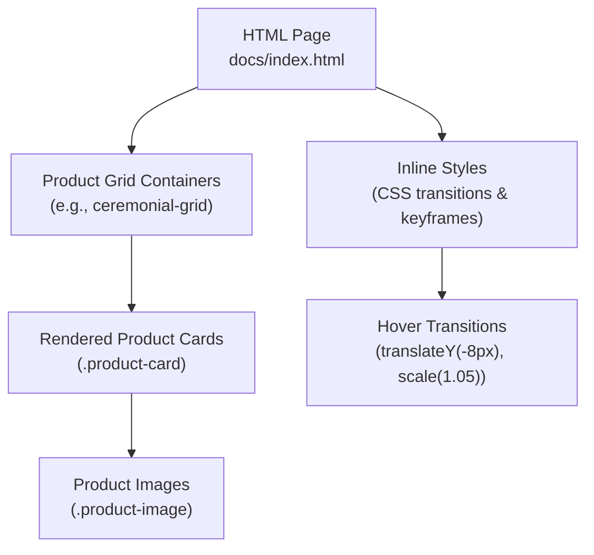
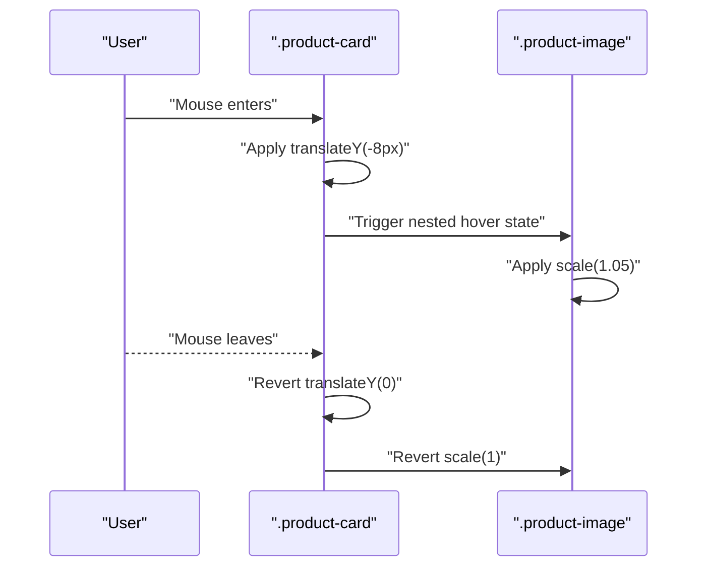
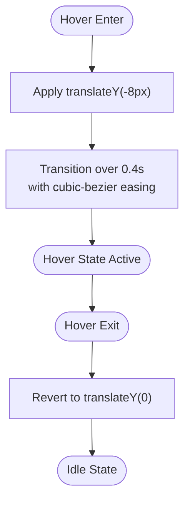
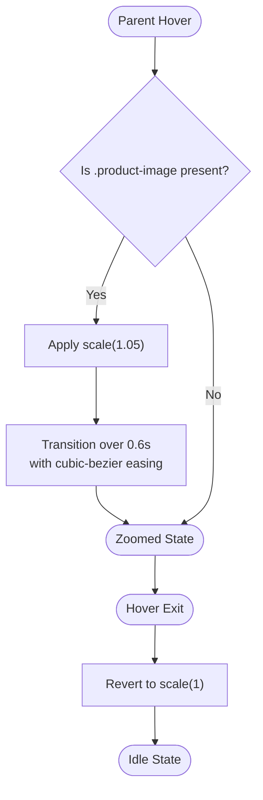
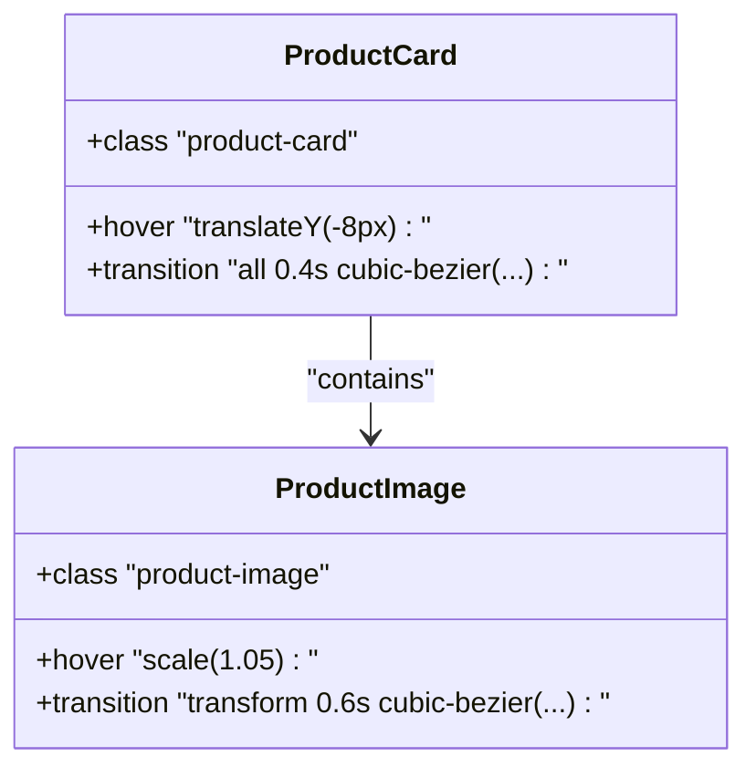

# Hover Effects and Animations

<cite>
**Referenced Files in This Document**
- [index.html](file://docs/index.html)
</cite>

## Table of Contents
1. [Introduction](#introduction)
2. [Project Structure](#project-structure)
3. [Core Components](#core-components)
4. [Architecture Overview](#architecture-overview)
5. [Detailed Component Analysis](#detailed-component-analysis)
6. [Dependency Analysis](#dependency-analysis)
7. [Performance Considerations](#performance-considerations)
8. [Troubleshooting Guide](#troubleshooting-guide)
9. [Conclusion](#conclusion)

## Introduction
This document explains the product card hover effects and animation system used across the site’s product grids. It focuses on:
- The .product-card:hover selector that elevates cards with a vertical translate transform
- The .product-image selector that zooms images on hover
- The cubic-bezier timing functions and durations (0.4s, 0.6s) used to create smooth transitions
- How these selectors interact to provide clear visual feedback during browsing
- Performance considerations for GPU-accelerated transforms and cross-browser compatibility

## Project Structure
The hover and animation behavior is implemented entirely within the single-page application file. CSS styles are defined inline in a <style> block, and product cards are rendered dynamically by JavaScript into grid containers.

**Diagram sources**
- [index.html:39-208](file://docs/index.html#L39-L208)
- [index.html:1376-1404](file://docs/index.html#L1376-L1404)

**Section sources**
- [index.html:39-208](file://docs/index.html#L39-L208)
- [index.html:1376-1404](file://docs/index.html#L1376-L1404)

## Core Components
- Card elevation on hover:
  - Selector: .product-card:hover
  - Effect: Elevates the card using a vertical translation
  - Timing: Uses a global transition duration and easing applied to the card
- Image zoom on hover:
  - Selector: .product-card:hover .product-image
  - Effect: Scales the image slightly larger when the parent card is hovered
  - Timing: Uses its own transition duration and easing
- Base transitions:
  - .product-card defines a transition for all properties with a specific duration and easing
  - .product-image defines a transition specifically for transform with a longer duration and easing

These components work together to deliver a layered interaction: the card lifts first, then the image subtly enlarges, creating depth and focus.

**Section sources**
- [index.html:74-88](file://docs/index.html#L74-L88)
- [index.html:1376-1404](file://docs/index.html#L1376-L1404)

## Architecture Overview
The hover system follows a simple, composable pattern:
- Parent container (.product-card) handles overall elevation
- Child element (.product-image) handles internal zoom
- Both use transform-based animations for performance
- Easing curves (cubic-bezier) ensure natural motion

**Diagram sources**
- [index.html:74-88](file://docs/index.html#L74-L88)

## Detailed Component Analysis

### Card Elevation (.product-card:hover)
- Purpose: Provide tactile lift effect indicating interactivity
- Transform: translateY(-8px) moves the card upward
- Transition: Global transition on .product-card applies to all properties including transform
- Duration: 0.4s
- Easing: cubic-bezier(0.4, 0, 0.2, 1)
- Visual feedback: Shadow enhancement via Tailwind classes combined with transform creates perceived elevation

**Diagram sources**
- [index.html:74-80](file://docs/index.html#L74-L80)

**Section sources**
- [index.html:74-80](file://docs/index.html#L74-L80)

### Image Zoom (.product-card:hover .product-image)
- Purpose: Focus attention on the product image without layout shift
- Transform: scale(1.05) increases size by 5%
- Transition: Specific transition on .product-image for transform only
- Duration: 0.6s
- Easing: cubic-bezier(0.4, 0, 0.2, 1)
- Interaction: Only triggers when the parent .product-card is hovered

**Diagram sources**
- [index.html:82-88](file://docs/index.html#L82-L88)

**Section sources**
- [index.html:82-88](file://docs/index.html#L82-L88)

### Rendering and DOM Integration
- Product cards are generated by JavaScript and inserted into grid containers
- Each card includes the .product-card class and an inner .product-image
- The hover rules apply automatically due to CSS specificity and nesting

**Diagram sources**
- [index.html:1376-1404](file://docs/index.html#L1376-L1404)
- [index.html:74-88](file://docs/index.html#L74-L88)

**Section sources**
- [index.html:1376-1404](file://docs/index.html#L1376-L1404)

## Dependency Analysis
- CSS dependencies:
  - Inline styles define transitions and hover states
  - Tailwind utility classes contribute shadows and layout but do not interfere with transforms
- JavaScript dependencies:
  - Dynamic rendering injects elements with required classes
  - No JS event listeners are attached to hover; behavior is purely CSS-driven
- Selectors and specificity:
  - .product-card:hover targets the card
  - .product-card:hover .product-image targets the image only when the card is hovered

**Diagram sources**
- [index.html:39-208](file://docs/index.html#L39-L208)
- [index.html:1376-1404](file://docs/index.html#L1376-L1404)

**Section sources**
- [index.html:39-208](file://docs/index.html#L39-L208)
- [index.html:1376-1404](file://docs/index.html#L1376-L1404)

## Performance Considerations
- GPU acceleration:
  - Using transform (translateY, scale) leverages the compositor thread, minimizing layout and paint costs
- Duration and easing:
  - 0.4s for card elevation provides responsive feedback
  - 0.6s for image zoom offers a slightly slower, more refined zoom
  - cubic-bezier(0.4, 0, 0.2, 1) delivers a natural ease-out curve
- Cross-browser compatibility:
  - Modern browsers fully support transform and cubic-bezier
  - For older environments, consider adding vendor prefixes if needed (not required in modern stacks)
- Avoiding jank:
  - Do not animate layout-affecting properties (width, height, margin) on hover
  - Keep transform values modest to avoid excessive repaint regions
- Accessibility:
  - Ensure sufficient contrast and avoid overly large zoom that obscures content
  - Respect reduced-motion preferences by providing media query overrides if necessary

[No sources needed since this section provides general guidance]

## Troubleshooting Guide
- Hover not triggering:
  - Verify the element has the .product-card class and contains a .product-image child
  - Confirm no other CSS rule overrides the hover transform or transition
- Animation too fast/slow:
  - Adjust the transition duration on .product-card (currently 0.4s) and .product-image (currently 0.6s)
- Stutter or lag:
  - Ensure only transform is animated on hover
  - Remove any conflicting transitions on parent elements that might trigger layout recalculation
- Inconsistent behavior across devices:
  - Test on mobile touch devices; hover may require tap interactions
  - Consider adding active/focus states for keyboard navigation if applicable

**Section sources**
- [index.html:74-88](file://docs/index.html#L74-L88)
- [index.html:1376-1404](file://docs/index.html#L1376-L1404)

## Conclusion
The hover system uses a clean, performant approach:
- .product-card:hover applies translateY(-8px) with a 0.4s cubic-bezier transition
- .product-card:hover .product-image applies scale(1.05) with a 0.6s cubic-bezier transition
- These transforms are GPU-friendly and provide clear, layered visual feedback
- The design balances responsiveness and refinement, improving user experience during product browsing

[No sources needed since this section summarizes without analyzing specific files]