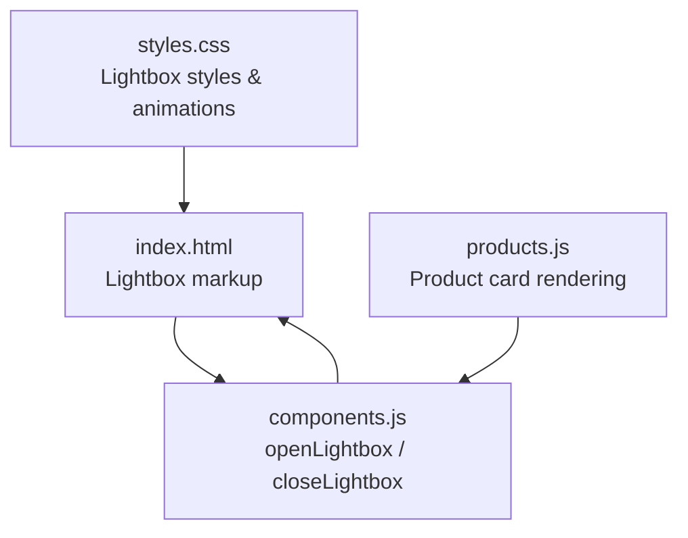
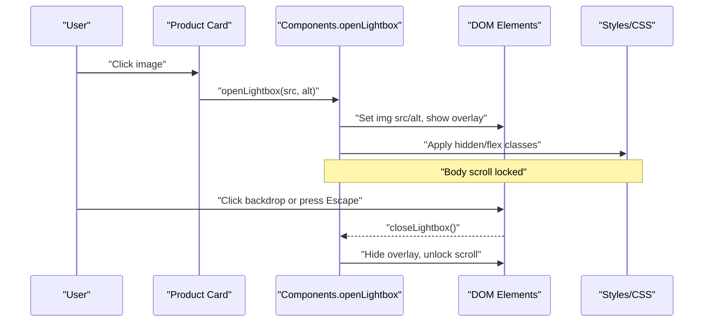
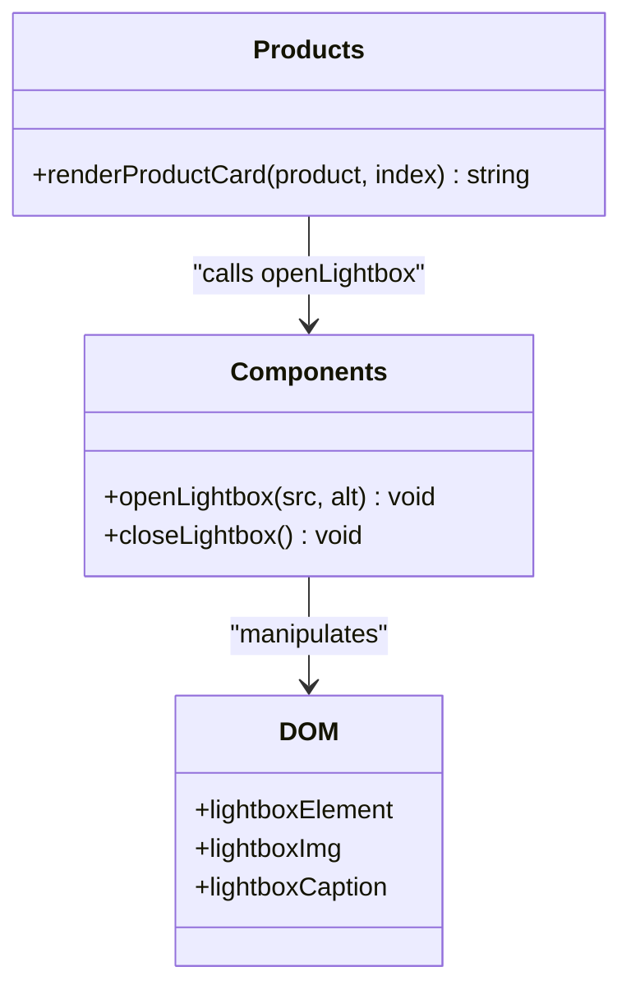
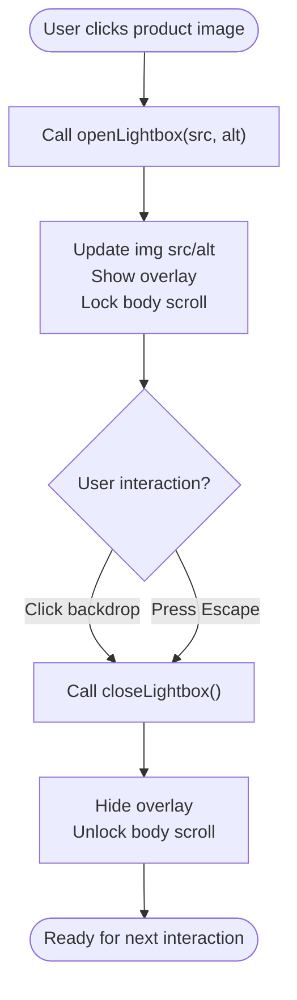
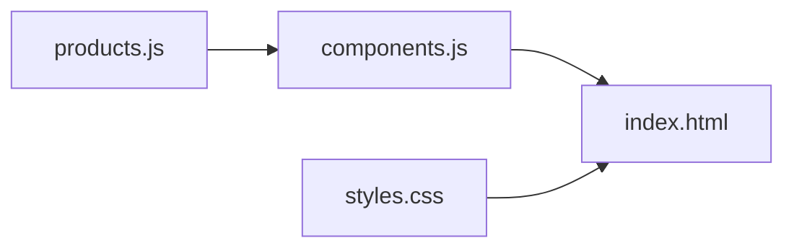

# Image Lightbox Feature

<cite>
**Referenced Files in This Document**
- [index.html](file://docs/index.html)
- [components.js](file://docs/js/components.js)
- [products.js](file://docs/js/products.js)
- [styles.css](file://docs/css/styles.css)
</cite>

## Table of Contents
1. [Introduction](#introduction)
2. [Project Structure](#project-structure)
3. [Core Components](#core-components)
4. [Architecture Overview](#architecture-overview)
5. [Detailed Component Analysis](#detailed-component-analysis)
6. [Dependency Analysis](#dependency-analysis)
7. [Performance Considerations](#performance-considerations)
8. [Troubleshooting Guide](#troubleshooting-guide)
9. [Conclusion](#conclusion)

## Introduction
This document explains the Image Lightbox feature implemented for the product gallery. The lightbox allows users to click on any product image to view it in a full-screen overlay with smooth animations, caption support, and keyboard accessibility. It is integrated into the product cards and uses shared UI utilities for consistent behavior across the site.

## Project Structure
The lightbox feature spans three primary areas:
- HTML markup defines the modal container and elements.
- JavaScript provides open/close logic and event handling.
- CSS styles define transitions, animations, and responsive sizing.

**Diagram sources**
- [index.html:684-691](file://docs/index.html#L684-L691)
- [components.js:65-92](file://docs/js/components.js#L65-L92)
- [products.js:37-80](file://docs/js/products.js#L37-L80)
- [styles.css:148-165](file://docs/css/styles.css#L148-L165)

**Section sources**
- [index.html:684-691](file://docs/index.html#L684-L691)
- [components.js:65-92](file://docs/js/components.js#L65-L92)
- [products.js:37-80](file://docs/js/products.js#L37-L80)
- [styles.css:148-165](file://docs/css/styles.css#L148-L165)

## Core Components
- Lightbox Modal (HTML): A fixed-position overlay containing an image element and a caption area. Clicking outside the image closes the lightbox.
- Open/Close Logic (JavaScript): Functions to set the image source and alt text, toggle visibility classes, manage body scroll lock, and handle Escape key.
- Integration Point (Products): Each product card’s image has an inline click handler that calls the global openLightbox function with the image URL and title.
- Styling (CSS): Transitions for fade-in/out, zoom animation for the image, and responsive constraints for viewport fit.

Key responsibilities:
- Prevent background scrolling when the lightbox is open.
- Provide accessible caption via alt text and visible caption element.
- Ensure safe string escaping for inline onclick handlers.

**Section sources**
- [index.html:684-691](file://docs/index.html#L684-L691)
- [components.js:65-92](file://docs/js/components.js#L65-L92)
- [products.js:57-79](file://docs/js/products.js#L57-L79)
- [styles.css:148-165](file://docs/css/styles.css#L148-L165)

## Architecture Overview
The lightbox follows a simple event-driven flow:
- User clicks a product image.
- Product card passes image URL and title to openLightbox.
- Components module updates DOM state and locks body scroll.
- CSS applies transitions and animations.
- Closing occurs by clicking the backdrop or pressing Escape.

**Diagram sources**
- [products.js:57-79](file://docs/js/products.js#L57-L79)
- [components.js:65-92](file://docs/js/components.js#L65-L92)
- [index.html:684-691](file://docs/index.html#L684-L691)
- [styles.css:148-165](file://docs/css/styles.css#L148-L165)

## Detailed Component Analysis

### Lightbox Markup (HTML)
- Overlay container with high z-index and semi-transparent background.
- Close button positioned at top-right.
- Image element constrained to viewport width/height with object-fit.
- Caption bar centered at bottom with contextual text.

Behavioral notes:
- Clicking the overlay triggers closeLightbox.
- Clicking the image prevents event propagation to avoid accidental close.

**Section sources**
- [index.html:684-691](file://docs/index.html#L684-L691)

### Lightbox Logic (JavaScript)
Functions:
- openLightbox(src, alt): Sets image attributes, shows overlay, locks body scroll.
- closeLightbox(): Hides overlay, restores body scroll.
- Keyboard listener: Closes lightbox on Escape key.

Implementation highlights:
- Uses class toggling to control visibility and layout.
- Ensures accessibility by setting alt text and updating caption.
- Global functions are exposed for inline onclick usage.

Complexity:
- Time complexity per action: O(1).
- Space complexity: O(1) additional state.

Error handling:
- Guards against missing DOM nodes before manipulation.

**Section sources**
- [components.js:65-92](file://docs/js/components.js#L65-L92)

### Product Card Integration
Rendering:
- Each product card includes an image with a cursor style indicating interactivity.
- Inline onclick calls openLightbox with escaped product name and image URL.

Safety:
- Product names are escaped to prevent syntax errors in inline handlers.

Accessibility:
- Alt text is set from product name for screen readers.

**Section sources**
- [products.js:37-80](file://docs/js/products.js#L37-L80)

### Styling and Animations
- Overlay fades in/out using opacity transitions.
- Image zooms in with a scale animation upon opening.
- Responsive sizing ensures images fit within viewport while maintaining aspect ratio.

Performance:
- CSS transitions are GPU-friendly and do not block main thread.
- No heavy computations; minimal reflows due to class toggling.

**Section sources**
- [styles.css:148-165](file://docs/css/styles.css#L148-L165)

### Class Diagram

**Diagram sources**
- [components.js:65-92](file://docs/js/components.js#L65-L92)
- [products.js:37-80](file://docs/js/products.js#L37-L80)

### Flowchart: Lightbox Interaction

**Diagram sources**
- [components.js:65-92](file://docs/js/components.js#L65-L92)
- [index.html:684-691](file://docs/index.html#L684-L691)

## Dependency Analysis
- components.js exposes openLightbox and closeLightbox globally for inline handlers.
- products.js renders product cards and attaches onclick handlers to images.
- index.html provides the lightbox markup and global function bindings.
- styles.css provides visual transitions and responsive behavior.

**Diagram sources**
- [products.js:37-80](file://docs/js/products.js#L37-L80)
- [components.js:65-92](file://docs/js/components.js#L65-L92)
- [index.html:684-691](file://docs/index.html#L684-L691)
- [styles.css:148-165](file://docs/css/styles.css#L148-L165)

**Section sources**
- [products.js:37-80](file://docs/js/products.js#L37-L80)
- [components.js:65-92](file://docs/js/components.js#L65-L92)
- [index.html:684-691](file://docs/index.html#L684-L691)
- [styles.css:148-165](file://docs/css/styles.css#L148-L165)

## Performance Considerations
- Use lazy loading for large images if needed to reduce initial payload.
- Avoid unnecessary DOM queries inside hot paths; current implementation caches references implicitly through direct getElementById calls only when needed.
- Keep alt text concise to improve accessibility and reduce parsing overhead.
- Prefer CSS transitions over JS animations for smoother performance.

[No sources needed since this section provides general guidance]

## Troubleshooting Guide
Common issues and resolutions:
- Lightbox does not open:
  - Verify that the product image onclick handler calls openLightbox with valid src and alt.
  - Ensure DOM elements exist before manipulation; check for null guards in openLightbox.
- Lightbox does not close:
  - Confirm that backdrop click and Escape key listeners are active.
  - Check that closeLightbox toggles classes correctly and unlocks body scroll.
- Image not visible or clipped:
  - Validate max-width/max-height constraints and object-fit settings in CSS.
  - Ensure image URLs are correct and accessible.
- Accessibility concerns:
  - Ensure alt text is meaningful and caption reflects image context.
  - Test keyboard navigation and focus management.

**Section sources**
- [components.js:65-92](file://docs/js/components.js#L65-L92)
- [products.js:57-79](file://docs/js/products.js#L57-L79)
- [index.html:684-691](file://docs/index.html#L684-L691)
- [styles.css:148-165](file://docs/css/styles.css#L148-L165)

## Conclusion
The Image Lightbox feature is a lightweight, accessible, and performant solution for viewing product images in a full-screen overlay. It integrates seamlessly with the product gallery, leverages CSS transitions for smooth UX, and adheres to accessibility best practices. The modular design keeps responsibilities clear and maintainable, enabling easy enhancements such as swipe navigation or keyboard arrow controls in future iterations.