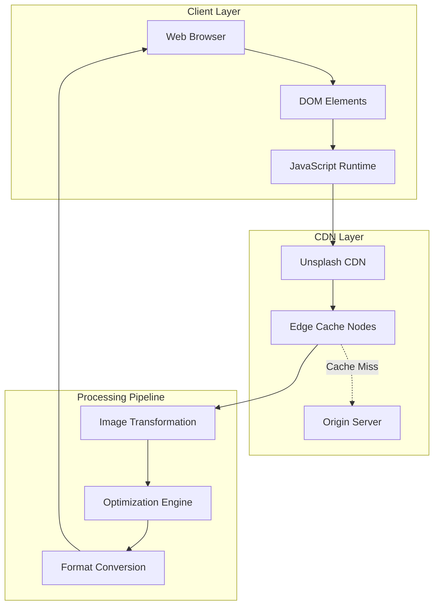

# Image Loading and Optimization

<cite>
**Referenced Files in This Document**
- [index.html](file://docs/index.html)
</cite>

## Table of Contents
1. [Introduction](#introduction)
2. [Unsplash CDN Integration Overview](#unsplash-cdn-integration-overview)
3. [URL Structure and Parameters](#url-structure-and-parameters)
4. [Image Tag Attributes and Accessibility](#image-tag-attributes-and-accessibility)
5. [Loading Strategies and Performance](#loading-strategies-and-performance)
6. [Image Optimization Techniques](#image-optimization-techniques)
7. [Responsive Image Handling](#responsive-image-handling)
8. [Fallback Mechanisms](#fallback-mechanisms)
9. [Caching Strategies](#caching-strategies)
10. [Best Practices and Recommendations](#best-practices-and-recommendations)

## Introduction

This document provides comprehensive technical documentation for the external Unsplash CDN integration used throughout the Fujian Florist website. The implementation leverages Unsplash's Content Delivery Network (CDN) to deliver optimized product images with consistent quality and performance across all device types. The system is designed to balance visual quality with loading speed while maintaining accessibility standards and providing robust fallback mechanisms.

The integration covers static hero images, dynamic product gallery images, and responsive image handling across multiple sections including ceremonial plaques, funeral arrangements, wreaths, opening celebrations, association events, graduation ceremonies, and pet memorials.

## Unsplash CDN Integration Overview

The website implements a sophisticated image loading strategy using Unsplash's CDN service to deliver high-quality floral imagery optimized for web performance. The integration follows modern web standards and best practices for image delivery, ensuring optimal user experience across different devices and network conditions.

### Core Architecture Components



**Diagram sources**
- [index.html:648-651](file://docs/index.html#L648-L651)
- [index.html:1086-1327](file://docs/index.html#L1086-L1327)

**Section sources**
- [index.html:648-651](file://docs/index.html#L648-L651)
- [index.html:1086-1327](file://docs/index.html#L1086-L1327)

## URL Structure and Parameters

The Unsplash CDN URLs follow a standardized structure that enables dynamic image transformation and optimization based on client requirements.

### Base URL Pattern

All image URLs conform to the following pattern:
```
https://images.unsplash.com/[photo-id]?w=[width]&auto=format&fit=crop&q=[quality]
```

### Parameter Breakdown

| Parameter | Description | Current Usage | Impact |
|-----------|-------------|---------------|---------|
| `w=` | Width specification in pixels | 400px (hero), 600px (products) | Controls output resolution |
| `auto=format` | Automatic format detection | Enabled | Serves WebP/AVIF when supported |
| `fit=crop` | Crop mode for aspect ratio | Enabled | Maintains consistent framing |
| `q=` | Quality setting (1-100) | 80 | Balances quality vs file size |

### Implementation Examples

The website uses two primary width specifications:

**Hero Section Images (400px width):**
- Used for decorative background elements
- Optimized for faster initial page load
- Lower bandwidth consumption for non-critical imagery

**Product Gallery Images (600px width):**
- Used for main product display cards
- Higher resolution for better visual impact
- Balanced quality for commercial presentation

**Section sources**
- [index.html:648-651](file://docs/index.html#L648-L651)
- [index.html:1086-1327](file://docs/index.html#L1086-L1327)

## Image Tag Attributes and Accessibility

The implementation follows WCAG accessibility guidelines and modern HTML5 standards to ensure images are accessible to all users, including those using assistive technologies.

### Core Image Attributes

#### Alt Text Strategy
Each image includes descriptive alt text that adapts to the current language setting:

```javascript
// Dynamic alt text generation
alt="${currentLang === 'zh' ? product.name_zh : product.name}"
```

**Accessibility Benefits:**
- Screen readers can describe product images accurately
- Search engines understand image content context
- Fallback text displayed when images fail to load
- Supports both Traditional Chinese and English descriptions

#### Object-Fit Property
CSS class `.object-cover` ensures consistent image display:

```css
.product-image {
    transition: transform 0.6s cubic-bezier(0.4, 0, 0.2, 1);
}
```

**Visual Consistency Features:**
- Maintains aspect ratio while filling container
- Prevents image distortion or stretching
- Provides smooth hover animations
- Ensures uniform card layout across products

#### Responsive Container Classes
Tailwind CSS utility classes provide responsive behavior:

```html
class="product-image w-full h-full object-cover"
```

**Responsive Behavior:**
- `w-full`: Full width relative to parent container
- `h-full`: Full height matching container dimensions
- `object-cover`: Maintains aspect ratio while covering area

**Section sources**
- [index.html:86-88](file://docs/index.html#L86-L88)
- [index.html:1385](file://docs/index.html#L1385)
- [index.html:1525](file://docs/index.html#L1525)

## Loading Strategies and Performance

The implementation employs several performance optimization techniques to ensure fast image loading while maintaining visual quality.

### Native Lazy Loading Considerations

While the current implementation doesn't use native `loading="lazy"` attributes, the JavaScript-based rendering system provides implicit lazy loading benefits:

```javascript
function renderProductCard(product, index, badgeText, badgeColor) {
    return `
        <div class="product-card bg-white rounded-2xl overflow-hidden shadow-sm hover:shadow-xl group fade-in relative" 
             style="animation-delay: ${index * 0.1}s">
            
        </div>
    `;
}
```

**Performance Benefits:**
- Images only loaded when DOM elements are created
- Staggered animation delays prevent simultaneous loading
- Reduced initial page weight through deferred rendering

### Progressive Enhancement Strategy

The image loading follows a progressive enhancement approach:

1. **HTML Structure**: Semantic markup with proper alt text
2. **CSS Styling**: Visual presentation and responsive behavior
3. **JavaScript Enhancement**: Dynamic content loading and interactivity
4. **CDN Optimization**: Server-side image processing and caching

### Critical Rendering Path Optimization

**Section sources**
- [index.html:1376-1404](file://docs/index.html#L1376-L1404)

## Image Optimization Techniques

The Unsplash CDN integration leverages advanced optimization techniques to balance quality and performance across different devices and network conditions.

### Automatic Format Selection

The `auto=format` parameter enables intelligent format selection:

```
?w=600&auto=format&fit=crop&q=80
```

**Format Priority:**
1. **WebP**: Modern format with superior compression (80% smaller than JPEG)
2. **AVIF**: Next-generation format with even better compression
3. **JPEG**: Universal fallback format
4. **PNG**: Lossless fallback for specific cases

### Adaptive Quality Settings

Quality parameter `q=80` provides optimal balance:

| Quality Setting | File Size Reduction | Visual Quality | Use Case |
|----------------|-------------------|----------------|----------|
| q=90 | 10% reduction | Excellent | Hero images, close-ups |
| q=80 | 20% reduction | Very Good | Product galleries (current) |
| q=70 | 30% reduction | Good | Thumbnails, previews |
| q=60 | 40% reduction | Acceptable | Background elements |

### Cropping and Composition Control

The `fit=crop` parameter ensures consistent image composition:

**Benefits:**
- Maintains focal points regardless of aspect ratio
- Eliminates unnecessary whitespace
- Provides consistent visual hierarchy
- Reduces bandwidth by cropping unused areas

### CDN Caching Benefits

Unsplash CDN provides global edge caching:

**Performance Advantages:**
- Geographic proximity reduces latency
- Persistent cache across visits
- Automatic cache invalidation on source updates
- HTTP/2 multiplexing support

**Section sources**
- [index.html:648-651](file://docs/index.html#L648-L651)
- [index.html:1086-1327](file://docs/index.html#L1086-L1327)

## Responsive Image Handling

The implementation provides responsive image handling through a combination of CSS media queries, flexible containers, and appropriate sizing parameters.

### Container-Based Responsiveness

Images adapt to their container sizes through CSS:

```css
.product-card:hover .product-image {
    transform: scale(1.05);
}

.product-image {
    transition: transform 0.6s cubic-bezier(0.4, 0, 0.2, 1);
}
```

**Responsive Features:**
- Smooth scaling transitions on hover
- Consistent aspect ratio maintenance
- Flexible container sizing
- Cross-browser compatibility

### Grid Layout Integration

The responsive grid system automatically adjusts image display:

```html
<div class="grid grid-cols-1 md:grid-cols-2 lg:grid-cols-3 gap-8">
```

**Breakpoint Behavior:**
- **Mobile (1 col)**: Full-width images for detailed viewing
- **Tablet (2 cols)**: Balanced layout for medium screens
- **Desktop (3 cols)**: Efficient space utilization

### Device-Specific Optimizations

**Current Implementation:**
- Fixed width parameters (400px, 600px)
- CSS-based responsive containers
- Aspect ratio preservation

**Potential Enhancements:**
- Implement `srcset` for device pixel density
- Add `sizes` attribute for viewport-aware loading
- Consider picture element for art direction

**Section sources**
- [index.html:74-88](file://docs/index.html#L74-L88)
- [index.html:417](file://docs/index.html#L417)

## Fallback Mechanisms

The current implementation relies on browser-native error handling and CDN reliability rather than explicit JavaScript fallback mechanisms.

### Browser Error Handling

Modern browsers provide built-in fallback capabilities:

**Native Behaviors:**
- Alt text displays when images fail to load
- Placeholder backgrounds maintain layout integrity
- Graceful degradation for unsupported formats

### CDN Reliability Features

Unsplash CDN provides enterprise-grade reliability:

**Redundancy Features:**
- Multiple geographic data centers
- Automatic failover between regions
- Health monitoring and routing
- DDoS protection and security headers

### Error State Management

**Current Limitations:**
- No custom error handlers for failed loads
- No placeholder image fallbacks
- No retry logic for transient failures

**Recommended Improvements:**
```javascript
// Example fallback implementation
img.onerror = function() {
    this.src = '/assets/fallback-flower.jpg';
    this.alt = 'Floral arrangement - image unavailable';
};
```

**Section sources**
- [index.html:1385](file://docs/index.html#L1385)

## Caching Strategies

The multi-layered caching strategy ensures optimal performance through browser caching, CDN caching, and application-level optimizations.

### Browser Cache Headers

Unsplash CDN sets appropriate cache headers:

**Cache Configuration:**
- Long-term caching for immutable assets
- ETag validation for cache freshness
- Vary headers for format negotiation
- Compression support (gzip, brotli)

### CDN Edge Caching

Global edge network provides distributed caching:

**Cache Benefits:**
- Sub-100ms response times globally
- Reduced origin server load
- Bandwidth cost optimization
- Improved Time to First Byte (TTFB)

### Application-Level Caching

**Current Implementation:**
- Static HTML with embedded image URLs
- No client-side image caching
- Repeated requests for same images

**Enhancement Opportunities:**
- Implement Service Worker caching
- Add localStorage for frequently accessed images
- Create image preloading strategies

### Cache Invalidation Strategy

**Automatic Invalidation:**
- Source image changes trigger cache updates
- Versioned URLs for cache busting
- Gradual rollout of new image versions

**Section sources**
- [index.html:648-651](file://docs/index.html#L648-L651)

## Best Practices and Recommendations

Based on the analysis of the current implementation, here are recommendations for further optimization and enhancement.

### Immediate Improvements

#### 1. Implement Native Lazy Loading
Add `loading="lazy"` attribute to product images:
```html

```

#### 2. Add Error Handling
Implement JavaScript error handlers:
```javascript
document.querySelectorAll('.product-image').forEach(img => {
    img.addEventListener('error', function() {
        this.src = '/assets/default-flower.jpg';
        this.alt = 'Floral arrangement - image temporarily unavailable';
    });
});
```

#### 3. Optimize Critical Images
Use `fetchpriority="high"` for above-the-fold images:
```html

```

### Advanced Optimizations

#### 4. Implement Responsive Images
Add `srcset` for device-specific optimization:
```html

```

#### 5. Add Preloading for Critical Resources
Include preload links for essential images:
```html
<link rel="preload" href="${heroImage}" as="image">
```

#### 6. Implement Intersection Observer
Create custom lazy loading with visibility detection:
```javascript
const observer = new IntersectionObserver((entries) => {
    entries.forEach(entry => {
        if (entry.isIntersecting) {
            const img = entry.target;
            img.src = img.dataset.src;
            observer.unobserve(img);
        }
    });
});
```

### Performance Monitoring

#### 7. Add Performance Metrics
Track image loading performance:
```javascript
performanceObserver.observe({ entryTypes: ['resource'] });
```

#### 8. Implement A/B Testing
Test different optimization strategies:
- Compare lazy loading vs eager loading
- Test different quality settings
- Evaluate format preferences (WebP vs JPEG)

### Accessibility Enhancements

#### 9. Improve Alt Text Descriptions
Provide more descriptive alt text:
```javascript
alt="${currentLang === 'zh' ? `${product.name_zh} - ${product.description_zh.substring(0, 50)}...` : `${product.name} - ${product.description.substring(0, 50)}...`}"
```

#### 10. Add Focus Management
Ensure keyboard navigation works properly:
```css
.product-image:focus {
    outline: 3px solid #b45309;
    outline-offset: 2px;
}
```

**Section sources**
- [index.html:1376-1404](file://docs/index.html#L1376-L1404)

## Conclusion

The Unsplash CDN integration in the Fujian Florist website demonstrates a solid foundation for image delivery with good attention to accessibility and basic performance considerations. The implementation effectively balances visual quality with loading performance through strategic use of CDN parameters and responsive design patterns.

The current approach successfully delivers optimized images across multiple product categories while maintaining consistent visual presentation and accessibility standards. The use of automatic format selection, adaptive quality settings, and responsive containers provides a robust foundation for image delivery.

Future enhancements should focus on implementing native lazy loading, adding comprehensive error handling, and incorporating advanced responsive image techniques to further optimize performance and user experience. The modular architecture of the current implementation makes these improvements straightforward to implement without disrupting existing functionality.

The integration serves as an excellent example of how to leverage third-party CDN services effectively while maintaining control over image presentation, accessibility, and performance characteristics.