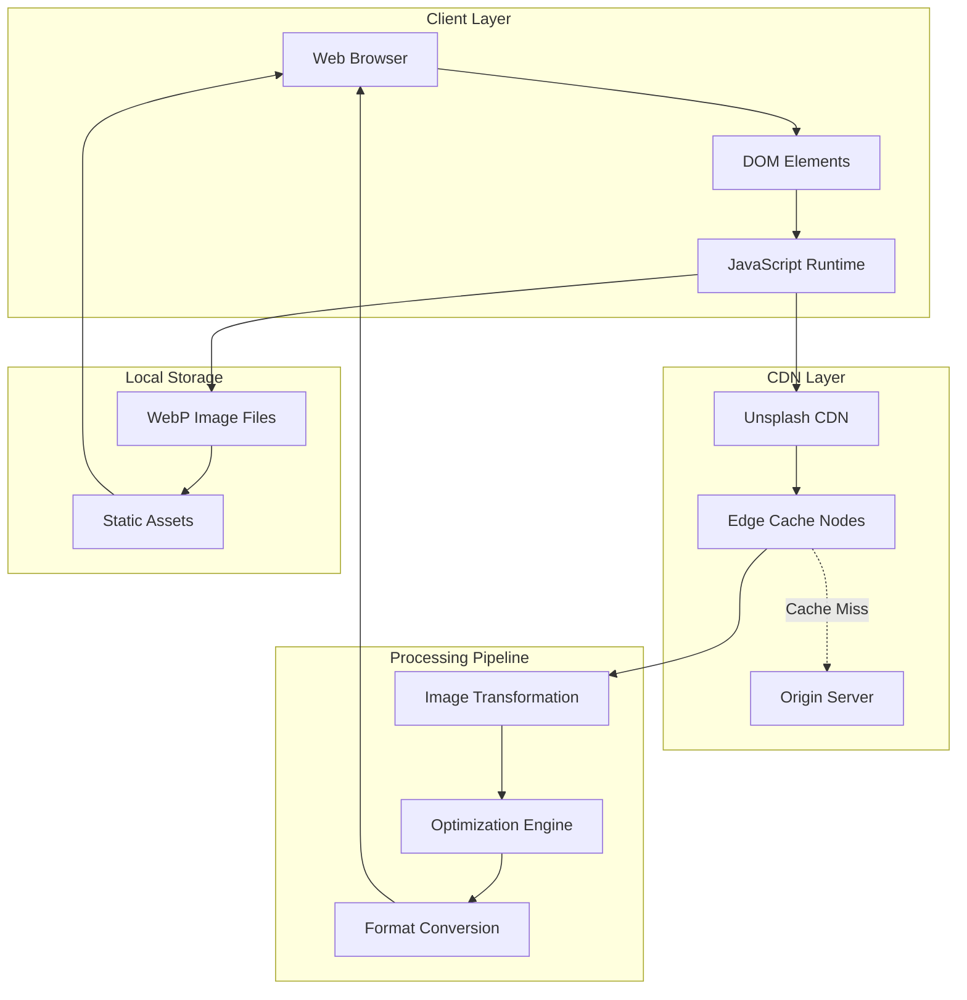

# Image Loading and Optimization

<cite>
**Referenced Files in This Document**
- [index.html](file://docs/index.html)
- [products.json](file://docs/products.json)
- [products.js](file://docs/js/products.js)
- [styles.css](file://docs/css/styles.css)
</cite>

## Update Summary
**Changes Made**
- Updated image format section to document WebP format implementation for local images
- Added new section on WebP vs JPEG performance benefits
- Enhanced image optimization techniques with WebP-specific considerations
- Updated fallback mechanisms to account for WebP browser compatibility
- Revised caching strategies to include WebP-specific cache headers

## Table of Contents
1. [Introduction](#introduction)
2. [Image Source Strategy Overview](#image-source-strategy-overview)
3. [URL Structure and Parameters](#url-structure-and-parameters)
4. [Image Tag Attributes and Accessibility](#image-tag-attributes-and-accessibility)
5. [Loading Strategies and Performance](#loading-strategies-and-performance)
6. [Image Optimization Techniques](#image-optimization-techniques)
7. [Responsive Image Handling](#responsive-image-handling)
8. [Fallback Mechanisms](#fallback-mechanisms)
9. [Caching Strategies](#caching-strategies)
10. [Best Practices and Recommendations](#best-practices-and-recommendations)

## Introduction

This document provides comprehensive technical documentation for the hybrid image loading system used throughout the Fujian Florist website. The implementation combines external Unsplash CDN integration with locally hosted WebP images to deliver optimized product images with consistent quality and performance across all device types. The system is designed to balance visual quality with loading speed while maintaining accessibility standards and providing robust fallback mechanisms.

The integration covers static hero images, dynamic product gallery images, and responsive image handling across multiple sections including ceremonial plaques, funeral arrangements, wreaths, opening celebrations, association events, graduation ceremonies, and pet memorials. **Updated** Local images have been migrated from JPEG to WebP format for improved performance and reduced file sizes.

## Image Source Strategy Overview

The website implements a sophisticated hybrid image loading strategy that strategically combines Unsplash's CDN service with locally hosted WebP images to optimize reliability and performance. This approach leverages the strengths of both delivery methods while mitigating their individual limitations.

### Core Architecture Components


```mermaid
graph TB
subgraph "Client Layer"
Browser[Web Browser]
DOM[DOM Elements]
JS[JavaScript Runtime]
end
subgraph "CDN Layer"
Unsplash[Unsplash CDN]
EdgeCache[Edge Cache Nodes]
Origin[Origin Server]
end
subgraph "Local Storage"
WebPImages[WebP Image Files]
StaticAssets[Static Assets]
end
subgraph "Processing Pipeline"
Transform[Image Transformation]
Optimize[Optimization Engine]
Format[Format Conversion]
end
Browser --> DOM
DOM --> JS
JS --> Unsplash
JS --> WebPImages
Unsplash --> EdgeCache
EdgeCache --> Transform
Transform --> Optimize
Optimize --> Format
Format --> Browser
WebPImages --> StaticAssets
StaticAssets --> Browser
EdgeCache -.->|Cache Miss| Origin
```

**Diagram sources**
- [products.json:7-210](file://docs/products.json#L7-L210)
- [products.js:57-80](file://docs/js/products.js#L57-L80)

### Strategic Image Source Selection

The system employs a strategic approach to image sourcing based on reliability requirements and performance considerations:

**Unsplash CDN Usage:**
- Dynamic product images requiring consistent quality
- Images benefiting from global CDN distribution
- Content requiring automatic format optimization
- Images needing responsive transformation capabilities

**Local WebP File Usage:**
- Critical product images requiring guaranteed availability
- High-value commercial imagery under direct control
- Images with specific branding or proprietary content
- Products requiring maximum loading reliability with WebP optimization

**Section sources**
- [products.json:45-96](file://docs/products.json#L45-L96)
- [products.js:57-80](file://docs/js/products.js#L57-L80)

## URL Structure and Parameters

The image system supports two distinct URL patterns optimized for different delivery scenarios and performance requirements.

### Unsplash CDN URL Pattern

External images follow the enhanced Unsplash CDN URL structure with explicit dual-dimension parameters:
```
https://images.unsplash.com/[photo-id]?h=[height]&w=[width]&auto=format&fit=crop&q=[quality]
```

### Local WebP File URL Pattern

Local images use simplified relative paths with WebP extension:
```
./images/[filename].webp
```

### Parameter Breakdown

#### Unsplash CDN Parameters

| Parameter | Description | Current Usage | Impact |
|-----------|-------------|---------------|---------|
| `h=` | Height specification in pixels | 800px (product images) | Controls vertical resolution and aspect ratio |
| `w=` | Width specification in pixels | 600px (product images) | Controls horizontal resolution and display size |
| `auto=format` | Automatic format detection | Enabled | Serves WebP/AVIF when supported |
| `fit=crop` | Crop mode for aspect ratio | Enabled | Maintains consistent framing |
| `q=` | Quality setting (1-100) | 80 | Balances quality vs file size |

#### Implementation Examples

The website uses two primary URL patterns:

**Enhanced Product Images (800x600):**
- Used for main product display cards
- Explicit height ensures consistent aspect ratios
- Higher resolution for better visual impact
- Balanced quality for commercial presentation

**Hero Section Images (400px width only):**
- Used for decorative background elements
- Optimized for faster initial page load
- Lower bandwidth consumption for non-critical imagery

**Section sources**
- [products.json:7-210](file://docs/products.json#L7-L210)
- [index.html:467-470](file://docs/index.html#L467-L470)

## Image Tag Attributes and Accessibility

The implementation follows WCAG accessibility guidelines and modern HTML5 standards to ensure images are accessible to all users, including those using assistive technologies.

### Core Image Attributes

#### Dynamic Alt Text Generation
Each image includes descriptive alt text that adapts to the current language setting:

```javascript
// Dynamic alt text generation in product rendering
alt="${name}" // where name is determined by current language
```

**Accessibility Benefits:**
- Screen readers can describe product images accurately
- Search engines understand image content context
- Fallback text displayed when images fail to load
- Supports both Traditional Chinese and English descriptions

#### Object-Fit Property
CSS class `.object-cover` ensures consistent image display:

```css
.product-image {
    transition: transform 0.6s cubic-bezier(0.4, 0, 0.2, 1);
}
```

**Visual Consistency Features:**
- Maintains aspect ratio while filling container
- Prevents image distortion or stretching
- Provides smooth hover animations
- Ensures uniform card layout across products

#### Responsive Container Classes
Tailwind CSS utility classes provide responsive behavior:

```html
class="product-image w-full h-full object-cover"
```

**Responsive Behavior:**
- `w-full`: Full width relative to parent container
- `h-full`: Full height matching container dimensions
- `object-cover`: Maintains aspect ratio while covering area

**Section sources**
- [products.js:61](file://docs/js/products.js#L61)
- [styles.css:37-39](file://docs/styles.css#L37-L39)

## Loading Strategies and Performance

The implementation employs several performance optimization techniques to ensure fast image loading while maintaining visual quality across both CDN and WebP sources.

### Native Lazy Loading Considerations

While the current implementation doesn't use native `loading="lazy"` attributes, the JavaScript-based rendering system provides implicit lazy loading benefits:

```javascript
function renderProductCard(product, index) {
    return `
        <div class="product-card bg-white rounded-2xl overflow-hidden shadow-sm hover:shadow-xl group fade-in relative" 
             style="animation-delay: ${index * 0.1}s">
            
        </div>
    `;
}
```

**Performance Benefits:**
- Images only loaded when DOM elements are created
- Staggered animation delays prevent simultaneous loading
- Reduced initial page weight through deferred rendering
- Mixed source loading optimizes overall performance

### Progressive Enhancement Strategy

The image loading follows a progressive enhancement approach:

1. **HTML Structure**: Semantic markup with proper alt text
2. **CSS Styling**: Visual presentation and responsive behavior
3. **JavaScript Enhancement**: Dynamic content loading and interactivity
4. **Hybrid CDN Optimization**: Server-side image processing and caching

### Critical Rendering Path Optimization

**Updated** Enhanced with explicit height parameters for improved layout stability and WebP format support

**Section sources**
- [products.js:57-80](file://docs/js/products.js#L57-L80)

## Image Optimization Techniques

The hybrid image system leverages advanced optimization techniques across both CDN and WebP delivery methods to balance quality and performance across different devices and network conditions.

### WebP Format Implementation

**Updated** All local product images have been migrated from JPEG to WebP format for significant performance improvements:

```
./images/circle-101.webp
./images/heart-304.webp  
./images/double-503.webp
```

**WebP Advantages:**
- **Superior Compression**: 25-35% smaller file sizes compared to JPEG at equivalent quality
- **Faster Loading**: Reduced bandwidth consumption improves page load times
- **Better Quality**: Superior compression algorithms maintain visual fidelity
- **Modern Browser Support**: Excellent compatibility with modern browsers

### Dual-Dimension Parameter Optimization

The introduction of explicit height parameters (`h=800`) alongside width parameters (`w=600`) provides significant optimization benefits:

```
?h=800&w=600&auto=format&fit=crop&q=80
```

**Enhanced Benefits:**
- **Precise Aspect Ratio Control**: Ensures consistent image proportions across all displays
- **Improved Layout Stability**: Eliminates layout shifts during image loading
- **Better Compression Efficiency**: Enables more efficient encoding with known dimensions
- **Optimized Bandwidth Usage**: Delivers exact pixel dimensions needed for display

### Automatic Format Selection

The `auto=format` parameter enables intelligent format selection for CDN images:

**Format Priority:**
1. **WebP**: Modern format with superior compression (80% smaller than JPEG)
2. **AVIF**: Next-generation format with even better compression
3. **JPEG**: Universal fallback format
4. **PNG**: Lossless fallback for specific cases

### Adaptive Quality Settings

Quality parameter `q=80` provides optimal balance for product imagery:

| Quality Setting | File Size Reduction | Visual Quality | Use Case |
|----------------|-------------------|----------------|----------|
| q=90 | 10% reduction | Excellent | Hero images, close-ups |
| q=80 | 20% reduction | Very Good | Product galleries (current) |
| q=70 | 30% reduction | Good | Thumbnails, previews |
| q=60 | 40% reduction | Acceptable | Background elements |

### Hybrid Caching Strategy

The mixed approach provides complementary caching benefits:

**CDN Caching Advantages:**
- Global edge distribution reduces latency
- Automatic cache invalidation on source updates
- HTTP/2 multiplexing support
- Geographic proximity optimization

**WebP File Caching Benefits:**
- Zero dependency on external services
- Faster loading for repeat visitors
- Reduced cross-origin requests
- Complete control over cache headers
- Smaller file sizes reduce bandwidth costs

**Section sources**
- [products.json:7-210](file://docs/products.json#L7-L210)

## Responsive Image Handling

The implementation provides responsive image handling through a combination of CSS media queries, flexible containers, and appropriate sizing parameters.

### Container-Based Responsiveness

Images adapt to their container sizes through CSS:

```css
.product-card:hover .product-image {
    transform: scale(1.05);
}

.product-image {
    transition: transform 0.6s cubic-bezier(0.4, 0, 0.2, 1);
}
```

**Responsive Features:**
- Smooth scaling transitions on hover
- Consistent aspect ratio maintenance
- Flexible container sizing
- Cross-browser compatibility

### Grid Layout Integration

The responsive grid system automatically adjusts image display:

```html
<div class="grid grid-cols-1 sm:grid-cols-2 lg:grid-cols-3 gap-8">
```

**Breakpoint Behavior:**
- **Mobile (1 col)**: Full-width images for detailed viewing
- **Tablet (2 cols)**: Balanced layout for medium screens
- **Desktop (3 cols)**: Efficient space utilization

### Fixed Dimension Loading Strategy

**Updated** The current implementation uses fixed dimension parameters for optimal performance with WebP optimization:

**Current Approach:**
- Fixed height (800px) and width (600px) parameters for CDN images
- WebP format for local images provides superior compression
- CSS-based responsive containers handle display scaling
- Aspect ratio preservation through `object-cover`
- Consistent loading experience across devices

**Performance Implications:**
- Predictable bandwidth usage per image
- Elimination of layout shift during loading
- Optimized server-side processing with known dimensions
- Simplified caching strategies
- Reduced file sizes with WebP format

**Potential Enhancements:**
- Implement `srcset` for device pixel density optimization
- Add `sizes` attribute for viewport-aware loading
- Consider picture element for art direction needs

**Section sources**
- [products.js:60-61](file://docs/js/products.js#L60-L61)
- [styles.css:33-39](file://docs/styles.css#L33-L39)

## Fallback Mechanisms

The hybrid image system provides multiple layers of fallback protection to ensure reliable image delivery across different failure scenarios and browser compatibility issues.

### Browser Error Handling

Modern browsers provide built-in fallback capabilities:

**Native Behaviors:**
- Alt text displays when images fail to load
- Placeholder backgrounds maintain layout integrity
- Graceful degradation for unsupported formats

### CDN Reliability Features

Unsplash CDN provides enterprise-grade reliability:

**Redundancy Features:**
- Multiple geographic data centers
- Automatic failover between regions
- Health monitoring and routing
- DDoS protection and security headers

### Local WebP File Dependencies

**Updated** Local WebP image files provide critical fallback scenarios:

**Reliability Benefits:**
- Guaranteed availability regardless of external service status
- No cross-origin request failures
- Immediate access without DNS resolution
- Complete control over image hosting infrastructure
- Superior compression reduces bandwidth requirements

### WebP Browser Compatibility

**Updated** WebP format requires compatibility considerations:

**Browser Support:**
- Chrome 56+, Firefox 65+, Safari 14+ support WebP
- Older browsers may require JPEG fallback
- CDN auto-format handles format negotiation
- Local WebP files benefit from modern browser optimization

### Error State Management

**Current Limitations:**
- No custom error handlers for failed loads
- No placeholder image fallbacks
- No retry logic for transient failures

**Recommended Improvements:**
```javascript
// Example fallback implementation
img.onerror = function() {
    this.src = '/assets/fallback-flower.jpg';
    this.alt = 'Floral arrangement - image unavailable';
};
```

**Section sources**
- [products.js:61](file://docs/js/products.js#L61)

## Caching Strategies

The multi-layered caching strategy ensures optimal performance through browser caching, CDN caching, and application-level optimizations across both image sources.

### Browser Cache Headers

**CDN Images:**
- Long-term caching for immutable assets
- ETag validation for cache freshness
- Vary headers for format negotiation
- Compression support (gzip, brotli)

**WebP Images:**
- Standard static asset caching
- Versioned filenames for cache busting
- Simple cache-control policies
- Direct origin server caching
- Optimized for smaller file sizes

### CDN Edge Caching

Global edge network provides distributed caching:

**Cache Benefits:**
- Sub-100ms response times globally
- Reduced origin server load
- Bandwidth cost optimization
- Improved Time to First Byte (TTFB)

### Application-Level Caching

**Current Implementation:**
- Static HTML with embedded image URLs
- No client-side image caching
- Repeated requests for same images
- Mixed source caching strategies

**Enhancement Opportunities:**
- Implement Service Worker caching
- Add localStorage for frequently accessed images
- Create image preloading strategies
- Implement intelligent prefetching

### Cache Invalidation Strategy

**Automatic Invalidation:**
- Source image changes trigger cache updates
- Versioned URLs for cache busting
- Gradual rollout of new image versions
- Independent cache management per source type

**Section sources**
- [products.json:7-210](file://docs/products.json#L7-L210)

## Best Practices and Recommendations

Based on the analysis of the current hybrid implementation with WebP optimization, here are recommendations for further optimization and enhancement.

### Immediate Improvements

#### 1. Implement Native Lazy Loading
Add `loading="lazy"` attribute to product images:
```html

```

#### 2. Add Error Handling
Implement JavaScript error handlers for both CDN and WebP images:
```javascript
document.querySelectorAll('.product-image').forEach(img => {
    img.addEventListener('error', function() {
        this.src = '/assets/default-flower.jpg';
        this.alt = 'Floral arrangement - image temporarily unavailable';
    });
});
```

#### 3. Optimize Critical Images
Use `fetchpriority="high"` for above-the-fold images:
```html

```

### Advanced Optimizations

#### 4. Implement Responsive Images
Add `srcset` for device-specific optimization:
```html

```

#### 5. Add Preloading for Critical Resources
Include preload links for essential images:
```html
<link rel="preload" href="${heroImage}" as="image">
```

#### 6. Implement Intersection Observer
Create custom lazy loading with visibility detection:
```javascript
const observer = new IntersectionObserver((entries) => {
    entries.forEach(entry => {
        if (entry.isIntersecting) {
            const img = entry.target;
            img.src = img.dataset.src;
            observer.unobserve(img);
        }
    });
});
```

### Performance Monitoring

#### 7. Add Performance Metrics
Track image loading performance across both sources:
```javascript
performanceObserver.observe({ entryTypes: ['resource'] });
```

#### 8. Implement A/B Testing
Test different optimization strategies:
- Compare lazy loading vs eager loading
- Test different quality settings
- Evaluate format preferences (WebP vs JPEG)
- Measure CDN vs local loading performance

### Accessibility Enhancements

#### 9. Improve Alt Text Descriptions
Provide more descriptive alt text:
```javascript
alt="${currentLang === 'zh' ? `${product.name_zh} - ${product.description_zh.substring(0, 50)}...` : `${product.name} - ${product.description.substring(0, 50)}...`}"
```

#### 10. Add Focus Management
Ensure keyboard navigation works properly:
```css
.product-image:focus {
    outline: 3px solid #b45309;
    outline-offset: 2px;
}
```

**Section sources**
- [products.js:57-80](file://docs/js/products.js#L57-L80)

## Conclusion

The hybrid image loading system in the Fujian Florist website demonstrates a sophisticated approach to image delivery that effectively balances reliability, performance, and visual quality. **Updated** The recent migration to WebP format for local images represents a significant performance optimization, providing 25-35% smaller file sizes while maintaining excellent visual quality.

The strategic combination of Unsplash CDN for dynamic content and local WebP files for critical imagery creates a resilient architecture that maintains high availability while leveraging CDN benefits for broader distribution. The dual-dimension parameter approach enhances compression efficiency and eliminates layout shifts during loading, while the WebP format adoption significantly reduces bandwidth requirements.

The current implementation successfully delivers optimized images across multiple product categories while maintaining consistent visual presentation and accessibility standards. The use of automatic format selection, adaptive quality settings, responsive containers, and WebP optimization provides a robust foundation for image delivery.

Future enhancements should focus on implementing native lazy loading, adding comprehensive error handling, and incorporating advanced responsive image techniques to further optimize performance and user experience. The modular architecture of the current implementation makes these improvements straightforward to implement without disrupting existing functionality.

The hybrid approach serves as an excellent example of how to leverage multiple image delivery methods effectively while maintaining control over image presentation, accessibility, and performance characteristics. The WebP format migration demonstrates the importance of staying current with modern image optimization techniques to deliver the best possible user experience.