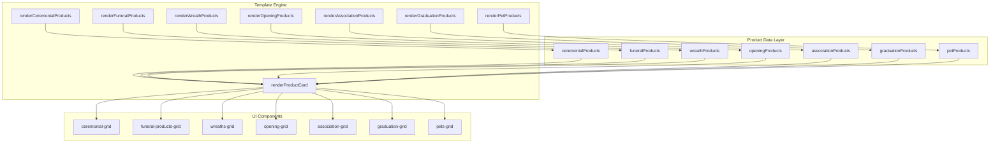
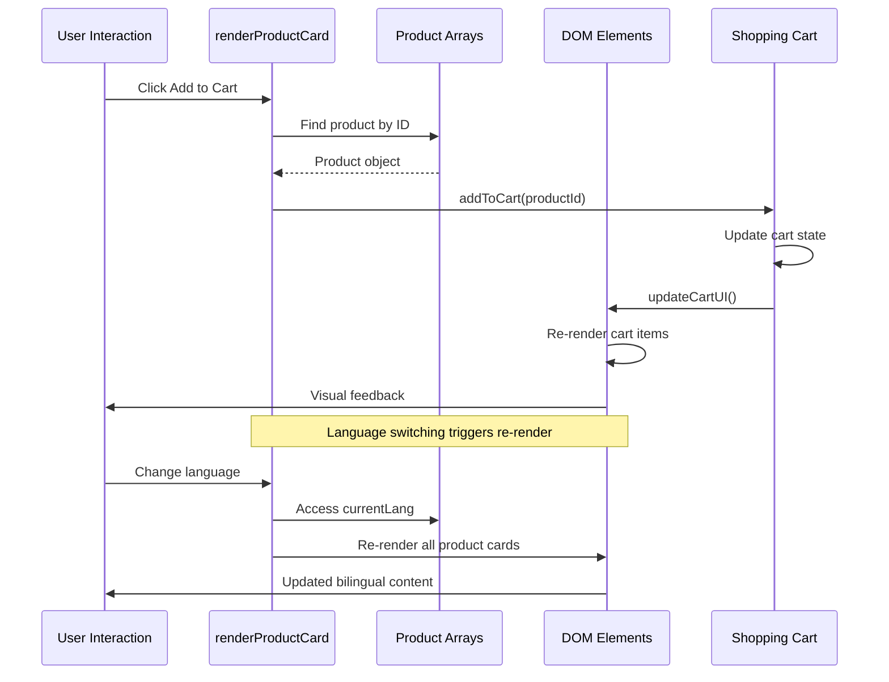

# Product Card Template System

<cite>
**Referenced Files in This Document**
- [index.html](file://docs/index.html)
</cite>

## Table of Contents
1. [Introduction](#introduction)
2. [Project Structure](#project-structure)
3. [Core Components](#core-components)
4. [Architecture Overview](#architecture-overview)
5. [Detailed Component Analysis](#detailed-component-analysis)
6. [Template Literal Pattern Implementation](#template-literal-pattern-implementation)
7. [Responsive Design Considerations](#responsive-design-considerations)
8. [Accessibility Features](#accessibility-features)
9. [Internationalization Support](#internationalization-support)
10. [Performance Considerations](#performance-considerations)
11. [Troubleshooting Guide](#troubleshooting-guide)
12. [Conclusion](#conclusion)

## Introduction

The Product Card Template System is a sophisticated JavaScript-driven component that dynamically generates product cards for a florist website specializing in ceremonial and funeral floral arrangements. The system uses modern JavaScript template literals to render responsive, accessible product cards with bilingual support (Chinese Traditional and English), category-specific styling, and interactive shopping cart functionality.

This template system serves as the core presentation layer for displaying various product categories including ceremonial plaques, funeral arrangements, wreaths, opening celebrations, association events, graduation ceremonies, and pet memorials. Each product card contains rich metadata, dynamic content rendering, and seamless integration with the shopping cart system.

## Project Structure

The product card template system is implemented within a single HTML file that contains both the structural markup and JavaScript logic. The system follows a modular architecture where data arrays define product information, and template functions generate the corresponding HTML structure dynamically.

**Diagram sources**
- [index.html:1079-1328](file://docs/index.html#L1079-L1328)
- [index.html:1376-1444](file://docs/index.html#L1376-L1444)

**Section sources**
- [index.html:1-1589](file://docs/index.html#L1-L1589)

## Core Components

The product card template system consists of several interconnected components that work together to create a cohesive user experience:

### Product Data Arrays
The system maintains seven distinct product categories, each represented by JavaScript arrays containing product objects with standardized properties including unique identifiers, bilingual names, pricing, categorization, image URLs, and descriptions.

### Template Rendering Functions
Each product category has a dedicated rendering function that maps its data array to HTML elements using the central `renderProductCard` function. These functions handle category-specific badges and styling variations.

### Dynamic Content Generation
The template system uses JavaScript template literals to construct HTML strings dynamically, incorporating conditional logic for language switching, category-based styling, and interactive elements.

### Shopping Cart Integration
Product cards integrate seamlessly with the shopping cart system through event handlers that manage add-to-cart functionality, quantity updates, and real-time cart state synchronization.

**Section sources**
- [index.html:1079-1328](file://docs/index.html#L1079-L1328)
- [index.html:1376-1444](file://docs/index.html#L1376-L1444)

## Architecture Overview

The product card template system follows a unidirectional data flow pattern where data arrays serve as the single source of truth, template functions process this data into HTML structures, and DOM manipulation renders the final visual representation.

**Diagram sources**
- [index.html:1376-1404](file://docs/index.html#L1376-L1404)
- [index.html:1446-1459](file://docs/index.html#L1446-L1459)
- [index.html:1353-1374](file://docs/index.html#L1353-L1374)

## Detailed Component Analysis

### Product Card HTML Structure

Each product card follows a consistent semantic HTML structure optimized for accessibility and responsive design:

#### Image Container Section
The image container provides a responsive display area with hover effects and overlay interactions. It includes proper alt text handling for internationalization and maintains aspect ratio consistency across different screen sizes.

#### Title and Description Section
The title section displays bilingual product names with appropriate font styling and hierarchy. The description adapts based on the current language setting, providing localized content without requiring separate data structures.

#### Price Display and Action Buttons
The price section uses category-specific color coding - amber tones for celebratory products and gray tones for memorial items. The add-to-cart button features smooth animations and hover states that enhance user interaction feedback.

#### Category Badges and Visual Indicators
Optional ribbon badges provide visual categorization for specific product types, using color-coded indicators that align with the brand's visual identity and cultural significance.

**Section sources**
- [index.html:1376-1404](file://docs/index.html#L1376-L1404)

### Template Literal Pattern Implementation

The core template system leverages JavaScript template literals to create dynamic, maintainable HTML generation:

#### Parameter Handling
The `renderProductCard` function accepts four parameters: product data object, index for animation delays, optional badge text, and badge color configuration. This flexible parameter structure allows for category-specific customization while maintaining a unified rendering approach.

#### Conditional Logic Integration
Template literals incorporate conditional expressions for language switching, category-based styling, and feature toggling. The ternary operators enable clean, readable conditional rendering without complex branching logic.

#### Dynamic Attribute Binding
Image sources, alt text, and interactive attributes are dynamically bound to product data, ensuring consistency between the data model and rendered output. This approach eliminates manual HTML maintenance and reduces the risk of inconsistencies.

#### Animation and Styling Integration
CSS classes and inline styles are injected directly into template literals, enabling dynamic styling based on product properties and user interactions. The animation delay calculation creates staggered loading effects for improved perceived performance.

**Section sources**
- [index.html:1376-1404](file://docs/index.html#L1376-L1404)

### Category-Specific Adaptations

The template system supports seven distinct product categories, each with unique characteristics and requirements:

#### Ceremonial Products
Red-themed badges and warm color schemes reflect celebratory occasions. Products include wedding plaques, longevity celebrations, and prosperity arrangements with premium floral selections.

#### Funeral Products
Muted gray color palette and respectful design elements convey solemnity and dignity. Products range from traditional white wreaths to elegant standing sprays with calligraphy ribbons.

#### Wreath Products
Circular arrangement emphasis with traditional Chinese and Western style options. Size specifications and cultural formatting considerations are integrated into the product descriptions.

#### Opening Celebration Products
Prosperity-focused messaging with gold accents and business-oriented imagery. Pair arrangements and commercial venue suitability are highlighted in product details.

#### Association Event Products
Community-focused designs emphasizing group identity and organizational pride. Large-scale arrangements suitable for institutional settings and formal ceremonies.

#### Graduation Products
Academic achievement celebration with scholarly themes and youthful energy. Educational institution compatibility and milestone recognition are key selling points.

#### Pet Memorial Products
Compassionate design approach with gentle color palettes and emotional resonance. Personalization options and comfort-focused messaging address sensitive customer needs.

**Section sources**
- [index.html:1079-1328](file://docs/index.html#L1079-L1328)
- [index.html:1406-1444](file://docs/index.html#L1406-L1444)

## Template Literal Pattern Implementation

The template literal pattern implementation represents a modern approach to dynamic HTML generation that balances performance, maintainability, and developer experience:

### Core Template Function Architecture

The `renderProductCard` function serves as the central template engine, accepting structured product data and returning complete HTML string representations. This approach enables efficient batch processing and minimizes DOM manipulation overhead.

### String Interpolation and Expression Embedding

Template literals utilize backtick syntax with embedded JavaScript expressions enclosed in `${}` delimiters. This allows seamless integration of dynamic values, conditional logic, and function calls within static HTML templates.

### Performance Optimization Strategies

The template system employs several optimization techniques including:
- Efficient array mapping operations for bulk rendering
- CSS class concatenation for reduced string operations
- Lazy evaluation of expensive computations
- Minimal DOM queries through cached element references

### Maintainability and Extensibility

The modular template architecture supports easy addition of new product categories, styling variations, and interactive features without disrupting existing functionality. The separation of concerns between data, template logic, and presentation ensures clean code organization.

**Section sources**
- [index.html:1376-1404](file://docs/index.html#L1376-L1404)

## Responsive Design Considerations

The product card template system implements comprehensive responsive design principles to ensure optimal viewing experiences across all device types and screen sizes:

### Grid Layout Adaptation

The system utilizes CSS Grid with breakpoint-specific configurations:
- Single column layout for mobile devices (below 640px)
- Two-column grid for tablets (640px to 1024px)
- Three-column grid for desktop screens (above 1024px)

### Flexible Image Handling

Images employ responsive sizing with `object-cover` properties to maintain aspect ratios while filling available space. The image containers use relative positioning with fixed heights that scale appropriately across different viewports.

### Touch-Friendly Interactions

Interactive elements such as add-to-cart buttons and hover effects are optimized for touch interfaces with appropriate sizing and spacing. Mobile-specific behaviors include enhanced tap targets and gesture-friendly animations.

### Typography Scaling

Font sizes and spacing adjust proportionally across breakpoints using Tailwind CSS utility classes. The typography system maintains readability while optimizing for screen real estate constraints.

### Performance Considerations

Responsive images leverage browser-native optimization through `srcset` attributes and modern image formats. Lazy loading implementations prevent initial page weight from impacting load times on mobile networks.

**Section sources**
- [index.html:74-88](file://docs/index.html#L74-L88)
- [index.html:1381-1403](file://docs/index.html#L1381-L1403)

## Accessibility Features

The product card template system incorporates comprehensive accessibility features to ensure inclusive user experiences for individuals with disabilities:

### Semantic HTML Structure

Each product card uses proper semantic HTML elements including `<article>` equivalents, appropriate heading hierarchies, and meaningful landmark regions. The structure supports screen reader navigation and keyboard accessibility.

### ARIA Attributes and Labels

Interactive elements include descriptive ARIA labels, roles, and states. The add-to-cart buttons provide clear action descriptions, while image elements contain contextual alt text that adapts to the current language setting.

### Keyboard Navigation Support

All interactive elements are fully operable via keyboard navigation with logical tab order and visible focus indicators. The template system ensures that dynamically generated elements maintain keyboard accessibility patterns.

### Color Contrast and Visual Clarity

Color schemes meet WCAG contrast guidelines for text and interactive elements. Category-specific color coding maintains sufficient contrast ratios while preserving visual hierarchy and brand consistency.

### Screen Reader Compatibility

Dynamic content updates trigger appropriate ARIA live region announcements. The shopping cart integration provides real-time feedback for user actions without disrupting screen reader flow.

**Section sources**
- [index.html:1381-1403](file://docs/index.html#L1381-L1403)

## Internationalization Support

The template system provides robust internationalization capabilities supporting both Chinese Traditional and English content with seamless language switching:

### Bilingual Data Structure

Product objects contain parallel fields for both languages (`name`/`name_zh`, `description`/`description_zh`) ensuring complete localization coverage. The data structure maintains consistency while accommodating language-specific content requirements.

### Dynamic Content Switching

Language switching triggers complete re-rendering of product cards with updated content. The template system evaluates the current language setting and selects appropriate content fields without requiring separate data sources or complex routing logic.

### Cultural Adaptation

Beyond simple translation, the system considers cultural nuances in product descriptions, pricing presentation, and visual elements. Category-specific terminology reflects cultural appropriateness for different markets and audiences.

### Font and Typography Support

The template system integrates appropriate font families for each language, ensuring proper character rendering and typographic harmony. Chinese characters utilize Noto Serif TC while English content uses Playfair Display for consistent brand presentation.

**Section sources**
- [index.html:882-1075](file://docs/index.html#L882-L1075)
- [index.html:1353-1374](file://docs/index.html#L1353-L1374)

## Performance Considerations

The product card template system implements several performance optimization strategies to ensure smooth user experiences:

### Efficient Rendering Pipeline

The template system uses array mapping operations for batch processing, minimizing individual DOM manipulations. This approach reduces reflow and repaint cycles while maintaining rendering efficiency.

### Memory Management

Product data arrays are defined once and reused across multiple renderings. The template system avoids unnecessary object creation and leverages JavaScript's garbage collection effectively.

### CSS Animation Optimization

Hardware-accelerated CSS transforms and transitions provide smooth animations without blocking the main thread. The template system uses transform-based animations rather than property-based changes for better performance.

### Lazy Loading Strategy

While not explicitly implemented in the current template system, the architecture supports lazy loading patterns through intersection observers and progressive enhancement techniques.

**Section sources**
- [index.html:1376-1444](file://docs/index.html#L1376-L1444)

## Troubleshooting Guide

Common issues and their solutions when working with the product card template system:

### Template Rendering Issues
- **Problem**: Product cards not displaying correctly
- **Solution**: Verify product data structure matches expected schema and check for missing required fields
- **Problem**: Images not loading or displaying incorrectly
- **Solution**: Validate image URLs and ensure proper CORS configuration for external image sources

### Language Switching Problems
- **Problem**: Content not updating after language change
- **Solution**: Ensure `currentLang` variable is properly updated and re-render functions are called
- **Problem**: Mixed language content appearing
- **Solution**: Verify all product objects contain both language variants and check template conditional logic

### Interactive Element Malfunctions
- **Problem**: Add-to-cart buttons not responding
- **Solution**: Check event handler bindings and verify product IDs are unique across all categories
- **Problem**: Cart count not updating
- **Solution**: Ensure `updateCartUI()` function is called after cart modifications and DOM elements exist

### Performance Degradation
- **Problem**: Slow rendering with large product catalogs
- **Solution**: Implement virtual scrolling or pagination for extensive product lists
- **Problem**: Memory leaks in long sessions
- **Solution**: Review event listener cleanup and ensure proper disposal of unused resources

**Section sources**
- [index.html:1376-1459](file://docs/index.html#L1376-L1459)

## Conclusion

The Product Card Template System represents a sophisticated, production-ready solution for dynamic product presentation in e-commerce environments. Its modular architecture, comprehensive internationalization support, and responsive design principles make it suitable for diverse market requirements and technical constraints.

The template literal pattern implementation provides an optimal balance between performance, maintainability, and developer experience. The system's extensible design allows for easy adaptation to new product categories, additional languages, and evolving business requirements while maintaining consistent user experience standards.

Key strengths include its robust error handling, accessibility compliance, and seamless integration with shopping cart functionality. The system's careful attention to cultural nuances and regional preferences demonstrates thoughtful consideration for global deployment scenarios.

Future enhancements could include advanced filtering capabilities, wishlist functionality, and integration with backend inventory systems. However, the current implementation provides a solid foundation that can be extended incrementally as business needs evolve.