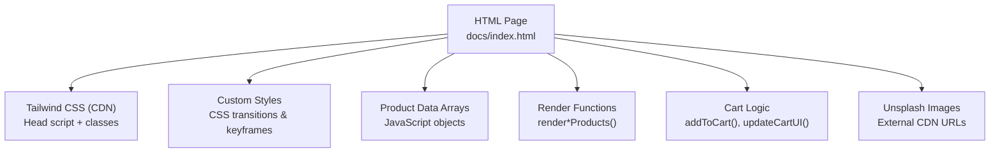
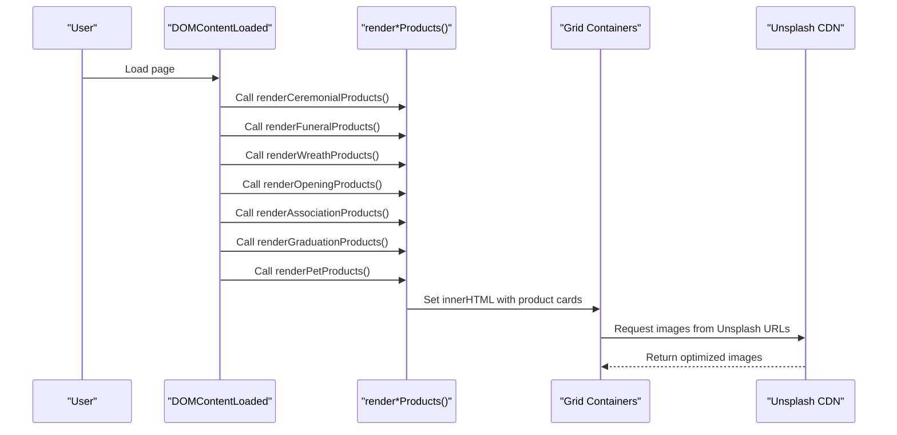
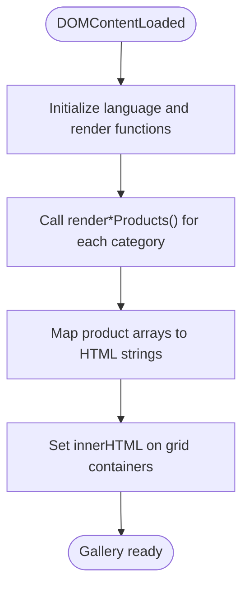
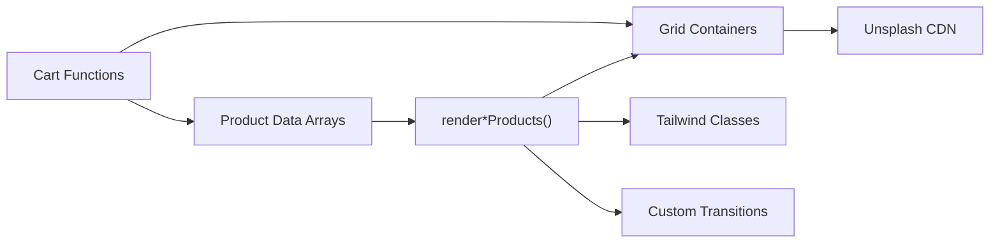

# Product Gallery Components

<cite>
**Referenced Files in This Document**
- [index.html](file://docs/index.html)
</cite>

## Table of Contents
1. [Introduction](#introduction)
2. [Project Structure](#project-structure)
3. [Core Components](#core-components)
4. [Architecture Overview](#architecture-overview)
5. [Detailed Component Analysis](#detailed-component-analysis)
6. [Dependency Analysis](#dependency-analysis)
7. [Performance Considerations](#performance-considerations)
8. [Troubleshooting Guide](#troubleshooting-guide)
9. [Conclusion](#conclusion)

## Introduction
This document explains the product gallery components implemented in the site, focusing on:
- Grid layout system using CSS Grid and Tailwind CSS classes
- Product card structure with hover effects and animations
- Image handling with external Unsplash CDN integration
- Product card template system and JavaScript rendering functions
- Hover transformations including translateY and scale effects
- Responsive grid breakpoints
- Performance optimization techniques for image loading and animation smoothness

The implementation is contained within a single-page HTML file that uses Tailwind CSS via CDN and vanilla JavaScript to render multiple product categories into responsive grids.

## Project Structure
The project consists of a single page with embedded styles and scripts:
- docs/index.html contains all HTML markup, Tailwind configuration, custom CSS, and JavaScript logic for rendering product galleries and cart interactions.

**Diagram sources**
- [index.html:1-209](file://docs/index.html#L1-L209)
- [index.html:881-1589](file://docs/index.html#L881-L1589)

**Section sources**
- [index.html:1-209](file://docs/index.html#L1-L209)
- [index.html:881-1589](file://docs/index.html#L881-L1589)

## Core Components
- Category sections with grid containers:
  - Ceremonial: id="ceremonial-grid"
  - Funeral: id="funeral-products-grid"
  - Wreaths: id="wreaths-grid"
  - Opening: id="opening-grid"
  - Association: id="association-grid"
  - Graduation: id="graduation-grid"
  - Pets: id="pets-grid"
- Each section defines a responsive grid container using Tailwind’s grid utilities.
- Product cards are rendered by JavaScript from data arrays and injected into these containers.

Key responsibilities:
- Layout: Tailwind CSS grid classes define responsive columns and spacing.
- Interactions: Custom CSS provides hover transforms and transitions.
- Rendering: JavaScript maps product data to HTML strings and inserts them into the DOM.
- Cart: Add-to-cart updates UI and generates WhatsApp checkout link.

**Section sources**
- [index.html:402-587](file://docs/index.html#L402-L587)
- [index.html:1332-1351](file://docs/index.html#L1332-L1351)
- [index.html:1376-1444](file://docs/index.html#L1376-L1444)

## Architecture Overview
High-level flow:
- On DOMContentLoaded, each category’s render function is called to populate its grid.
- Each render function maps a data array to product card HTML and sets innerHTML on the corresponding grid element.
- User interactions (Add to Cart) update an in-memory cart and refresh the cart sidebar UI.
- Language switching re-renders all grids to reflect localized text.

**Diagram sources**
- [index.html:1332-1351](file://docs/index.html#L1332-L1351)
- [index.html:1406-1444](file://docs/index.html#L1406-L1444)
- [index.html:1079-1328](file://docs/index.html#L1079-L1328)

## Detailed Component Analysis

### Grid Layout System (CSS Grid + Tailwind)
Each category section uses Tailwind’s responsive grid classes to control column counts across breakpoints:
- Ceremonial: grid-cols-1 md:grid-cols-2 lg:grid-cols-3
- Funeral: grid-cols-1 sm:grid-cols-2 lg:grid-cols-3
- Wreaths: grid-cols-1 sm:grid-cols-2 lg:grid-cols-3
- Opening: grid-cols-1 sm:grid-cols-2 lg:grid-cols-3
- Association: grid-cols-1 sm:grid-cols-2 lg:grid-cols-3
- Graduation: grid-cols-1 sm:grid-cols-2 lg:grid-cols-3
- Pets: grid-cols-1 sm:grid-cols-2 lg:grid-cols-3

Spacing between items is controlled by gap-8. The max-width container and horizontal padding ensure consistent margins.

Responsive behavior summary:
- Mobile (< sm): 1 column
- Small tablets (sm): 2 columns
- Large screens (lg): 3 columns

**Section sources**
- [index.html:417](file://docs/index.html#L417)
- [index.html:471](file://docs/index.html#L471)
- [index.html:509](file://docs/index.html#L509)
- [index.html:528](file://docs/index.html#L528)
- [index.html:547](file://docs/index.html#L547)
- [index.html:566](file://docs/index.html#L566)
- [index.html:585](file://docs/index.html#L585)

### Product Card Template System
The product card template is generated by a single render function that returns an HTML string per product. It includes:
- Optional ribbon badge for certain categories
- Image area with overlay and add-to-cart button
- Product metadata: ID, title, description, price
- “Add to Cart” action link

Template characteristics:
- Uses Tailwind utility classes for layout, typography, colors, and shadows
- Applies fade-in animation with staggered delay based on index
- Adds hover shadow and group-based reveal for the floating add-to-cart button

Example references:
- Template generation: [index.html:1376-1404](file://docs/index.html#L1376-L1404)
- Category-specific renderers: [index.html:1406-1444](file://docs/index.html#L1406-L1444)

**Section sources**
- [index.html:1376-1404](file://docs/index.html#L1376-L1404)
- [index.html:1406-1444](file://docs/index.html#L1406-L1444)

### Hover Effects and Animations
Hover and transition behaviors are defined in custom CSS:
- Card lift on hover: translateY(-8px)
- Image zoom on hover: scale(1.05)
- Smooth transitions with cubic-bezier easing
- Fade-in entrance animation with translateY(20px) to 0
- Slide-in-right animation for cart items
- Floating WhatsApp button animation

Key properties:
- transform: translateY(...) and scale(...)
- transition: all or specific property with duration and easing
- @keyframes for fadeIn, slideInRight, float

References:
- Card hover and image zoom: [index.html:74-88](file://docs/index.html#L74-L88)
- Entrance and slide animations: [index.html:94-122](file://docs/index.html#L94-L122)
- Floating button animation: [index.html:58-72](file://docs/index.html#L58-L72)

**Section sources**
- [index.html:74-88](file://docs/index.html#L74-L88)
- [index.html:94-122](file://docs/index.html#L94-L122)
- [index.html:58-72](file://docs/index.html#L58-L72)

### Image Handling with Unsplash CDN
Images are sourced from Unsplash via direct URLs with query parameters for sizing and quality:
- Example pattern: https://images.unsplash.com/photo-...?w=600&auto=format&fit=crop&q=80
- All product images use this pattern consistently across categories

Benefits:
- Automatic format selection and cropping
- Controlled width and quality for balanced performance

References:
- Sample image URL patterns: [index.html:1086](file://docs/index.html#L1086), [index.html:1129](file://docs/index.html#L1129), [index.html:1172](file://docs/index.html#L1172), [index.html:1205](file://docs/index.html#L1205), [index.html:1238](file://docs/index.html#L1238), [index.html:1271](file://docs/index.html#L1271), [index.html:1304](file://docs/index.html#L1304)

**Section sources**
- [index.html:1079-1328](file://docs/index.html#L1079-L1328)

### JavaScript Rendering Functions
Rendering pipeline:
- Data arrays hold product details (id, name, name_zh, price, category, image, description, description_zh)
- Each category has a dedicated render function that maps products to card HTML and assigns it to the corresponding grid container
- setLanguage triggers re-rendering to update localized content
- DOMContentLoaded initializes all renders and language settings

References:
- Data arrays: [index.html:1079-1328](file://docs/index.html#L1079-L1328)
- Render functions: [index.html:1406-1444](file://docs/index.html#L1406-L1444)
- Initialization and language switch: [index.html:1332-1351](file://docs/index.html#L1332-L1351), [index.html:1353-1374](file://docs/index.html#L1353-L1374)

**Diagram sources**
- [index.html:1332-1351](file://docs/index.html#L1332-L1351)
- [index.html:1406-1444](file://docs/index.html#L1406-L1444)

**Section sources**
- [index.html:1079-1328](file://docs/index.html#L1079-L1328)
- [index.html:1332-1351](file://docs/index.html#L1332-L1351)
- [index.html:1353-1374](file://docs/index.html#L1353-L1374)
- [index.html:1406-1444](file://docs/index.html#L1406-L1444)

### Cart Integration and Actions
- addToCart finds the product by id, increments quantity if already present, and updates UI
- updateCartUI recalculates totals, toggles visibility of empty/cart content, and updates the WhatsApp checkout link
- generateWhatsAppLink builds a message with item details and total

References:
- addToCart: [index.html:1446-1459](file://docs/index.html#L1446-L1459)
- updateCartUI: [index.html:1496-1553](file://docs/index.html#L1496-L1553)
- generateWhatsAppLink: [index.html:1478-1494](file://docs/index.html#L1478-L1494)

**Section sources**
- [index.html:1446-1459](file://docs/index.html#L1446-L1459)
- [index.html:1478-1494](file://docs/index.html#L1478-L1494)
- [index.html:1496-1553](file://docs/index.html#L1496-L1553)

## Dependency Analysis
- External dependencies:
  - Tailwind CSS via CDN for utility-first styling
  - Google Fonts for serif/sans typefaces
  - Font Awesome for icons
  - Unsplash CDN for product images
- Internal dependencies:
  - Data arrays drive render functions
  - Render functions depend on grid container IDs
  - Cart functions depend on product data and DOM elements

**Diagram sources**
- [index.html:1079-1328](file://docs/index.html#L1079-L1328)
- [index.html:1406-1444](file://docs/index.html#L1406-L1444)
- [index.html:1496-1553](file://docs/index.html#L1496-L1553)

**Section sources**
- [index.html:1079-1328](file://docs/index.html#L1079-L1328)
- [index.html:1406-1444](file://docs/index.html#L1406-L1444)
- [index.html:1496-1553](file://docs/index.html#L1496-L1553)

## Performance Considerations
- Image optimization:
  - Use Unsplash query parameters to constrain width and quality (e.g., w=600, q=80) to reduce payload size
  - Ensure consistent aspect ratios to avoid layout shifts
- Animation smoothness:
  - Prefer transform and opacity changes for GPU-accelerated animations
  - Use cubic-bezier easing for natural motion
- Rendering efficiency:
  - Batch DOM writes by constructing full HTML strings before setting innerHTML
  - Avoid excessive reflows; keep transitions minimal and short
- Network considerations:
  - Leverage browser caching for static assets (fonts, Tailwind)
  - Consider preloading critical fonts and images if needed

[No sources needed since this section provides general guidance]

## Troubleshooting Guide
Common issues and resolutions:
- Grid not displaying correctly:
  - Verify grid container IDs match those used in render functions
  - Check Tailwind CDN inclusion and class names
- Images not loading:
  - Confirm Unsplash URLs are valid and accessible
  - Validate query parameters for width and quality
- Hover effects not working:
  - Ensure custom CSS is included and not overridden
  - Inspect computed styles for transform and transition properties
- Cart not updating:
  - Check console for errors in addToCart/updateCartUI
  - Verify DOM elements exist when updateCartUI runs

**Section sources**
- [index.html:1446-1459](file://docs/index.html#L1446-L1459)
- [index.html:1496-1553](file://docs/index.html#L1496-L1553)
- [index.html:74-88](file://docs/index.html#L74-L88)

## Conclusion
The product gallery leverages Tailwind CSS for responsive grids, custom CSS for smooth hover and entrance animations, and vanilla JavaScript for dynamic rendering and cart management. Unsplash CDN provides optimized images with controlled dimensions and quality. By following the documented structure and performance tips, you can extend categories, refine animations, and maintain a responsive, efficient user experience.

[No sources needed since this section summarizes without analyzing specific files]