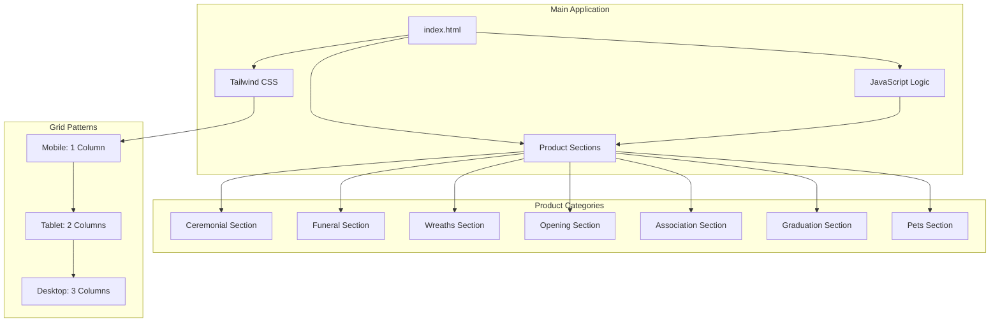
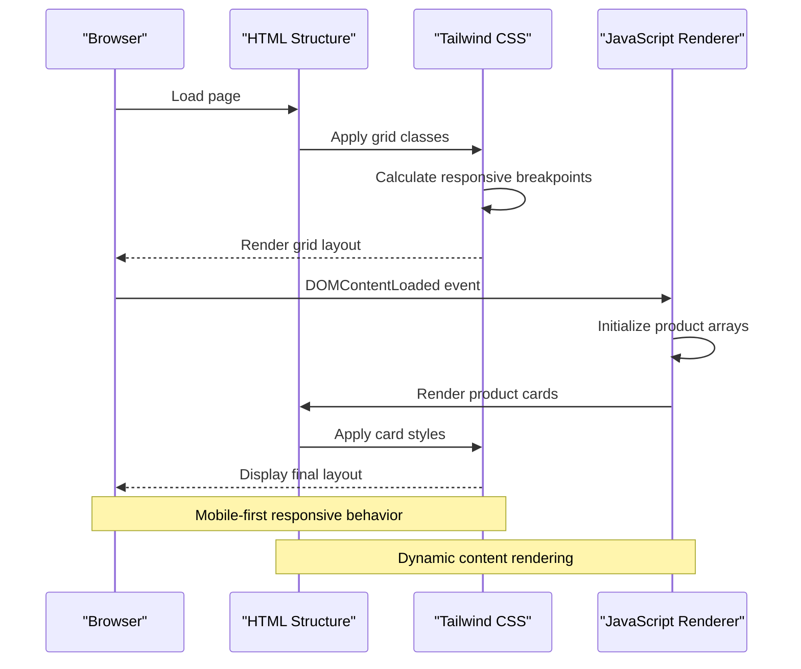
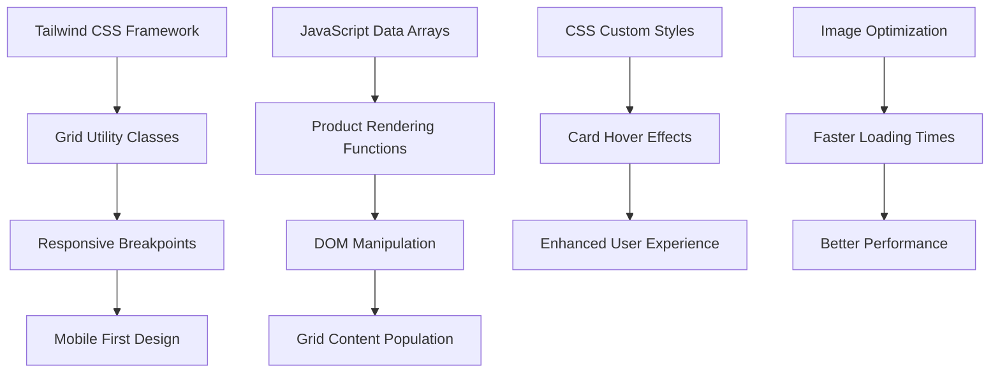

# Responsive Grid Layout System

<cite>
**Referenced Files in This Document**
- [index.html](file://docs/index.html)
</cite>

## Table of Contents
1. [Introduction](#introduction)
2. [Project Structure](#project-structure)
3. [Core Components](#core-components)
4. [Architecture Overview](#architecture-overview)
5. [Detailed Component Analysis](#detailed-component-analysis)
6. [Dependency Analysis](#dependency-analysis)
7. [Performance Considerations](#performance-considerations)
8. [Troubleshooting Guide](#troubleshooting-guide)
9. [Conclusion](#conclusion)

## Introduction

This document provides comprehensive documentation for the CSS Grid layout system implemented across all product sections of the Fujian Florist website. The system utilizes Tailwind CSS utility classes to create responsive, mobile-first grid layouts that adapt seamlessly across different screen sizes. The implementation covers seven distinct product categories: ceremonial plaques, funeral arrangements, wreaths, grand opening plaques, association plaques, graduation plaques, and pet memorial plaques.

The grid system follows modern web design principles with consistent spacing, responsive breakpoints, and optimized performance for large product catalogs. Each section maintains visual consistency while providing appropriate layouts for different content types and user interaction patterns.

## Project Structure

The website is built as a single-page application using HTML, CSS (Tailwind CSS), and JavaScript. The grid layout system is implemented throughout the main HTML file with consistent patterns across all product sections.

**Diagram sources**
- [index.html:402-419](file://docs/index.html#L402-L419)
- [index.html:422-492](file://docs/index.html#L422-L492)
- [index.html:495-511](file://docs/index.html#L495-L511)

**Section sources**
- [index.html:1-50](file://docs/index.html#L1-L50)

## Core Components

The grid layout system consists of several core components that work together to create a cohesive responsive experience:

### Container Pattern
Each product section uses a consistent container pattern with maximum width constraints and responsive padding:

- **Container**: `max-w-7xl mx-auto px-4 sm:px-6 lg:px-8`
- **Spacing**: Consistent vertical padding `py-20` between sections
- **Backgrounds**: Alternating white and stone backgrounds for visual separation

### Grid Configuration Classes
The primary grid configuration follows a mobile-first approach with progressive enhancement:

- **Mobile (default)**: `grid-cols-1` - Single column layout
- **Small tablets**: `sm:grid-cols-2` - Two columns on small screens
- **Large tablets**: `md:grid-cols-2` - Two columns on medium screens  
- **Desktop**: `lg:grid-cols-3` - Three columns on large screens
- **Gap spacing**: `gap-8` - Consistent 2rem spacing between grid items

### Product Card Component
Each product card follows a standardized structure with hover effects and responsive image handling.

**Section sources**
- [index.html:402-419](file://docs/index.html#L402-L419)
- [index.html:417](file://docs/index.html#L417)
- [index.html:471](file://docs/index.html#L471)
- [index.html:509](file://docs/index.html#L509)
- [index.html:528](file://docs/index.html#L528)
- [index.html:547](file://docs/index.html#L547)
- [index.html:566](file://docs/index.html#L566)
- [index.html:585](file://docs/index.html#L585)

## Architecture Overview

The grid system architecture follows a component-based approach where each product category implements the same grid pattern but with unique styling and content.

**Diagram sources**
- [index.html:1332-1351](file://docs/index.html#L1332-L1351)
- [index.html:1406-1444](file://docs/index.html#L1406-L1444)

## Detailed Component Analysis

### Ceremonial Plaques Section
The ceremonial section demonstrates the standard grid implementation with celebratory styling.

#### Grid Configuration
- **Container**: Standard max-width container with responsive padding
- **Grid**: `grid grid-cols-1 md:grid-cols-2 lg:grid-cols-3 gap-8`
- **Cards**: White background with amber accent colors
- **Badges**: Red celebration badges with gold color scheme

#### Responsive Behavior
- **Mobile (< 768px)**: Single column, full-width cards
- **Tablet (768px+)**: Two columns with equal spacing
- **Desktop (1024px+)**: Three columns with optimal viewing

**Section sources**
- [index.html:402-419](file://docs/index.html#L402-L419)
- [index.html:1406-1409](file://docs/index.html#L1406-L1409)

### Funeral Plaques Section
The funeral section uses a more subdued color palette while maintaining the same grid structure.

#### Grid Configuration
- **Grid**: `grid grid-cols-1 sm:grid-cols-2 lg:grid-cols-3 gap-8`
- **Styling**: Gray color scheme with minimal decoration
- **Special Features**: Additional service information grid above products

#### Unique Implementation
- Uses `sm:grid-cols-2` breakpoint instead of `md:` for earlier tablet support
- Includes informational grid showing service features
- Darker color palette appropriate for somber occasion

**Section sources**
- [index.html:422-492](file://docs/index.html#L422-L492)
- [index.html:471](file://docs/index.html#L471)
- [index.html:1411-1414](file://docs/index.html#L1411-L1414)

### Wreaths Section
The wreaths section follows the standard pattern with traditional Chinese and Western style options.

#### Grid Configuration
- **Grid**: `grid grid-cols-1 sm:grid-cols-2 lg:grid-cols-3 gap-8`
- **Background**: Clean white background
- **Content**: Mix of traditional and modern wreath designs

**Section sources**
- [index.html:495-511](file://docs/index.html#L495-L511)
- [index.html:509](file://docs/index.html#L509)
- [index.html:1416-1420](file://docs/index.html#L1416-L1420)

### Grand Opening Plaques Section
The opening section uses warm amber tones to convey celebration and prosperity.

#### Grid Configuration
- **Grid**: `grid grid-cols-1 sm:grid-cols-2 lg:grid-cols-3 gap-8`
- **Background**: Warm amber-50 background
- **Badges**: Prominent "開張" badges in amber color

**Section sources**
- [index.html:514-530](file://docs/index.html#L514-L530)
- [index.html:528](file://docs/index.html#L528)
- [index.html:1422-1426](file://docs/index.html#L1422-L1426)

### Association Plaques Section
The association section maintains consistency with other celebratory sections.

#### Grid Configuration
- **Grid**: `grid grid-cols-1 sm:grid-cols-2 lg:grid-cols-3 gap-8`
- **Background**: Clean white background
- **Target Audience**: Community organizations and associations

**Section sources**
- [index.html:533-549](file://docs/index.html#L533-L549)
- [index.html:547](file://docs/index.html#L547)
- [index.html:1428-1432](file://docs/index.html#L1428-L1432)

### Graduation Plaques Section
The graduation section uses blue accents to represent academic achievement.

#### Grid Configuration
- **Grid**: `grid grid-cols-1 sm:grid-cols-2 lg:grid-cols-3 gap-8`
- **Background**: Warm amber-50 background
- **Badges**: Blue graduation-themed badges

**Section sources**
- [index.html:552-568](file://docs/index.html#L552-L568)
- [index.html:566](file://docs/index.html#L566)
- [index.html:1434-1438](file://docs/index.html#L1434-L1438)

### Pet Memorial Plaques Section
The pet memorial section uses purple accents for a gentle, comforting feel.

#### Grid Configuration
- **Grid**: `grid grid-cols-1 sm:grid-cols-2 lg:grid-cols-3 gap-8`
- **Background**: Clean white background
- **Badges**: Purple pet-themed badges

**Section sources**
- [index.html:571-587](file://docs/index.html#L571-L587)
- [index.html:585](file://docs/index.html#L585)
- [index.html:1440-1444](file://docs/index.html#L1440-L1444)

### Hero Section Grid
The hero section demonstrates a specialized grid layout for category navigation.

#### Grid Configuration
- **Grid**: `grid grid-cols-2 md:grid-cols-3 lg:grid-cols-6 gap-4`
- **Purpose**: Category quick links with icons and descriptions
- **Responsive**: Adapts from 2 columns on mobile to 6 columns on desktop

**Section sources**
- [index.html:307-368](file://docs/index.html#L307-L368)

## Dependency Analysis

The grid system has clear dependencies and relationships between components:

**Diagram sources**
- [index.html:8](file://docs/index.html#L8)
- [index.html:1332-1351](file://docs/index.html#L1332-L1351)
- [index.html:1376-1404](file://docs/index.html#L1376-L1404)

**Section sources**
- [index.html:8](file://docs/index.html#L8)
- [index.html:1332-1351](file://docs/index.html#L1332-L1351)

## Performance Considerations

### Image Optimization Strategies
The implementation includes several performance optimizations for large product catalogs:

1. **Lazy Loading**: Images use external CDN URLs with optimization parameters
2. **Responsive Images**: All images include `w=600&auto=format&fit=crop&q=80` parameters
3. **Efficient Rendering**: JavaScript renders only necessary DOM elements
4. **CSS Transitions**: Hardware-accelerated transforms for smooth animations

### Memory Management
- **Data Arrays**: Product data stored in efficient JavaScript arrays
- **Event Delegation**: Single event listeners for cart functionality
- **DOM Caching**: Grid containers cached for efficient updates

### Mobile-First Design Principles
The grid system follows mobile-first principles:

1. **Base Styles**: Single column layout for mobile devices
2. **Progressive Enhancement**: Additional columns added via media queries
3. **Touch-Friendly**: Adequate spacing and touch targets
4. **Performance**: Minimal CSS and JavaScript overhead

### Optimization Techniques for Large Catalogs
For scaling to larger product catalogs, consider implementing:

1. **Virtual Scrolling**: Only render visible products
2. **Pagination**: Load products in batches
3. **Caching**: Cache rendered product cards
4. **Debounced Search**: Optimize search functionality

**Section sources**
- [index.html:1079-1328](file://docs/index.html#L1079-L1328)
- [index.html:1376-1404](file://docs/index.html#L1376-L1404)

## Troubleshooting Guide

### Common Grid Issues

#### Grid Items Not Aligning Properly
- **Check**: Ensure all grid containers have consistent `gap-8` spacing
- **Verify**: Parent containers have proper `max-w-7xl mx-auto` classes
- **Inspect**: Check for conflicting CSS rules affecting grid layout

#### Responsive Breakpoints Not Working
- **Verify**: Tailwind CSS is properly loaded via CDN
- **Check**: Screen size testing across different devices
- **Debug**: Use browser developer tools to inspect applied classes

#### Performance Issues with Many Products
- **Monitor**: Page load time with large product arrays
- **Optimize**: Implement pagination or infinite scrolling
- **Cache**: Consider caching frequently accessed product data

### Debugging Tools
Use browser developer tools to inspect:
- Applied Tailwind CSS classes
- Grid layout calculations
- Performance metrics
- Network requests for images

**Section sources**
- [index.html:1332-1351](file://docs/index.html#L1332-L1351)

## Conclusion

The CSS Grid layout system implemented in the Fujian Florist website demonstrates a robust, scalable approach to responsive web design. The consistent use of Tailwind CSS utility classes creates maintainable code that adapts seamlessly across all device sizes. 

Key strengths of this implementation include:

- **Consistency**: Uniform grid patterns across all product categories
- **Responsiveness**: Mobile-first design with progressive enhancement
- **Performance**: Optimized for large product catalogs
- **Maintainability**: Clear separation of concerns between HTML, CSS, and JavaScript
- **Accessibility**: Semantic HTML structure with proper ARIA considerations

The system successfully balances aesthetic requirements with technical performance, providing an excellent foundation for future enhancements and scalability. The modular approach allows for easy addition of new product categories while maintaining visual consistency and optimal user experience across all devices.