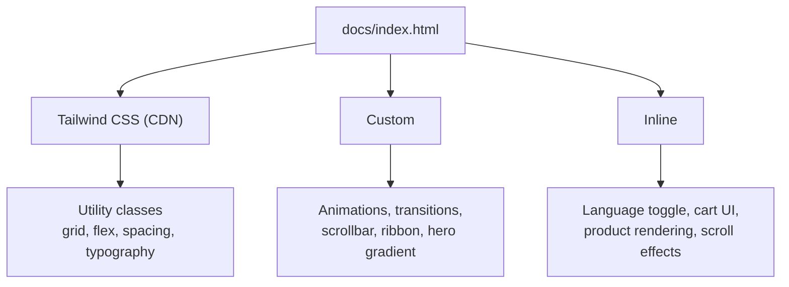
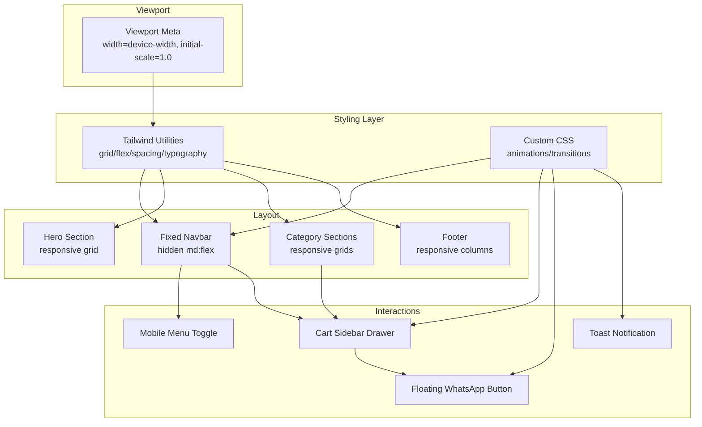
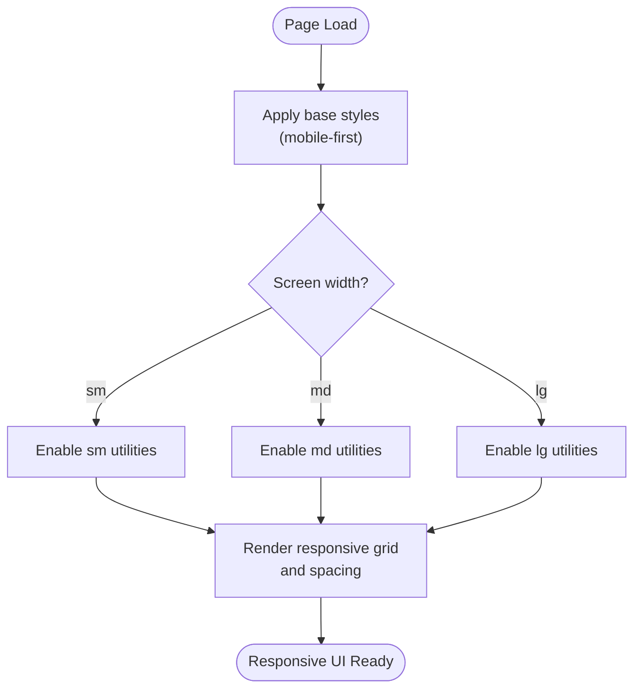
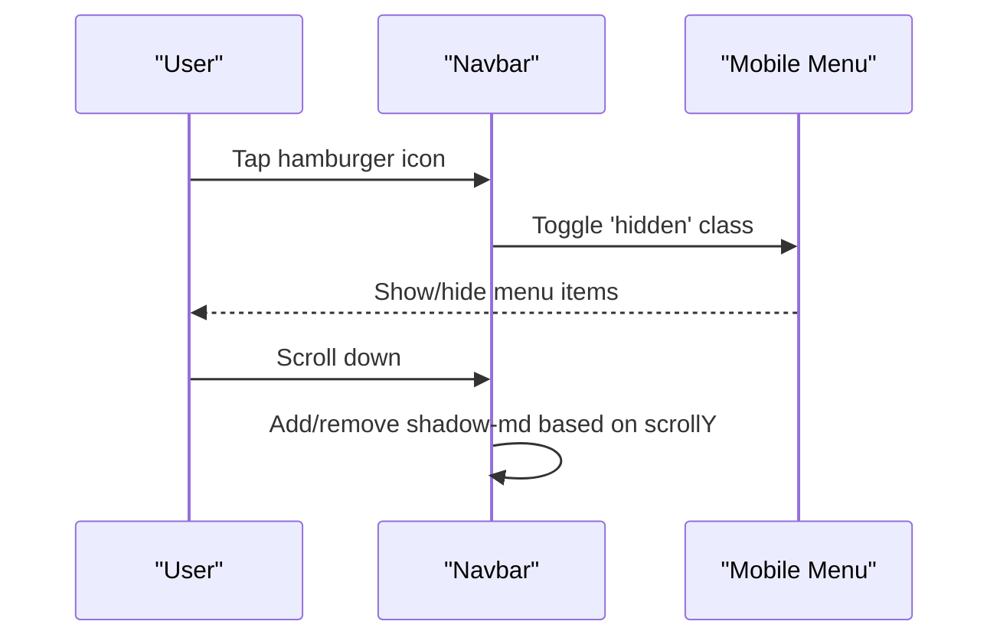
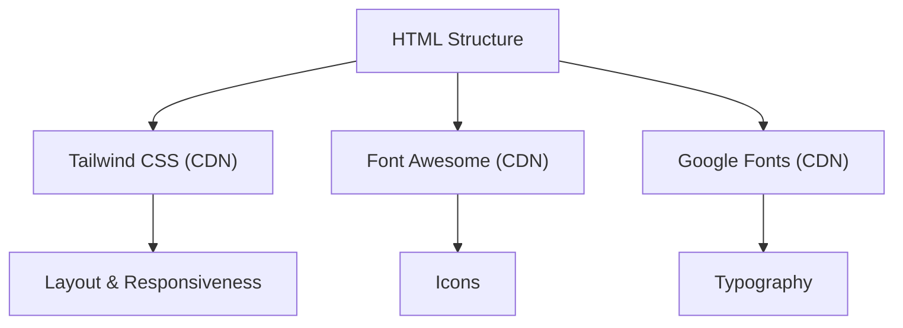

# Responsive Design Patterns

<cite>
**Referenced Files in This Document**
- [index.html](file://docs/index.html)
</cite>

## Table of Contents
1. [Introduction](#introduction)
2. [Project Structure](#project-structure)
3. [Core Components](#core-components)
4. [Architecture Overview](#architecture-overview)
5. [Detailed Component Analysis](#detailed-component-analysis)
6. [Dependency Analysis](#dependency-analysis)
7. [Performance Considerations](#performance-considerations)
8. [Troubleshooting Guide](#troubleshooting-guide)
9. [Conclusion](#conclusion)

## Introduction
This document explains the responsive design implementation for a single-page site built with Tailwind CSS utility classes and custom CSS. It focuses on:
- Mobile-first approach and breakpoint strategy
- Adaptive layout patterns across sections
- Grid system usage with responsive column configurations
- Flexible spacing utilities and typography scaling
- Responsive navigation behavior and mobile menu
- Touch-friendly interface elements
- Cross-device testing considerations and performance optimization for mobile users

The site uses Tailwind via CDN, inline configuration, and embedded styles to achieve responsiveness without a build step.

**Section sources**
- [index.html:1-20](file://docs/index.html#L1-L20)

## Project Structure
The project is minimal:
- docs/index.html contains all HTML markup, Tailwind configuration, custom CSS, and JavaScript logic.
- No separate CSS or JS files are present; everything is self-contained.

**Diagram sources**
- [index.html:1-40](file://docs/index.html#L1-L40)
- [index.html:39-208](file://docs/index.html#L39-L208)
- [index.html:881-1589](file://docs/index.html#L881-L1589)

**Section sources**
- [index.html:1-40](file://docs/index.html#L1-L40)

## Core Components
- Viewport and language setup: viewport meta ensures correct scaling on mobile devices; lang attribute toggles between zh-Hant and en.
- Tailwind configuration: inline script extends theme with fonts and colors used throughout the page.
- Custom CSS: animations, transitions, hover states, scrollbar styling, ribbon badge, and hero background gradient.
- Navigation: fixed top bar with desktop links and a mobile-only hamburger button that toggles a slide-in menu.
- Sections: multiple product categories using responsive grids and consistent spacing/typography.
- Cart sidebar: full-height drawer with overlay, touch-friendly controls, and WhatsApp checkout link generation.
- Floating WhatsApp button: persistent call-to-action with subtle animation.
- Toast notifications: non-blocking feedback for user actions.

Key responsive behaviors:
- Mobile-first base styles with progressive enhancement at sm, md, lg breakpoints.
- Grid layouts adapt from single-column on small screens to multi-column on larger screens.
- Navigation collapses into a hamburger menu below md.
- Touch targets sized appropriately for mobile interactions.

**Section sources**
- [index.html:1-12](file://docs/index.html#L1-L12)
- [index.html:13-38](file://docs/index.html#L13-L38)
- [index.html:39-208](file://docs/index.html#L39-L208)
- [index.html:214-282](file://docs/index.html#L214-L282)
- [index.html:813-879](file://docs/index.html#L813-L879)

## Architecture Overview
Responsive architecture overview showing how components interact and respond to screen sizes.

**Diagram sources**
- [index.html:1-12](file://docs/index.html#L1-L12)
- [index.html:13-38](file://docs/index.html#L13-L38)
- [index.html:39-208](file://docs/index.html#L39-L208)
- [index.html:214-282](file://docs/index.html#L214-L282)
- [index.html:813-879](file://docs/index.html#L813-L879)

## Detailed Component Analysis

### Breakpoint Strategy and Mobile-First Approach
- Base styles apply to all screen sizes (mobile-first).
- Breakpoints used:
  - sm: small phones/tablets
  - md: tablets/small laptops
  - lg: desktops
- Examples:
  - Navigation: hidden by default; visible at md with md:flex.
  - Hero category grid: grid-cols-2 on mobile, md:grid-cols-3, lg:grid-cols-6.
  - Product grids: grid-cols-1, sm:grid-cols-2, lg:grid-cols-3.
  - Footer: md:grid-cols-4.

**Diagram sources**
- [index.html:214-282](file://docs/index.html#L214-L282)
- [index.html:307-368](file://docs/index.html#L307-L368)
- [index.html:417-418](file://docs/index.html#L417-L418)
- [index.html:719-720](file://docs/index.html#L719-L720)

**Section sources**
- [index.html:214-282](file://docs/index.html#L214-L282)
- [index.html:307-368](file://docs/index.html#L307-L368)
- [index.html:417-418](file://docs/index.html#L417-L418)
- [index.html:719-720](file://docs/index.html#L719-L720)

### Grid System Usage and Responsive Column Configurations
- Hero category grid:
  - grid-cols-2 on mobile
  - md:grid-cols-3
  - lg:grid-cols-6
- Category product grids:
  - grid-cols-1 on mobile
  - sm:grid-cols-2
  - lg:grid-cols-3
- About section:
  - lg:grid-cols-2 for image gallery vs text content
- Delivery options:
  - md:grid-cols-3 for three cards
- Footer:
  - md:grid-cols-4 for four columns

These patterns ensure content reflows gracefully as screen size increases.

**Section sources**
- [index.html:307-368](file://docs/index.html#L307-L368)
- [index.html:417-418](file://docs/index.html#L417-L418)
- [index.html:471](file://docs/index.html#L471)
- [index.html:509](file://docs/index.html#L509)
- [index.html:528](file://docs/index.html#L528)
- [index.html:547](file://docs/index.html#L547)
- [index.html:566](file://docs/index.html#L566)
- [index.html:585](file://docs/index.html#L585)
- [index.html:597](file://docs/index.html#L597)
- [index.html:645](file://docs/index.html#L645)
- [index.html:719-720](file://docs/index.html#L719-L720)

### Flexible Spacing Utilities and Typography Scaling
- Spacing:
  - Consistent use of px-4 sm:px-6 lg:px-8 for container padding.
  - py-20 for vertical rhythm across sections.
  - gap-4/gap-8 for grid gaps.
- Typography:
  - Headings scale with text-4xl on mobile and lg:text-7xl for hero titles.
  - Body text remains readable with text-sm/text-base and line-height utilities.
  - Font families extended via Tailwind config for serif/sans variants.

**Section sources**
- [index.html:216](file://docs/index.html#L216)
- [index.html:299](file://docs/index.html#L299)
- [index.html:13-38](file://docs/index.html#L13-L38)

### Responsive Navigation Behavior and Mobile Menu Implementation
- Desktop:
  - Hidden by default; shown at md with md:flex.
  - Horizontal list of links with hover transitions.
- Mobile:
  - Hamburger button visible only on md:hidden.
  - Clicking toggles mobile-menu visibility.
  - Full-width menu with stacked links.

**Diagram sources**
- [index.html:214-282](file://docs/index.html#L214-L282)
- [index.html:1343-1351](file://docs/index.html#L1343-L1351)

**Section sources**
- [index.html:214-282](file://docs/index.html#L214-L282)
- [index.html:1343-1351](file://docs/index.html#L1343-L1351)

### Touch-Friendly Interface Elements
- Buttons and icons:
  - Adequate tap targets with p-2/p-4 and rounded-full shapes.
  - Hover states enhanced with transition-colors and transform.
- Quantity controls:
  - Distinct +/- buttons with clear visual feedback.
- Cart drawer:
  - Full-screen overlay with backdrop blur.
  - Slide-in animation for smooth UX.
- Floating WhatsApp button:
  - Large icon with accessible label and subtle floating animation.

**Section sources**
- [index.html:254-263](file://docs/index.html#L254-L263)
- [index.html:813-879](file://docs/index.html#L813-L879)
- [index.html:1534-1544](file://docs/index.html#L1534-L1544)

### Adaptive Layout Patterns Across Sections
- Hero:
  - Centered content with responsive grid for category cards.
  - CTAs stack vertically on mobile and align horizontally on larger screens.
- Category sections:
  - Consistent header structure with decorative accents.
  - Product grids adapt to screen size.
- Funeral contact card:
  - Stacked CTAs on mobile, side-by-side on larger screens.
- About:
  - Two-column layout on lg, single column on smaller screens.
- Delivery info:
  - Three equal cards on md+.

**Section sources**
- [index.html:285-399](file://docs/index.html#L285-L399)
- [index.html:402-419](file://docs/index.html#L402-L419)
- [index.html:473-491](file://docs/index.html#L473-L491)
- [index.html:643-714](file://docs/index.html#L643-L714)
- [index.html:590-640](file://docs/index.html#L590-L640)

## Dependency Analysis
External dependencies and their roles:
- Tailwind CSS via CDN provides utility classes for layout, spacing, typography, and responsive behavior.
- Google Fonts supplies font families configured in Tailwind theme.
- Font Awesome provides icons used across navigation, CTAs, and product cards.

**Diagram sources**
- [index.html:1-12](file://docs/index.html#L1-L12)
- [index.html:13-38](file://docs/index.html#L13-L38)

**Section sources**
- [index.html:1-12](file://docs/index.html#L1-L12)
- [index.html:13-38](file://docs/index.html#L13-L38)

## Performance Considerations
- Avoid heavy animations on low-end devices:
  - Use simple transitions and avoid excessive transforms where possible.
- Optimize images:
  - Ensure images are appropriately sized and compressed; consider lazy loading if more images are added.
- Minimize DOM updates:
  - Batch render operations when updating product grids or cart UI.
- Reduce repaint/reflow:
  - Prefer opacity and transform changes over layout-affecting properties.
- Keep Tailwind usage efficient:
  - Since Tailwind is loaded via CDN, be mindful of unused utilities; consider building a purged CSS bundle for production if needed.
- Accessibility and usability:
  - Maintain sufficient color contrast and touch target sizes.
  - Provide keyboard-accessible interactions where feasible.

[No sources needed since this section provides general guidance]

## Troubleshooting Guide
Common issues and resolutions:
- Mobile menu not toggling:
  - Verify the hamburger button triggers the toggle function and that the mobile menu element exists with the correct id.
- Cart drawer not closing:
  - Ensure overlay click handler removes translate-x-full and hides the overlay.
- Language switching not applying:
  - Confirm data-i18n attributes exist and translations object has matching keys.
- Grid misalignment on certain screens:
  - Check breakpoint-specific classes and ensure no conflicting custom CSS overrides.
- Smooth scrolling not working:
  - Validate html scroll-behavior property and anchor hrefs.

**Section sources**
- [index.html:1570-1573](file://docs/index.html#L1570-L1573)
- [index.html:1555-1568](file://docs/index.html#L1555-L1568)
- [index.html:1353-1374](file://docs/index.html#L1353-L1374)
- [index.html:155-157](file://docs/index.html#L155-L157)

## Conclusion
The site demonstrates a robust mobile-first responsive design using Tailwind CSS utilities and custom CSS. Breakpoints are applied consistently across navigation, grids, and sections to deliver an adaptive experience. The implementation emphasizes accessibility, touch-friendly interactions, and maintainable patterns. For further improvements, consider optimizing assets, reducing runtime overhead, and adopting a build-time Tailwind pipeline for production efficiency.

[No sources needed since this section summarizes without analyzing specific files]