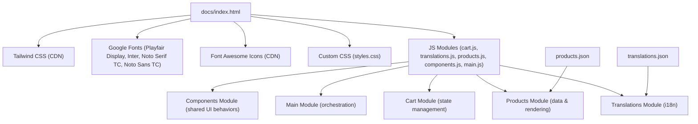
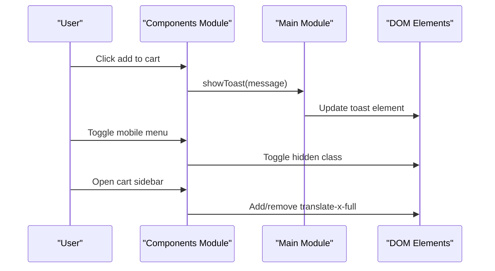
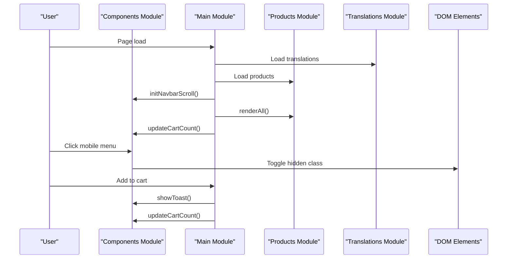
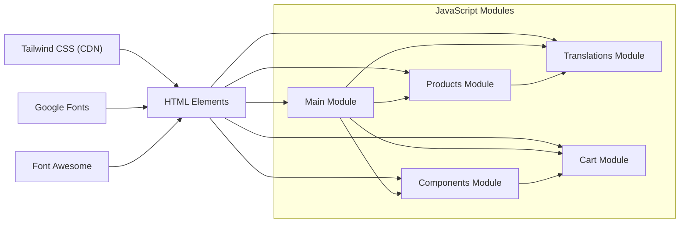

# User Interface Components

<cite>
**Referenced Files in This Document**
- [index.html](file://docs/index.html)
- [components.js](file://docs/js/components.js)
- [main.js](file://docs/js/main.js)
- [cart.js](file://docs/js/cart.js)
- [products.js](file://docs/js/products.js)
- [translations.js](file://docs/js/translations.js)
- [styles.css](file://docs/css/styles.css)
- [products.json](file://docs/products.json)
- [translations.json](file://docs/translations.json)
</cite>

## Update Summary
**Changes Made**
- Updated content consistency documentation to reflect streamlined hero section descriptions
- Enhanced service descriptions documentation with consistent booking policy communication
- Added detailed analysis of unified messaging patterns across all user interface components
- Updated examples to demonstrate consistent policy messaging implementation

## Table of Contents
1. [Introduction](#introduction)
2. [Project Structure](#project-structure)
3. [Component Module Architecture](#component-module-architecture)
4. [Core Components](#core-components)
5. [Architecture Overview](#architecture-overview)
6. [Detailed Component Analysis](#detailed-component-analysis)
7. [Content Consistency Framework](#content-consistency-framework)
8. [Dependency Analysis](#dependency-analysis)
9. [Performance Considerations](#performance-considerations)
10. [Troubleshooting Guide](#troubleshooting-guide)
11. [Conclusion](#conclusion)

## Introduction
This document explains the user interface components implemented in the site, focusing on:
- Responsive navigation with a mobile hamburger menu
- Smooth scrolling behavior
- Product gallery with hover effects and animations
- Floating WhatsApp button integration
- CSS Grid and Flexbox layouts
- Tailwind CSS utility usage and custom styling
- Cross-browser compatibility, accessibility considerations, and performance optimizations
- **Content consistency framework ensuring uniform messaging across all components**

The implementation follows a modular architecture with shared UI behaviors consolidated into dedicated JavaScript modules for improved maintainability and code reusability, with enhanced content consistency for better user experience.

## Project Structure
The repository uses a modular architecture with separate files for different concerns:
- HTML file contains semantic markup and references external resources
- JavaScript modules handle specific functionality (components, cart, products, translations)
- CSS file provides custom styles and animations
- External dependencies loaded via CDN (Tailwind CSS, Google Fonts, Font Awesome)
- JSON files manage product data and internationalization content

**Diagram sources**
- [index.html:8-13](file://docs/index.html#L8-L13)
- [index.html:695-700](file://docs/index.html#L695-L700)
- [components.js:1-72](file://docs/js/components.js#L1-L72)
- [main.js:1-134](file://docs/js/main.js#L1-L134)
- [products.json:1-215](file://docs/products.json#L1-L215)
- [translations.json:1-229](file://docs/translations.json#L1-L229)

**Section sources**
- [index.html:1-33](file://docs/index.html#L1-L33)
- [index.html:695-700](file://docs/index.html#L695-L700)

## Component Module Architecture

### Modular Design Principles
The UI components follow a modular architecture with clear separation of concerns:

- **Components Module**: Shared UI behaviors (toast notifications, mobile menu, cart sidebar, navbar scroll)
- **Main Module**: Application orchestration and business logic coordination
- **Cart Module**: Shopping cart state management using localStorage
- **Products Module**: Product data fetching and rendering logic
- **Translations Module**: Internationalization and language switching

### Component Module Responsibilities
The `components.js` module consolidates shared UI behaviors:

**Diagram sources**
- [components.js:7-18](file://docs/js/components.js#L7-L18)
- [components.js:20-23](file://docs/js/components.js#L20-L23)
- [components.js:25-39](file://docs/js/components.js#L25-L39)
- [main.js:8-14](file://docs/js/main.js#L8-L14)

**Section sources**
- [components.js:1-72](file://docs/js/components.js#L1-L72)
- [main.js:1-134](file://docs/js/main.js#L1-L134)

## Core Components
- Navigation bar with desktop links and a mobile hamburger menu
- Hero section with category grid and call-to-action buttons
- Multiple product sections using responsive grids
- Shopping cart sidebar with slide-in animation and overlay
- Floating WhatsApp button with animated badge and expandable text
- Toast notifications for user feedback
- Language switcher (Traditional Chinese / English)

Key behaviors managed by the Components module:
- Mobile menu toggle via class manipulation
- Cart open/close with body scroll lock
- Navbar shadow effect on scroll
- Toast notification display and auto-hide
- Cart count updates

**Section sources**
- [index.html:37-106](file://docs/index.html#L37-L106)
- [index.html:108-200](file://docs/index.html#L108-L200)
- [index.html:627-674](file://docs/index.html#L627-L674)
- [index.html:676-693](file://docs/index.html#L676-L693)
- [components.js:20-23](file://docs/js/components.js#L20-23)
- [components.js:25-39](file://docs/js/components.js#L25-39)
- [components.js:41-51](file://docs/js/components.js#L41-51)
- [components.js:53-63](file://docs/js/components.js#L53-63)

## Architecture Overview
The page follows a modular architecture with clear separation of concerns:
- Head includes Tailwind CDN, fonts, icons, and Tailwind configuration
- Body contains semantic sections for each product category and shared UI elements
- JavaScript modules are loaded in dependency order: cart → translations → products → components → main
- Main module orchestrates initialization and coordinates between other modules

**Diagram sources**
- [index.html:695-700](file://docs/index.html#L695-L700)
- [main.js:119-127](file://docs/js/main.js#L119-L127)
- [components.js:41-51](file://docs/js/components.js#L41-51)
- [components.js:53-63](file://docs/js/components.js#L53-63)

## Detailed Component Analysis

### Responsive Navigation and Mobile Hamburger Menu
- Desktop navigation displays horizontal links; hidden on small screens
- Mobile menu is controlled by a hamburger icon and toggled via the Components module
- The navbar gains a shadow on scroll through the Components module's scroll listener

Implementation highlights:
- Fixed top navigation with backdrop blur and border
- Hidden md:flex for desktop links; md:hidden for mobile-only controls
- Components.toggleMobileMenu() adds/removes hidden class on the mobile menu container
- Components.initNavbarScroll() toggles shadow-md class based on scroll position

Accessibility notes:
- Links use descriptive href anchors to sections
- Consider adding aria-expanded and aria-controls attributes to the hamburger button and menu for improved screen reader support

**Updated** Mobile menu functionality now centralized in the Components module for better code organization and reusability.

**Section sources**
- [index.html:37-106](file://docs/index.html#L37-L106)
- [components.js:20-23](file://docs/js/components.js#L20-23)
- [components.js:41-51](file://docs/js/components.js#L41-51)

### Smooth Scrolling Implementation
- Global smooth scrolling is enabled via CSS property on html
- Buttons and links use anchor targets or programmatic scrollIntoView calls with behavior set to smooth

Notes:
- Ensure anchor IDs match section IDs exactly
- For older browsers without native smooth scrolling, consider a polyfill if needed

**Section sources**
- [styles.css:94-96](file://docs/css/styles.css#L94-L96)
- [index.html:195](file://docs/index.html#L195)

### Product Gallery with Hover Effects and Animations
- Each product card has a transitioned transform on hover, lifting the card and scaling the image
- Images scale smoothly with a cubic-bezier easing
- Cards fade in with staggered delays when rendered
- Optional ribbon badges appear on certain categories

Implementation highlights:
- Custom CSS classes define hover transforms and image scaling
- Products module generates markup with consistent structure and dynamic content
- Category-specific color logic adjusts price and button accent colors

Accessibility notes:
- Provide meaningful alt text for images
- Ensure keyboard focusability for "Add to Cart" actions

**Section sources**
- [styles.css:25-39](file://docs/css/styles.css#L25-L39)
- [products.js:37-80](file://docs/js/products.js#L37-L80)

### Floating WhatsApp Button Integration
- Fixed-position button at bottom-right with an animated floating effect
- Badge indicator dot and expandable label on hover
- Opens a pre-filled WhatsApp message URL

Implementation highlights:
- Keyframe animation for subtle vertical float defined in custom CSS
- Group-based hover reveals text via max-width transition
- Uses rel="noopener noreferrer" for security when opening external links

Accessibility notes:
- Add aria-label describing the action (e.g., "Chat on WhatsApp")
- Ensure sufficient color contrast for the icon and text

**Section sources**
- [index.html:676-686](file://docs/index.html#L676-L686)
- [styles.css:16-23](file://docs/css/styles.css#L16-L23)

### Shopping Cart Sidebar and Overlay
- Slide-in panel from the right with a blurred overlay backdrop
- Cart items list with quantity controls, remove actions, and totals
- Footer shows delivery options summary and a WhatsApp checkout link generated from cart contents
- Opening/closing locks body scroll and toggles visibility

Implementation highlights:
- Components.toggleCart() manages sidebar visibility and body scroll lock
- Transform translate-x-full used to hide/show the panel
- Overlay click closes the cart
- Main.updateCartUI() recalculates totals and rebuilds item lists
- generateWhatsAppLink builds a localized order summary message

Accessibility notes:
- Focus management should move into the cart when opened and return on close
- Use role="dialog" and aria-modal="true" for the cart panel

**Updated** Cart sidebar functionality now centralized in the Components module, improving separation of concerns and making the toggle logic reusable across the application.

**Section sources**
- [index.html:627-674](file://docs/index.html#L627-L674)
- [components.js:25-39](file://docs/js/components.js#L25-39)
- [main.js:47-107](file://docs/js/main.js#L47-L107)

### Toast Notifications
- Centered toast appears briefly after adding items to the cart
- Controlled by the Components module through class manipulation

Implementation highlights:
- Components.showToast() manages toast visibility with automatic timeout
- Short 3-second timeout hides the toast automatically
- Message text is localized based on current language

Accessibility notes:
- Announce messages to assistive technologies using aria-live regions

**Updated** Toast notification functionality moved to the Components module for better organization and reusability.

**Section sources**
- [index.html:688-693](file://docs/index.html#L688-L693)
- [components.js:7-18](file://docs/js/components.js#L7-18)
- [main.js:8-14](file://docs/js/main.js#L8-L14)

### Language Switcher (i18n)
- Two buttons toggle between Traditional Chinese and English
- All text nodes with data-i18n attributes are updated dynamically
- Product names and descriptions switch accordingly

Implementation highlights:
- Translations module holds both languages and handles loading
- Main.setLanguage() updates active states, document lang attribute, and re-renders product grids
- Components module exposes setLanguage globally for inline onclick handlers

Accessibility notes:
- Indicate current language visually and via aria attributes
- Ensure labels describe the action ("Switch to English", "切換為繁體中文")

**Section sources**
- [index.html:72-77](file://docs/index.html#L72-L77)
- [components.js:71](file://docs/js/components.js#L71)
- [main.js:111-115](file://docs/js/main.js#L111-L115)

### Layout Patterns: CSS Grid and Flexbox
- Hero category grid uses responsive columns: grid-cols-2 md:grid-cols-3 lg:grid-cols-6
- Product sections use grid-cols-1 sm:grid-cols-2 lg:grid-cols-3 for consistent responsiveness
- Flexbox is used extensively for alignment, spacing, and centering across header, hero CTAs, and component internals

Examples:
- Hero category grid layout
- Product grids per section
- Header flex layout with logo, nav, and controls

**Section sources**
- [index.html:131](file://docs/index.html#L131)
- [index.html:417](file://docs/index.html#L417)
- [index.html:471](file://docs/index.html#L471)
- [index.html:509](file://docs/index.html#L509)
- [index.html:528](file://docs/index.html#L528)
- [index.html:547](file://docs/index.html#L547)
- [index.html:566](file://docs/index.html#L566)
- [index.html:585](file://docs/index.html#L585)

### Tailwind CSS Usage and Custom Styling
- Tailwind CDN loaded with a small configuration extending fonts and gold color palette
- Utility classes handle spacing, typography, colors, shadows, rounded corners, and responsive breakpoints
- Custom CSS defines animations (float, fadeIn, slideInRight), transitions, scrollbar styling, ribbons, and hero background gradient

Best practices observed:
- Consistent use of Tailwind utilities for layout and appearance
- Minimal custom CSS focused on animations and brand-specific visuals
- Clear separation between utility classes and custom component styles

**Section sources**
- [index.html:14-32](file://docs/index.html#L14-L32)
- [styles.css:1-147](file://docs/css/styles.css#L1-L147)

## Content Consistency Framework

### Unified Messaging Strategy
The website implements a comprehensive content consistency framework ensuring uniform communication of services and policies across all user interface components. This approach enhances user experience by providing clear, consistent information about booking requirements and service offerings.

### Booking Policy Communication
The 5-day pre-order requirement is consistently communicated throughout the interface:

**Hero Section Implementation:**
- Streamlined description explicitly states "需提前5天前預訂" (5 days pre-order required)
- Integrated into the main value proposition alongside 30 years experience and reputation guarantee

**Service Section Consistency:**
- Each product category section includes the same pre-order requirement messaging
- Funeral section emphasizes urgency policy with "$800+ for urgent orders"
- Delivery section prominently features urgent order policy with bold formatting

**Cart and Checkout Flow:**
- Cart footer displays "需提前5天前預訂。急單需$800起。" (5 days pre-order required. Urgent orders $800+)
- WhatsApp checkout messages include policy reminders

### Service Description Standardization
All service descriptions follow a consistent pattern:
- Clear service categorization with bilingual support
- Consistent feature highlighting (free eulogy writing, professional calligraphy)
- Uniform pricing presentation and availability information
- Standardized contact methods and response expectations

### Translation Management System
The translations.json file serves as the single source of truth for all content:
- Centralized management of Chinese and English text
- Consistent key naming conventions across all UI components
- Dynamic language switching without page reload
- Preservation of content relationships during language changes

**Section sources**
- [index.html:126-128](file://docs/index.html#L126-L128)
- [index.html:236-238](file://docs/index.html#L236-L238)
- [index.html:310-312](file://docs/index.html#L310-L312)
- [index.html:328-330](file://docs/index.html#L328-L330)
- [index.html:445-457](file://docs/index.html#L445-L457)
- [index.html:663](file://docs/index.html#L663)
- [translations.json:16](file://docs/translations.json#L16)
- [translations.json:41-51](file://docs/translations.json#L41-L51)
- [translations.json:54](file://docs/translations.json#L54)
- [translations.json:78](file://docs/translations.json#L78)
- [translations.json:107](file://docs/translations.json#L107)

## Dependency Analysis
External dependencies:
- Tailwind CSS (CDN)
- Google Fonts (Playfair Display, Inter, Noto Serif TC, Noto Sans TC)
- Font Awesome Icons (CDN)

Internal module relationships:
- Main module orchestrates initialization and coordinates between other modules
- Components module provides shared UI behaviors used by Main and inline handlers
- Products module depends on Translations for i18n
- Cart module provides state management used by Main and Components
- Components module depends on Cart for cart count updates

**Diagram sources**
- [index.html:8-13](file://docs/index.html#L8-L13)
- [index.html:695-700](file://docs/index.html#L695-L700)
- [components.js:53-63](file://docs/js/components.js#L53-63)
- [main.js:119-127](file://docs/js/main.js#L119-L127)

**Section sources**
- [index.html:8-13](file://docs/index.html#L8-L13)
- [index.html:695-700](file://docs/index.html#L695-L700)
- [components.js:1-72](file://docs/js/components.js#L1-L72)
- [main.js:1-134](file://docs/js/main.js#L1-L134)

## Performance Considerations
- Prefer system fonts or self-hosted fonts to reduce latency; currently using Google Fonts
- Avoid heavy animations on low-power devices; consider prefers-reduced-motion media query to disable animations
- Use lazy loading for product images to improve initial load time
- Debounce scroll listeners if more complex logic is added later
- Minimize DOM reflows by batching updates (current approach rebuilds lists only when necessary)
- Modular architecture improves maintainability but may increase HTTP requests; consider bundling for production
- **Content consistency reduces cognitive load by providing predictable messaging patterns**

## Troubleshooting Guide
Common issues and resolutions:
- Mobile menu not toggling:
  - Verify the hamburger button calls Components.toggleMobileMenu() and the menu element ID matches
  - Check that the hidden class is being toggled correctly
- Cart not updating:
  - Ensure addToCart finds the correct product and updates quantities
  - Confirm Components.updateCartCount() is called after cart operations
  - Verify Main.updateCartUI() recalculates totals and refreshes the DOM
- Smooth scrolling not working:
  - Confirm html scroll-behavior is set to smooth in CSS
  - Validate anchor IDs match section IDs
- WhatsApp link incorrect:
  - Inspect generateWhatsAppLink output and ensure message encoding is correct
- Accessibility concerns:
  - Add aria attributes to interactive elements (menu, cart dialog, language buttons)
  - Ensure focus management when opening/closing overlays
- Components module errors:
  - Verify all required DOM elements exist before accessing them
  - Check that modules are loaded in the correct order (cart → translations → products → components → main)
- **Content consistency issues:**
  - Verify translation keys exist in translations.json for all referenced data-i18n attributes
  - Ensure all service descriptions maintain consistent policy messaging
  - Check that urgent order policies are uniformly displayed across all relevant sections

**Updated** Added troubleshooting guidance for the new modular architecture, Components module, and content consistency framework.

**Section sources**
- [components.js:20-23](file://docs/js/components.js#L20-23)
- [components.js:25-39](file://docs/js/components.js#L25-39)
- [components.js:53-63](file://docs/js/components.js#L53-63)
- [main.js:47-107](file://docs/js/main.js#L47-L107)
- [styles.css:94-96](file://docs/css/styles.css#L94-L96)
- [translations.json:1-229](file://docs/translations.json#L1-L229)

## Conclusion
The UI components implement a cohesive, responsive experience using Tailwind CSS and minimal custom CSS within a well-organized modular architecture. The navigation adapts to mobile with a hamburger menu, smooth scrolling improves UX, product galleries provide engaging hover interactions, and the floating WhatsApp button streamlines customer contact. The shopping cart integrates seamlessly with localized messaging for checkout.

The recent consolidation of shared UI behaviors into the Components module significantly improves code organization, maintainability, and reusability. **The enhanced content consistency framework ensures uniform communication of services and policies, particularly the 5-day pre-order requirement and urgent order policies, creating a more reliable and trustworthy user experience.** With minor enhancements for accessibility and performance, the interface delivers a polished, culturally appropriate experience for users while following modern JavaScript development best practices.

The systematic approach to content consistency demonstrates how technical architecture can support business goals by ensuring critical policy information is clearly and consistently communicated across all touchpoints, ultimately improving conversion rates and reducing customer confusion.