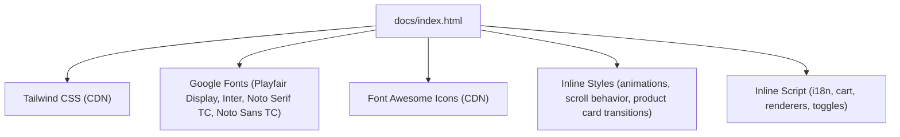
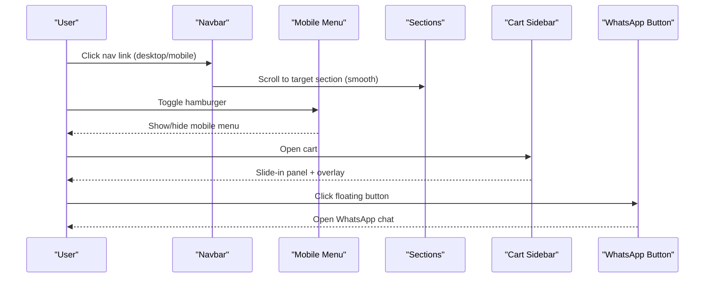
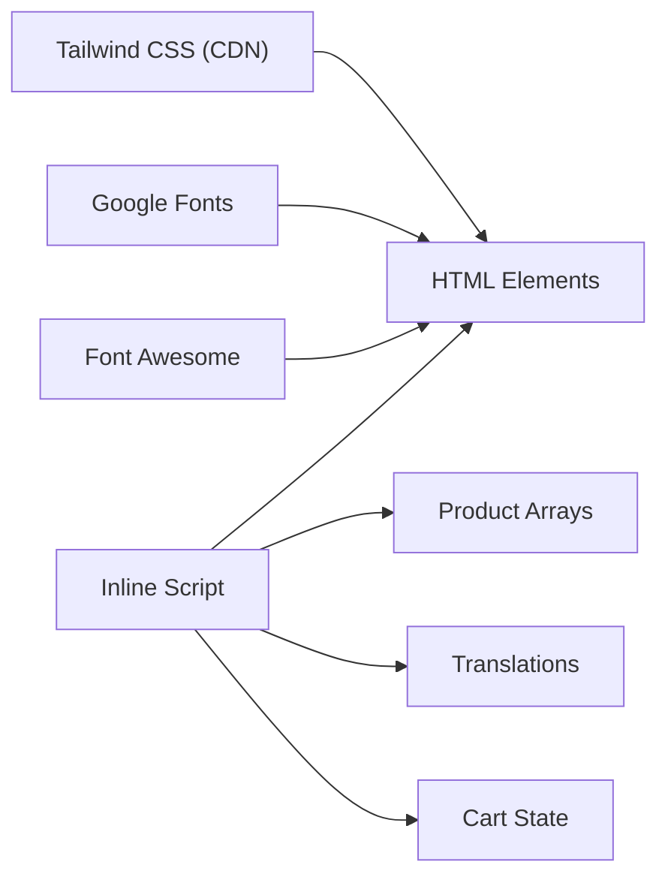

# User Interface Components

<cite>
**Referenced Files in This Document**
- [index.html](file://docs/index.html)
</cite>

## Table of Contents
1. [Introduction](#introduction)
2. [Project Structure](#project-structure)
3. [Core Components](#core-components)
4. [Architecture Overview](#architecture-overview)
5. [Detailed Component Analysis](#detailed-component-analysis)
6. [Dependency Analysis](#dependency-analysis)
7. [Performance Considerations](#performance-considerations)
8. [Troubleshooting Guide](#troubleshooting-guide)
9. [Conclusion](#conclusion)

## Introduction
This document explains the user interface components implemented in the site, focusing on:
- Responsive navigation with a mobile hamburger menu
- Smooth scrolling behavior
- Product gallery with hover effects and animations
- Floating WhatsApp button integration
- CSS Grid and Flexbox layouts
- Tailwind CSS utility usage and custom styling
- Cross-browser compatibility, accessibility considerations, and performance optimizations

The implementation is contained within a single-page HTML file that uses Tailwind CSS via CDN, Font Awesome icons, Google Fonts, and inline JavaScript for interactivity and internationalization.

## Project Structure
The repository contains a minimal structure with the primary UI in one HTML file. There are no separate CSS or JS files; all styles and scripts are embedded.

**Diagram sources**
- [index.html:1-20](file://docs/index.html#L1-L20)
- [index.html:13-38](file://docs/index.html#L13-L38)
- [index.html:39-208](file://docs/index.html#L39-L208)
- [index.html:881-1586](file://docs/index.html#L881-L1586)

**Section sources**
- [index.html:1-20](file://docs/index.html#L1-L20)

## Core Components
- Navigation bar with desktop links and a mobile hamburger menu
- Hero section with category grid and call-to-action buttons
- Multiple product sections using responsive grids
- Shopping cart sidebar with slide-in animation and overlay
- Floating WhatsApp button with animated badge and expandable text
- Toast notifications for user feedback
- Language switcher (Traditional Chinese / English)

Key behaviors:
- Mobile menu toggle
- Cart open/close with body scroll lock
- Smooth scrolling to sections
- Dynamic product rendering based on language
- Cart state management and WhatsApp checkout link generation

**Section sources**
- [index.html:214-282](file://docs/index.html#L214-L282)
- [index.html:285-399](file://docs/index.html#L285-L399)
- [index.html:402-587](file://docs/index.html#L402-L587)
- [index.html:813-879](file://docs/index.html#L813-L879)
- [index.html:881-1586](file://docs/index.html#L881-L1586)

## Architecture Overview
The page follows a single-file architecture:
- Head includes Tailwind CDN, fonts, icons, and a small Tailwind config extending theme colors and fonts.
- Inline styles define animations, transitions, and custom components (e.g., floating WhatsApp, product cards).
- Body contains semantic sections for each product category and shared UI elements (nav, cart, footer).
- Inline script initializes data, renders product grids, handles language switching, cart operations, and UI toggles.

**Diagram sources**
- [index.html:214-282](file://docs/index.html#L214-L282)
- [index.html:1570-1573](file://docs/index.html#L1570-L1573)
- [index.html:1555-1568](file://docs/index.html#L1555-L1568)
- [index.html:862-872](file://docs/index.html#L862-L872)

## Detailed Component Analysis

### Responsive Navigation and Mobile Hamburger Menu
- Desktop navigation displays horizontal links; hidden on small screens.
- Mobile menu is controlled by a hamburger icon and toggled via class manipulation.
- The navbar gains a shadow on scroll for visual depth.

Implementation highlights:
- Fixed top navigation with backdrop blur and border.
- Hidden md:flex for desktop links; md:hidden for mobile-only controls.
- Toggle function adds/removes hidden class on the mobile menu container.
- Scroll listener toggles a shadow class on the navbar.

Accessibility notes:
- Links use descriptive href anchors to sections.
- Consider adding aria-expanded and aria-controls attributes to the hamburger button and menu for improved screen reader support.

**Section sources**
- [index.html:214-282](file://docs/index.html#L214-L282)
- [index.html:1343-1351](file://docs/index.html#L1343-L1351)
- [index.html:1570-1573](file://docs/index.html#L1570-L1573)

### Smooth Scrolling Implementation
- Global smooth scrolling is enabled via CSS property on html.
- Buttons and links use anchor targets or programmatic scrollIntoView calls with behavior set to smooth.

Notes:
- Ensure anchor IDs match section IDs exactly.
- For older browsers without native smooth scrolling, consider a polyfill if needed.

**Section sources**
- [index.html:155-157](file://docs/index.html#L155-L157)
- [index.html:371-381](file://docs/index.html#L371-L381)

### Product Gallery with Hover Effects and Animations
- Each product card has a transitioned transform on hover, lifting the card and scaling the image.
- Images scale smoothly with a cubic-bezier easing.
- Cards fade in with staggered delays when rendered.
- Optional ribbon badges appear on certain categories.

Implementation highlights:
- Custom CSS classes define hover transforms and image scaling.
- Render functions generate markup with consistent structure and dynamic content.
- Category-specific color logic adjusts price and button accent colors.

Accessibility notes:
- Provide meaningful alt text for images.
- Ensure keyboard focusability for “Add to Cart” actions.

**Section sources**
- [index.html:74-88](file://docs/index.html#L74-L88)
- [index.html:94-108](file://docs/index.html#L94-L108)
- [index.html:1376-1404](file://docs/index.html#L1376-L1404)
- [index.html:1406-1444](file://docs/index.html#L1406-L1444)

### Floating WhatsApp Button Integration
- Fixed-position button at bottom-right with an animated floating effect.
- Badge indicator dot and expandable label on hover.
- Opens a pre-filled WhatsApp message URL.

Implementation highlights:
- Keyframe animation for subtle vertical float.
- Group-based hover reveals text via max-width transition.
- Uses rel="noopener noreferrer" for security when opening external links.

Accessibility notes:
- Add aria-label describing the action (e.g., “Chat on WhatsApp”).
- Ensure sufficient color contrast for the icon and text.

**Section sources**
- [index.html:58-72](file://docs/index.html#L58-L72)
- [index.html:862-872](file://docs/index.html#L862-L872)

### Shopping Cart Sidebar and Overlay
- Slide-in panel from the right with a blurred overlay backdrop.
- Cart items list with quantity controls, remove actions, and totals.
- Footer shows delivery options summary and a WhatsApp checkout link generated from cart contents.
- Opening/closing locks body scroll and toggles visibility.

Implementation highlights:
- Transform translate-x-full used to hide/show the panel.
- Overlay click closes the cart.
- updateCartUI recalculates totals and rebuilds item lists.
- generateWhatsAppLink builds a localized order summary message.

Accessibility notes:
- Focus management should move into the cart when opened and return on close.
- Use role="dialog" and aria-modal="true" for the cart panel.

**Section sources**
- [index.html:813-860](file://docs/index.html#L813-L860)
- [index.html:1496-1568](file://docs/index.html#L1496-L1568)
- [index.html:1478-1494](file://docs/index.html#L1478-L1494)

### Toast Notifications
- Centered toast appears briefly after adding items to the cart.
- Controlled by toggling opacity and transform classes.

Implementation highlights:
- Short timeout hides the toast automatically.
- Message text is localized based on current language.

Accessibility notes:
- Announce messages to assistive technologies using aria-live regions.

**Section sources**
- [index.html:874-879](file://docs/index.html#L874-L879)
- [index.html:1575-1585](file://docs/index.html#L1575-L1585)

### Language Switcher (i18n)
- Two buttons toggle between Traditional Chinese and English.
- All text nodes with data-i18n attributes are updated dynamically.
- Product names and descriptions switch accordingly.

Implementation highlights:
- translations object holds both languages.
- setLanguage updates active states, document lang attribute, and re-renders product grids.

Accessibility notes:
- Indicate current language visually and via aria attributes.
- Ensure labels describe the action (“Switch to English”, “切換為繁體中文”).

**Section sources**
- [index.html:248-253](file://docs/index.html#L248-L253)
- [index.html:882-1075](file://docs/index.html#L882-L1075)
- [index.html:1353-1374](file://docs/index.html#L1353-L1374)

### Layout Patterns: CSS Grid and Flexbox
- Hero category grid uses responsive columns: grid-cols-2 md:grid-cols-3 lg:grid-cols-6.
- Product sections use grid-cols-1 sm:grid-cols-2 lg:grid-cols-3 for consistent responsiveness.
- Flexbox is used extensively for alignment, spacing, and centering across header, hero CTAs, and component internals.

Examples:
- Hero category grid layout
- Product grids per section
- Header flex layout with logo, nav, and controls

**Section sources**
- [index.html:307-368](file://docs/index.html#L307-L368)
- [index.html:417](file://docs/index.html#L417)
- [index.html:471](file://docs/index.html#L471)
- [index.html:509](file://docs/index.html#L509)
- [index.html:528](file://docs/index.html#L528)
- [index.html:547](file://docs/index.html#L547)
- [index.html:566](file://docs/index.html#L566)
- [index.html:585](file://docs/index.html#L585)

### Tailwind CSS Usage and Custom Styling
- Tailwind CDN loaded with a small configuration extending fonts and gold color palette.
- Utility classes handle spacing, typography, colors, shadows, rounded corners, and responsive breakpoints.
- Custom CSS defines animations (float, fadeIn, slideInRight), transitions, scrollbar styling, ribbons, and hero background gradient.

Best practices observed:
- Consistent use of Tailwind utilities for layout and appearance.
- Minimal custom CSS focused on animations and brand-specific visuals.

**Section sources**
- [index.html:8-38](file://docs/index.html#L8-L38)
- [index.html:39-208](file://docs/index.html#L39-L208)

## Dependency Analysis
External dependencies:
- Tailwind CSS (CDN)
- Google Fonts (Playfair Display, Inter, Noto Serif TC, Noto Sans TC)
- Font Awesome Icons (CDN)

Internal relationships:
- Inline script depends on DOM elements identified by IDs and data-i18n attributes.
- Render functions depend on product arrays and language state.
- Cart functions depend on DOM elements for count, items, footer, and total.

**Diagram sources**
- [index.html:8-12](file://docs/index.html#L8-L12)
- [index.html:881-1586](file://docs/index.html#L881-L1586)

**Section sources**
- [index.html:8-12](file://docs/index.html#L8-L12)
- [index.html:881-1586](file://docs/index.html#L881-L1586)

## Performance Considerations
- Prefer system fonts or self-hosted fonts to reduce latency; currently using Google Fonts.
- Avoid heavy animations on low-power devices; consider prefers-reduced-motion media query to disable animations.
- Use lazy loading for product images to improve initial load time.
- Debounce scroll listeners if more complex logic is added later.
- Minimize DOM reflows by batching updates (current approach rebuilds lists only when necessary).

[No sources needed since this section provides general guidance]

## Troubleshooting Guide
Common issues and resolutions:
- Mobile menu not toggling:
  - Verify the hamburger button calls the toggle function and the menu element ID matches.
  - Check that the hidden class is being toggled correctly.
- Cart not updating:
  - Ensure addToCart finds the correct product and updates quantities.
  - Confirm updateCartUI recalculates totals and refreshes the DOM.
- Smooth scrolling not working:
  - Confirm html scroll-behavior is set to smooth.
  - Validate anchor IDs match section IDs.
- WhatsApp link incorrect:
  - Inspect generateWhatsAppLink output and ensure message encoding is correct.
- Accessibility concerns:
  - Add aria attributes to interactive elements (menu, cart dialog, language buttons).
  - Ensure focus management when opening/closing overlays.

**Section sources**
- [index.html:1570-1573](file://docs/index.html#L1570-L1573)
- [index.html:1446-1476](file://docs/index.html#L1446-L1476)
- [index.html:1496-1568](file://docs/index.html#L1496-L1568)
- [index.html:155-157](file://docs/index.html#L155-L157)
- [index.html:1478-1494](file://docs/index.html#L1478-L1494)

## Conclusion
The UI components implement a cohesive, responsive experience using Tailwind CSS and minimal custom CSS. The navigation adapts to mobile with a hamburger menu, smooth scrolling improves UX, product galleries provide engaging hover interactions, and the floating WhatsApp button streamlines customer contact. The shopping cart integrates seamlessly with localized messaging for checkout. With minor enhancements for accessibility and performance, the interface delivers a polished, culturally appropriate experience for users.